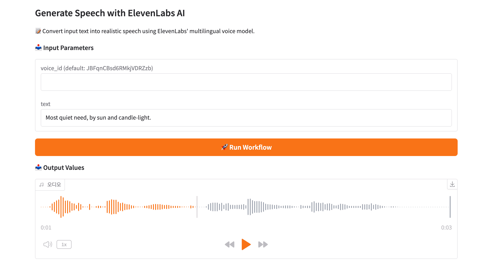

# model-compose: 선언적 AI 모델 및 워크플로우 오케스트레이터

[](https://python.org)
[](https://opensource.org/licenses/MIT)
[](http://makeapullrequest.com)

**model-compose**는 `docker-compose`에서 영감을 받은 오픈소스 선언적 워크플로우 오케스트레이터입니다. 간단한 YAML 파일을 사용하여 AI 모델 파이프라인을 정의하고 실행할 수 있으며, 커스텀 코드가 필요하지 않습니다. 외부 AI 서비스를 연결하거나 로컬 AI 모델을 실행하는 것을 손쉽게 조합 가능한 강력한 워크플로우로 구성할 수 있습니다.

---

## ✨ 주요 기능

- **선언적 설계**: 복잡한 스크립팅 없이 간단한 YAML 파일로 완전한 AI 워크플로우를 정의합니다.
- **모든 것을 조합**: 여러 AI 모델, API, 도구를 하나의 통합된 파이프라인으로 결합합니다.
- **오케스트레이션에 최적화**: 다중 단계 모델 상호작용을 쉽게 조율합니다. 개별 API 호출을 유지보수 가능한 엔드투엔드 시스템으로 변환합니다.
- **다중 워크플로우 지원**: 하나의 프로젝트에 여러 개의 명명된 워크플로우를 정의합니다. 이름으로 실행하거나 빠른 실행을 위한 기본값을 설정할 수 있습니다.
- **모듈형 컴포넌트**: 로직을 재사용 가능한 컴포넌트와 작업으로 분해합니다. 워크플로우 전체에서 쉽게 연결, 교체, 확장할 수 있습니다.
- **유연한 I/O 라우팅**: 깔끔하고 범위가 지정된 변수를 사용하여 작업 간 입력과 출력을 연결합니다. 접착 코드가 필요 없습니다.
- **스트리밍 모드 지원**: 모델과 API에서 실시간 출력을 스트리밍하여 대화형 애플리케이션과 더 빠른 피드백 루프를 가능하게 합니다.
- **로컬 실행, 원격 서비스**: CLI에서 워크플로우를 실행하거나 선택적 웹 UI와 함께 HTTP 또는 MCP 엔드포인트로 노출합니다.
- **MCP 서버 통합**: 워크플로우를 즉시 Model Context Protocol(MCP) 도구로 변환합니다. 컨트롤러 타입만 변경하면 되고 코드 변경은 필요 없습니다.
- **비동기 웹훅 통합**: 내장된 HTTP 콜백 리스너로 외부 서비스의 비동기 콜백을 처리합니다.
- **이벤트 기반 워크플로우**: 실시간 자동화를 위해 HTTP 트리거 리스너를 통해 HTTP 웹훅으로 워크플로우를 트리거합니다.
- **보안 터널링**: 게이트웨이 지원(ngrok, Cloudflare Tunnel, SSH 터널)을 사용하여 로컬 서비스를 인터넷에 노출합니다.
- **Docker 배포**: 워크플로우 컨트롤러를 Docker 컨테이너로 빌드 및 배포하여 일관되고 이식 가능한 실행 환경을 제공합니다.
- **환경 변수 지원**: `.env` 파일이나 환경 변수를 통해 비밀번호와 설정을 쉽게 주입하여 YAML을 깔끔하고 안전하게 유지합니다.

---

## 📚 문서

**📖 [전체 사용자 가이드](docs/user-guide/ko/README.md)**

시작하는 데 도움이 필요하거나 고급 기능을 탐색하고 싶으신가요? 포괄적인 사용자 가이드를 확인하세요.

가이드는 기본 개념부터 고급 워크플로우까지 모든 것을 다룹니다:
- model-compose 시작하기
- 컴포넌트 및 워크플로우 구성
- 로컬 AI 모델 및 학습
- 스트리밍 모드 및 변수 바인딩
- 리스너 및 게이트웨이를 사용한 시스템 통합
- 배포 전략
- 실용적인 예제 및 문제 해결

**📂 [예제 둘러보기](examples/README.ko.md)**

카테고리 및 컴포넌트 유형별로 정리된 실용적이고 바로 실행 가능한 예제를 탐색하세요.

---

## 📦 설치

```
pip install model-compose
```

또는 소스에서 설치:

```
git clone https://github.com/hanyeol/model-compose.git
cd model-compose
pip install -e .
```

> 요구사항: Python 3.9 이상

---

## 🚀 실행 방법

**model-compose**는 `docker-compose`에서 영감을 받은 CLI 인터페이스를 제공하여 AI 워크플로우를 시작하고 관리합니다.

#### 🔼 워크플로우 컨트롤러 시작 (`up`)
`up` 명령을 사용하여 워크플로우 컨트롤러를 시작합니다. 이는 워크플로우를 HTTP 또는 MCP 엔드포인트로 호스팅하고 선택적으로 웹 UI를 제공합니다.

```
model-compose up
```

기본적으로 이 명령은:

- **현재 작업 디렉토리**에서 `model-compose.yml` 파일을 찾습니다
- **같은 디렉토리**에 `.env` 파일이 있으면 자동으로 환경 변수를 로드합니다
- 워크플로우 컨트롤러를 시작합니다 (기본값: `http://localhost:8080`)
- 선택적으로 웹 UI를 시작합니다 (기본값: `http://localhost:8081`, 구성된 경우)

백그라운드에서 실행하려면 (분리 모드):

```
model-compose up -d
```

`-f`를 사용하여 하나 이상의 설정 파일을 지정할 수 있습니다:

```
model-compose -f base.yml -f override.yml up
```

필요한 경우 다음을 사용하여 환경 변수를 재정의하거나 확장할 수 있습니다:

```
model-compose up --env-file .env
```

또는

```
model-compose up --env OPENAI_API_KEY=... --env ELEVENLABS_API_KEY=...
```

> 💡 컨트롤러가 실행되면 REST API를 통해 워크플로우를 트리거하거나, MCP를 사용하는 경우 JSON-RPC를 통해 트리거할 수 있습니다. 웹 UI를 통해서도 접근할 수 있습니다.

#### 🔽 서버 종료 (`down`)
워크플로우 컨트롤러와 모든 관련 서비스를 정상적으로 중지하고 제거하려면:

```
model-compose down
```

#### ▶️ 워크플로우 한 번 실행 (`run`)
컨트롤러를 시작하지 않고 CLI에서 직접 워크플로우를 실행합니다:

```
model-compose run <workflow-name> --input '{"key": "value"}'
```

이는 테스트, 자동화 또는 스크립팅에 유용합니다.

#### 🧪 라이프사이클 명령

| 명령                  | 설명                          |
|----------------------|--------------------------------------|
| `model-compose up`   | 워크플로우 컨트롤러를 시작하고 정의된 워크플로우를 로드합니다 |
| `model-compose down` | 컨트롤러와 모든 관련 서비스를 정상적으로 중지하고 제거합니다 |
| `model-compose start`| 이전에 구성된 컨트롤러를 시작합니다 |
| `model-compose stop` | 현재 실행 중인 컨트롤러를 일시 중지합니다 |

---
## 🧾 `model-compose.yml`

`model-compose.yml` 파일은 워크플로우가 어떻게 구성되고 실행되는지를 정의하는 중앙 설정 파일입니다.

포함 내용:

- **Controller**: HTTP/MCP 서버, API 엔드포인트, 선택적 웹 UI를 구성합니다
- **Components**: API 호출, 로컬 AI 모델 실행 또는 명령 실행을 위한 재사용 가능한 정의입니다
- **Workflows**: 데이터 흐름을 정의하는 명명된 작업 세트입니다
- **Jobs**: 입력, 출력 및 종속성을 지원하여 특정 컴포넌트를 실행하는 단계입니다
- **Listeners**: 외부 서비스의 비동기 응답을 처리하는 선택적 콜백 리스너입니다
- **Gateways**: 로컬 컨트롤러를 공용 인터넷에 노출하는 선택적 터널링 서비스입니다

기본적으로 `model-compose`는 `up` 또는 `run`과 같은 명령을 실행할 때 현재 작업 디렉토리에서 `model-compose.yml` 파일을 자동으로 찾습니다.

#### 🧪 최소 예제 (컴포넌트 및 워크플로우 포함)

```
controller:
  type: http-server
  port: 8080
  base_path: /api
  webui:
    port: 8081

components:
  - id: chatgpt
    type: http-client
    base_url: https://api.openai.com/v1
    path: /chat/completions
    method: POST
    headers:
      Authorization: Bearer ${env.OPENAI_API_KEY}
      Content-Type: application/json
    body:
      model: gpt-4o
      messages:
        - role: user
          content: "Write an inspiring quote."
    output:
      quote: ${response.choices[0].message.content}

workflows:
  - id: generate-quote
    default: true
    jobs:
      - id: get-quote
        component: chatgpt
```

이 최소 예제는 OpenAI ChatGPT API를 호출하여 영감을 주는 명언을 생성하는 간단한 워크플로우를 정의합니다.

- `controller` 섹션은 포트 `8080`에서 HTTP 서버를 시작하고 포트 `8081`에서 웹 UI를 활성화합니다.
- `components` 섹션은 OpenAI Chat Completions API에 `POST` 요청을 하는 `chatgpt`라는 재사용 가능한 HTTP 클라이언트를 정의합니다. 인증을 위해 환경 변수 `OPENAI_API_KEY`를 사용하고 API 응답에서 명언을 추출합니다.
- `workflows` 섹션은 `generate-quote`라는 단일 워크플로우를 정의합니다. API에서 명언을 가져오기 위해 `chatgpt` 컴포넌트를 사용하는 `get-quote`라는 하나의 작업을 포함합니다.
- `default: true`가 설정되어 있으므로 실행 중에 워크플로우 이름이 지정되지 않으면 이 워크플로우가 기본적으로 선택됩니다.

더 많은 컴포넌트(예: 텍스트 음성 변환, 이미지 생성)를 추가하고 추가 작업을 통해 연결하여 이 예제를 쉽게 확장할 수 있습니다.

> 📁 리스너, 게이트웨이 및 고급 워크플로우를 포함한 더 많은 예제 구성은 [예제 디렉토리](examples)를 확인하거나 [사용자 가이드](docs/user-guide/README.md)를 참조하세요.

---
## 🖥 웹 UI
**model-compose**는 선택적으로 경량 **웹 UI**를 제공하여 워크플로우를 시각적으로 트리거하고, 입력 및 출력을 검사하며, 실행 로그를 모니터링할 수 있도록 도와줍니다.



#### ✅ 웹 UI 활성화
웹 UI를 활성화하려면 `model-compose.yml` 파일의 `controller` 아래에 `webui` 섹션을 추가하기만 하면 됩니다:
```
controller:
  type: http-server
  port: 8080
  webui:
    port: 8081
```

활성화되면 웹 UI는 다음 주소에서 사용할 수 있습니다:
```
http://localhost:8081
```

## 🎨 커스텀 웹 UI
다른 드라이버를 지정하거나 자체 프론트엔드를 제공하여 웹 UI 경험을 완전히 사용자 정의할 수 있습니다.

기본적으로 `model-compose`는 [Gradio](https://www.gradio.app)를 대화형 UI로 사용합니다. 그러나 자체 정적 프론트엔드(예: 커스텀 React/Vite 앱)를 사용하고 싶다면 `static` 드라이버로 전환할 수 있습니다.

다음은 방법입니다:

```
controller:
  type: http-server
  port: 8080
  webui:
    driver: static
    static_dir: webui
    port: 8081
```
프론트엔드는 사전 빌드된 정적 사이트여야 하며(예: `vite build`, `next export` 또는 `react-scripts` build 사용), 지정된 `static_dir`에 배치되어야 합니다.
해당 디렉토리에 `index.html`이 있는지 확인하세요.

#### 📁 예제 디렉토리 구조
```
project/
├── model-compose.yml
├── webui/
│   ├── index.html
│   ├── assets/
│   └── ...
```

#### 🔧 참고 사항
* `static_dir` 경로는 프로젝트 루트에 상대적이거나 절대 경로여야 합니다.
* `model-compose.yml` 내에서 환경 변수를 사용하여 이 경로를 구성 가능하게 만들 수 있습니다.

추가 드라이버(예: `dynamic`)에 대한 지원은 향후 버전에서 추가될 수 있습니다.

구성되면 웹 UI는 다음 주소에서 사용할 수 있습니다:
```
http://localhost:8081
```

---
## 🛰 MCP 서버 지원
**Model Context Protocol(MCP)** 서버를 통해 워크플로우를 노출하여 경량 JSON-RPC 인터페이스를 사용한 원격 실행, 자동화 또는 시스템 통합을 가능하게 할 수도 있습니다.

#### ✅ 최소 MCP 서버 예제

```
controller:
  type: mcp-server
  port: 8080
  base_path: /mcp

components:
  - id: chatgpt
    type: http-client
    base_url: https://api.openai.com/v1
    path: /chat/completions
    method: POST
    headers:
      Authorization: Bearer ${env.OPENAI_API_KEY}
      Content-Type: application/json
    body:
      model: gpt-4o
      messages:
        - role: user
          content: "Write an inspiring quote."
    output:
      quote: ${response.choices[0].message.content}

workflows:
  - id: generate-quote
    default: true
    jobs:
      - id: get-quote
        component: chatgpt
```
이 구성은 컨트롤러를 **MCP 서버**로 시작하며, 포트 8080에서 수신 대기하고 **JSON-RPC API**를 통해 워크플로우를 노출합니다.

실행되면 표준 MCP 요청을 사용하여 원격으로 워크플로우를 호출할 수 있습니다:

```
{
  "jsonrpc": "2.0",
  "id": 1,
  "method": "callTool",
  "params": {
    "name": "generate-quote",
    "arguments": {}
  }
}
```

모든 HTTP 클라이언트를 통해 다음 주소로 이 요청을 보낼 수 있습니다:
```
POST http://localhost:8080/mcp
```

---
## 🐳 Docker 런타임 지원
`model-compose.yml` 파일에서 런타임 옵션을 지정하여 Docker 컨테이너 내에서 워크플로우 컨트롤러를 실행할 수 있습니다.

#### ✅ 최소 Docker 런타임 예제

```
controller:
  type: http-server
  port: 8080
  runtime: docker
```

이 구성은 **model-compose**가 자동으로 관리하는 경량 Docker 컨테이너 내에서 컨트롤러를 시작합니다. 컨테이너 이름, 이미지, 볼륨 매핑과 같은 기본 설정을 사용합니다.

#### ⚙️ 고급 Docker 런타임 옵션
`runtime` 키 아래에 객체를 사용하여 Docker 런타임을 완전히 구성할 수 있습니다:

```
controller:
  type: http-server
  port: 8080
  runtime:
    type: docker
    image: 192.168.0.23/custom-image:latest
    container_name: my-controller
    volumes:
      - ./models:/models
      - ./cache:/cache
    ports:
      - "5000:8080"
      - "5001:8081"
    env:
      MODEL_STORAGE_PATH: /models
    command: [ "python", "-m", "mindor.cli.compose", "up" ]
    ...
```

이를 통해 다음을 완전히 제어할 수 있습니다:

- **container_name**: 컨테이너의 커스텀 이름
- **image**: 사용할 Docker 이미지
- **volumes**: 호스트와 컨테이너 간 파일 공유를 위한 바인드 마운트
- **ports**: 호스트 ↔ 컨테이너 통신을 위한 포트 매핑
- **env**: 주입할 환경 변수
- **command**: 기본 진입점 재정의
- *그 외 다수*

이 모든 것은 선택 사항이므로 간단하게 시작하고 필요한 것만 사용자 정의할 수 있습니다.

#### 🐳 Docker 런타임의 이점

- 깔끔하고 격리된 환경에서 컨트롤러를 실행합니다
- 호스트 Python 설정과의 종속성 충돌을 방지합니다
- 원격 서버 또는 CI 파이프라인에 프로젝트를 쉽게 배포합니다
- 다른 사람들과 재현 가능한 워크플로우를 공유합니다

---
## 🏗 아키텍처


---

## 🤝 기여하기
모든 기여를 환영합니다!
버그 수정, 문서 개선 또는 예제 추가 등 모든 것이 도움이 됩니다.

```
# 개발 환경 설정
git clone https://github.com/hanyeol/model-compose.git
cd model-compose
pip install -e .[dev]
```

---

## 📄 라이선스
MIT License © 2025 Hanyeol Cho.

---

## 📬 연락처
질문, 아이디어 또는 피드백이 있으신가요? [이슈를 열거나](https://github.com/hanyeol/model-compose/issues) [GitHub Discussions](https://github.com/hanyeol/model-compose/discussions)에서 토론을 시작하세요.
