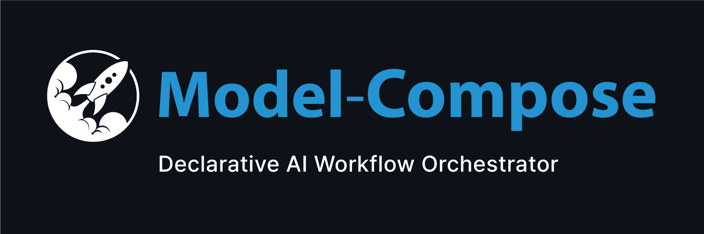
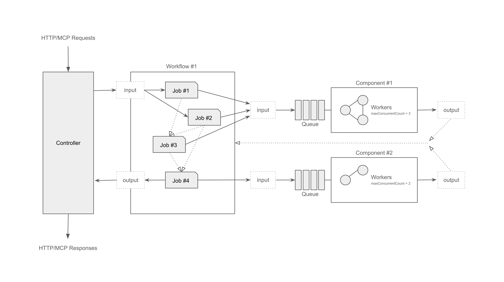

<div align="center">



[](https://python.org)
[](https://pypi.org/project/model-compose/)
[](https://opensource.org/licenses/MIT)
[](https://pepy.tech/project/model-compose)
[](http://makeapullrequest.com)

[English](README.md) | [中文](README.zh-cn.md)

</div>

---

# 🤖 Model-Compose

**model-compose**는 `docker-compose`에서 영감을 받아서 만든 선언적 AI 워크플로우 오케스트레이터입니다. 간단한 YAML 파일로 AI 파이프라인을 정의하고 실행할 수 있습니다. 별도의 코드 작성이 필요 없습니다. 외부 AI 서비스(OpenAI, Anthropic, Google 등) 연결, 로컬 AI 모델 실행, 벡터 스토어 통합 등으로 강력하고 조합 가능한 워크플로우로 구성할 수 있습니다.

**코드 작성 없이, YAML 설정만으로.**

<div align="center">

[📖 사용자 가이드](docs/user-guide/ko/README.md) · [🚀 빠른 시작](#-빠른-시작) · [💡 예제](examples/README.ko.md) · [🤝 기여하기](#-기여하기)

</div>

---

## ✨ 주요 기능

### 🎨 **노코드 AI 오케스트레이션**
복잡한 AI 워크플로우를 순수 YAML로 정의—Python, JavaScript, 코딩 불필요. 여러 AI 서비스, 모델, API를 단순한 선언적 설정만으로 연결.

### 🔗 **범용 AI 서비스 통합**
모든 AI 제공자를 즉시 연결—OpenAI, Anthropic Claude, Google Gemini, ElevenLabs, Stability AI, Replicate, 또는 모든 커스텀 HTTP API. 단일 워크플로우에서 서비스를 자유롭게 조합.

### 🖥️ **로컬 모델 실행**
HuggingFace 등에서 제공하는 모델을 로컬에서 실행하며 transformers, PyTorch, 모델 서빙 프레임워크 네이티브 지원. LoRA/PEFT를 통한 파인튜닝, 커스텀 데이터셋 학습까지 모두 YAML 설정으로.

### ⚡ **실시간 스트리밍**
실시간 AI 응답을 위한 내장 SSE(Server-Sent Events) 스트리밍. OpenAI, Claude, 로컬 모델, 모든 스트리밍 API에서 자동 청킹 및 연결 관리.

### 🔄 **고급 워크플로우 구성**
조건부 로직, 데이터 변환, 병렬 실행이 가능한 다단계 파이프라인 구축. 강력한 변수 바인딩으로 작업 간 데이터 전달—`${input}`, `${response}`, `${env}`, 타입 변환 및 기본값 지원.

### 🚀 **프로덕션 준비 완료 컨트롤러**
한 줄만 바꾸면 HTTP REST API 또는 MCP(Model Context Protocol) 서버로 배포. 동시성 제어, 헬스 체크, 자동 API 문서화 포함.

### 🎯 **이벤트 기반 아키텍처**
비동기 워크플로우를 위한 HTTP Callback 리스너(이미지 생성, 비디오 처리). 웹훅 및 외부 이벤트를 위한 HTTP Trigger 리스너. 실세계 이벤트에 반응하는 AI 시스템 구축.

### 🌐 **스마트 터널링 & 게이트웨이**
ngrok, Cloudflare, SSH 터널로 로컬 서비스를 즉시 인터넷에 노출. 복잡한 네트워킹 설정 없이 웹훅 통합, Slack 봇, 퍼블릭 API 배포에 최적.

### 🐳 **컨테이너 네이티브 배포**
완벽한 Docker 지원으로 런타임 설정, 볼륨 마운트, 환경 관리 제공. 최소 설정으로 모든 클라우드 제공자나 Kubernetes 클러스터에 배포.

### 🎨 **즉시 사용 가능한 웹 UI**
단 2줄로 비주얼 인터페이스 추가—Gradio 기반 채팅 UI 또는 커스텀 정적 프론트엔드 제공. 워크플로우 테스트, 실행 모니터링, 파이프라인 디버깅을 시각적으로.

### 🗄️ **RAG & 벡터 데이터베이스 지원**
ChromaDB, Milvus, Pinecone, Weaviate 네이티브 통합. 임베딩 검색, 문서 인덱싱, 시맨틱 검색으로 검색 증강 생성(RAG) 시스템 구축.

### 🔧 **유연한 컴포넌트 시스템**
멀티 액션 지원이 포함된 재사용 가능한 컴포넌트. 한 번 정의하면 어디서나 사용. HTTP 클라이언트, 로컬 모델, 벡터 스토어, 쉘 명령, 커스텀 워크플로우를 자유롭게 조합.

---


## 📦 설치

```bash
pip install model-compose
```

또는 소스에서 설치:

```bash
git clone https://github.com/hanyeol/model-compose.git
cd model-compose
pip install -e .
```

> 요구사항: Python 3.9 이상

---

## 🚀 빠른 시작

`model-compose.yml` 파일 생성:

```yaml
controller:
  type: http-server
  port: 8080
  webui:
    port: 8081

components:
  - id: chatgpt
    type: http-client
    base_url: https://api.openai.com/v1
    path: /chat/completions
    method: POST
    headers:
      Authorization: Bearer ${env.OPENAI_API_KEY}
    body:
      model: gpt-4o
      messages:
        - role: user
          content: ${input.prompt}

workflows:
  - id: chat
    default: true
    jobs:
      - component: chatgpt
```

`.env` 파일 생성:

```bash
OPENAI_API_KEY=your-key
```

실행:

```bash
model-compose up
```

API는 `http://localhost:8080`에서, Web UI는 `http://localhost:8081`에서 실행됩니다 🎉

---

## 🎯 강력하지만 단순한 설정

### 🖥️ 2줄로 Web UI 추가
```yaml
controller:
  webui:
    port: 8081
```

### 🛰️ 1줄로 MCP 서버 전환
```yaml
controller:
  type: mcp-server
```

### 🔄 컴포넌트를 별도 프로세스로 실행
```yaml
component:
  runtime: process
```

### 🐳 1줄로 Docker 배포
```yaml
controller:
  runtime: docker
```

> 💡 더 많은 워크플로우는 [예제](examples/README.ko.md)를, 자세한 내용은 [사용자 가이드](docs/user-guide/ko/README.md)를 참조하세요.

---
## 🏗 아키텍처



---

## 🤝 기여하기
모든 기여를 환영합니다!
버그 수정, 문서 개선, 예제 추가 등 — 모든 도움이 도움이 됩니다.

```bash
# 개발 환경 설정
git clone https://github.com/hanyeol/model-compose.git
cd model-compose
pip install -e .[dev]
```

---

## 📄 라이선스
MIT License © 2025 Hanyeol Cho.

---

## 📬 문의
질문, 아이디어, 피드백이 있으신가요? [이슈를 열거나](https://github.com/hanyeol/model-compose/issues) [GitHub Discussions](https://github.com/hanyeol/model-compose/discussions)에서 토론을 시작하세요.
