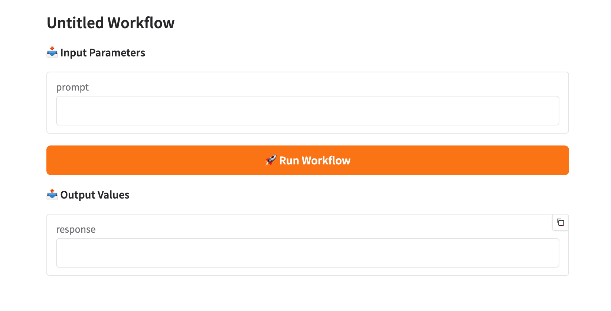

# Chapter 1: Getting Started

## 1.1 Introduction and Overview

**model-compose** is a declarative AI workflow orchestrator that lets you define and run AI model pipelines using simple YAML configuration files. Inspired by `docker-compose`, it brings the same philosophy of declarative configuration to the world of AI model orchestration.

### What is model-compose?

model-compose allows you to:

- **Compose AI workflows declaratively**: Define complete multi-step AI pipelines in YAML—no custom code required
- **Connect anything**: Integrate external AI services (OpenAI, Anthropic, etc.) or run local AI models seamlessly
- **Build complex pipelines**: Chain multiple models and APIs together with clean data flow between steps
- **Flexible execution**: Run workflows from CLI, expose as HTTP APIs, or use the Model Context Protocol (MCP)
- **Deploy easily**: Run locally or deploy via Docker with minimal configuration

### Key Use Cases

- **API Orchestration**: Chain multiple AI service calls (e.g., text generation → translation → speech synthesis)
- **Local Model Inference**: Run HuggingFace models for tasks like chat completion, image analysis, or embeddings
- **RAG Systems**: Build retrieval-augmented generation pipelines with vector stores
- **Multi-modal Workflows**: Combine text, image, and audio processing in a single pipeline
- **Automated Workflows**: Script and automate AI tasks without writing custom integration code

### How It Works

model-compose consists of three core elements:

1. **YAML Configuration Files** (`model-compose.yml`): Declaratively define components, workflows, and execution environments.
2. **Component System**: Provides reusable units of work such as API calls, local model execution, and data processing.
3. **Execution Environment**: Run workflows via CLI commands or through HTTP/MCP servers.

For example, a simple workflow that calls the OpenAI API can be defined as:

```yaml
components:
  - id: chatgpt
    type: http-client
    base_url: https://api.openai.com/v1
    action:
      path: /chat/completions

workflows:
  - id: generate-text
    jobs:
      - component: chatgpt
```

With this configuration alone, you can run it from the CLI, expose it as an HTTP API, or deploy it as a Docker container.

---

## 1.2 Installation

### Requirements

- **Python 3.9 or higher**
- pip package manager

### Install via pip

The simplest way to install model-compose is via pip:

```bash
pip install model-compose
```

### Install from Source

For the latest development version or to contribute to the project:

```bash
git clone https://github.com/hanyeol/model-compose.git
cd model-compose
pip install -e .
```

For development with additional dependencies:

```bash
pip install -e .[dev]
```

### Verify Installation

Check that model-compose is installed correctly:

```bash
model-compose --version
```

You should see the version number printed.

### Using Virtual Environments (Recommended)

It's recommended to use a virtual environment to avoid dependency conflicts:

```bash
# Create a virtual environment
python -m venv venv

# Activate it
# On macOS/Linux:
source venv/bin/activate
# On Windows:
venv\Scripts\activate

# Install model-compose
pip install model-compose
```

---

## 1.3 Running Your First Workflow

Let's walk through creating and running your first model-compose workflow. We'll build a simple workflow that calls the OpenAI API to generate text.

### 1.3.1 Simple Example (OpenAI API Call)

#### Step 1: Create a Project Directory

```bash
mkdir my-first-workflow
cd my-first-workflow
```

#### Step 2: Set Up Your API Key

Create a `.env` file to store your OpenAI API key securely:

```bash
# .env
OPENAI_API_KEY=your-api-key
```

> **Note**: Never commit `.env` files to version control. Add `.env` to your `.gitignore`.

#### Step 3: Create Your Workflow Configuration

Create a `model-compose.yml` file:

```yaml
# model-compose.yml
controller:
  type: http-server
  port: 8080
  base_path: /api
  webui:
    port: 8081

components:
  - id: chatgpt
    type: http-client
    base_url: https://api.openai.com/v1
    action:
      path: /chat/completions
      method: POST
      headers:
        Authorization: Bearer ${env.OPENAI_API_KEY}
        Content-Type: application/json
      body:
        model: gpt-4o
        messages:
          - role: user
            content: ${input.prompt}
      output:
        response: ${response.choices[0].message.content}

workflows:
  - id: generate-text
    default: true
    jobs:
      - id: call-gpt
        component: chatgpt
```

#### Understanding the Configuration

Let's break down what each section does:

**Controller**
```yaml
controller:
  type: http-server
  port: 8080
  base_path: /api
  webui:
    port: 8081
```
- Defines how workflows are exposed (as HTTP server)
- Sets the API port (8080) and Web UI port (8081)
- Base path for API endpoints (`/api`)

**Components**
```yaml
components:
  - id: chatgpt
    type: http-client
    base_url: https://api.openai.com/v1
    action:
      path: /chat/completions
      method: POST
      headers:
        Authorization: Bearer ${env.OPENAI_API_KEY}
      body:
        model: gpt-4o
        messages:
          - role: user
            content: ${input.prompt}
      output:
        response: ${response.choices[0].message.content}
```
- Defines a reusable component called `chatgpt`
- Configures an HTTP client to call OpenAI's API
- Uses `${env.OPENAI_API_KEY}` to inject the API key from environment variables
- Passes `${input.prompt}` to the request body
- Extracts the response into an `output.response` variable

**Workflows**
```yaml
workflows:
  - id: generate-text
    default: true
    jobs:
      - id: call-gpt
        component: chatgpt
```
- Defines a workflow named `generate-text`
- Marks it as `default` (runs when no workflow name specified)
- Contains a single job that executes the `chatgpt` component

---

### 1.3.2 Running a Workflow (run command)

The `run` command executes a workflow once directly from the CLI—perfect for testing and scripting.

#### Basic Usage

```bash
model-compose run generate-text --input '{"prompt": "Write a short poem about coding"}'
```

This will:
1. Load the `model-compose.yml` configuration
2. Execute the `generate-text` workflow
3. Pass the input to the workflow
4. Print the output to the console

#### Expected Output

```json
{
  "response": "Code flows like water,\nBugs emerge in moonlit nights,\nDebug till sunrise."
}
```

#### Passing Different Inputs

You can pass any JSON input that your workflow expects:

```bash
model-compose run generate-text --input '{"prompt": "Explain quantum computing in one sentence"}'
```

#### Using Environment Variables

If you need to override environment variables:

```bash
model-compose run generate-text \
  --input '{"prompt": "Hello!"}' \
  --env OPENAI_API_KEY=sk-different-key
```

Or use a different env file:

```bash
model-compose run generate-text \
  --input '{"prompt": "Hello!"}' \
  --env-file .env.production
```

#### Running Non-Default Workflows

If you have multiple workflows and want to run a specific one:

```bash
model-compose run my-other-workflow --input '{"key": "value"}'
```

---

### 1.3.3 Starting the Controller and Using Web UI

The `up` command starts a persistent server that hosts your workflows as HTTP endpoints and optionally provides a Web UI.

#### Start the Controller

```bash
model-compose up
```

You should see output like:

```
Starting model-compose controller...
✓ Loaded configuration from model-compose.yml
✓ HTTP server running on http://localhost:8080
✓ Web UI available at http://localhost:8081
✓ Loaded 1 workflow: generate-text (default)
```

The controller is now running and ready to accept requests.

#### Using the Web UI

Open your browser and navigate to:

```
http://localhost:8081
```

The Web UI provides an interactive interface where you can:

- **Select workflows** from a dropdown
- **Enter inputs** in a form
- **Run workflows** with a button click
- **View outputs** in real-time
- **See execution logs** for debugging



**To run your workflow:**
1. Enter your prompt in the input field (e.g., "Write a short poem about AI")
2. Click "Run Workflow"
3. View the generated response in the output panel

#### Using the HTTP API

You can also trigger workflows programmatically via HTTP:

```bash
curl -X POST http://localhost:8080/api/workflows/runs \
  -H "Content-Type: application/json" \
  -d '{
    "workflow_id": "generate-text",
    "input": {
      "prompt": "What is machine learning?"
    },
    "output_only": true
  }'
```

Response:

```json
{
  "response": "Machine learning is a subset of artificial intelligence..."
}
```

#### Running in Detached Mode

To run the controller in the background:

```bash
model-compose up -d
```

#### Stopping the Controller

To gracefully shut down the controller:

```bash
model-compose down
```

This will:
- Stop the HTTP server
- Stop the Web UI
- Clean up resources
- Save state if needed

---

## 1.4 Basic Concepts

Now that you've run your first workflow, let's clarify the key concepts in model-compose.

### Controller

The **controller** is the runtime environment that hosts and executes your workflows. It can operate in two modes:

- **HTTP Server**: Exposes workflows as REST API endpoints with optional Web UI
- **MCP Server**: Exposes workflows via the Model Context Protocol (JSON-RPC)

The controller is configured in the `controller` section of `model-compose.yml`.

### Components

**Components** are reusable building blocks that perform specific tasks. Think of them as functions you can call from workflows.

Common component types:
- `http-client`: Make HTTP API calls to external services
- `model`: Run local AI models (HuggingFace transformers)
- `shell`: Execute shell commands
- `text-splitter`: Split text into chunks
- `workflow`: Call another workflow as a component

Each component has:
- An **id**: unique identifier to reference it in workflows
- A **type**: what kind of component it is
- **Configuration**: specific settings for that component type
- **Input/output mappings**: how data flows in and out

### Workflows

A **workflow** is a named sequence of jobs that defines a complete AI pipeline. Workflows can:

- Execute multiple steps in order
- Pass data between steps using variable bindings
- Have multiple branches or parallel execution (advanced)
- Be triggered via CLI, HTTP API, or Web UI

Key workflow properties:
- `id`: Unique name for the workflow
- `default`: Whether this workflow runs by default (optional)
- `jobs`: List of jobs to execute
- `title` and `description`: Human-readable metadata for Web UI

### Jobs

**Jobs** are individual steps within a workflow. Each job:

- References a component to execute
- Can accept inputs from previous jobs
- Can produce outputs for subsequent jobs
- Executes in sequence (by default)

Example:
```yaml
jobs:
  - id: generate-text
    component: chatgpt
    input:
      prompt: ${input.query}

  - id: translate
    component: translator
    input:
      text: ${generate-text.output.response}
```

### Variable Binding

**Variable binding** is how data flows through your workflow using the `${...}` syntax.

Common variable sources:

- `${env.VAR_NAME}`: Environment variables
- `${input.field}`: Workflow input
- `${response.field}`: HTTP response from current component
- `${jobs.job-id.output.field}`: Output from a specific job (job-id)

Example data flow:
```yaml
component:
  action:
    body:
      prompt: ${input.user_prompt}  # From workflow input
      api_key: ${env.API_KEY}       # From environment
    output:
      result: ${response.data}      # Extract from API response
```

### Putting It All Together

Here's how everything connects:

1. **Define components** - reusable actions (API calls, models, etc.)
2. **Create workflows** - sequences of jobs using those components
3. **Configure controller** - how to expose and run workflows
4. **Run** - execute via CLI (`run`) or start a server (`up`)
5. **Data flows** - through variable bindings between jobs

---

## Next Steps

Try it out:
- Change the OpenAI model (try `gpt-3.5-turbo` or `gpt-4`)
- Experiment with different prompts and inputs

---

**Next Chapter**: [2. Core Concepts](./02-core-concepts.md)
