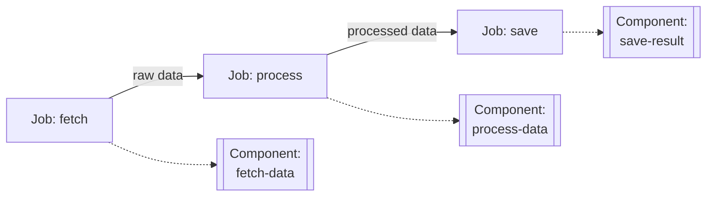
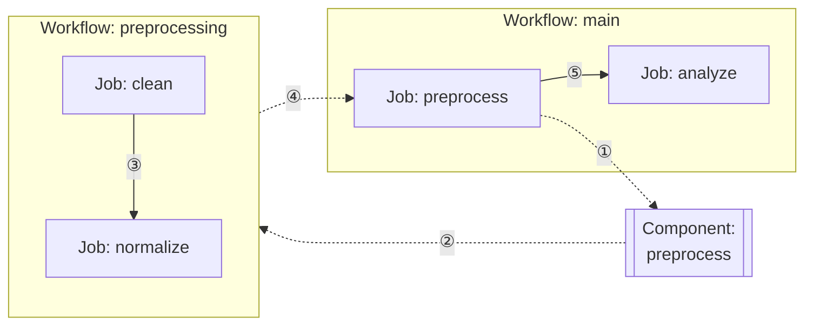

# Chapter 4: Component Configuration

This chapter covers various component types, definition methods, input/output mapping, and reusability patterns in model-compose.

---

## 4.1 Component Types

model-compose provides various component types for performing different tasks.

### Available Component Types

| Type | Purpose | Main Use Cases |
|------|---------|---------------|
| `http-client` | External API calls | REST API integration for OpenAI, ElevenLabs, etc. |
| `http-server` | Provide HTTP service | Implement custom HTTP API endpoints |
| `mcp-server` | Provide MCP service | Implement Model Context Protocol server |
| `mcp-client` | MCP client | Communicate with MCP servers |
| `model` | Run local AI models | Local model inference for text generation, image analysis, etc. |
| `model-trainer` | Train models | Fine-tuning, LoRA training |
| `datasets` | Load datasets | Load and process training/evaluation datasets |
| `vector-store` | Vector DB integration | RAG systems with Chroma, Milvus, etc. |
| `workflow` | Call workflows | Execute other workflows as subroutines |
| `shell` | Execute shell commands | Run scripts, system commands |
| `text-splitter` | Split text | Split documents into chunks |
| `image-processor` | Process images | Image transformation, resizing, etc. |
| `web-scraper` | Scrape web pages | Extract data from websites using CSS/XPath |

### Component Selection Guide

**External API Integration**
- OpenAI, Anthropic, etc. → `http-client`
- Custom REST API → `http-client`

**Local AI Models**
- Local inference → `model`
- vLLM, Ollama, etc. backend usage → `http-server`
- Training → `model-trainer`

**Data Processing**
- Text splitting → `text-splitter`
- Image processing → `image-processor`
- Vector storage → `vector-store`
- Web scraping → `web-scraper`

**Workflow Composition**
- Sub-workflows → `workflow`
- System tasks → `shell`

---

## 4.2 Defining Components

### Basic Structure

All components follow this basic structure:

```yaml
components:
  - id: unique-component-id
    type: component-type
    # Type-specific settings...
    output:
      # Output mapping...
```

### Required Properties

- `id`: Unique component identifier
- `type`: Component type

### Optional Properties

- `output`: Output data mapping
- `actions`: Multiple action definitions (multi-action component)

### Single Action vs Multi-Action Components

Components can be defined as single action or multi-action.

#### Single Action Component

A component that performs only one task:

```yaml
components:
  - id: send-email
    type: http-client
    endpoint: https://api.email.com/send
    method: POST
    headers:
      Authorization: Bearer ${env.EMAIL_API_KEY}
    body:
      to: ${input.to}
      subject: ${input.subject}
      body: ${input.body}
    output: ${response}
```

Usage:
```yaml
workflow:
  jobs:
    - component: send-email
      input:
        to: "user@example.com"
        subject: "Welcome"
        body: "Hello!"
```

#### Multi-Action Component

Define multiple tasks within a single component:

```yaml
components:
  - id: email-service
    type: http-client
    base_url: https://api.email.com
    headers:
      Authorization: Bearer ${env.EMAIL_API_KEY}
      Content-Type: application/json
    actions:
      - id: send
        path: /send
        method: POST
        body:
          to: ${input.to}
          subject: ${input.subject}
          body: ${input.body}
        output: ${response}

      - id: get-status
        path: /status/${input.message_id}
        method: GET
        output: ${response.status}

      - id: list-templates
        path: /templates
        method: GET
        output: ${response.templates}
```

Usage:
```yaml
workflow:
  jobs:
    - id: send
      component: email-service
      action: send
      input:
        to: "user@example.com"
        subject: "Welcome"
        body: "Hello!"
      output:
        message_id: ${output.id}

    - id: check
      component: email-service
      action: get-status
      input:
        message_id: ${jobs.send.output.message_id}
```

#### When to Use Multi-Action?

**Multi-action is suitable when:**
- Using multiple endpoints of the same API service
- Sharing common authentication/headers
- Logically grouping related tasks

**Single action is suitable when:**
- Simple and independent tasks
- Limited reuse for specific tasks
- Rapid prototyping

---

## 4.3 Input/Output Mapping

### Input Mapping

How to pass data to components:

#### Method 1: Direct Mapping

```yaml
components:
  - id: translator
    type: http-client
    endpoint: https://api.translate.com/v1/translate
    body:
      text: ${input.text}
      target_lang: ${input.language}
```

Usage in workflow:
```yaml
workflow:
  jobs:
    - component: translator
      input:
        text: "Hello"
        language: "ko"
```

#### Method 2: Pass Entire Input

```yaml
components:
  - id: processor
    type: http-client
    endpoint: https://api.example.com/process
    body: ${input}  # Pass entire input as-is
```

### Output Mapping

How to extract component results:

#### Basic Output

```yaml
components:
  - id: chatgpt
    type: http-client
    endpoint: https://api.openai.com/v1/chat/completions
    body:
      model: gpt-4o
      messages: ${input.messages}
    output:
      content: ${response.choices[0].message.content}
      tokens: ${response.usage.total_tokens}
```

Usage in workflow:
```yaml
workflow:
  jobs:
    - component: chatgpt
      output:
        answer: ${output.content}  # Component output's content field
        usage: ${output.tokens}     # Component output's tokens field
```

#### Full Response Output

```yaml
components:
  - id: api-call
    type: http-client
    endpoint: https://api.example.com/data
    output: ${response}  # Full response
```

#### With Type Conversion

```yaml
components:
  - id: image-gen
    type: http-client
    endpoint: https://api.images.com/generate
    output: ${response.image as image/png;base64}
```

### Input/Output Flow Example

```yaml
components:
  - id: step1
    type: http-client
    endpoint: https://api1.com/process
    body:
      data: ${input.raw_data}
    output:
      processed: ${response.result}

  - id: step2
    type: http-client
    endpoint: https://api2.com/analyze
    body:
      data: ${input.processed_data}
    output:
      analysis: ${response.insights}

workflow:
  jobs:
    - id: process
      component: step1
      input:
        raw_data: ${input.data}
      output:
        result: ${output.processed}

    - id: analyze
      component: step2
      input:
        processed_data: ${jobs.process.output.result}
      output:
        final: ${output.analysis}
```

---

## 4.4 Reusability Patterns

### Pattern 1: Separate Components by Model

Assign clear responsibilities by separating components by model or service:

```yaml
components:
  # OpenAI GPT-4o dedicated
  - id: gpt4o
    type: http-client
    endpoint: https://api.openai.com/v1/chat/completions
    headers:
      Authorization: Bearer ${env.OPENAI_API_KEY}
      Content-Type: application/json
    body:
      model: gpt-4o
      messages: ${input.messages}
      temperature: ${input.temperature | 0.7}
    output:
      content: ${response.choices[0].message.content}
      tokens: ${response.usage.total_tokens}

  # Anthropic Claude dedicated
  - id: claude
    type: http-client
    endpoint: https://api.anthropic.com/v1/messages
    headers:
      x-api-key: ${env.ANTHROPIC_API_KEY}
      anthropic-version: "2023-06-01"
      Content-Type: application/json
    body:
      model: claude-3-5-sonnet-20241022
      messages: ${input.messages}
      max_tokens: ${input.max_tokens | 1024}
    output:
      content: ${response.content[0].text}

  # TTS dedicated
  - id: elevenlabs-tts
    type: http-client
    endpoint: https://api.elevenlabs.io/v1/text-to-speech/${input.voice_id}
    headers:
      xi-api-key: ${env.ELEVENLABS_API_KEY}
      Content-Type: application/json
    body:
      text: ${input.text}
      model_id: eleven_multilingual_v2
    output: ${response as base64}
```

### Pattern 2: Multi-Action Component

Define multiple actions for one service:

```yaml
components:
  - id: slack
    type: http-client
    base_url: https://slack.com/api
    headers:
      Authorization: Bearer ${env.SLACK_TOKEN}
    actions:
      - id: send-message
        path: /chat.postMessage
        method: POST
        body:
          channel: ${input.channel}
          text: ${input.text}
        output: ${response}

      - id: list-channels
        path: /conversations.list
        method: GET
        output: ${response.channels}

      - id: get-user
        path: /users.info
        method: GET
        params:
          user: ${input.user_id}
        output: ${response.user}
```

Usage:
```yaml
workflow:
  jobs:
    - id: send
      component: slack
      action: send-message
      input:
        channel: "#general"
        text: "Hello!"

    - id: list
      component: slack
      action: list-channels
```

### Pattern 3: Component Chaining

Compose complex logic by combining small components:

```yaml
components:
  - id: fetch-data
    type: http-client
    endpoint: https://api.data.com/fetch
    output: ${response.data}

  - id: process-data
    type: shell
    command: [python, process.py, ${input.data}]
    output:
      result: ${stdout}

  - id: save-result
    type: http-client
    endpoint: https://api.storage.com/save
    method: POST
    body:
      data: ${input.data}
    output: ${response}

workflow:
  jobs:
    - id: fetch
      component: fetch-data
      output:
        raw: ${output}

    - id: process
      component: process-data
      input:
        data: ${jobs.fetch.output.raw}
      output:
        processed: ${output.result}

    - id: save
      component: save-result
      input:
        data: ${jobs.process.output.processed}
```

Structure diagram:


### Pattern 4: Environment-Specific Components

Use different endpoints based on environment:

```yaml
# base.yml
components:
  - id: api-client
    type: http-client
    endpoint: ${env.API_ENDPOINT}/process
    headers:
      Authorization: Bearer ${env.API_KEY}
    body: ${input}
    output: ${response}
```

```bash
# Development environment
export API_ENDPOINT=https://dev-api.example.com
export API_KEY=dev-key
model-compose up

# Production environment
export API_ENDPOINT=https://api.example.com
export API_KEY=prod-key
model-compose up
```

### Pattern 5: Workflow Modularization

Reuse workflows as components:

```yaml
components:
  - id: preprocess
    type: workflow
    workflow: preprocessing

workflows:
  - id: preprocessing
    jobs:
      - id: clean
        component: data-cleaner
      - id: normalize
        component: normalizer

  - id: main
    jobs:
      - id: preprocess
        component: preprocess
        input: ${input.raw_data}

      - id: analyze
        component: analyzer
        input: ${jobs.preprocess.output}
```

Structure diagram:


---

## 4.5 Runtime Configuration

Components can execute in different runtime environments depending on your needs. The runtime determines where and how components run.

### Available Runtimes

model-compose supports three runtime types:

| Runtime | Isolation | Speed | Overhead | Best For |
|---------|-----------|-------|----------|----------|
| `embedded` | None | Fast | Minimal | Lightweight tasks, default choice |
| `process` | Process-level | Medium | Medium | Heavy models, GPU isolation |
| `docker` | Container-level | Slow | High | Production deployments |

### Embedded Runtime (Default)

Runs components in the same process as the controller.

```yaml
components:
  - id: text-generator
    type: model
    runtime: embedded  # or omit (embedded is default)
    task: text-generation
    model: gpt2
```

**When to use:**
- Simple API calls
- Lightweight models
- Fast response required
- Development and testing

### Process Runtime

Runs components in separate Python processes with isolated memory.

```yaml
components:
  - id: heavy-model
    type: model
    runtime: process
    task: text-generation
    model: meta-llama/Llama-3.1-70B
```

**When to use:**
- Large models (70B+ parameters)
- Multiple GPU utilization
- Blocking operations
- Crash isolation needed

**Advanced configuration:**

```yaml
components:
  - id: model-gpu-0
    type: model
    runtime:
      type: process
      env:
        CUDA_VISIBLE_DEVICES: "0"
      start_timeout: 120
      stop_timeout: 30
    task: image-generation
    model: stabilityai/stable-diffusion-xl-base-1.0
```

**Multi-GPU example:**

```yaml
components:
  - id: model-gpu-0
    type: model
    runtime:
      type: process
      env:
        CUDA_VISIBLE_DEVICES: "0"
    model: gpt2-large

  - id: model-gpu-1
    type: model
    runtime:
      type: process
      env:
        CUDA_VISIBLE_DEVICES: "1"
    model: stabilityai/stable-diffusion-v1-5

workflows:
  - id: multi-gpu-workflow
    jobs:
      - id: text
        component: model-gpu-0
        action: generate
      - id: image
        component: model-gpu-1
        action: generate
```

### Docker Runtime

Runs components in isolated Docker containers.

```yaml
components:
  - id: isolated-model
    type: model
    runtime: docker
    task: text-generation
    model: meta-llama/Llama-3.1-70B
```

**When to use:**
- Production deployments
- Security-critical workloads
- Reproducible environments
- Multi-tenant scenarios

### Runtime Selection Guide

**Embedded** → Start here for most use cases
**Process** → Upgrade when you need isolation or heavy workloads
**Docker** → Use for production and security requirements

---

## 4.6 Component Best Practices

### 1. Clear Naming

```yaml
# Good
- id: openai-gpt4o-chat
- id: elevenlabs-tts-multilingual
- id: slack-send-message

# Bad
- id: comp1
- id: api
- id: process
```

### 2. Document Input/Output

```yaml
components:
  - id: translator
    type: http-client
    # Input: { text: string, target_lang: string }
    # Output: { translated: string, detected_lang: string }
    endpoint: https://api.translate.com/v1/translate
    body:
      text: ${input.text}
      target: ${input.target_lang}
    output:
      translated: ${response.translation}
      detected_lang: ${response.source_language}
```

### 3. Use Environment Variables

```yaml
# Good - Use environment variables
components:
  - id: api-client
    type: http-client
    endpoint: ${env.API_ENDPOINT}
    headers:
      Authorization: Bearer ${env.API_KEY}

# Bad - Hardcoding
components:
  - id: api-client
    type: http-client
    endpoint: https://api.example.com
    headers:
      Authorization: Bearer sk-hardcoded-key
```

---

## Next Steps

Try it yourself:
- Experiment with different component types
- Build a reusable component library
- Break down complex workflows into small components

---

**Next Chapter**: [5. Writing Workflows](./05-writing-workflows.md)
