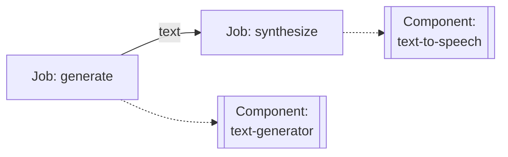
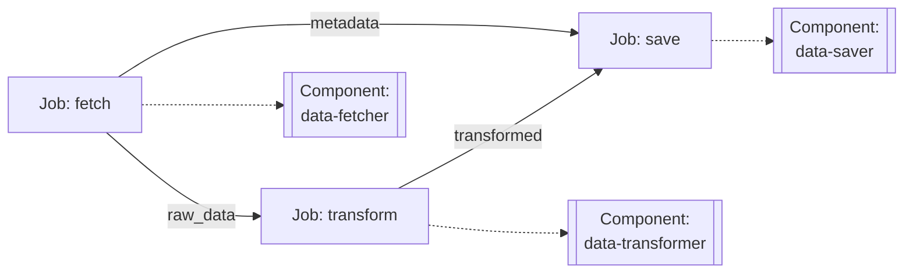
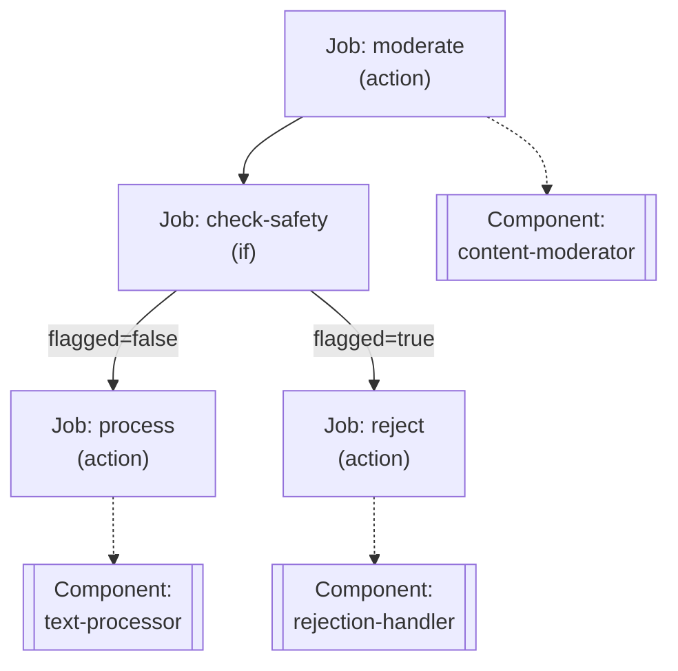
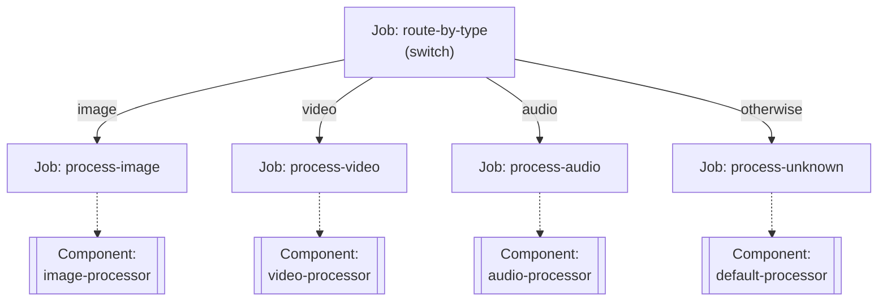
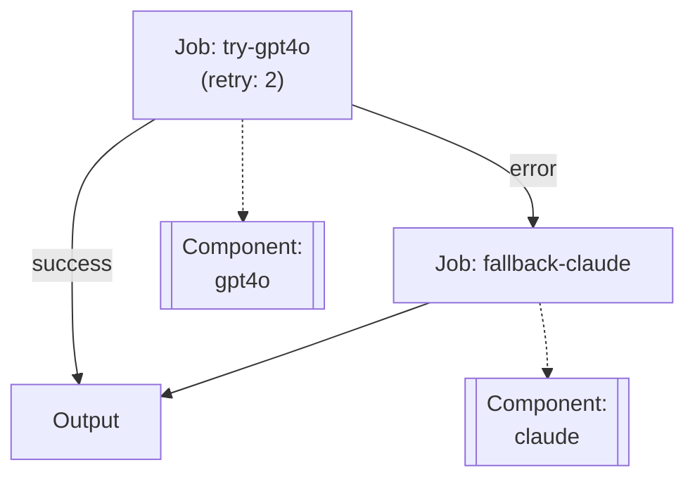

# Chapter 5: Writing Workflows

This chapter covers how to write workflows in model-compose. From single-job workflows to complex multi-step pipelines, you'll learn about data passing between jobs, conditional execution, streaming mode, and error handling.

---

## 5.1 Single-Job Workflows

The simplest form of a workflow contains just one job.

### Basic Structure

```yaml
workflows:
  - id: simple-workflow
    jobs:
      - id: task
        component: my-component
        input:
          field: ${input.value}
```

### Example: Text Generation

```yaml
components:
  - id: gpt4o
    type: http-client
    endpoint: https://api.openai.com/v1/chat/completions
    headers:
      Authorization: Bearer ${env.OPENAI_API_KEY}
      Content-Type: application/json
    body:
      model: gpt-4o
      messages:
        - role: user
          content: ${input.prompt}
    output:
      text: ${response.choices[0].message.content}

workflows:
  - id: generate-text
    jobs:
      - id: generate
        component: gpt4o
        input:
          prompt: ${input.prompt}
        output:
          result: ${output.text}
```

Execution:
```bash
model-compose run generate-text --input '{"prompt": "Hello, AI!"}'
```

### Simplified Form

Single-job workflows can be written more concisely:

```yaml
workflows:
  - id: generate-text
    component: gpt4o
    input:
      prompt: ${input.prompt}
    output:
      result: ${output.text}
```

---

## 5.2 Multi-Step Workflows

Workflows that execute multiple jobs sequentially.

### Sequential Execution

```yaml
workflows:
  - id: multi-step
    jobs:
      - id: step1
        component: component1
        input: ${input}
        output:
          data1: ${output}

      - id: step2
        component: component2
        input:
          data: ${jobs.step1.output.data1}
        output:
          data2: ${output}

      - id: step3
        component: component3
        input:
          data: ${jobs.step2.output.data2}
```

### Example: Text Generation and Speech Synthesis

```yaml
components:
  - id: text-generator
    type: http-client
    endpoint: https://api.openai.com/v1/chat/completions
    headers:
      Authorization: Bearer ${env.OPENAI_API_KEY}
      Content-Type: application/json
    body:
      model: gpt-4o
      messages:
        - role: user
          content: ${input.prompt}
    output:
      text: ${response.choices[0].message.content}

  - id: text-to-speech
    type: http-client
    endpoint: https://api.elevenlabs.io/v1/text-to-speech/${input.voice_id}
    headers:
      xi-api-key: ${env.ELEVENLABS_API_KEY}
      Content-Type: application/json
    body:
      text: ${input.text}
      model_id: eleven_multilingual_v2
    output: ${response as base64}

workflows:
  - id: text-to-voice
    jobs:
      - id: generate
        component: text-generator
        input:
          prompt: ${input.prompt}
        output:
          text: ${output.text}

      - id: synthesize
        component: text-to-speech
        input:
          text: ${jobs.generate.output.text}
          voice_id: ${input.voice_id}
        output:
          audio: ${output}
```

Structure diagram:


---

## 5.3 Data Passing Between Jobs

How to pass data between jobs in a workflow.

### Variable Binding Syntax

```yaml
${input.field}              # Workflow input
${output.field}             # Current job output
${jobs.job-id.output.field} # Specific job output
${env.VAR_NAME}             # Environment variable
```

### Example: Complex Data Passing

```yaml
workflows:
  - id: data-pipeline
    jobs:
      - id: fetch
        component: data-fetcher
        input:
          url: ${input.source_url}
        output:
          raw_data: ${output.data}
          metadata: ${output.meta}

      - id: transform
        component: data-transformer
        input:
          data: ${jobs.fetch.output.raw_data}
          options:
            format: json
            encoding: utf-8
        output:
          transformed: ${output.result}

      - id: save
        component: data-saver
        input:
          data: ${jobs.transform.output.transformed}
          metadata: ${jobs.fetch.output.metadata}
          destination: ${input.target_path}
```

Structure diagram:


### Type Conversion

You can apply type conversions during data passing:

```yaml
workflows:
  - id: image-workflow
    jobs:
      - id: generate
        component: image-generator
        output:
          image_base64: ${output as base64}

      - id: process
        component: image-processor
        input:
          image: ${jobs.generate.output.image_base64 as image/png;base64}
```

---

## 5.4 Job Types

model-compose provides various job types to support different task patterns.

### Available Job Types

| Type | Purpose | Description |
|------|---------|-------------|
| `action` | Component execution | Invoke a component to perform a task (default type) |
| `if` | Conditional branching | Route to different jobs based on a condition |
| `switch` | Multi-way branching | Route to one of many paths based on a value |
| `delay` | Wait | Wait for a specified duration |
| `filter` | Data restructuring | Extract and restructure data into a new shape |
| `random-router` | Random routing | Randomly select one job |

> **Note**: If `type` is not specified, it defaults to `action`.

### Action Job

The default job type that executes a component.

```yaml
jobs:
  - id: my-task
    type: action  # Optional (default)
    component: my-component
    action: my-action  # For multi-action components
    input: ${input}
    output:
      result: ${output}
```

### If Job

Branch to different jobs based on a condition.

#### Basic Structure

```yaml
jobs:
  - id: condition-check
    type: if
    operator: eq          # Comparison operator
    input: ${input.value}
    value: "expected"
    if_true: job-when-true
    if_false: job-when-false
```

#### Supported Operators

- `eq`: Equal
- `neq`: Not equal
- `gt`: Greater than
- `gte`: Greater than or equal
- `lt`: Less than
- `lte`: Less than or equal
- `in`: Contains
- `not-in`: Does not contain
- `starts-with`: Starts with
- `ends-with`: Ends with
- `match`: Regex match

#### Multiple Conditions

```yaml
jobs:
  - id: multi-condition
    type: if
    conditions:
      - operator: gt
        input: ${input.score}
        value: 80
        if_true: excellent-handler
      - operator: gt
        input: ${input.score}
        value: 60
        if_true: good-handler
    otherwise: need-improvement-handler
```

### Switch Job

Route to one of many paths based on a value.

#### Basic Structure

```yaml
jobs:
  - id: route-by-type
    type: switch
    input: ${input.type}
    cases:
      - value: "image"
        then: process-image
      - value: "video"
        then: process-video
      - value: "audio"
        then: process-audio
    otherwise: process-unknown
```

### Delay Job

Wait for a specified duration or until a specific time.

#### Time Interval Wait (time-interval)

```yaml
jobs:
  - id: wait
    type: delay
    mode: time-interval
    duration: 5000  # milliseconds
```

#### Wait Until Specific Time (specific-time)

```yaml
jobs:
  - id: wait-until
    type: delay
    mode: specific-time
    time: "2024-12-25T09:00:00"
    timezone: "Asia/Seoul"  # Optional
```

### Filter Job

Extract parts of data and restructure into a new shape.

```yaml
jobs:
  - id: reshape-data
    type: filter
    output:
      user_id: ${input.user.id}
      user_name: ${input.user.profile.name}
      score: ${input.metrics.score}
```

### Random Router Job

Randomly select one of multiple jobs. Use `weight` to adjust the probability of each route.

#### Equal Distribution (50:50)

```yaml
jobs:
  - id: ab-test
    type: random-router
    routes:
      - id: variant-a
        weight: 50
      - id: variant-b
        weight: 50
```

#### Unequal Distribution (70:20:10)

```yaml
jobs:
  - id: traffic-split
    type: random-router
    routes:
      - id: primary-model
        weight: 70
      - id: experimental-model
        weight: 20
      - id: fallback-model
        weight: 10
```

> **Note**: Weight values don't need to sum to 100. They work as relative ratios.

---

## 5.5 Conditional Execution

Using If and Switch jobs to control execution flow based on conditions.

### Example 1: Content Filtering with If Job

```yaml
components:
  - id: content-moderator
    type: http-client
    endpoint: https://api.openai.com/v1/moderations
    headers:
      Authorization: Bearer ${env.OPENAI_API_KEY}
      Content-Type: application/json
    body:
      input: ${input.text}
    output:
      flagged: ${response.results[0].flagged}

  - id: text-processor
    type: http-client
    endpoint: https://api.openai.com/v1/chat/completions
    headers:
      Authorization: Bearer ${env.OPENAI_API_KEY}
      Content-Type: application/json
    body:
      model: gpt-4o
      messages:
        - role: user
          content: ${input.text}
    output:
      result: ${response.choices[0].message.content}

  - id: rejection-handler
    type: http-client
    endpoint: https://api.example.com/log-rejection
    method: POST
    body:
      text: ${input.text}
      reason: "content_flagged"
    output: ${response}

workflows:
  - id: safe-processing
    jobs:
      - id: moderate
        component: content-moderator
        input:
          text: ${input.text}
        output:
          flagged: ${output.flagged}

      - id: check-safety
        type: if
        operator: eq
        input: ${jobs.moderate.output.flagged}
        value: false
        if_true: process
        if_false: reject

      - id: process
        component: text-processor
        input:
          text: ${input.text}
        output:
          result: ${output.result}

      - id: reject
        component: rejection-handler
        input:
          text: ${input.text}
```

Structure diagram:


### Example 2: Media Type Processing with Switch Job

```yaml
components:
  - id: image-processor
    type: http-client
    endpoint: https://api.example.com/process-image
    body:
      image: ${input.data}
    output: ${response}

  - id: video-processor
    type: http-client
    endpoint: https://api.example.com/process-video
    body:
      video: ${input.data}
    output: ${response}

  - id: audio-processor
    type: http-client
    endpoint: https://api.example.com/process-audio
    body:
      audio: ${input.data}
    output: ${response}

  - id: default-processor
    type: http-client
    endpoint: https://api.example.com/process-unknown
    body:
      data: ${input.data}
    output: ${response}

workflows:
  - id: media-processing
    jobs:
      - id: route-by-type
        type: switch
        input: ${input.media_type}
        cases:
          - value: "image"
            then: process-image
          - value: "video"
            then: process-video
          - value: "audio"
            then: process-audio
        otherwise: process-unknown

      - id: process-image
        component: image-processor
        input:
          data: ${input.data}

      - id: process-video
        component: video-processor
        input:
          data: ${input.data}

      - id: process-audio
        component: audio-processor
        input:
          data: ${input.data}

      - id: process-unknown
        component: default-processor
        input:
          data: ${input.data}
```

Structure diagram:


---

## 5.6 Streaming Mode

When components support streaming, you can stream data in real-time.

> **For more details, see [Chapter 11: Streaming Mode](./11-streaming-mode.md).**

### Streaming Configuration in Components

#### Model Components

Model components enable streaming by setting `streaming: true` at the action level:

```yaml
components:
  - id: local-llm
    type: model
    task: text-generation
    model:
      provider: huggingface
      repository: meta-llama/Llama-2-7b-hf
      token: ${env.HUGGINGFACE_TOKEN}
    text: ${input.prompt}
    streaming: true  # Enable streaming
```

#### HTTP Components

`http-client` and `http-server` components automatically switch to streaming mode when the API returns a stream response:

```yaml
components:
  - id: gpt4o-stream
    type: http-client
    endpoint: https://api.openai.com/v1/chat/completions
    headers:
      Authorization: Bearer ${env.OPENAI_API_KEY}
      Content-Type: application/json
    body:
      model: gpt-4o
      messages: ${input.messages}
      stream: true  # Request streaming from API
    output: ${response}
```

> **Note**: `http-client` and `http-server` automatically detect stream responses from APIs, so no explicit `streaming` setting is needed.

### Using Streaming in Workflows

```yaml
workflows:
  - id: chat
    jobs:
      - id: respond
        component: gpt4o-stream
        input:
          messages: ${input.messages}
    output: ${output}
```

> **Note**: If a component's output is a stream, the job's output is also a stream. If the last job's output is a stream, the workflow output is also returned as a stream.

### Requesting Streaming via HTTP API

```bash
curl -X POST http://localhost:8080/api/workflows/runs \
  -H "Content-Type: application/json" \
  -d '{
    "workflow_id": "chat",
    "input": {
      "messages": [
        {"role": "user", "content": "Tell me a story"}
      ]
    }
  }'
```

> **Note**: Streaming responses are delivered in Server-Sent Events (SSE) format.

---

## 5.7 Error Handling

Handle errors that may occur during workflow execution.

### Retry Configuration

```yaml
workflows:
  - id: resilient-workflow
    jobs:
      - id: api-call
        component: external-api
        retry:
          max_attempts: 3
          delay: 1000  # milliseconds
          backoff: exponential
        input: ${input}
```

### Fallback Handling

```yaml
workflows:
  - id: fallback-workflow
    jobs:
      - id: primary
        component: primary-service
        input: ${input}
        on_error: continue

      - id: fallback
        component: fallback-service
        condition: ${jobs.primary.error}
        input: ${input}
```

### Example: Multi-Model Fallback

```yaml
components:
  - id: gpt4o
    type: http-client
    endpoint: https://api.openai.com/v1/chat/completions
    headers:
      Authorization: Bearer ${env.OPENAI_API_KEY}
      Content-Type: application/json
    body:
      model: gpt-4o
      messages: ${input.messages}
    output:
      text: ${response.choices[0].message.content}

  - id: claude
    type: http-client
    endpoint: https://api.anthropic.com/v1/messages
    headers:
      x-api-key: ${env.ANTHROPIC_API_KEY}
      anthropic-version: "2023-06-01"
      Content-Type: application/json
    body:
      model: claude-3-5-sonnet-20241022
      messages: ${input.messages}
      max_tokens: 1024
    output:
      text: ${response.content[0].text}

workflows:
  - id: robust-chat
    jobs:
      - id: try-gpt4o
        component: gpt4o
        retry:
          max_attempts: 2
          delay: 500
        input:
          messages: ${input.messages}
        output:
          result: ${output.text}
        on_error: continue

      - id: fallback-claude
        component: claude
        condition: ${jobs.try-gpt4o.error}
        input:
          messages: ${input.messages}
        output:
          result: ${output.text}
```

Structure diagram:


### Accessing Error Information

```yaml
workflows:
  - id: error-logging
    jobs:
      - id: risky-operation
        component: risky-api
        input: ${input}
        on_error: continue

      - id: log-error
        component: error-logger
        condition: ${jobs.risky-operation.error}
        input:
          error_message: ${jobs.risky-operation.error.message}
          error_code: ${jobs.risky-operation.error.code}
          timestamp: ${jobs.risky-operation.error.timestamp}
```

---

## 5.8 Workflow Best Practices

### 1. Clear Job Names

```yaml
# Good
workflows:
  - id: user-onboarding
    jobs:
      - id: validate-email
        component: email-validator
      - id: create-account
        component: account-creator
      - id: send-welcome-email
        component: email-sender

# Bad
workflows:
  - id: workflow1
    jobs:
      - id: step1
        component: comp1
      - id: step2
        component: comp2
```

### 2. Job Decomposition

Break complex logic into smaller jobs:

```yaml
# Good - Clear step separation
workflows:
  - id: content-pipeline
    jobs:
      - id: fetch-content
        component: content-fetcher
      - id: validate-content
        component: content-validator
      - id: transform-content
        component: content-transformer
      - id: publish-content
        component: content-publisher

# Bad - One monolithic job
workflows:
  - id: content-pipeline
    jobs:
      - id: process-everything
        component: monolithic-processor
```

### 3. Reusable Workflows

```yaml
components:
  - id: preprocessing-workflow
    type: workflow
    workflow: preprocessing

workflows:
  - id: preprocessing
    jobs:
      - id: clean
        component: data-cleaner
      - id: normalize
        component: data-normalizer

  - id: analysis
    jobs:
      - id: preprocess
        component: preprocessing-workflow
        input: ${input.raw_data}
      - id: analyze
        component: analyzer
        input: ${jobs.preprocess.output}
```

### 4. Document Inputs and Outputs

```yaml
workflows:
  - id: image-generation
    # Input: { prompt: string, style: string, size: string }
    # Output: { image_url: string, width: number, height: number }
    jobs:
      - id: generate
        component: image-generator
        input:
          prompt: ${input.prompt}
          style: ${input.style}
          size: ${input.size}
```

### 5. Consider Error Handling

Always add retry or fallback logic for critical jobs:

```yaml
workflows:
  - id: critical-workflow
    jobs:
      - id: important-task
        component: critical-service
        retry:
          max_attempts: 3
          delay: 1000
        on_error: continue

      - id: fallback-task
        component: backup-service
        condition: ${jobs.important-task.error}
```

---

## Next Steps

Try it out:
- Start with simple single-job workflows
- Gradually expand to complex multi-step workflows
- Add error handling and retry logic
- Build reusable workflow components

---

**Next Chapter**: [6. Controller Configuration](./06-controller-configuration.md)
