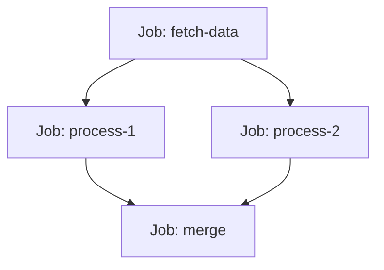
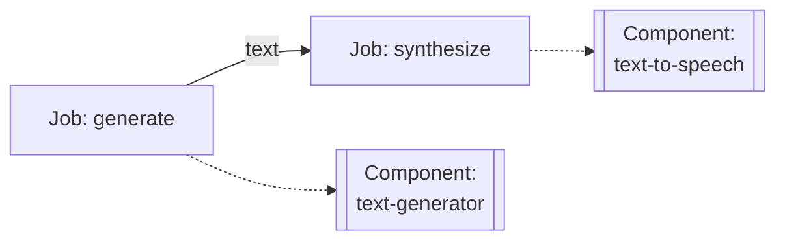
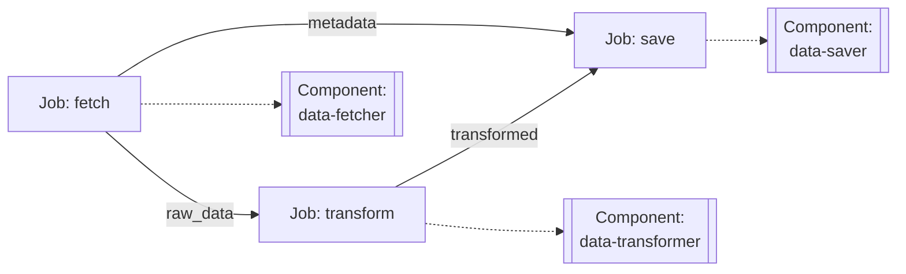
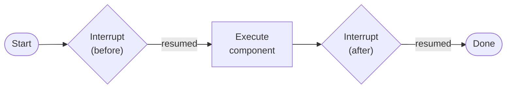
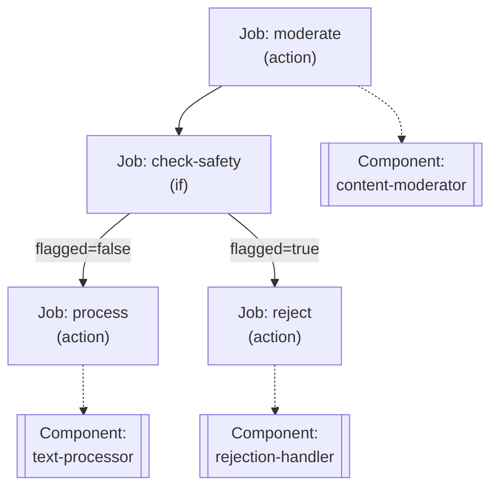
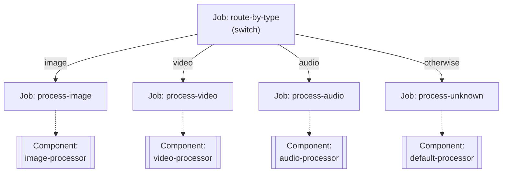

# Chapter 5: Writing Workflows

This chapter covers how to write workflows in model-compose. From single-job workflows to complex multi-step pipelines, you'll learn about data passing between jobs, conditional execution, streaming mode, and error handling.

## 5.1 What is a Workflow?

A **Workflow** is an execution unit that combines one or more jobs to form a complete execution pipeline. When writing a workflow, you need to define three core elements:

### 1. Job Definitions
Each job specifies the component to execute and the input to pass to that component.

```yaml
jobs:
  - id: my-task
    component: my-component
    input:
      field: ${input.value}
```

### 2. Job Dependencies
Use the `depends_on` field to explicitly define the execution order between jobs. This allows you to create sequential execution, parallel execution, or complex execution graphs.

```yaml
jobs:
  - id: task1
    component: component1

  - id: task2
    component: component2
    depends_on: [task1]  # Executes after task1 completes
```

### 3. Input/Output Definitions
- **input**: Maps workflow input or previous job outputs to the current job's input
- **output**: Uses the job's result as workflow output or as input for subsequent jobs

Each job's output is stored in `${jobs.job_id.output}` and can be referenced as input by subsequent jobs.

```yaml
jobs:
  - id: task1
    component: component1
    input:
      data: ${input.user_data}     # Use workflow input
    output:
      result: ${output.processed}
    # Output is stored in jobs.task1.output

  - id: task2
    component: component2
    input:
      data: ${jobs.task1.output.result}  # Use task1's output as input
    depends_on: [task1]
```

By combining these three elements, you can build workflows ranging from simple single jobs to complex multi-step pipelines.

---

## 5.2 Single-Job Workflows

The simplest form of a workflow contains just one job.

### Basic Structure

```yaml
workflows:
  - id: simple-workflow
    jobs:
      - id: task
        component: my-component
        input:
          field: ${input.value}
```

### Simplified Form

When there's only one job, you can omit `jobs` and the job `id`. If the `id` is omitted, it defaults to `__job__`.

```yaml
workflows:
  - id: simple-workflow
    component: my-component
    input:
      field: ${input.value}
```

### Example: Text Generation

```yaml
components:
  - id: gpt4o
    type: http-client
    action:
      endpoint: https://api.openai.com/v1/chat/completions
      headers:
        Authorization: Bearer ${env.OPENAI_API_KEY}
        Content-Type: application/json
      body:
        model: gpt-4o
        messages:
          - role: user
            content: ${input.prompt}
      output:
        text: ${response.choices[0].message.content}

workflows:
  - id: generate-text
    jobs:
      - id: generate
        component: gpt4o
        input:
          prompt: ${input.prompt}
        output:
          result: ${output.text}
```

Execution:
```bash
model-compose run generate-text --input '{"prompt": "Hello, AI!"}'
```

---

## 5.3 Multi-Step Workflows

Workflows that execute multiple jobs sequentially.

### Job Dependencies (depends_on)

Use the `depends_on` field to explicitly define the execution order between jobs. This field specifies a list of job IDs that must complete before the current job starts.

**Basic format:**
```yaml
depends_on: [job-id-1, job-id-2]
```

**Key features:**
- Can specify dependencies on multiple jobs as an array
- Executes after all dependent jobs complete
- Jobs without dependencies can run in parallel
- Circular dependencies are not allowed

### Sequential Execution

```yaml
workflows:
  - id: multi-step
    jobs:
      - id: step1
        component: component1
        input: ${input}
        output:
          data1: ${output}

      - id: step2
        component: component2
        input:
          data: ${jobs.step1.output.data1}
        output:
          data2: ${output}
        depends_on: [step1]  # Executes after step1 completes

      - id: step3
        component: component3
        input:
          data: ${jobs.step2.output.data2}
        depends_on: [step2]  # Executes after step2 completes
```

### Parallel Execution

Jobs without dependencies run concurrently:

```yaml
workflows:
  - id: parallel-workflow
    jobs:
      - id: task-a
        component: component-a
        input: ${input}
        output:
          result-a: ${output}

      - id: task-b
        component: component-b
        input: ${input}
        output:
          result-b: ${output}
      # task-a and task-b run in parallel

      - id: combine
        component: combiner
        input:
          data-a: ${jobs.task-a.output.result-a}
          data-b: ${jobs.task-b.output.result-b}
        depends_on: [task-a, task-b]  # Executes after both tasks complete
```

### Complex Dependency Graph

```yaml
workflows:
  - id: complex-workflow
    jobs:
      - id: fetch-data
        component: data-fetcher
        output:
          raw: ${output}

      - id: process-1
        component: processor-1
        input: ${jobs.fetch-data.output.raw}
        depends_on: [fetch-data]
        output:
          processed-1: ${output}

      - id: process-2
        component: processor-2
        input: ${jobs.fetch-data.output.raw}
        depends_on: [fetch-data]
        output:
          processed-2: ${output}

      - id: merge
        component: merger
        input:
          data-1: ${jobs.process-1.output.processed-1}
          data-2: ${jobs.process-2.output.processed-2}
        depends_on: [process-1, process-2]
        output:
          merged: ${output}
```

Structure diagram:

```mermaid
graph TB
    fetch["Job: fetch-data"]
    proc1["Job: process-1"]
    proc2["Job: process-2"]
    merge["Job: merge"]

    fetch --> proc1
    fetch --> proc2
    proc1 --> merge
    proc2 --> merge
```

### Example: Text Generation and Speech Synthesis

```yaml
components:
  - id: text-generator
    type: http-client
    action:
      endpoint: https://api.openai.com/v1/chat/completions
      headers:
        Authorization: Bearer ${env.OPENAI_API_KEY}
        Content-Type: application/json
      body:
        model: gpt-4o
        messages:
          - role: user
            content: ${input.prompt}
      output:
        text: ${response.choices[0].message.content}

  - id: text-to-speech
    type: http-client
    action:
      endpoint: https://api.elevenlabs.io/v1/text-to-speech/${input.voice_id}
      headers:
        xi-api-key: ${env.ELEVENLABS_API_KEY}
        Content-Type: application/json
      body:
        text: ${input.text}
        model_id: eleven_multilingual_v2
      output: ${response as base64}

workflows:
  - id: text-to-voice
    jobs:
      - id: generate
        component: text-generator
        input:
          prompt: ${input.prompt}
        output:
          text: ${output.text}

      - id: synthesize
        component: text-to-speech
        input:
          text: ${jobs.generate.output.text}
          voice_id: ${input.voice_id}
        output:
          audio: ${output}
        depends_on: [ generate ]
```

Structure diagram:

```mermaid
graph LR
    job1["Job: generate"]
    job2["Job: synthesize"]

    job1 -->|text| job2

    job1 -.-> comp1[[Component:<br/>text-generator]]
    job2 -.-> comp2[[Component:<br/>text-to-speech]]
```

---

## 5.4 Data Passing Between Jobs

How to pass data between jobs in a workflow.

### Variable Binding Syntax

```yaml
${input.field}              # Workflow input
${output.field}             # Current job output
${jobs.job-id.output.field} # Specific job output
${env.VAR_NAME}             # Environment variable
```

### Example: Complex Data Passing

```yaml
workflows:
  - id: data-pipeline
    jobs:
      - id: fetch
        component: data-fetcher
        input:
          url: ${input.source_url}
        output:
          raw_data: ${output.data}
          metadata: ${output.meta}

      - id: transform
        component: data-transformer
        input:
          data: ${jobs.fetch.output.raw_data}
          options:
            format: json
            encoding: utf-8
        output:
          transformed: ${output.result}
        depends_on: [ fetch ]

      - id: save
        component: data-saver
        input:
          data: ${jobs.transform.output.transformed}
          metadata: ${jobs.fetch.output.metadata}
          destination: ${input.target_path}
        depends_on: [ transform, fetch ]
```

Structure diagram:

```mermaid
graph LR
    fetch["Job: fetch"]
    transform["Job: transform"]
    save["Job: save"]

    fetch -->|raw_data| transform
    fetch -->|metadata| save
    transform -->|transformed| save

    fetch -.-> comp1[[Component:<br/>data-fetcher]]
    transform -.-> comp2[[Component:<br/>data-transformer]]
    save -.-> comp3[[Component:<br/>data-saver]]
```

### Type Conversion

You can apply type conversions during data passing:

```yaml
workflows:
  - id: image-workflow
    jobs:
      - id: generate
        component: image-generator
        output:
          image_base64: ${output as base64}

      - id: process
        component: image-processor
        input:
          image: ${jobs.generate.output.image_base64 as image/png;base64}
```

### Workflow Output

A workflow can declare its own `output` to shape the final response returned to the caller. The expression is evaluated after all jobs finish and supports the same variable binding syntax used by jobs.

```yaml
workflows:
  - id: summarize
    jobs:
      - id: fetch
        component: data-fetcher
        input:
          url: ${input.source_url}

      - id: summarize
        component: summarizer
        input:
          text: ${jobs.fetch.output.body}
        depends_on: [ fetch ]

    output:
      summary: ${jobs.summarize.output.text}
      source: ${jobs.fetch.output.url}
```

If `output` is omitted, the workflow's result falls back to the outputs of its **terminal jobs** (jobs that no other job depends on). When multiple terminal jobs each return a dictionary, their outputs are merged; otherwise the last terminal job's output is used directly. Defining `output` explicitly overrides this default and lets you reshape or rename the response.

---

## 5.5 Job Types

model-compose provides various job types to support different task patterns.

### Available Job Types

| Type | Purpose | Description |
|------|---------|-------------|
| `component` | Component execution | Invoke a component to perform a task (default type) |
| `if` | Conditional branching | Route to different jobs based on a condition |
| `switch` | Multi-way branching | Route to one of many paths based on a value |
| `delay` | Wait | Wait for a duration or until a specific time |
| `filter` | Data restructuring | Extract and restructure data into a new shape |
| `random-router` | Random routing | Randomly select one job |
| `for-each` | Iteration | Run a component once per item in a collection |

> **Note**: If `type` is not specified, it defaults to `component`.

### Common Job Fields

Regardless of type, every job supports the following fields:

| Field | Type | Default | Description |
|-------|------|---------|-------------|
| `id` | `string` | `"__job__"` | Unique job identifier. |
| `name` | `string` | `null` | Human-readable label used as a group label in the web UI. |
| `depends_on` | `string[]` | `[]` | List of job IDs that must complete before this job runs. |
| `max_run_count` | `int` | `5` | Maximum times this job may execute within one workflow run (including routing re-runs). |
| `interrupt` | object | `null` | Human-in-the-loop interrupt points. See [Interrupts (Human-in-the-Loop)](#interrupts-human-in-the-loop) below. |
| `hook` | object | `null` | Inline Python hooks that run before/after the job. See [Hooks](#hooks) below. |
| `retry` | int/object | `null` | Retry policy applied on failure. See [Retry](#retry) below. |
| `on_error` | string/object | `null` | Fallback behavior after retries are exhausted. See [On-Error](#on-error) below. |

Interrupts, hooks, retries, and on-error handlers work on every job type — component, if, switch, delay, filter, for-each, random-router.

#### Interrupts (Human-in-the-Loop)

Pause a job before and/or after it runs, so a human (or another system) can inspect or override the state. Each phase accepts either `true` (always interrupt) or a detailed config:

```yaml
jobs:
  - id: send-invoice
    component: mailer
    interrupt:
      before:
        message: "Confirm before sending"
        condition:
          input: ${input.amount}
          operator: gt
          value: 1000
      after: true
```

- **`message`** — text shown to the user or client when the interrupt fires.
- **`metadata`** — structured data forwarded to the client (e.g., preview payload).
- **`condition`** — optional `{ operator, input, value }`; the interrupt only fires when the condition is truthy. Uses the same operators as [If Job](#if-job) (`eq`, `neq`, `gt`, `gte`, `lt`, `lte`, `in`, `not-in`, `match`).

**Task lifecycle around an interrupt:**

```
PENDING → PROCESSING → INTERRUPTED → PROCESSING → ... → COMPLETED / FAILED
```

The task remains in `INTERRUPTED` until it is resumed. Resuming with an `answer` replaces the job's input (before phase) or output (after phase); a null/empty answer leaves the data unchanged.

**Resume payload:**

Every resume call needs `task_id`, `job_id`, `run_id`, and optionally `answer`. `run_id` is non-null only for `component` jobs with `repeat_count > 1`, where each parallel repeat interrupts independently — for all other jobs pass `null`.

```bash
curl -X POST http://localhost:8080/api/tasks/{task_id}/resume \
  -H "Content-Type: application/json" \
  -d '{"job_id": "send-invoice", "run_id": null, "answer": {"approved": true}}'
```

For CLI, WebSocket, and MCP flows, see [Chapter 3](./03-cli-usage.md#interrupt-handling), [Chapter 7](./07-controller-configuration.md), and [Chapter 8](./08-websocket-interface.md).

#### Hooks

Run inline Python code before and/or after a job, without pausing for a human. Hooks are useful for shaping input/output, side effects (logging, metrics), or wiring in-process helpers.

```yaml
jobs:
  - id: enrich
    component: my-component
    hook:
      before:
        script: |
          async def hook(input, **kwargs):
              input["received_at"] = kwargs["run_id"]
              return input
      after:
        - script: |
            async def hook(input, output, **kwargs):
                output["enriched"] = True
                return output
        - script: |
            async def hook(input, output, **kwargs):
                # observation-only hook — return the value unchanged
                print(f"[{kwargs['phase']}] {kwargs['job_id']} produced {output}")
                return output
```

**Hook signatures:**

- **Before phase:** `async def hook(input, **kwargs)` — returned value replaces the input.
- **After phase:** `async def hook(input, output, **kwargs)` — returned value replaces the output.

The return value is always used verbatim; to leave data unchanged you must explicitly `return input` (or `return output`). Both sync and async functions are supported.

**`kwargs` fields (`HookPoint`):**

| Field | Type | Description |
|-------|------|-------------|
| `task_id` | `str` | Workflow task ID |
| `job_id` | `str` | Job ID |
| `run_id` | `str \| None` | Per-run ID; non-null only for `component` jobs with `repeat_count > 1` |
| `phase` | `"before" \| "after"` | The phase this hook is bound to |

Each phase accepts either a single hook or a list. When a list is given, hooks pipe results together in order.

**Interaction with routing jobs (`if`, `switch`, `random-router`):** the after-hook is invoked with `output=None` and its return value is discarded — hooks on routing jobs are effectively observation-only.

**Execution order per job:** `before-interrupt → before-hook → job body → output template render → after-interrupt → after-hook`.

#### Retry

Retry a job when it raises an exception. The retry loop is internal to the job — retries do **not** count against `max_run_count`, which tracks routing re-runs only.

```yaml
jobs:
  - id: fetch
    component: http-api
    retry: 3               # 3 total attempts, no delay
```

Or the full form:

```yaml
jobs:
  - id: fetch
    component: http-api
    retry:
      max_attempt_count: 5
      delay: 1s
      backoff: exponential   # fixed | exponential
      max_delay: 30s
```

Any exception raised by the job body is retried up to `max_attempt_count` times.

| Field | Type | Default | Description |
|-------|------|---------|-------------|
| `max_attempt_count` | `int` | `1` | Total attempts including the first, before falling through to `on_error`. Must be ≥ 1. |
| `delay` | string/number | `0` | Base delay between attempts (`"1s"`, `"500ms"`, or seconds). |
| `backoff` | `"fixed" \| "exponential"` | `"fixed"` | How the delay grows across attempts. |
| `max_delay` | string/number | `null` | Cap for the delay after backoff is applied. |

Delay grows per attempt (`n` = current attempt, `1`-indexed):

- `fixed` → `base`
- `exponential` → `base × 2^(n − 1)`

If retries are exhausted, `on_error` is applied when configured; otherwise the exception propagates.

#### On-Error

Apply a fallback strategy after retries are exhausted. Without `on_error`, an unhandled exception fails the workflow.

```yaml
jobs:
  - id: fetch
    component: http-api
    on_error: ignore       # swallow the error, return null
```

Or the full form:

```yaml
jobs:
  - id: fetch
    component: http-api
    retry: 3
    on_error:
      output:
        status: failed
        reason: ${error.message}
      to: cleanup_job
```

The `on_error: ignore` string form is a shorthand for `on_error: {}` — swallow the error and return `null`.

| Field | Type | Default | Description |
|-------|------|---------|-------------|
| `output` | any | `null` | Fallback output rendered on failure. Can reference `${error.*}` variables. |
| `to` | `string` | `null` | Job ID to route to on failure (like a routing job's target). |

**Resolution order** when `on_error` fires:

1. `to` set → route to that job (`output` is ignored).
2. Otherwise `output` set → render and return it.
3. Otherwise → return `null`.

**Error variables** available inside `output`:

| Path | Description |
|------|-------------|
| `${error.message}` | Exception message (`str(e)`). |

`on_error` only fires after every retry attempt has failed; if any retry succeeds, `on_error` is not invoked.

### Component Job

The default job type that executes a component. If `type` is omitted, the job is treated as a component job.

#### Fields (in addition to [Common Job Fields](#common-job-fields))

| Field | Type | Default | Description |
|-------|------|---------|-------------|
| `component` | `string` or object | `"__default__"` | The component to run. Either a string ID referencing a defined component, or an inline component config object. |
| `action` | `string` | `"__default__"` | The action to invoke on the component. For components with multiple actions, specify which one to call. |
| `input` | any | `null` | Input data supplied to the component. Supports variable binding (`${input.field}`, `${jobs.*.output}`). |
| `output` | any | `null` | Output mapping. Extracts and reshapes the component's output for use by subsequent jobs. |
| `repeat_count` | `int` or `string` | `1` | Number of times to repeat the component execution. Must be at least 1. Each repeat gets a distinct `run_id`, so interrupts and hooks are isolated per run. |

#### Basic Structure

```yaml
jobs:
  - id: my-task
    type: component  # Optional (default)
    component: my-component
    action: my-action  # For multi-action components
    input: ${input}
    output:
      result: ${output}
```

#### Inline Component

Instead of referencing a predefined component by ID, you can define the component inline:

```yaml
jobs:
  - id: my-task
    component:
      type: http-client
      action:
        endpoint: https://api.example.com/run
        body:
          data: ${input.data}
        output: ${response.result}
```

#### Repeat Execution

Run a component multiple times with the same input. Results are collected into an array:

```yaml
jobs:
  - id: generate-variants
    component: text-generator
    input:
      prompt: ${input.prompt}
    repeat_count: 3
```

The `repeat_count` also supports variable binding:

```yaml
repeat_count: ${input.count}
```

#### Example: Shell Command with Human Approval

`interrupt` (documented in [Common Job Fields](#common-job-fields)) is often used to gate side-effecting component jobs like shell execution:

```yaml
workflow:
  jobs:
    - id: run-command
      component: shell-executor
      input:
        command: ls -la
      interrupt:
        before:
          message: "About to execute: ls -la"
          metadata:
            command: ls -la
        after:
          message: "Command finished. Review the output above."
      output:
        result: ${output as text}

component:
  id: shell-executor
  type: shell
  action:
    command: ["sh", "-c", "${input.command}"]
    output: ${result.stdout}
```

Structure diagram:

```mermaid
graph LR
    start(["Start"]) --> before{"Interrupt<br/>(before)"}
    before -->|resumed| exec["Execute<br/>component"]
    exec --> after{"Interrupt<br/>(after)"}
    after -->|resumed| done(["Done"])
```

### If Job

Branch to different jobs based on a condition. Conditions are evaluated in order; the first match determines the routing target.

#### Fields

| Field | Type | Default | Description |
|-------|------|---------|-------------|
| `input` | any | `null` | Value to evaluate against the conditions. Supports variable binding. |
| `conditions` | `IfCondition[]` | `[]` | List of conditions to evaluate in order. |
| `otherwise` | `string` | `null` | Job ID to route to if no conditions matched. |
| `depends_on` | `string[]` | `[]` | Jobs that must complete before this job runs. |

**IfCondition fields:**

| Field | Type | Default | Description |
|-------|------|---------|-------------|
| `operator` | `string` | `"eq"` | Comparison operator (see below). |
| `value` | any | `null` | Value to compare against. Supports variable binding. |
| `if_true` | `string` | `null` | Job ID to route to when the condition is true. |
| `if_false` | `string` | `null` | Job ID to route to when the condition is false. |

#### Supported Operators

| Operator | Description |
|----------|-------------|
| `eq` | Equal |
| `neq` | Not equal |
| `gt` | Greater than |
| `gte` | Greater than or equal |
| `lt` | Less than |
| `lte` | Less than or equal |
| `in` | Contained in value |
| `not-in` | Not contained in value |
| `starts-with` | Starts with |
| `ends-with` | Ends with |
| `match` | Regex match |

#### Single Condition (Shorthand)

When there is only one condition, you can write the condition fields directly on the job without wrapping in `conditions`:

```yaml
jobs:
  - id: condition-check
    type: if
    input: ${input.value}
    operator: eq
    value: "expected"
    if_true: job-when-true
    if_false: job-when-false
```

#### Multiple Conditions

```yaml
jobs:
  - id: multi-condition
    type: if
    input: ${input.score}
    conditions:
      - operator: gt
        value: 80
        if_true: excellent-handler
      - operator: gt
        value: 60
        if_true: good-handler
    otherwise: need-improvement-handler
```

### Switch Job

Route to one of many paths based on exact value matching. Like a switch-case statement.

#### Fields

| Field | Type | Default | Description |
|-------|------|---------|-------------|
| `input` | any | `null` | Value to match against cases. Supports variable binding. |
| `cases` | `SwitchCase[]` | `[]` | List of cases to evaluate. |
| `otherwise` | `string` | `null` | Job ID to route to if no cases match. |
| `depends_on` | `string[]` | `[]` | Jobs that must complete before this job runs. |

**SwitchCase fields:**

| Field | Type | Description |
|-------|------|-------------|
| `value` | `string` | Value to match against the input. |
| `then` | `string` | Job ID to route to if the value matches. |

#### Single Case (Shorthand)

```yaml
jobs:
  - id: check-type
    type: switch
    input: ${input.type}
    value: "image"
    then: process-image
    otherwise: process-other
```

#### Multiple Cases

```yaml
jobs:
  - id: route-by-type
    type: switch
    input: ${input.type}
    cases:
      - value: "image"
        then: process-image
      - value: "video"
        then: process-video
      - value: "audio"
        then: process-audio
    otherwise: process-unknown
```

### Delay Job

Wait for a specified duration or until a specific time. Has two modes selected by the `mode` field.

#### Fields (time-interval)

| Field | Type | Default | Description |
|-------|------|---------|-------------|
| `mode` | `"time-interval"` | - | Wait for a duration. |
| `duration` | `number` or `string` | - | Time to wait — seconds as a number, or a duration string like `"5s"`, `"2m"`, `"1h"`. Supports variable binding. |
| `output` | any | `null` | Optional output mapping. |
| `depends_on` | `string[]` | `[]` | Jobs that must complete before this job runs. |

```yaml
jobs:
  - id: wait
    type: delay
    mode: time-interval
    duration: 5s  # or 5 (numeric seconds)
```

#### Fields (specific-time)

| Field | Type | Default | Description |
|-------|------|---------|-------------|
| `mode` | `"specific-time"` | - | Wait until a specific date/time. |
| `time` | `datetime` or `string` | - | Target date and time (ISO 8601 format). Supports variable binding. |
| `timezone` | `string` | `null` | Timezone identifier (e.g., `"Asia/Seoul"`, `"UTC"`). |
| `output` | any | `null` | Optional output mapping. |
| `depends_on` | `string[]` | `[]` | Jobs that must complete before this job runs. |

```yaml
jobs:
  - id: wait-until
    type: delay
    mode: specific-time
    time: "2024-12-25T09:00:00"
    timezone: "Asia/Seoul"
```

### Filter Job

Extract parts of data and restructure into a new shape. Does not execute any component — it only transforms data using variable bindings.

#### Fields

| Field | Type | Default | Description |
|-------|------|---------|-------------|
| `output` | any | `null` | Output mapping that defines the new data shape. Uses variable binding to extract values from workflow input or previous job outputs. |
| `depends_on` | `string[]` | `[]` | Jobs that must complete before this job runs. |

```yaml
jobs:
  - id: reshape-data
    type: filter
    output:
      user_id: ${input.user.id}
      user_name: ${input.user.profile.name}
      score: ${input.metrics.score}
```

### Random Router Job

Randomly select one of multiple jobs. Supports uniform (equal probability) and weighted (custom probability) modes.

#### Fields

| Field | Type | Default | Description |
|-------|------|---------|-------------|
| `mode` | `"uniform"` or `"weighted"` | `"uniform"` | Routing mode. `uniform` gives equal probability; `weighted` uses the `weight` field of each route. |
| `routings` | `Routing[]` | `[]` | List of possible routing destinations. |
| `depends_on` | `string[]` | `[]` | Jobs that must complete before this job runs. |

**Routing fields:**

| Field | Type | Default | Description |
|-------|------|---------|-------------|
| `to` | `string` | - | Destination job ID. |
| `weight` | `number` | `null` | Relative weight for weighted mode. Ignored in uniform mode. |

#### Uniform Distribution

```yaml
jobs:
  - id: ab-test
    type: random-router
    mode: uniform
    routings:
      - to: variant-a
      - to: variant-b
```

#### Weighted Distribution (70:20:10)

```yaml
jobs:
  - id: traffic-split
    type: random-router
    mode: weighted
    routings:
      - to: primary-model
        weight: 70
      - to: experimental-model
        weight: 20
      - to: fallback-model
        weight: 10
```

> **Note**: Weight values don't need to sum to 100. They work as relative ratios.

### For-Each Job

Run a component once per item in an input collection. Items are drawn from a list, an async stream, or any iterable, and processed in batches.

#### Fields

| Field | Type | Default | Description |
|-------|------|---------|-------------|
| `input` | any | - | Source of items to iterate over. Supports lists, async streams, and iterables. Supports variable binding. |
| `batch_size` | `integer` | `null` (=1) | Number of items processed concurrently per batch. |
| `streaming` | `boolean` | `false` | Yield results as they complete instead of accumulating into a list. |
| `do.component` | `string` or object | `"__default__"` | Component to invoke for each item. |
| `do.action` | `string` | `"__default__"` | Action to invoke on the component. |
| `do.input` | any | `null` | Input for each iteration; `${item}` refers to the current element. |
| `do.output` | any | `null` | Output mapping applied to each iteration's result. |
| `output` | any | `null` | Job-level output mapping applied to the aggregated result. |
| `depends_on` | `string[]` | `[]` | Jobs that must complete before this job runs. |

```yaml
jobs:
  - id: process-each
    type: for-each
    input: ${input.items}
    batch_size: 4
    do:
      component: item-processor
      action: transform
      input:
        item: ${item}
```

---

## 5.6 Conditional Execution

Using If and Switch jobs to control execution flow based on conditions.

### Example 1: Content Filtering with If Job

```yaml
components:
  - id: content-moderator
    type: http-client
    action:
      endpoint: https://api.openai.com/v1/moderations
      headers:
        Authorization: Bearer ${env.OPENAI_API_KEY}
        Content-Type: application/json
      body:
        input: ${input.text}
      output:
        flagged: ${response.results[0].flagged}

  - id: text-processor
    type: http-client
    action:
      endpoint: https://api.openai.com/v1/chat/completions
      headers:
        Authorization: Bearer ${env.OPENAI_API_KEY}
        Content-Type: application/json
      body:
        model: gpt-4o
        messages:
          - role: user
            content: ${input.text}
      output:
        result: ${response.choices[0].message.content}

  - id: rejection-handler
    type: http-client
    action:
      endpoint: https://api.example.com/log-rejection
      method: POST
      body:
        text: ${input.text}
        reason: "content_flagged"
      output: ${response}

workflows:
  - id: safe-processing
    jobs:
      - id: moderate
        component: content-moderator
        input:
          text: ${input.text}
        output:
          flagged: ${output.flagged}

      - id: check-safety
        type: if
        operator: eq
        input: ${jobs.moderate.output.flagged}
        value: false
        if_true: process
        if_false: reject
        depends_on: [ moderate ]

      - id: process
        component: text-processor
        input:
          text: ${input.text}
        output:
          result: ${output.result}

      - id: reject
        component: rejection-handler
        input:
          text: ${input.text}
```

Structure diagram:

```mermaid
graph TB
    moderate["Job: moderate<br/>(action)"]
    check["Job: check-safety<br/>(if)"]
    process["Job: process<br/>(action)"]
    reject["Job: reject<br/>(action)"]

    moderate --> check
    check -->|flagged=false| process
    check -->|flagged=true| reject

    moderate -.-> comp1[[Component:<br/>content-moderator]]
    process -.-> comp2[[Component:<br/>text-processor]]
    reject -.-> comp3[[Component:<br/>rejection-handler]]
```

### Example 2: Media Type Processing with Switch Job

```yaml
components:
  - id: image-processor
    type: http-client
    action:
      endpoint: https://api.example.com/process-image
      body:
        image: ${input.data}
      output: ${response}

  - id: video-processor
    type: http-client
    action:
      endpoint: https://api.example.com/process-video
      body:
        video: ${input.data}
      output: ${response}

  - id: audio-processor
    type: http-client
    action:
      endpoint: https://api.example.com/process-audio
      body:
        audio: ${input.data}
      output: ${response}

  - id: default-processor
    type: http-client
    action:
      endpoint: https://api.example.com/process-unknown
      body:
        data: ${input.data}
      output: ${response}

workflows:
  - id: media-processing
    jobs:
      - id: route-by-type
        type: switch
        input: ${input.media_type}
        cases:
          - value: "image"
            then: process-image
          - value: "video"
            then: process-video
          - value: "audio"
            then: process-audio
        otherwise: process-unknown

      - id: process-image
        component: image-processor
        input:
          data: ${input.data}
        depends_on: [ route-by-type ]

      - id: process-video
        component: video-processor
        input:
          data: ${input.data}
        depends_on: [ route-by-type ]

      - id: process-audio
        component: audio-processor
        input:
          data: ${input.data}
        depends_on: [ route-by-type ]

      - id: process-unknown
        component: default-processor
        input:
          data: ${input.data}
        depends_on: [ route-by-type ]
```

Structure diagram:

```mermaid
graph TB
    route["Job: route-by-type<br/>(switch)"]
    img["Job: process-image"]
    vid["Job: process-video"]
    aud["Job: process-audio"]
    unk["Job: process-unknown"]

    route -->|"image"| img
    route -->|"video"| vid
    route -->|"audio"| aud
    route -->|"otherwise"| unk

    img -.-> comp1[[Component:<br/>image-processor]]
    vid -.-> comp2[[Component:<br/>video-processor]]
    aud -.-> comp3[[Component:<br/>audio-processor]]
    unk -.-> comp4[[Component:<br/>default-processor]]
```

---

## 5.7 Streaming Mode

When components support streaming, you can stream data in real-time.

> **For more details, see [Chapter 13: Streaming Mode](./13-streaming-mode.md).**

### Streaming Configuration in Components

#### Model Components

Model components enable streaming by setting `streaming: true` at the component level:

```yaml
components:
  - id: local-llm
    type: model
    task: text-generation
    model:
      provider: huggingface
      repository: meta-llama/Llama-2-7b-hf
      token: ${env.HUGGINGFACE_TOKEN}
    streaming: true  # Enable streaming
    action:
      prompt: ${input.prompt}
```

#### HTTP Components

`http-client` and `http-server` components automatically switch to streaming mode when the API returns a stream response:

```yaml
components:
  - id: gpt4o-stream
    type: http-client
    action:
      endpoint: https://api.openai.com/v1/chat/completions
      headers:
        Authorization: Bearer ${env.OPENAI_API_KEY}
        Content-Type: application/json
      body:
        model: gpt-4o
        messages: ${input.messages}
        stream: true  # Request streaming from API
      output: ${response}
```

> **Note**: `http-client` and `http-server` automatically detect stream responses from APIs, so no explicit `streaming` setting is needed.

### Using Streaming in Workflows

```yaml
workflows:
  - id: chat
    jobs:
      - id: respond
        component: gpt4o-stream
        input:
          messages: ${input.messages}
    output: ${output}
```

> **Note**: If a component's output is a stream, the job's output is also a stream. If the last job's output is a stream, the workflow output is also returned as a stream.

### Requesting Streaming via HTTP API

```bash
curl -X POST http://localhost:8080/api/workflows/runs \
  -H "Content-Type: application/json" \
  -d '{
    "workflow_id": "chat",
    "input": {
      "messages": [
        {"role": "user", "content": "Tell me a story"}
      ]
    }
  }'
```

> **Note**: Streaming responses are delivered in Server-Sent Events (SSE) format.

---

## 5.8 Error Handling

model-compose does not currently provide a declarative `retry`, `on_error`, or per-job `condition` field. Errors from a component action propagate up and abort the workflow run unless you handle them at a lower layer (for example, an HTTP action's [`polling` completion](#) `success_when`/`fail_when` rules, an `http-client` action's own retry logic, or an `agent` component's ReAct loop).

If you need retry or fallback semantics today, wire them explicitly in the workflow graph:

- Put the risky call in one job, and use an [If Job](#if-job) to inspect its output and route to either the "success" branch or a "fallback" branch based on a status/error signal that the component itself surfaces.
- For HTTP polling, use `success_when` / `fail_when` inside the action's `completion:` block so the transport layer decides when a response is terminal.
- For long-running agent behavior (retry-until-goal), use the `agent` component with `max_iteration_count`.

### Example: Explicit Fallback Between Two Providers

```yaml
components:
  - id: gpt4o
    type: http-client
    base_url: https://api.openai.com
    action:
      path: /v1/chat/completions
      method: POST
      headers:
        Authorization: Bearer ${env.OPENAI_API_KEY}
        Content-Type: application/json
      body:
        model: gpt-4o
        messages: ${input.messages}

  - id: claude
    type: http-client
    base_url: https://api.anthropic.com
    action:
      path: /v1/messages
      method: POST
      headers:
        x-api-key: ${env.ANTHROPIC_API_KEY}
        anthropic-version: "2023-06-01"
        Content-Type: application/json
      body:
        model: claude-3-5-sonnet-20241022
        max_tokens: 1024
        messages: ${input.messages}

workflows:
  - id: robust-chat
    jobs:
      - id: try-gpt4o
        component: gpt4o
        input:
          messages: ${input.messages}

      - id: pick
        type: if
        input: ${jobs.try-gpt4o.output.choices[0].message.content}
        operator: neq
        value: null
        if_true: use-gpt4o
        if_false: fallback-claude

      - id: use-gpt4o
        type: filter
        output: ${jobs.try-gpt4o.output.choices[0].message.content}

      - id: fallback-claude
        component: claude
        input:
          messages: ${input.messages}

    output:
      answer: ${jobs.use-gpt4o.output || jobs.fallback-claude.output.content[0].text}
```

The pattern is: run the primary job, use an `if` job to inspect its output, and route to either a "keep this result" branch or a "call the fallback" branch. The workflow's terminal-job merging (see [output configuration](#output-configuration)) then produces the final response.

---

## 5.9 Workflow Best Practices

### 1. Clear Job Names

```yaml
# Good
workflows:
  - id: user-onboarding
    jobs:
      - id: validate-email
        component: email-validator
      - id: create-account
        component: account-creator
      - id: send-welcome-email
        component: email-sender

# Bad
workflows:
  - id: workflow1
    jobs:
      - id: step1
        component: comp1
      - id: step2
        component: comp2
```

### 2. Job Decomposition

Break complex logic into smaller jobs:

```yaml
# Good - Clear step separation
workflows:
  - id: content-pipeline
    jobs:
      - id: fetch-content
        component: content-fetcher
      - id: validate-content
        component: content-validator
      - id: transform-content
        component: content-transformer
      - id: publish-content
        component: content-publisher

# Bad - One monolithic job
workflows:
  - id: content-pipeline
    jobs:
      - id: process-everything
        component: monolithic-processor
```

### 3. Reusable Workflows

```yaml
components:
  - id: preprocessing-workflow
    type: workflow
    workflow: preprocessing

workflows:
  - id: preprocessing
    jobs:
      - id: clean
        component: data-cleaner
      - id: normalize
        component: data-normalizer

  - id: analysis
    jobs:
      - id: preprocess
        component: preprocessing-workflow
        input: ${input.raw_data}
      - id: analyze
        component: analyzer
        input: ${jobs.preprocess.output}
        depends_on: [ preprocess ]
```

### 4. Document Inputs and Outputs

```yaml
workflows:
  - id: image-generation
    # Input: { prompt: string, style: string, size: string }
    # Output: { image_url: string, width: number, height: number }
    jobs:
      - id: generate
        component: image-generator
        input:
          prompt: ${input.prompt}
          style: ${input.style}
          size: ${input.size}
```

### 5. Consider Error Handling

Because model-compose does not have a declarative retry/on-error field, wire fallback behavior into the workflow graph — run the primary call, then use an `if` job to route to the fallback based on the observed output:

```yaml
workflows:
  - id: critical-workflow
    jobs:
      - id: important-task
        component: critical-service
        input: ${input}

      - id: check
        type: if
        input: ${jobs.important-task.output.status}
        operator: eq
        value: ok
        if_true: done
        if_false: fallback-task

      - id: fallback-task
        component: backup-service
        input: ${input}

      - id: done
        type: filter
        output: ${jobs.important-task.output}
```

---

## Next Steps

Try it out:
- Start with simple single-job workflows
- Gradually expand to complex multi-step workflows
- Use `if`/`switch` jobs to wire in fallback branches
- Build reusable workflow components

---

**Next Chapter**: [6. Workflow Schema](./06-workflow-schema.md)
