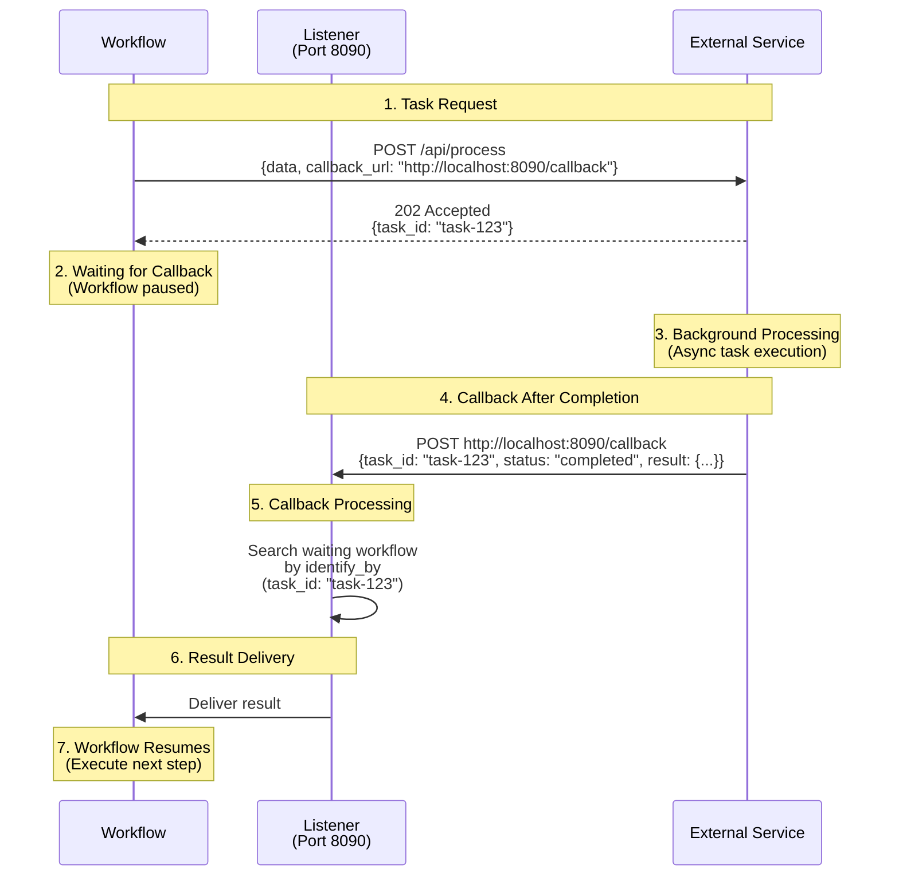
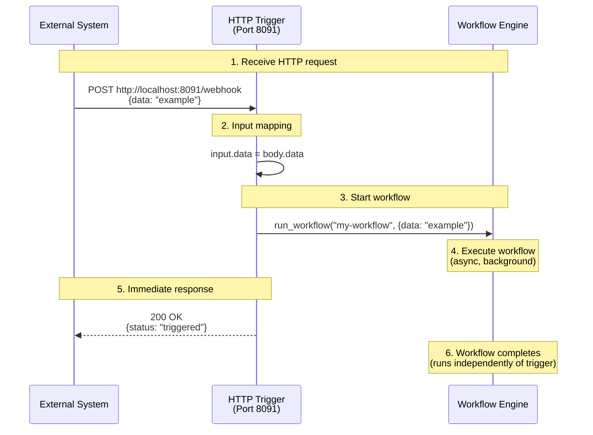
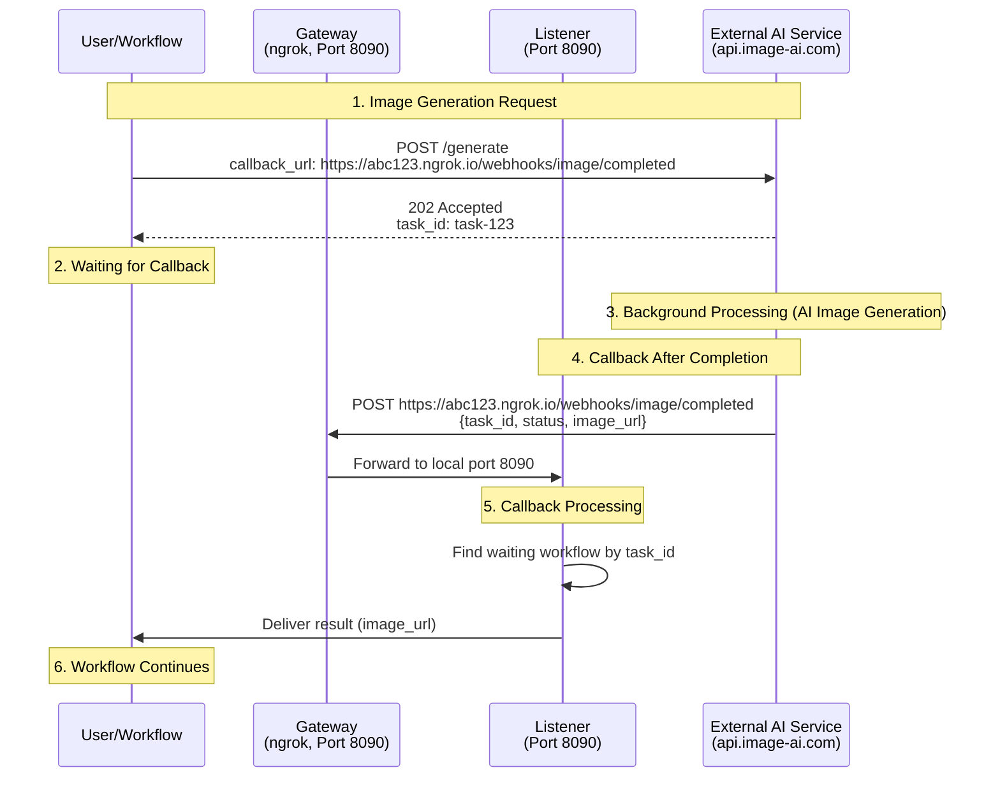

# 13. System Integration

This chapter covers listeners and gateways for integrating with external systems.

---

## 13.1 Listener Overview

Listeners are HTTP servers for communicating with external systems. There are two types:

### Listener Types

**1. HTTP Callback (http-callback)**
- Receives **asynchronous callbacks** from external services and delivers results to **waiting workflows**
- Use cases: Async API integration (image generation, video processing, payment processing, etc.)
- Behavior: Workflow pauses while waiting for callback

**2. HTTP Trigger (http-trigger)**
- Receives HTTP requests from external sources and **immediately starts workflows**
- Use cases: Webhook reception, REST API endpoint provision
- Behavior: Each request starts a new workflow instance

### Comparison

| Feature | HTTP Callback | HTTP Trigger |
|---------|--------------|--------------|
| **Purpose** | Receive async task results | Start workflows |
| **Workflow** | Already running (waiting state) | Newly started |
| **Response** | Delivered to waiting workflow | Immediately start workflow |
| **Examples** | External API callbacks, payment completion | Webhook reception, REST API |
| **Identifier** | Match waiting workflow via `identify_by` | Always start new workflow |

---

## 13.2 HTTP Callback Listener

HTTP Callback listeners receive asynchronous callbacks from external services. Useful when integrating with services that send results to a callback URL after task completion.

### 13.2.1 HTTP Callback Overview

Many external services don't return results immediately, but queue tasks and send results to a callback URL later:

1. Client sends task request to external service (including callback URL)
2. External service returns task ID immediately
3. External service processes task in background
4. After completion, sends results to callback URL
5. Listener receives callback and delivers results to waiting workflow

### 13.2.2 Basic HTTP Callback Configuration

**Simple callback listener:**

```yaml
listener:
  type: http-callback
  host: 0.0.0.0
  port: 8090
  path: /callback
  method: POST
```

This creates an endpoint at `http://0.0.0.0:8090/callback` that accepts POST requests.

### 13.2.3 Callback Endpoint Configuration

**Single callback endpoint:**

```yaml
listener:
  type: http-callback
  host: 0.0.0.0
  port: 8090
  path: /webhook/completed           # Callback path
  method: POST                        # HTTP method
  identify_by: ${body.task_id}       # Task identifier
  status: ${body.status}              # Status field
  success_when:                       # Success status values
    - "completed"
    - "success"
  fail_when:                          # Failure status values
    - "failed"
    - "error"
  result: ${body.result}              # Result extraction path
```

**Multiple callback endpoints:**

```yaml
listener:
  type: http-callback
  host: 0.0.0.0
  port: 8090
  base_path: /webhooks                # Common base path
  callbacks:
    # Image generation completion callback
    - path: /image/completed
      method: POST
      identify_by: ${body.request_id}
      status: ${body.status}
      success_when: ["completed"]
      fail_when: ["failed"]
      result: ${body.image_url}

    # Video processing completion callback
    - path: /video/completed
      method: POST
      identify_by: ${body.task_id}
      status: ${body.state}
      success_when: ["done"]
      fail_when: ["error", "timeout"]
      result: ${body.output}

    # General task completion callback
    - path: /task/callback
      method: POST
      identify_by: ${body.id}
      result: ${body.data}
```

### 13.2.4 Callback Field Descriptions

| Field | Description | Required | Default |
|-------|-------------|----------|---------|
| `path` | Callback endpoint path | Yes | - |
| `method` | HTTP method | No | `POST` |
| `identify_by` | Task identification field path | No | `__callback__` |
| `status` | Status check field path | No | - |
| `success_when` | Success status value list | No | - |
| `fail_when` | Failure status value list | No | - |
| `result` | Result extraction field path | No | Entire body |
| `bulk` | Handle multiple items in single request | No | `false` |
| `item` | Item extraction path in bulk mode | No | - |

### 13.2.5 Bulk Callback Processing

When receiving results for multiple tasks in a single callback request:

```yaml
listener:
  type: http-callback
  host: 0.0.0.0
  port: 8090
  path: /batch/completed
  method: POST
  bulk: true                          # Enable bulk mode
  item: ${body.results}               # Results array path
  identify_by: ${item.task_id}        # Identifier for each item
  status: ${item.status}
  success_when: ["completed"]
  result: ${item.data}
```

Callback request example:
```json
{
  "results": [
    {
      "task_id": "task-1",
      "status": "completed",
      "data": {"url": "https://example.com/result1.png"}
    },
    {
      "task_id": "task-2",
      "status": "completed",
      "data": {"url": "https://example.com/result2.png"}
    }
  ]
}
```

### 13.2.6 Advanced HTTP Callback Configuration

**Concurrency control:**

```yaml
listener:
  type: http-callback
  host: 0.0.0.0
  port: 8090
  max_concurrent_count: 10            # Maximum concurrent callback processing
  path: /callback
  method: POST
```

**Runtime configuration:**

```yaml
listener:
  type: http-callback
  runtime: native                     # or docker
  host: 0.0.0.0
  port: 8090
  path: /callback
```

### 13.2.7 How HTTP Callback Works

Listeners receive callbacks from external services and deliver results to waiting workflows.

**Basic structure:**

```yaml
listener:
  type: http-callback
  host: 0.0.0.0
  port: 8090
  path: /callback
  identify_by: ${body.task_id}        # Identify which workflow
  result: ${body.result}              # Extract result
```

**Workflow execution flow:**



**Step-by-step explanation:**

1. **Workflow start**: Send request to external service (including callback URL)
2. **Immediate response**: External service returns task ID
3. **Waiting state**: Workflow pauses waiting for callback
4. **Background processing**: External service performs async task
5. **Callback sent**: After completion, sends result to callback URL
6. **Listener receives**: Listener receives callback and finds workflow using `identify_by`
7. **Workflow resumes**: Delivers result to workflow and executes next step

**Important**: Listeners only run on local ports. To access from external sources, you need a **gateway** (Section 13.4). Complete examples using gateways are covered in **Section 13.5**.

### 13.2.8 Callback Data Mapping

Listeners can extract and map various fields from callback requests.

**Single field extraction:**

```yaml
listener:
  path: /webhook
  identify_by: ${body.task_id}
  result: ${body.output.url}          # Nested field access
```

**Multiple field extraction:**

```yaml
listener:
  path: /webhook
  identify_by: ${body.task_id}
  result:
    url: ${body.output.url}
    width: ${body.output.width}
    height: ${body.output.height}
    size: ${body.output.file_size}
```

**Using query parameters:**

```yaml
listener:
  path: /webhook
  identify_by: ${query.task_id}       # Extract from URL query
  result: ${body}
```

Callback request example:
```
POST http://localhost:8090/webhook?task_id=task-123
Content-Type: application/json

{
  "status": "completed",
  "output": {
    "url": "https://example.com/result.png"
  }
}
```

---

## 13.3 HTTP Trigger Listener

HTTP Trigger listeners receive HTTP requests from external sources and immediately start workflows. Can be used as REST API endpoints or webhook receivers.

### 13.3.1 HTTP Trigger Overview

HTTP Triggers are useful in these situations:

- Receiving webhooks from external systems (GitHub, Slack, Discord, etc.)
- Providing REST API endpoints
- Manually triggering workflows
- Event-driven automation needs

**Difference from HTTP Callback:**
- HTTP Callback: Deliver results to already running workflows
- HTTP Trigger: Start new workflow instances

### 13.3.2 Basic HTTP Trigger Configuration

**Simple trigger listener:**

```yaml
listener:
  type: http-trigger
  host: 0.0.0.0
  port: 8091
  path: /trigger/my-workflow
  method: POST
  workflow: my-workflow
  input:
    data: ${body.data}
```

This creates an endpoint at `http://0.0.0.0:8091/trigger/my-workflow` that starts `my-workflow` when receiving a POST request.

### 13.3.3 Trigger Endpoint Configuration

**Single trigger endpoint:**

```yaml
listener:
  type: http-trigger
  host: 0.0.0.0
  port: 8091
  path: /webhooks/deploy
  method: POST
  workflow: deployment-workflow
  input:
    repo: ${body.repository.name}
    branch: ${body.ref}
    commit: ${body.head_commit.id}
```

**Multiple trigger endpoints:**

```yaml
listener:
  type: http-trigger
  host: 0.0.0.0
  port: 8091
  base_path: /api
  triggers:
    # GitHub push event
    - path: /github/push
      method: POST
      workflow: ci-build
      input:
        repository: ${body.repository.name}
        branch: ${body.ref}
        pusher: ${body.pusher.name}

    # Slack slash command
    - path: /slack/command
      method: POST
      workflow: slack-handler
      input:
        command: ${body.command}
        text: ${body.text}
        user: ${body.user_name}
        channel: ${body.channel_id}

    # Manual trigger
    - path: /manual/process
      method: POST
      workflow: data-processing
      input:
        file_url: ${body.file_url}
        options: ${body.options}
```

### 13.3.4 Trigger Field Descriptions

| Field | Description | Required | Default |
|-------|-------------|----------|---------|
| `path` | Trigger endpoint path | Yes | - |
| `method` | HTTP method | No | `POST` |
| `workflow` | Workflow ID to execute | Yes | - |
| `input` | Workflow input mapping | No | Entire body |
| `bulk` | Execute multiple workflows in single request | No | `false` |
| `item` | Item extraction path in bulk mode | No | - |

### 13.3.5 Bulk Trigger Processing

When processing multiple items at once, executing a workflow for each:

```yaml
listener:
  type: http-trigger
  host: 0.0.0.0
  port: 8091
  path: /batch/process
  method: POST
  bulk: true
  item: ${body.items}
  workflow: item-processor
  input:
    item_id: ${item.id}
    data: ${item.data}
```

Request example:
```json
{
  "items": [
    {"id": "item-1", "data": {"name": "Product A"}},
    {"id": "item-2", "data": {"name": "Product B"}},
    {"id": "item-3", "data": {"name": "Product C"}}
  ]
}
```

This request starts 3 separate workflow instances.

### 13.3.6 How HTTP Trigger Works

**Basic structure:**

```yaml
listener:
  type: http-trigger
  port: 8091
  path: /webhook
  workflow: my-workflow
  input:
    data: ${body.data}
```

**Execution flow:**



**Step-by-step explanation:**

1. **Receive request**: External system sends HTTP request to trigger endpoint
2. **Input mapping**: Convert request data to workflow input according to `input` configuration
3. **Start workflow**: Start new workflow instance asynchronously
4. **Immediate response**: Return response immediately without waiting for workflow completion
5. **Background execution**: Workflow runs independently to completion

**Important**: HTTP Trigger only starts workflows and returns immediately. To receive workflow results, you need separate mechanisms (HTTP Callback, database queries, etc.).

### 13.3.7 Input Data Mapping

You can map various fields from HTTP requests to workflow inputs.

**Body field extraction:**

```yaml
listener:
  type: http-trigger
  path: /webhook
  workflow: my-workflow
  input:
    name: ${body.user.name}
    email: ${body.user.email}
    action: ${body.action}
```

**Using query parameters:**

```yaml
listener:
  type: http-trigger
  path: /webhook
  workflow: my-workflow
  input:
    token: ${query.token}
    mode: ${query.mode}
    data: ${body}
```

Request example:
```
POST http://localhost:8091/webhook?token=abc123&mode=test
Content-Type: application/json

{
  "user": "john",
  "action": "process"
}
```

**Complex mapping:**

```yaml
listener:
  type: http-trigger
  path: /webhook
  workflow: my-workflow
  input:
    auth:
      token: ${query.token}
      user: ${body.user}
    payload:
      data: ${body.data}
      timestamp: ${body.timestamp}
```

### 13.3.8 Practical Examples

**GitHub Webhook handling:**

```yaml
listener:
  type: http-trigger
  host: 0.0.0.0
  port: 8091
  path: /github/webhook
  method: POST
  workflow: github-ci
  input:
    event: ${body.action}
    repository: ${body.repository.full_name}
    branch: ${body.pull_request.head.ref}
    author: ${body.pull_request.user.login}

workflow:
  id: github-ci
  title: GitHub CI Pipeline
  jobs:
    - id: checkout
      component: git-clone
      input:
        repo: ${input.repository}
        branch: ${input.branch}

    - id: test
      component: run-tests
      depends_on: [checkout]

    - id: notify
      component: github-status
      depends_on: [test]
      input:
        status: ${jobs.test.output.success}
```

**Slack Webhook handling:**

```yaml
listener:
  type: http-trigger
  host: 0.0.0.0
  port: 8091
  path: /slack/events
  method: POST
  workflow: slack-bot
  input:
    event_type: ${body.event.type}
    user: ${body.event.user}
    channel: ${body.event.channel}
    text: ${body.event.text}

workflow:
  id: slack-bot
  title: Slack Bot Handler
  jobs:
    - id: process-message
      component: nlp-analyzer
      input:
        text: ${input.text}

    - id: reply
      component: slack-client
      depends_on: [process-message]
      input:
        channel: ${input.channel}
        text: "Processing complete: ${jobs.process-message.output.result}"
```

---

## 13.4 Gateways - HTTP Tunneling

Gateways are tunneling services for exposing locally running services to the internet. Useful for testing webhooks in development or when external access to local services is needed.

### 13.4.1 Gateway Overview

Gateways are needed in these scenarios:

- Testing external webhooks in local development
- Exposing services behind firewalls
- Temporary public URLs needed
- External services require callback URLs

**Supported gateways:**

| Type | Features | Use Cases |
|------|----------|-----------|
| **HTTP Tunnel (ngrok)** | Easy setup, temporary URLs | Local development, quick testing |
| **HTTP Tunnel (Cloudflare)** | Free unlimited, high reliability | Local development, continuous testing |
| **SSH Tunnel** | Own server, fixed addresses | Enterprise environments, production-ready |

### 13.4.2 HTTP Tunnel - ngrok

ngrok is a tunneling service that exposes local servers with public URLs.

**Basic configuration (single port):**

```yaml
gateway:
  type: http-tunnel
  driver: ngrok
  port: 8080                          # Local port to tunnel
```

This exposes local port 8080 through ngrok public URL.

**Multiple ports configuration:**

```yaml
gateway:
  type: http-tunnel
  driver: ngrok
  port:
    - 8080                            # First local port
    - 8090                            # Second local port
    - 3000                            # Third local port
```

Each port gets its own unique public URL (e.g., `https://abc123.ngrok.io`, `https://def456.ngrok.io`, `https://ghi789.ngrok.io`).

**Complete example with single port:**

```yaml
gateway:
  type: http-tunnel
  driver: ngrok
  port: 8090                          # Same as listener port

listener:
  type: http-callback
  host: 0.0.0.0
  port: 8090
  path: /callback
  identify_by: ${body.task_id}
  result: ${body.result}

components:
  external-service:
    type: http-client
    base_url: https://api.external-service.com
    path: /process
    method: POST
    body:
      data: ${input.data}
      # Use gateway:8090.public_url to access public URL
      callback_url: ${gateway:8090.public_url}/callback
      callback_id: ${context.run_id}
    output: ${response}

workflow:
  title: External Service with Gateway
  jobs:
    - id: process
      component: external-service
      input: ${input}
      output: ${output}
```

**Example with multiple ports:**

```yaml
gateway:
  type: http-tunnel
  driver: ngrok
  port:
    - 8090                            # Callback listener
    - 8091                            # Status webhook
    - 8092                            # Admin interface

components:
  external-service:
    type: http-client
    base_url: https://api.external-service.com
    path: /process
    method: POST
    body:
      data: ${input.data}
      callback_url: ${gateway:8090.public_url}/callback
      status_url: ${gateway:8091.public_url}/status
      admin_url: ${gateway:8092.public_url}/admin
    output: ${response}
```

**Accessing gateway URLs:**

The format `${gateway:PORT.public_url}` provides the public URL for each exposed port:
- `${gateway:8090.public_url}` → `https://abc123.ngrok.io`
- `${gateway:8091.public_url}` → `https://def456.ngrok.io`
- `${gateway:8092.public_url}` → `https://ghi789.ngrok.io`

**Execution flow:**
1. Gateway starts: ngrok exposes local port(s) with public URL(s)
2. Listener starts: Waiting for callbacks on configured port(s)
3. Workflow executes: `${gateway:PORT.public_url}` is replaced with actual public URL
4. Callback URL sent to external service
5. External service sends callback to public URL after completion
6. ngrok forwards request to corresponding local port
7. Listener receives callback and delivers result to workflow

### 13.4.3 HTTP Tunnel - Cloudflare

Cloudflare Tunnel (formerly Argo Tunnel) is a stable tunneling service available for free with unlimited bandwidth.

**Basic configuration (single port):**

```yaml
gateway:
  type: http-tunnel
  driver: cloudflare
  port: 8080                          # Local port to tunnel
```

This exposes local port 8080 through Cloudflare Tunnel public URL.

**Multiple ports configuration:**

```yaml
gateway:
  type: http-tunnel
  driver: cloudflare
  port:
    - 8080                            # First local port
    - 8090                            # Second local port
    - 3000                            # Third local port
```

Each port gets its own unique public URL (e.g., `https://abc-def.trycloudflare.com`, `https://ghi-jkl.trycloudflare.com`, `https://mno-pqr.trycloudflare.com`).

**Complete example with callback:**

```yaml
gateway:
  type: http-tunnel
  driver: cloudflare
  port: 8090

listener:
  type: http-callback
  host: 0.0.0.0
  port: 8090
  path: /callback
  identify_by: ${body.task_id}
  result: ${body.result}

components:
  external-service:
    type: http-client
    base_url: https://api.external-service.com
    path: /process
    method: POST
    body:
      data: ${input.data}
      # Use gateway:8090.public_url to access public URL
      callback_url: ${gateway:8090.public_url}/callback
      callback_id: ${context.run_id}
    output: ${response}
```

**Example with multiple ports:**

```yaml
gateway:
  type: http-tunnel
  driver: cloudflare
  port:
    - 8090                            # Callback listener
    - 8091                            # Status webhook
    - 3000                            # Frontend application

components:
  external-service:
    type: http-client
    base_url: https://api.external-service.com
    path: /process
    method: POST
    body:
      data: ${input.data}
      callback_url: ${gateway:8090.public_url}/callback
      status_url: ${gateway:8091.public_url}/status
      app_url: ${gateway:3000.public_url}
    output: ${response}
```

**Accessing gateway URLs:**

The format `${gateway:PORT.public_url}` provides the public URL for each exposed port:
- `${gateway:8090.public_url}` → `https://abc-def.trycloudflare.com`
- `${gateway:8091.public_url}` → `https://ghi-jkl.trycloudflare.com`
- `${gateway:3000.public_url}` → `https://mno-pqr.trycloudflare.com`

**ngrok vs Cloudflare comparison:**

| Feature | ngrok | Cloudflare |
|---------|-------|------------|
| Free plan | Limited (request limit per hour) | Unlimited |
| Setup difficulty | Easy | Medium (account required) |
| URL format | `https://random.ngrok.io` | `https://random.trycloudflare.com` |
| Stability | High | Very high |
| Speed | Fast | Very fast |
| URL lifetime | Session-based | Session-based |
| Multiple ports | Yes | Yes |

### 13.4.4 SSH Tunnel

Use SSH reverse tunnels to expose local services through remote servers.

**SSH key authentication:**

```yaml
gateway:
  type: ssh-tunnel
  port:
    - "9834:8090"  # Remote port 9834 -> Local port 8090
  connection:
    host: remote-server.com
    port: 22
    auth:
      type: keyfile
      username: user
      keyfile: ~/.ssh/id_rsa
```

**SSH password authentication:**

```yaml
gateway:
  type: ssh-tunnel
  port:
    - "9834:8090"  # Remote port 9834 -> Local port 8090
  connection:
    host: remote-server.com
    port: 22
    auth:
      type: password
      username: user
      password: ${env.SSH_PASSWORD}
```

**Multiple port forwarding:**

```yaml
gateway:
  type: ssh-tunnel
  port:
    - "9834:8090"  # First port forwarding
    - "9835:8091"  # Second port forwarding
    - "9836:8092"  # Third port forwarding
  connection:
    host: remote-server.com
    port: 22
    auth:
      type: keyfile
      username: user
      keyfile: ~/.ssh/id_rsa
```

**Simple port setup (same local and remote port):**

```yaml
gateway:
  type: ssh-tunnel
  port: 8090  # Remote port 8090 -> Local port 8090
  connection:
    host: remote-server.com
    port: 22
    auth:
      type: keyfile
      username: user
      keyfile: ~/.ssh/id_rsa
```

SSH tunnels are useful when:
- Using custom domains
- Firewalls block ngrok/Cloudflare
- Corporate environments require approved servers only
- Fixed IP addresses or ports are needed

### 13.4.5 Advanced Gateway Configuration

**Runtime configuration:**

```yaml
gateway:
  type: http-tunnel
  driver: ngrok
  runtime: native                     # or docker
  port: 8080
```

**Using gateway variables:**

When gateway is configured, these variables are available:

**HTTP Tunnel (ngrok, Cloudflare):**

```yaml
gateway:
  type: http-tunnel
  driver: ngrok
  port: 8080

components:
  service:
    type: http-client
    body:
      # Use public URL (gateway:port.public_url format)
      webhook_url: ${gateway:8080.public_url}/webhook
      # Example: https://abc123.ngrok.io/webhook

      # Port information
      local_port: ${gateway:8080.port}
```

**SSH Tunnel:**

```yaml
gateway:
  type: ssh-tunnel
  port:
    - "9834:8090"
  connection:
    host: remote-server.com
    port: 22
    auth:
      type: keyfile
      username: user
      keyfile: ~/.ssh/id_rsa

components:
  service:
    type: http-client
    body:
      # Use public address (gateway:local_port.public_address format)
      webhook_url: http://${gateway:8090.public_address}/webhook
      # Example: http://remote-server.com:9834/webhook
```

### 13.4.6 Real-world Example: SSH Tunnel

**Callback reception via SSH tunnel:**

```yaml
gateway:
  type: ssh-tunnel
  port:
    - "9834:8090"  # Remote port 9834 -> Local port 8090
  connection:
    host: ${env.SSH_TUNNEL_HOST}
    port: ${env.SSH_TUNNEL_PORT | 22}
    auth:
      type: keyfile
      username: ${env.SSH_USERNAME}
      keyfile: ${env.SSH_KEYFILE | ~/.ssh/id_rsa}

listener:
  type: http-callback
  host: 0.0.0.0
  port: 8090
  path: /callback
  identify_by: ${body.task_id}
  result: ${body.result}

component:
  type: http-client
  base_url: https://api.external-service.com
  path: /process
  method: POST
  headers:
    Content-Type: application/json
  body:
    data: ${input.data}
    # Use SSH tunnel's public address
    callback_url: http://${gateway:8090.public_address}/callback
    task_id: ${context.run_id}
  completion:
    type: callback
    wait_for: ${context.run_id}
  output:
    task_id: ${response.task_id}
    result: ${result as json}

workflow:
  title: SSH Tunnel Gateway Example
  description: Expose local callback listener to external services using SSH tunnel
  input: ${input}
  output: ${output}
```

**Environment variable setup:**

```bash
export SSH_TUNNEL_HOST="remote-server.com"
export SSH_TUNNEL_PORT=22
export SSH_USERNAME="user"
export SSH_KEYFILE="~/.ssh/id_rsa"

model-compose up
```

This setup works as follows:
1. Listener runs on local port 8090
2. SSH tunnel forwards remote server's port 9834 to local port 8090
3. External service sends callback to `http://remote-server.com:9834/callback`
4. SSH tunnel forwards the request to local port 8090
5. Listener receives callback and delivers result to workflow

### 13.4.7 Real-world Example: Slack Bot Webhook

```yaml
gateway:
  type: http-tunnel
  driver: cloudflare
  port: 8090                          # Same as listener port

listener:
  type: http-callback
  host: 0.0.0.0
  port: 8090
  base_path: /slack
  callbacks:
    - path: /events
      method: POST
      identify_by: ${body.event.client_msg_id}
      result: ${body.event}

components:
  slack-responder:
    type: http-client
    base_url: https://slack.com/api
    path: /chat.postMessage
    method: POST
    headers:
      Authorization: Bearer ${env.SLACK_BOT_TOKEN}
      Content-Type: application/json
    body:
      channel: ${input.channel}
      text: ${input.text}
    output: ${response}

workflow:
  title: Slack Event Handler
  jobs:
    - id: respond
      component: slack-responder
      input:
        channel: ${input.event.channel}
        text: "Processing complete: ${input.event.text}"
      output: ${output}
```

Slack app setup:
1. Create Slack app (https://api.slack.com/apps)
2. Run `model-compose up` and check gateway logs for public URL
3. Enable Event Subscriptions
4. Enter gateway public URL + listener path in Request URL (e.g., `https://abc123.trycloudflare.com/slack/events`)
5. Issue bot token and set `SLACK_BOT_TOKEN` environment variable

---

## 13.5 Using Listeners and Gateways Together

Using listeners and gateways together allows safe testing of external webhooks in local environments.

### 13.5.1 Integration Example: Async Image Processing

```yaml
gateway:
  type: http-tunnel
  driver: ngrok
  port: 8090                          # Same as listener port

listener:
  type: http-callback
  host: 0.0.0.0
  port: 8090
  base_path: /webhooks
  max_concurrent_count: 5
  callbacks:
    - path: /image/completed
      method: POST
      identify_by: ${body.task_id}
      status: ${body.status}
      success_when: ["completed", "success"]
      fail_when: ["failed", "error"]
      result:
        url: ${body.output.url}
        width: ${body.output.width}
        height: ${body.output.height}

components:
  image-generator:
    type: http-client
    base_url: https://api.image-ai.com/v1
    path: /generate
    method: POST
    headers:
      Authorization: Bearer ${env.IMAGE_AI_KEY}
    body:
      prompt: ${input.prompt}
      size: ${input.size | "1024x1024"}
      # Gateway public URL + listener path
      callback_url: ${gateway:8090.public_url}/webhooks/image/completed
      task_id: ${context.run_id}
    output:
      task_id: ${response.task_id}
      status: ${response.status}

  image-optimizer:
    type: http-client
    base_url: https://api.imageoptim.com
    path: /optimize
    method: POST
    headers:
      Authorization: Bearer ${env.IMAGEOPTIM_KEY}
    body:
      url: ${input.url}
      quality: 85
    output:
      optimized_url: ${response.url}
      original_size: ${response.original_size}
      compressed_size: ${response.compressed_size}

workflow:
  title: Image Generation and Optimization
  description: Generate image with AI and optimize it
  jobs:
    # Step 1: AI image generation (async)
    - id: generate
      component: image-generator
      input:
        prompt: ${input.prompt}
        size: ${input.size}
      output:
        task_id: ${output.task_id}
        image_url: ${output.url}        # URL from callback
        width: ${output.width}
        height: ${output.height}

    # Step 2: Image optimization (sync)
    - id: optimize
      component: image-optimizer
      input:
        url: ${jobs.generate.output.image_url}
      output:
        final_url: ${output.optimized_url}
        original_size: ${output.original_size}
        compressed_size: ${output.compressed_size}
        savings: ${output.original_size - output.compressed_size}
```

### 13.5.2 Architecture Diagram



**Flow explanation:**

1. **Request stage**: Workflow sends image generation request to external AI service (gateway public URL as callback URL)
2. **Wait stage**: Workflow waits until callback is received
3. **Processing stage**: External service generates image in background
4. **Callback stage**: After completion, sends callback to gateway public URL → gateway forwards to local listener
5. **Matching stage**: Listener finds waiting workflow by task_id
6. **Completion stage**: Delivers result to workflow and proceeds to next step

### 13.5.3 Production Environment Considerations

**Local development:**
```yaml
gateway:
  type: http-tunnel
  driver: ngrok                       # Use ngrok during development
  port: 8080

listener:
  host: 0.0.0.0
  port: 8090
```

**Production environment:**
```yaml
# Remove gateway configuration (use public IP/domain)

controller:
  type: http-server
  host: 0.0.0.0
  port: 443                           # HTTPS
  # Add SSL configuration

listener:
  host: 0.0.0.0
  port: 8090

components:
  service:
    body:
      # Use production domain
      callback_url: https://api.yourdomain.com/webhooks/callback
      callback_id: ${context.run_id}
```

---

## 13.6 System Integration Best Practices

### 1. Listener Security

**Timeout configuration:**

Set timeouts so async tasks don't wait indefinitely:

```yaml
components:
  service:
    type: http-client
    timeout: 300000                   # 5 minute timeout
    body:
      callback_url: ${gateway:8090.public_url}/callback
```

**Signature verification:**

Verify signatures to confirm authenticity of callback requests:

```yaml
listener:
  callbacks:
    - path: /webhook
      # Signature verification requires custom logic
      identify_by: ${body.id}
      # Verify signature in header: ${header.X-Signature}
```

### 2. Gateway Usage

**Use in development only:**

Use gateways primarily in development/test environments. Use public IPs/domains in production.

**Free plan limitations:**

- ngrok free plan: Connection limits, hourly request limits
- Cloudflare: Unlimited on free plan

### 3. Error Handling

**Callback failure handling:**

```yaml
workflow:
  jobs:
    - id: async-task
      component: async-service
      input: ${input}
      on_error:
        - id: retry
          component: async-service
          input: ${input}
          retry:
            max_retry_count: 3
            delay: 5000
```

**Retry logic:**

Implement retry logic as external services may fail to send callbacks.

### 4. Logging and Monitoring

**Callback logging:**

Store all callback request information for debugging and troubleshooting:

```yaml
listener:
  callbacks:
    - path: /webhook
      identify_by: ${body.task_id}
      result:
        task_id: ${body.task_id}                              # Task ID
        status: ${body.status}                                # Task status
        timestamp: ${body.timestamp}                          # Callback receipt time
        data: ${body}                                         # Store full payload (for debugging)
```

This stored information is used for:
- Root cause analysis when callbacks fail
- Monitoring external service response times
- Data integrity verification
- Audit log generation

**Workflow execution tracking:**

Track entire flow of each workflow execution:

```yaml
workflow:
  jobs:
    - id: request
      component: external-api
      input: ${input}
      output:
        request_time: ${context.timestamp}
        task_id: ${output.task_id}

    - id: log-request
      component: logger
      input:
        level: info
        message: "Task requested: task_id=${jobs.request.output.task_id}"
        data: ${jobs.request.output}

    # Wait for callback and receive result

    - id: log-result
      component: logger
      input:
        level: info
        message: "Task completed: task_id=${jobs.request.output.task_id}"
        data: ${output}
```

**Gateway URL verification:**

Verify and record public URL after gateway starts:

```bash
model-compose up
# Check gateway URL in logs
# [Gateway] Public URL: https://abc123.ngrok.io

# Register public URL with external service
# e.g., Slack Event Subscriptions, GitHub Webhooks, etc.
```

Since gateway may generate new URLs each startup, recommend extracting URL from automated deployment scripts and auto-registering with external services.

**Performance metrics collection:**

```yaml
listener:
  callbacks:
    - path: /webhook
      identify_by: ${body.task_id}
      result:
        task_id: ${body.task_id}                              # Task ID
        result: ${body.result}                                # Actual result data
        metrics:
          processing_time: ${body.processing_time_ms}         # Actual processing time (ms)
          queue_time: ${body.queue_time_ms}                   # Queue wait time (ms)
          total_time: ${body.processing_time_ms + body.queue_time_ms}  # Total time
```

Use these metrics to:
- Calculate average processing time of external services
- Detect performance degradation and send alerts
- Monitor SLA (Service Level Agreement) compliance

---

## Next Steps

Experiment with these scenarios:
- External async API integration
- Testing webhooks in local environment
- Slack/Discord bot development
- Payment gateway webhook handling

---

**Next Chapter**: [14. Deployment](./14-deployment.md)
