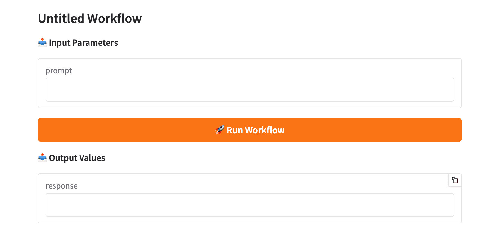

# 1장: 시작하기

## 1.1 소개 및 개요

**model-compose**는 간단한 YAML 설정 파일을 사용하여 AI 모델 파이프라인을 정의하고 실행할 수 있는 선언적 AI 워크플로우 오케스트레이터입니다. `docker-compose`에서 영감을 받아, AI 모델 오케스트레이션 영역에 선언적 설정이라는 동일한 철학을 적용했습니다.

### model-compose란?

model-compose를 사용하면 다음과 같은 작업을 수행할 수 있습니다:

- **선언적으로 AI 워크플로우 구성**: 커스텀 코드 없이 여러 단계로 구성된 AI 파이프라인을 YAML로 정의
- **무엇이든 연결**: 외부 AI 서비스(OpenAI, Anthropic 등)를 통합하거나 로컬 AI 모델을 원활하게 실행
- **복잡한 파이프라인 구축**: 단계 간 깔끔한 데이터 흐름으로 여러 모델과 API를 연결
- **유연한 실행**: CLI에서 워크플로우를 실행하거나, HTTP API로 노출하거나, Model Context Protocol(MCP) 사용
- **쉬운 배포**: 로컬에서 실행하거나 최소한의 설정으로 Docker를 통해 배포

### 주요 사용 사례

- **API 오케스트레이션**: 여러 AI 서비스 호출을 연결 (예: 텍스트 생성 → 번역 → 음성 합성)
- **로컬 모델 추론**: 채팅 완성, 이미지 분석, 임베딩 등의 작업을 위한 로컬 모델 실행
- **RAG 시스템**: 벡터 스토어를 사용한 검색 증강 생성 파이프라인 구축
- **멀티모달 워크플로우**: 텍스트, 이미지, 오디오 처리를 단일 파이프라인에서 결합
- **자동화된 워크플로우**: 커스텀 통합 코드 작성 없이 AI 작업을 스크립팅하고 자동화

### 작동 방식

model-compose는 세 가지 핵심 요소로 구성됩니다:

1. **YAML 설정 파일** (`model-compose.yml`): 컴포넌트, 워크플로우, 실행 환경을 선언적으로 정의합니다.
2. **컴포넌트 시스템**: API 호출, 로컬 모델 실행, 데이터 처리 등의 재사용 가능한 작업 단위를 제공합니다.
3. **실행 환경**: CLI 명령어나 HTTP/MCP 서버를 통해 워크플로우를 실행합니다.

예를 들어, OpenAI API를 호출하는 간단한 워크플로우는 다음과 같이 정의됩니다:

```yaml
components:
  - id: chatgpt
    type: http-client
    base_url: https://api.openai.com/v1
    path: /chat/completions

workflows:
  - id: generate-text
    jobs:
      - component: chatgpt
```

이 설정만으로 CLI에서 실행하거나, HTTP API로 노출하거나, Docker 컨테이너로 배포할 수 있습니다.

---

## 1.2 설치

### 요구 사항

- **Python 3.9 이상**
- pip 패키지 매니저

### pip를 통한 설치

model-compose를 설치하는 가장 간단한 방법은 pip를 사용하는 것입니다:

```bash
pip install model-compose
```

### 소스에서 설치

최신 개발 버전을 사용하거나 프로젝트에 기여하려면:

```bash
git clone https://github.com/hanyeol/model-compose.git
cd model-compose
pip install -e .
```

추가 개발 의존성과 함께 개발용으로 설치:

```bash
pip install -e .[dev]
```

### 설치 확인

model-compose가 올바르게 설치되었는지 확인합니다:

```bash
model-compose --version
```

버전 번호가 출력되어야 합니다.

### 가상 환경 사용 (권장)

의존성 충돌을 피하기 위해 가상 환경을 사용하는 것이 권장됩니다:

```bash
# 가상 환경 생성
python -m venv venv

# 활성화
# macOS/Linux:
source venv/bin/activate
# Windows:
venv\Scripts\activate

# model-compose 설치
pip install model-compose
```

---

## 1.3 첫 번째 워크플로우 실행하기

첫 번째 model-compose 워크플로우를 생성하고 실행하는 과정을 안내하겠습니다. 텍스트를 생성하기 위해 OpenAI API를 호출하는 간단한 워크플로우를 만들겠습니다.

### 1.3.1 간단한 예제 (OpenAI API 호출)

#### 1단계: 프로젝트 디렉토리 생성

```bash
mkdir my-first-workflow
cd my-first-workflow
```

#### 2단계: API 키 설정

OpenAI API 키를 안전하게 저장하기 위해 `.env` 파일을 생성합니다:

```bash
# .env
OPENAI_API_KEY=your-api-key
```

> **참고**: `.env` 파일을 버전 관리에 커밋하지 마세요. `.env`를 `.gitignore`에 추가하세요.

#### 3단계: 워크플로우 설정 생성

`model-compose.yml` 파일을 생성합니다:

```yaml
# model-compose.yml
controller:
  type: http-server
  port: 8080
  base_path: /api
  webui:
    port: 8081

components:
  - id: chatgpt
    type: http-client
    base_url: https://api.openai.com/v1
    path: /chat/completions
    method: POST
    headers:
      Authorization: Bearer ${env.OPENAI_API_KEY}
      Content-Type: application/json
    body:
      model: gpt-4o
      messages:
        - role: user
          content: ${input.prompt}
    output:
      response: ${response.choices[0].message.content}

workflows:
  - id: generate-text
    default: true
    jobs:
      - id: call-gpt
        component: chatgpt
```

#### 설정 이해하기

각 섹션이 무엇을 하는지 자세히 살펴보겠습니다:

**Controller**
```yaml
controller:
  type: http-server
  port: 8080
  base_path: /api
  webui:
    port: 8081
```
- 워크플로우가 어떻게 노출되는지 정의 (HTTP 서버로)
- API 포트(8080)와 Web UI 포트(8081) 설정
- API 엔드포인트의 기본 경로 (`/api`)

**Components**
```yaml
components:
  - id: chatgpt
    type: http-client
    base_url: https://api.openai.com/v1
    path: /chat/completions
    method: POST
    headers:
      Authorization: Bearer ${env.OPENAI_API_KEY}
    body:
      model: gpt-4o
      messages:
        - role: user
          content: ${input.prompt}
    output:
      response: ${response.choices[0].message.content}
```
- `chatgpt`라는 재사용 가능한 컴포넌트를 정의
- OpenAI의 API를 호출하기 위한 HTTP 클라이언트 설정
- `${env.OPENAI_API_KEY}`를 사용하여 환경 변수에서 API 키를 주입
- `${input.prompt}`를 요청 본문으로 전달
- 응답을 `output.response` 변수로 추출

**Workflows**
```yaml
workflows:
  - id: generate-text
    default: true
    jobs:
      - id: call-gpt
        component: chatgpt
```
- `generate-text`라는 이름의 워크플로우를 정의
- `default`로 표시 (워크플로우 이름이 지정되지 않은 경우 실행됨)
- `chatgpt` 컴포넌트를 실행하는 단일 작업 포함

---

### 1.3.2 워크플로우 실행 (run 명령어)

`run` 명령어는 CLI에서 워크플로우를 직접 한 번 실행합니다—테스트 및 스크립팅에 적합합니다.

#### 기본 사용법

```bash
model-compose run generate-text --input '{"prompt": "코딩에 대한 짧은 시를 작성해줘"}'
```

이 명령은 다음을 수행합니다:
1. `model-compose.yml` 설정을 불러옴
2. `generate-text` 워크플로우를 실행
3. 입력을 워크플로우에 전달
4. 출력을 콘솔에 출력

#### 예상 출력

```json
{
  "response": "코드는 물처럼 흐르고,\n달빛 아래 버그가 나타나며,\n해뜰 때까지 디버깅."
}
```

#### 다른 입력 전달하기

워크플로우가 예상하는 모든 JSON 입력을 전달할 수 있습니다:

```bash
model-compose run generate-text --input '{"prompt": "양자 컴퓨팅을 한 문장으로 설명해줘"}'
```

#### 환경 변수 사용

환경 변수를 재정의해야 하는 경우:

```bash
model-compose run generate-text \
  --input '{"prompt": "안녕!"}' \
  --env OPENAI_API_KEY=sk-different-key
```

또는 다른 env 파일 사용:

```bash
model-compose run generate-text \
  --input '{"prompt": "안녕!"}' \
  --env-file .env.production
```

#### 기본이 아닌 워크플로우 실행

여러 워크플로우가 있고 특정 워크플로우를 실행하려는 경우:

```bash
model-compose run my-other-workflow --input '{"key": "value"}'
```

---

### 1.3.3 컨트롤러 시작 및 웹 UI 사용

`up` 명령어는 워크플로우를 HTTP 엔드포인트로 호스팅하고 선택적으로 Web UI를 제공하는 지속적인 서버를 시작합니다.

#### 컨트롤러 시작

```bash
model-compose up
```

다음과 같은 출력이 표시됩니다:

```
INFO:     Started server process [72146]
INFO:     Waiting for application startup.
INFO:     Application startup complete.
INFO:     Started server process [72146]
INFO:     Waiting for application startup.
INFO:     Application startup complete.
INFO:     Uvicorn running on http://0.0.0.0:8081 (Press CTRL+C to quit)
INFO:     Uvicorn running on http://0.0.0.0:8080 (Press CTRL+C to quit)
```

이제 컨트롤러가 실행 중이며 요청을 받을 준비가 되었습니다.

#### 웹 UI 사용

브라우저를 열고 다음으로 이동합니다:

```
http://localhost:8081
```

Web UI는 다음을 수행할 수 있는 대화형 인터페이스를 제공합니다:

- 탭이나 드롭다운에서 **워크플로우 선택**
- 폼에 **입력 입력**
- 버튼 클릭으로 **워크플로우 실행**
- 실시간으로 **출력 확인**
- 디버깅을 위한 **실행 로그 확인**



**워크플로우를 실행하려면:**
1. 입력 필드에 프롬프트를 입력합니다 (예: "AI에 대한 짧은 시를 작성해줘")
2. "Run Workflow" 버튼을 클릭합니다
3. 출력 패널에서 생성된 응답을 확인합니다

#### HTTP API 사용

HTTP를 통해 프로그래밍 방식으로 워크플로우를 트리거할 수도 있습니다:

```bash
curl -X POST http://localhost:8080/api/workflows/runs \
  -H "Content-Type: application/json" \
  -d '{
    "workflow_id": "generate-text",
    "input": {
      "prompt": "머신러닝이란?"
    },
    "output_only": true
  }'
```

응답:

```json
{
  "response": "머신러닝은 인공지능의 하위 분야로..."
}
```

#### 분리 모드로 실행

백그라운드에서 컨트롤러를 실행하려면:

```bash
model-compose up -d
```

#### 컨트롤러 중지

컨트롤러를 정상적으로 종료하려면:

```bash
model-compose down
```

이 명령은 다음을 수행합니다:
- HTTP 서버 중지
- Web UI 중지
- 리소스 정리
- 필요한 경우 상태 저장

---

## 1.4 기본 개념

이제 첫 번째 워크플로우를 실행했으므로, model-compose의 주요 개념을 명확히 하겠습니다.

### Controller

**컨트롤러**는 워크플로우를 호스팅하고 실행하는 런타임 환경입니다. 두 가지 모드로 작동할 수 있습니다:

- **HTTP Server**: 선택적 Web UI와 함께 워크플로우를 REST API 엔드포인트로 노출
- **MCP Server**: Model Context Protocol(JSON-RPC)을 통해 워크플로우를 노출

컨트롤러는 `model-compose.yml`의 `controller` 섹션에서 설정됩니다.

### Components

**컴포넌트**는 특정 작업을 수행하는 재사용 가능한 빌딩 블록입니다. 워크플로우에서 호출할 수 있는 함수로 생각하면 됩니다.

일반적인 컴포넌트 타입:
- `http-client`: 외부 서비스에 HTTP API 호출
- `model`: 로컬 AI 모델 실행 (HuggingFace transformers)
- `shell`: 셸 명령어 실행
- `text-splitter`: 텍스트를 청크로 분할
- `workflow`: 다른 워크플로우를 컴포넌트로 호출

각 컴포넌트는 다음을 가집니다:
- **id**: 워크플로우에서 참조할 고유 식별자
- **type**: 컴포넌트의 종류
- **Configuration**: 해당 컴포넌트 타입에 대한 특정 설정
- **Input/output mappings**: 데이터가 어떻게 들어오고 나가는지

### Workflows

**워크플로우**는 완전한 AI 파이프라인을 정의하는 명명된 작업 시퀀스입니다. 워크플로우는 다음을 수행할 수 있습니다:

- 여러 단계를 순서대로 실행
- 변수 바인딩을 사용하여 단계 간 데이터 전달
- 여러 분기 또는 병렬 실행 (고급)
- CLI, HTTP API 또는 Web UI를 통해 트리거

주요 워크플로우 속성:
- `id`: 워크플로우의 고유 이름
- `default`: 이 워크플로우가 기본적으로 실행되는지 여부 (선택 사항)
- `jobs`: 실행할 작업 목록
- `title` 및 `description`: Web UI를 위한 사람이 읽을 수 있는 메타데이터

### Jobs

**작업**은 워크플로우 내의 개별 단계입니다. 각 작업은:

- 실행할 컴포넌트를 참조
- 이전 작업의 입력을 받을 수 있음
- 후속 작업을 위한 출력을 생성할 수 있음
- (기본적으로) 순차적으로 실행됨

예제:
```yaml
jobs:
  - id: generate-text
    component: chatgpt
    input:
      prompt: ${input.query}

  - id: translate
    component: translator
    input:
      text: ${generate-text.output.response}
```

### Variable Binding

**변수 바인딩**은 `${...}` 구문을 사용하여 워크플로우를 통해 데이터가 흐르는 방식입니다.

일반적인 변수 소스:

- `${env.VAR_NAME}`: 환경 변수
- `${input.field}`: 워크플로우 입력
- `${response.field}`: 현재 컴포넌트의 HTTP 응답
- `${jobs.job-id.output.field}`: 특정 작업(job-id)의 출력

데이터 흐름 예제:
```yaml
component:
  body:
    prompt: ${input.user_prompt}  # 워크플로우 입력에서
    api_key: ${env.API_KEY}       # 환경에서
  output:
    result: ${response.data}      # API 응답에서 추출
```

### 모든 것을 함께 연결

모든 것이 어떻게 연결되는지:

1. **컴포넌트 정의** - 재사용 가능한 작업 (API 호출, 모델 등)
2. **워크플로우 생성** - 해당 컴포넌트를 사용하는 작업의 시퀀스
3. **컨트롤러 설정** - 워크플로우를 노출하고 실행하는 방법
4. **실행** - CLI를 통해 실행 (`run`) 또는 서버 시작 (`up`)
5. **데이터 흐름** - 작업 간 변수 바인딩을 통해

---

## 다음 단계

실습해보세요:
- OpenAI 모델을 변경해보세요 (`gpt-3.5-turbo` 또는 `gpt-4` 시도)
- 다양한 프롬프트와 입력으로 실험해보세요

---

**다음 장**: [2. 핵심 개념](./02-core-concepts.md)
