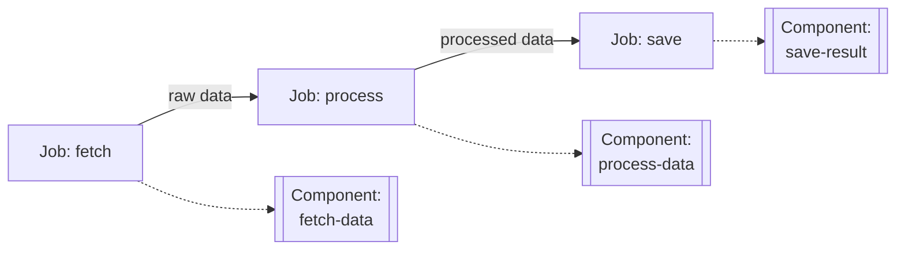
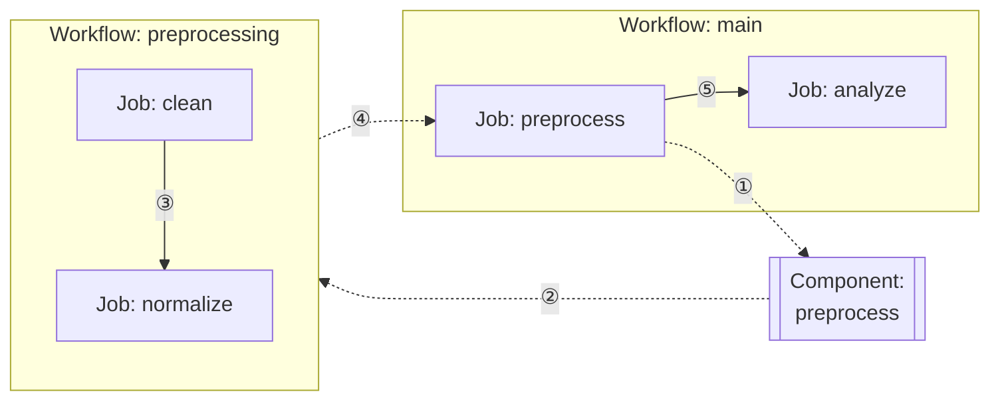

# 4장: 컴포넌트 구성

이 장에서는 model-compose의 다양한 컴포넌트 타입과 정의 방법, 입력/출력 매핑, 재사용 패턴을 다룹니다.

---

## 4.1 컴포넌트 타입

model-compose는 다양한 작업을 수행할 수 있는 여러 컴포넌트 타입을 제공합니다.

### 사용 가능한 컴포넌트 타입

| 타입 | 용도 | 주요 사용 사례 |
|------|------|---------------|
| `http-client` | 외부 API 호출 | OpenAI, ElevenLabs 등 REST API 통합 |
| `http-server` | HTTP 서비스 제공 | 커스텀 HTTP API 엔드포인트 구현 |
| `mcp-server` | MCP 서비스 제공 | Model Context Protocol 서버 구현 |
| `mcp-client` | MCP 클라이언트 | MCP 서버와 통신 |
| `model` | 로컬 AI 모델 실행 | 텍스트 생성, 이미지 분석 등 로컬 모델 추론 |
| `model-trainer` | 모델 훈련 | 파인튜닝, LoRA 훈련 |
| `datasets` | 데이터셋 로드 | 훈련/평가 데이터셋 로드 및 처리 |
| `vector-store` | 벡터 DB 연동 | Chroma, Milvus 등 RAG 시스템 |
| `workflow` | 워크플로우 호출 | 다른 워크플로우를 서브루틴으로 실행 |
| `shell` | 셸 명령 실행 | 스크립트 실행, 시스템 명령 |
| `text-splitter` | 텍스트 분할 | 문서를 청크로 분할 |
| `image-processor` | 이미지 처리 | 이미지 변환, 리사이즈 등 |

### 컴포넌트 선택 가이드

**외부 API 통합**
- OpenAI, Anthropic 등 → `http-client`
- 커스텀 REST API → `http-client`

**로컬 AI 모델**
- 로컬 추론 → `model`
- vLLM, Ollama 등 백엔드 사용 → `http-server`
- 훈련 → `model-trainer`

**데이터 처리**
- 텍스트 분할 → `text-splitter`
- 이미지 처리 → `image-processor`
- 벡터 저장 → `vector-store`

**워크플로우 조합**
- 서브 워크플로우 → `workflow`
- 시스템 작업 → `shell`

---

## 4.2 컴포넌트 정의 방법

### 기본 구조

모든 컴포넌트는 다음 기본 구조를 따릅니다:

```yaml
components:
  - id: unique-component-id
    type: component-type
    # 타입별 설정...
    output:
      # 출력 매핑...
```

### 필수 속성

- `id`: 컴포넌트의 고유 식별자
- `type`: 컴포넌트 타입

### 선택 속성

- `output`: 출력 데이터 매핑
- `actions`: 여러 액션 정의 (다중 액션 컴포넌트)

### 단일 액션 vs 다중 액션 컴포넌트

컴포넌트는 단일 액션 또는 다중 액션으로 정의할 수 있습니다.

#### 단일 액션 컴포넌트

하나의 작업만 수행하는 컴포넌트:

```yaml
components:
  - id: send-email
    type: http-client
    endpoint: https://api.email.com/send
    method: POST
    headers:
      Authorization: Bearer ${env.EMAIL_API_KEY}
    body:
      to: ${input.to}
      subject: ${input.subject}
      body: ${input.body}
    output: ${response}
```

사용:
```yaml
workflow:
  jobs:
    - component: send-email
      input:
        to: "user@example.com"
        subject: "Welcome"
        body: "Hello!"
```

#### 다중 액션 컴포넌트

하나의 컴포넌트에 여러 작업을 정의:

```yaml
components:
  - id: email-service
    type: http-client
    base_url: https://api.email.com
    headers:
      Authorization: Bearer ${env.EMAIL_API_KEY}
      Content-Type: application/json
    actions:
      - id: send
        path: /send
        method: POST
        body:
          to: ${input.to}
          subject: ${input.subject}
          body: ${input.body}
        output: ${response}

      - id: get-status
        path: /status/${input.message_id}
        method: GET
        output: ${response.status}

      - id: list-templates
        path: /templates
        method: GET
        output: ${response.templates}
```

사용:
```yaml
workflow:
  jobs:
    - id: send
      component: email-service
      action: send
      input:
        to: "user@example.com"
        subject: "Welcome"
        body: "Hello!"
      output:
        message_id: ${output.id}

    - id: check
      component: email-service
      action: get-status
      input:
        message_id: ${jobs.send.output.message_id}
```

#### 언제 다중 액션을 사용할까?

**다중 액션 사용이 적합한 경우:**
- 동일한 API 서비스의 여러 엔드포인트를 사용
- 공통 인증/헤더를 공유
- 관련된 작업들을 논리적으로 그룹화

**단일 액션 사용이 적합한 경우:**
- 단순하고 독립적인 작업
- 재사용이 제한적인 특정 작업
- 빠른 프로토타이핑

---

## 4.3 입력/출력 매핑

### 입력 매핑

컴포넌트에 데이터를 전달하는 방법:

#### 방법 1: 직접 매핑

```yaml
components:
  - id: translator
    type: http-client
    endpoint: https://api.translate.com/v1/translate
    body:
      text: ${input.text}
      target_lang: ${input.language}
```

워크플로우에서 사용:
```yaml
workflow:
  jobs:
    - component: translator
      input:
        text: "Hello"
        language: "ko"
```

#### 방법 2: 전체 입력 전달

```yaml
components:
  - id: processor
    type: http-client
    endpoint: https://api.example.com/process
    body: ${input}  # 전체 입력을 그대로 전달
```

### 출력 매핑

컴포넌트의 결과를 추출하는 방법:

#### 기본 출력

```yaml
components:
  - id: chatgpt
    type: http-client
    endpoint: https://api.openai.com/v1/chat/completions
    body:
      model: gpt-4o
      messages: ${input.messages}
    output:
      content: ${response.choices[0].message.content}
      tokens: ${response.usage.total_tokens}
```

워크플로우에서 사용:
```yaml
workflow:
  jobs:
    - component: chatgpt
      output:
        answer: ${output.content}  # 컴포넌트 출력의 content 필드
        usage: ${output.tokens}     # 컴포넌트 출력의 tokens 필드
```

#### 전체 응답 출력

```yaml
components:
  - id: api-call
    type: http-client
    endpoint: https://api.example.com/data
    output: ${response}  # 전체 응답
```

#### 타입 변환과 함께

```yaml
components:
  - id: image-gen
    type: http-client
    endpoint: https://api.images.com/generate
    output: ${response.image as base64}
```

### 입출력 흐름 예제

```yaml
components:
  - id: step1
    type: http-client
    endpoint: https://api1.com/process
    body:
      data: ${input.raw_data}
    output:
      processed: ${response.result}

  - id: step2
    type: http-client
    endpoint: https://api2.com/analyze
    body:
      data: ${input.processed_data}
    output:
      analysis: ${response.insights}

workflow:
  jobs:
    - id: process
      component: step1
      input:
        raw_data: ${input.data}
      output:
        result: ${output.processed}

    - id: analyze
      component: step2
      input:
        processed_data: ${jobs.process.output.result}
      output:
        final: ${output.analysis}
```

---

## 4.4 재사용 패턴

### 패턴 1: 모델별 컴포넌트 분리

모델이나 서비스별로 컴포넌트를 분리하여 명확한 책임 부여:

```yaml
components:
  # OpenAI GPT-4o 전용
  - id: gpt4o
    type: http-client
    endpoint: https://api.openai.com/v1/chat/completions
    headers:
      Authorization: Bearer ${env.OPENAI_API_KEY}
      Content-Type: application/json
    body:
      model: gpt-4o
      messages: ${input.messages}
      temperature: ${input.temperature | 0.7}
    output:
      content: ${response.choices[0].message.content}
      tokens: ${response.usage.total_tokens}

  # Anthropic Claude 전용
  - id: claude
    type: http-client
    endpoint: https://api.anthropic.com/v1/messages
    headers:
      x-api-key: ${env.ANTHROPIC_API_KEY}
      anthropic-version: "2023-06-01"
      Content-Type: application/json
    body:
      model: claude-3-5-sonnet-20241022
      messages: ${input.messages}
      max_tokens: ${input.max_tokens | 1024}
    output:
      content: ${response.content[0].text}

  # 음성 합성 전용
  - id: elevenlabs-tts
    type: http-client
    endpoint: https://api.elevenlabs.io/v1/text-to-speech/${input.voice_id}
    headers:
      xi-api-key: ${env.ELEVENLABS_API_KEY}
      Content-Type: application/json
    body:
      text: ${input.text}
      model_id: eleven_multilingual_v2
    output: ${response as base64}
```

### 패턴 2: 다중 액션 컴포넌트

하나의 서비스에 여러 액션을 정의:

```yaml
components:
  - id: slack
    type: http-client
    base_url: https://slack.com/api
    headers:
      Authorization: Bearer ${env.SLACK_TOKEN}
    actions:
      - id: send-message
        path: /chat.postMessage
        method: POST
        body:
          channel: ${input.channel}
          text: ${input.text}
        output: ${response}

      - id: list-channels
        path: /conversations.list
        method: GET
        output: ${response.channels}

      - id: get-user
        path: /users.info
        method: GET
        params:
          user: ${input.user_id}
        output: ${response.user}
```

사용:
```yaml
workflow:
  jobs:
    - id: send
      component: slack
      action: send-message
      input:
        channel: "#general"
        text: "Hello!"

    - id: list
      component: slack
      action: list-channels
```

### 패턴 3: 컴포넌트 체이닝

작은 컴포넌트를 조합하여 복잡한 로직 구성:

```yaml
components:
  - id: fetch-data
    type: http-client
    endpoint: https://api.data.com/fetch
    output: ${response.data}

  - id: process-data
    type: shell
    command: [ python, process.py, "${input.data}" ]
    output:
      result: ${result.stdout}

  - id: save-result
    type: http-client
    endpoint: https://api.storage.com/save
    method: POST
    body:
      data: ${input.data}
    output: ${response}

workflow:
  jobs:
    - id: fetch
      component: fetch-data
      output:
        raw: ${output}

    - id: process
      component: process-data
      input:
        data: ${jobs.fetch.output.raw}
      output:
        processed: ${output.result}

    - id: save
      component: save-result
      input:
        data: ${jobs.process.output.processed}
```

구조 다이어그램:


### 패턴 4: 환경별 컴포넌트

환경에 따라 다른 엔드포인트 사용:

```yaml
# base.yml
components:
  - id: api-client
    type: http-client
    endpoint: ${env.API_ENDPOINT}/process
    headers:
      Authorization: Bearer ${env.API_KEY}
    body: ${input}
    output: ${response}
```

```bash
# 개발 환경
export API_ENDPOINT=https://dev-api.example.com
export API_KEY=dev-key
model-compose up

# 프로덕션 환경
export API_ENDPOINT=https://api.example.com
export API_KEY=prod-key
model-compose up
```

### 패턴 5: 워크플로우 모듈화

워크플로우를 컴포넌트로 재사용:

```yaml
components:
  - id: preprocess
    type: workflow
    workflow: preprocessing

workflows:
  - id: preprocessing
    jobs:
      - id: clean
        component: data-cleaner
      - id: normalize
        component: normalizer

  - id: main
    jobs:
      - id: preprocess
        component: preprocess
        input: ${input.raw_data}

      - id: analyze
        component: analyzer
        input: ${jobs.preprocess.output}
```

구조 다이어그램:


---

## 4.5 컴포넌트 모범 사례

### 1. 명확한 네이밍

```yaml
# Good
- id: openai-gpt4o-chat
- id: elevenlabs-tts-multilingual
- id: slack-send-message

# Bad
- id: comp1
- id: api
- id: process
```

### 2. 입출력 문서화

```yaml
components:
  - id: translator
    type: http-client
    # Input: { text: string, target_lang: string }
    # Output: { translated: string, detected_lang: string }
    endpoint: https://api.translate.com/v1/translate
    body:
      text: ${input.text}
      target: ${input.target_lang}
    output:
      translated: ${response.translation}
      detected_lang: ${response.source_language}
```

### 3. 환경 변수 사용

```yaml
# Good - 환경 변수 사용
components:
  - id: api-client
    type: http-client
    endpoint: ${env.API_ENDPOINT}
    headers:
      Authorization: Bearer ${env.API_KEY}

# Bad - 하드코딩
components:
  - id: api-client
    type: http-client
    endpoint: https://api.example.com
    headers:
      Authorization: Bearer sk-hardcoded-key
```

---

## 다음 단계

실습해보세요:
- 다양한 컴포넌트 타입 실험하기
- 재사용 가능한 컴포넌트 라이브러리 구축하기
- 복잡한 워크플로우를 작은 컴포넌트로 분해하기

---

**다음 장**: [5. 워크플로우 작성](./05-writing-workflows.md)
