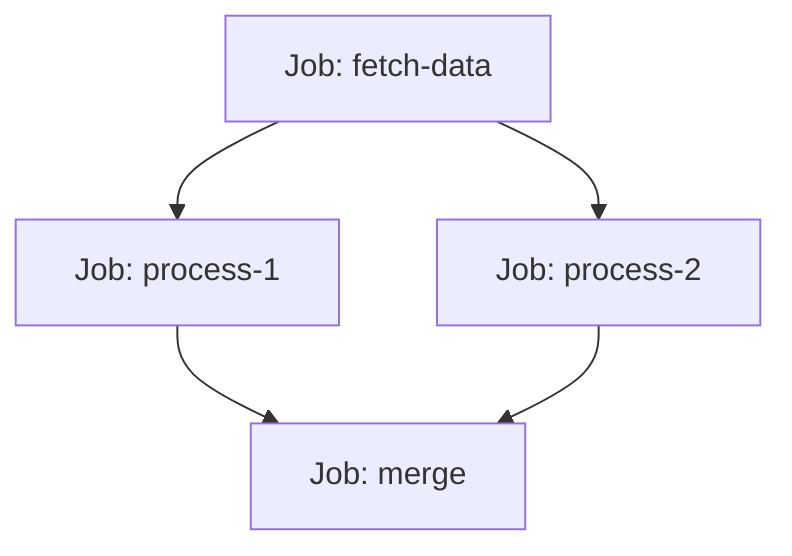
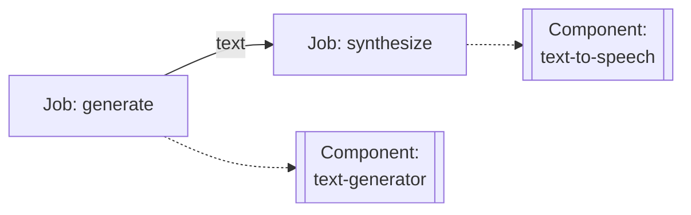
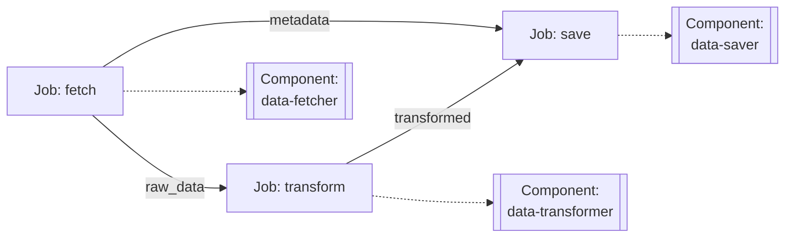
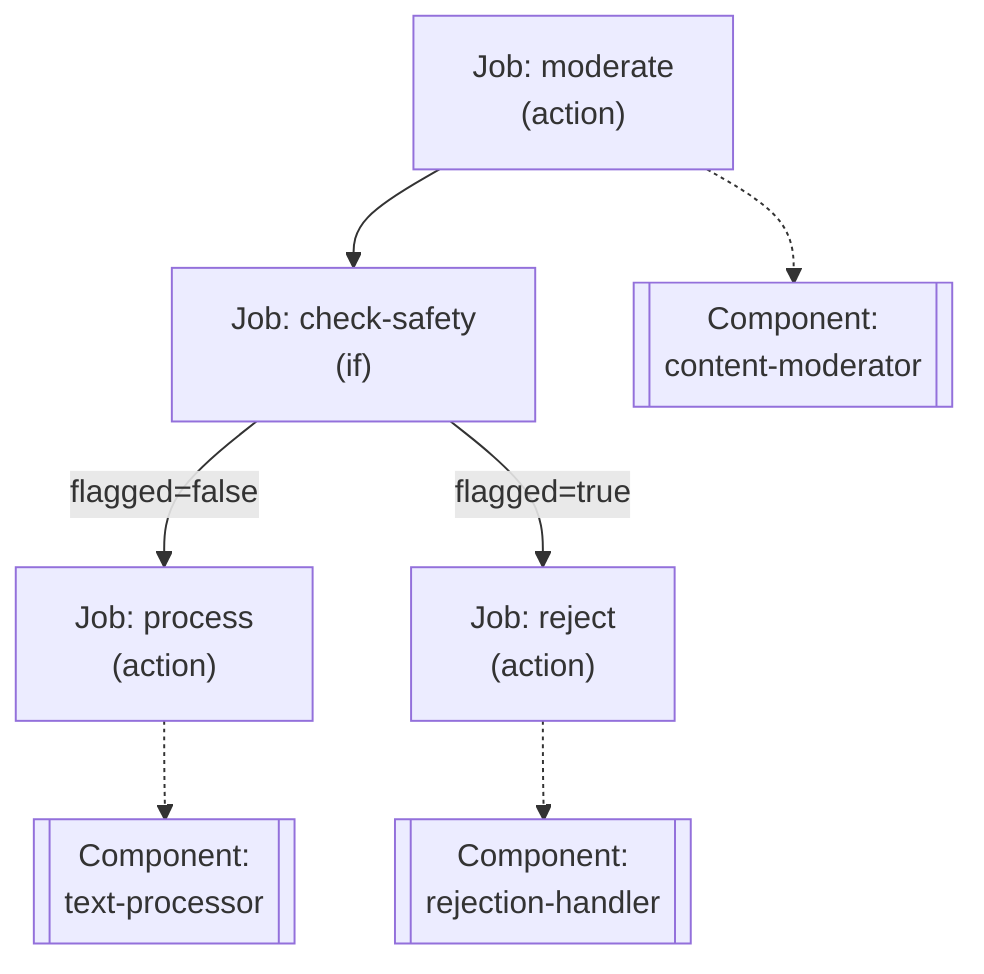
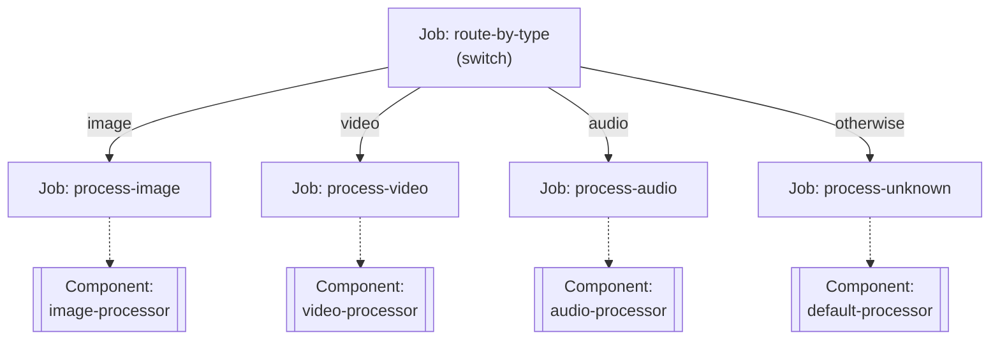
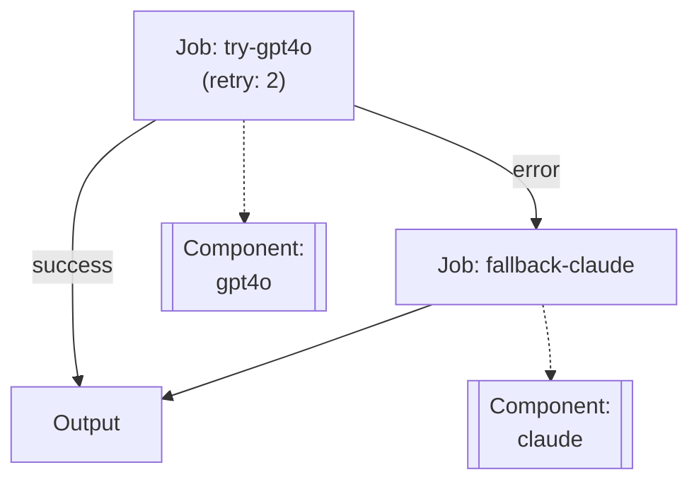

# 5장: 워크플로우 작성

이 장에서는 model-compose의 워크플로우 작성 방법을 다룹니다. 단일 작업부터 복잡한 다단계 워크플로우까지, 작업 간 데이터 전달, 조건부 실행, 스트리밍 모드, 에러 핸들링을 학습합니다.

## 5.1 워크플로우란?

**워크플로우(Workflow)**는 하나 이상의 작업(Job)을 조합하여 완전한 실행 파이프라인을 구성하는 실행 단위입니다. 워크플로우를 작성할 때는 다음 세 가지 핵심 요소를 정의해야 합니다:

### 1. 작업(Job) 정의
각 작업은 실행할 컴포넌트와 해당 컴포넌트에 전달할 입력을 지정합니다.

```yaml
jobs:
  - id: my-task
    component: my-component
    input:
      field: ${input.value}
```

### 2. 작업 간 의존성 관계
`depends_on` 필드로 작업 간의 실행 순서를 명시합니다. 이를 통해 순차 실행, 병렬 실행, 복잡한 실행 그래프를 정의할 수 있습니다.

```yaml
jobs:
  - id: task1
    component: component1

  - id: task2
    component: component2
    depends_on: [task1]  # task1 완료 후 실행
```

### 3. 입출력 정의
- **입력(input)**: 워크플로우 입력 또는 이전 작업의 출력을 현재 작업의 입력으로 매핑
- **출력(output)**: 작업의 결과를 워크플로우 출력 또는 다음 작업의 입력으로 사용

각 작업의 출력은 `${jobs.job_id.output}`에 저장되어, 이후 작업들에서 입력으로 참조할 수 있습니다.

```yaml
jobs:
  - id: task1
    component: component1
    input:
      data: ${input.user_data}     # 워크플로우 입력 사용
    output:
      result: ${output.processed}
    # 위 출력은 jobs.task1.output 변수에 저장됨

  - id: task2
    component: component2
    input:
      data: ${jobs.task1.output.result}  # task1의 출력을 입력으로 사용
    depends_on: [task1]
```

이 세 가지 요소를 조합하여 간단한 단일 작업부터 복잡한 다단계 파이프라인까지 다양한 워크플로우를 구성할 수 있습니다.

---

## 5.2 단일 작업 워크플로우

가장 간단한 형태의 워크플로우는 하나의 작업만 포함합니다.

### 기본 구조

```yaml
workflows:
  - id: simple-workflow
    jobs:
      - id: task
        component: my-component
        input:
          field: ${input.value}
```

### 간소화 형태

작업이 하나일 때는 `jobs`와 작업의 `id`를 생략할 수 있습니다. `id`가 생략되면 기본적으로 `__job__`으로 지정됩니다.

```yaml
workflows:
  - id: simple-workflow
    component: my-component
    input:
      field: ${input.value}
```

### 예제: 텍스트 생성

```yaml
components:
  - id: gpt4o
    type: http-client
    endpoint: https://api.openai.com/v1/chat/completions
    headers:
      Authorization: Bearer ${env.OPENAI_API_KEY}
      Content-Type: application/json
    body:
      model: gpt-4o
      messages:
        - role: user
          content: ${input.prompt}
    output:
      text: ${response.choices[0].message.content}

workflows:
  - id: generate-text
    jobs:
      - id: generate
        component: gpt4o
        input:
          prompt: ${input.prompt}
        output:
          result: ${output.text}
```

실행:
```bash
model-compose run generate-text --input '{"prompt": "Hello, AI!"}'
```

---

## 5.3 여러 단계 워크플로우

여러 작업을 순차적으로 실행하는 워크플로우입니다.

### 작업 의존성 (depends_on)

`depends_on` 필드를 사용하여 작업 간의 실행 순서를 명시적으로 정의할 수 있습니다. 이 필드는 현재 작업이 시작되기 전에 완료되어야 하는 작업들의 ID 목록을 지정합니다.

**기본 형식:**
```yaml
depends_on: [ job-id-1, job-id-2 ]
```

**주요 특징:**
- 여러 작업에 대한 의존성을 배열로 지정 가능
- 의존성이 있는 작업들이 모두 완료된 후에 실행
- 의존성이 없는 작업들은 병렬로 실행 가능
- 순환 의존성(circular dependency)은 허용되지 않음

### 순차 실행

```yaml
workflows:
  - id: multi-step
    jobs:
      - id: step1
        component: component1
        input: ${input}
        output:
          data1: ${output}

      - id: step2
        component: component2
        input:
          data: ${jobs.step1.output.data1}
        output:
          data2: ${output}
        depends_on: [step1]  # step1이 완료된 후 실행

      - id: step3
        component: component3
        input:
          data: ${jobs.step2.output.data2}
        depends_on: [step2]  # step2가 완료된 후 실행
```

### 병렬 실행

의존성이 없는 작업들은 동시에 실행됩니다:

```yaml
workflows:
  - id: parallel-workflow
    jobs:
      - id: task-a
        component: component-a
        input: ${input}
        output:
          result-a: ${output}

      - id: task-b
        component: component-b
        input: ${input}
        output:
          result-b: ${output}
      # task-a와 task-b는 병렬로 실행됨

      - id: combine
        component: combiner
        input:
          data-a: ${jobs.task-a.output.result-a}
          data-b: ${jobs.task-b.output.result-b}
        depends_on: [task-a, task-b]  # 두 작업이 모두 완료된 후 실행
```

### 복잡한 의존성 그래프

```yaml
workflows:
  - id: complex-workflow
    jobs:
      - id: fetch-data
        component: data-fetcher
        output:
          raw: ${output}

      - id: process-1
        component: processor-1
        input: ${jobs.fetch-data.output.raw}
        depends_on: [fetch-data]
        output:
          processed-1: ${output}

      - id: process-2
        component: processor-2
        input: ${jobs.fetch-data.output.raw}
        depends_on: [fetch-data]
        output:
          processed-2: ${output}

      - id: merge
        component: merger
        input:
          data-1: ${jobs.process-1.output.processed-1}
          data-2: ${jobs.process-2.output.processed-2}
        depends_on: [process-1, process-2]
        output:
          merged: ${output}
```

구조 다이어그램:


### 예제: 텍스트 생성 후 음성 변환

```yaml
components:
  - id: text-generator
    type: http-client
    endpoint: https://api.openai.com/v1/chat/completions
    headers:
      Authorization: Bearer ${env.OPENAI_API_KEY}
      Content-Type: application/json
    body:
      model: gpt-4o
      messages:
        - role: user
          content: ${input.prompt}
    output:
      text: ${response.choices[0].message.content}

  - id: text-to-speech
    type: http-client
    endpoint: https://api.elevenlabs.io/v1/text-to-speech/${input.voice_id}
    headers:
      xi-api-key: ${env.ELEVENLABS_API_KEY}
      Content-Type: application/json
    body:
      text: ${input.text}
      model_id: eleven_multilingual_v2
    output: ${response as base64}

workflows:
  - id: text-to-voice
    jobs:
      - id: generate
        component: text-generator
        input:
          prompt: ${input.prompt}
        output:
          text: ${output.text}

      - id: synthesize
        component: text-to-speech
        input:
          text: ${jobs.generate.output.text}
          voice_id: ${input.voice_id}
        output:
          audio: ${output}
        depends_on: [ generate ]
```

구조 다이어그램:


---

## 5.4 작업 간 데이터 전달

워크플로우에서 작업 간 데이터를 전달하는 방법입니다.

### 변수 바인딩 구문

```yaml
${input.field}              # 워크플로우 입력
${output.field}             # 현재 작업의 출력
${jobs.job-id.output.field} # 특정 작업의 출력
${env.VAR_NAME}             # 환경 변수
```

### 예제: 복합 데이터 전달

```yaml
workflows:
  - id: data-pipeline
    jobs:
      - id: fetch
        component: data-fetcher
        input:
          url: ${input.source_url}
        output:
          raw_data: ${output.data}
          metadata: ${output.meta}

      - id: transform
        component: data-transformer
        input:
          data: ${jobs.fetch.output.raw_data}
          options:
            format: json
            encoding: utf-8
        output:
          transformed: ${output.result}
        depends_on: [ fetch ]

      - id: save
        component: data-saver
        input:
          data: ${jobs.transform.output.transformed}
          metadata: ${jobs.fetch.output.metadata}
          destination: ${input.target_path}
        depends_on: [ transform, fetch ]
```

구조 다이어그램:


### 타입 변환

데이터 전달 시 타입 변환을 적용할 수 있습니다:

```yaml
workflows:
  - id: image-workflow
    jobs:
      - id: generate
        component: image-generator
        output:
          image_base64: ${output as base64}

      - id: process
        component: image-processor
        input:
          image: ${jobs.generate.output.image_base64 as image/png;base64}
```

---

## 5.5 Job 타입

model-compose는 다양한 작업 유형을 지원하기 위해 여러 Job 타입을 제공합니다.

### 사용 가능한 Job 타입

| 타입 | 용도 | 설명 |
|------|------|------|
| `action` | 컴포넌트 실행 | 컴포넌트를 호출하여 작업 수행 (기본 타입) |
| `if` | 조건 분기 | 조건에 따라 다른 Job으로 라우팅 |
| `switch` | 다중 분기 | 값에 따라 여러 경로 중 하나로 라우팅 |
| `delay` | 대기 | 지정된 시간 동안 대기 |
| `filter` | 데이터 재구성 | 데이터의 일부를 추출하여 새로운 데이터로 구성 |
| `random-router` | 랜덤 라우팅 | 무작위로 Job 선택 |

> **참고**: `type`을 명시하지 않으면 기본적으로 `action` 타입으로 처리됩니다.

### Action Job

컴포넌트를 실행하는 기본 Job 타입입니다.

```yaml
jobs:
  - id: my-task
    type: action  # 생략 가능 (기본값)
    component: my-component
    action: my-action  # 다중 액션 컴포넌트인 경우
    input: ${input}
    output:
      result: ${output}
```

### If Job

조건에 따라 다른 Job으로 분기합니다.

#### 기본 구조

```yaml
jobs:
  - id: condition-check
    type: if
    operator: eq          # 비교 연산자
    input: ${input.value}
    value: "expected"
    if_true: job-when-true
    if_false: job-when-false
```

#### 지원하는 연산자

- `eq`: 같음
- `neq`: 같지 않음
- `gt`: 초과
- `gte`: 이상
- `lt`: 미만
- `lte`: 이하
- `in`: 포함됨
- `not-in`: 포함되지 않음
- `starts-with`: ~로 시작
- `ends-with`: ~로 끝남
- `match`: 정규식 매칭

#### 다중 조건

```yaml
jobs:
  - id: multi-condition
    type: if
    conditions:
      - operator: gt
        input: ${input.score}
        value: 80
        if_true: excellent-handler
      - operator: gt
        input: ${input.score}
        value: 60
        if_true: good-handler
    otherwise: need-improvement-handler
```

### Switch Job

값에 따라 여러 경로 중 하나로 라우팅합니다.

#### 기본 구조

```yaml
jobs:
  - id: route-by-type
    type: switch
    input: ${input.type}
    cases:
      - value: "image"
        then: process-image
      - value: "video"
        then: process-video
      - value: "audio"
        then: process-audio
    otherwise: process-unknown
```

### Delay Job

지정된 시간 동안 대기하거나 특정 시간까지 기다립니다.

#### 시간 간격 대기 (time-interval)

```yaml
jobs:
  - id: wait
    type: delay
    mode: time-interval
    duration: 5000  # milliseconds
```

#### 특정 시간까지 대기 (specific-time)

```yaml
jobs:
  - id: wait-until
    type: delay
    mode: specific-time
    time: "2024-12-25T09:00:00"
    timezone: "Asia/Seoul"  # 선택 사항
```

### Filter Job

데이터의 일부를 추출하여 새로운 구조로 재구성합니다.

```yaml
jobs:
  - id: reshape-data
    type: filter
    output:
      user_id: ${input.user.id}
      user_name: ${input.user.profile.name}
      score: ${input.metrics.score}
```

### Random Router Job

여러 Job 중 무작위로 하나를 선택합니다. `weight`로 각 경로의 선택 확률을 조정할 수 있습니다.

#### 균등 분배 (50:50)

```yaml
jobs:
  - id: ab-test
    type: random-router
    routes:
      - id: variant-a
        weight: 50
      - id: variant-b
        weight: 50
```

#### 비균등 분배 (70:20:10)

```yaml
jobs:
  - id: traffic-split
    type: random-router
    routes:
      - id: primary-model
        weight: 70
      - id: experimental-model
        weight: 20
      - id: fallback-model
        weight: 10
```

> **참고**: weight 값의 합이 100일 필요는 없습니다. 상대적 비율로 동작합니다.

---

## 5.6 조건부 실행

If와 Switch Job을 사용하여 조건에 따른 실행 흐름을 제어하는 방법입니다.

### 예제 1: If Job으로 콘텐츠 필터링

```yaml
components:
  - id: content-moderator
    type: http-client
    endpoint: https://api.openai.com/v1/moderations
    headers:
      Authorization: Bearer ${env.OPENAI_API_KEY}
      Content-Type: application/json
    body:
      input: ${input.text}
    output:
      flagged: ${response.results[0].flagged}

  - id: text-processor
    type: http-client
    endpoint: https://api.openai.com/v1/chat/completions
    headers:
      Authorization: Bearer ${env.OPENAI_API_KEY}
      Content-Type: application/json
    body:
      model: gpt-4o
      messages:
        - role: user
          content: ${input.text}
    output:
      result: ${response.choices[0].message.content}

  - id: rejection-handler
    type: http-client
    endpoint: https://api.example.com/log-rejection
    method: POST
    body:
      text: ${input.text}
      reason: "content_flagged"
    output: ${response}

workflows:
  - id: safe-processing
    jobs:
      - id: moderate
        component: content-moderator
        input:
          text: ${input.text}
        output:
          flagged: ${output.flagged}

      - id: check-safety
        type: if
        operator: eq
        input: ${jobs.moderate.output.flagged}
        value: false
        if_true: process
        if_false: reject
        depends_on: [ moderate ]

      - id: process
        component: text-processor
        input:
          text: ${input.text}
        output:
          result: ${output.result}

      - id: reject
        component: rejection-handler
        input:
          text: ${input.text}
```

구조 다이어그램:


### 예제 2: Switch Job으로 미디어 타입 처리

```yaml
components:
  - id: image-processor
    type: http-client
    endpoint: https://api.example.com/process-image
    body:
      image: ${input.data}
    output: ${response}

  - id: video-processor
    type: http-client
    endpoint: https://api.example.com/process-video
    body:
      video: ${input.data}
    output: ${response}

  - id: audio-processor
    type: http-client
    endpoint: https://api.example.com/process-audio
    body:
      audio: ${input.data}
    output: ${response}

  - id: default-processor
    type: http-client
    endpoint: https://api.example.com/process-unknown
    body:
      data: ${input.data}
    output: ${response}

workflows:
  - id: media-processing
    jobs:
      - id: route-by-type
        type: switch
        input: ${input.media_type}
        cases:
          - value: "image"
            then: process-image
          - value: "video"
            then: process-video
          - value: "audio"
            then: process-audio
        otherwise: process-unknown

      - id: process-image
        component: image-processor
        input:
          data: ${input.data}
        depends_on: [ route-by-type ]

      - id: process-video
        component: video-processor
        input:
          data: ${input.data}
        depends_on: [ route-by-type ]

      - id: process-audio
        component: audio-processor
        input:
          data: ${input.data}
        depends_on: [ route-by-type ]

      - id: process-unknown
        component: default-processor
        input:
          data: ${input.data}
        depends_on: [ route-by-type ]
```

구조 다이어그램:


---

## 5.7 스트리밍 모드

컴포넌트에서 스트리밍을 지원하는 경우, 실시간으로 데이터를 스트리밍할 수 있습니다.

### 컴포넌트에서 스트리밍 설정

#### 모델 컴포넌트

모델 컴포넌트는 액션 레벨에서 `streaming: true`를 설정하여 스트리밍을 활성화합니다:

```yaml
components:
  - id: local-llm
    type: model
    task: text-generation
    model: facebook/bart-large-cnn
    architecture: seq2seq
    text: ${input.text}
    streaming: true  # 스트리밍 활성화
```

#### HTTP 컴포넌트

`http-client`와 `http-server` 컴포넌트는 API가 스트림 응답을 반환하면 자동으로 스트리밍 모드로 전환됩니다:

```yaml
components:
  - id: gpt4o-stream
    type: http-client
    endpoint: https://api.openai.com/v1/chat/completions
    headers:
      Authorization: Bearer ${env.OPENAI_API_KEY}
      Content-Type: application/json
    body:
      model: gpt-4o
      messages: ${input.messages}
      stream: true  # API에 스트리밍 요청
    output: ${response}
```

### 워크플로우에서 사용

```yaml
workflows:
  - id: chat
    jobs:
      - id: respond
        component: gpt4o-stream
        input:
          messages: ${input.messages}
    output: ${output}
```

> **참고**: 컴포넌트의 출력이 스트림이면 Job의 출력도 스트림이고, 마지막 Job의 출력이 스트림이면 워크플로우 출력도 스트림으로 반환됩니다.

### HTTP API로 스트리밍 요청

```bash
curl -X POST http://localhost:8080/api/workflows/runs \
  -H "Content-Type: application/json" \
  -d '{
    "workflow_id": "chat",
    "input": {
      "messages": [
        {"role": "user", "content": "Tell me a story"}
      ]
    }
  }'
```

> **참고**: 스트리밍 응답은 Server-Sent Events (SSE) 형식으로 전달됩니다.

> **더 자세한 내용은 [11장 스트리밍 모드](./11-streaming-mode.md)를 참고하세요.**

---

## 5.8 에러 핸들링

워크플로우 실행 중 발생할 수 있는 에러를 처리합니다.

### 재시도 설정

```yaml
workflows:
  - id: resilient-workflow
    jobs:
      - id: api-call
        component: external-api
        retry:
          max_attempts: 3
          delay: 1000  # milliseconds
          backoff: exponential
        input: ${input}
```

### 폴백 처리

```yaml
workflows:
  - id: fallback-workflow
    jobs:
      - id: primary
        component: primary-service
        input: ${input}
        on_error: continue

      - id: fallback
        component: fallback-service
        condition: ${jobs.primary.error}
        input: ${input}
```

### 예제: 다중 모델 폴백

```yaml
components:
  - id: gpt4o
    type: http-client
    endpoint: https://api.openai.com/v1/chat/completions
    headers:
      Authorization: Bearer ${env.OPENAI_API_KEY}
      Content-Type: application/json
    body:
      model: gpt-4o
      messages: ${input.messages}
    output:
      text: ${response.choices[0].message.content}

  - id: claude
    type: http-client
    endpoint: https://api.anthropic.com/v1/messages
    headers:
      x-api-key: ${env.ANTHROPIC_API_KEY}
      anthropic-version: "2023-06-01"
      Content-Type: application/json
    body:
      model: claude-3-5-sonnet-20241022
      messages: ${input.messages}
      max_tokens: 1024
    output:
      text: ${response.content[0].text}

workflows:
  - id: robust-chat
    jobs:
      - id: try-gpt4o
        component: gpt4o
        retry:
          max_attempts: 2
          delay: 500
        input:
          messages: ${input.messages}
        output:
          result: ${output.text}
        on_error: continue

      - id: fallback-claude
        component: claude
        condition: ${jobs.try-gpt4o.error}
        input:
          messages: ${input.messages}
        output:
          result: ${output.text}
        depends_on: [ try-gpt4o ]
```

구조 다이어그램:


### 에러 정보 접근

```yaml
workflows:
  - id: error-logging
    jobs:
      - id: risky-operation
        component: risky-api
        input: ${input}
        on_error: continue

      - id: log-error
        component: error-logger
        condition: ${jobs.risky-operation.error}
        input:
          error_message: ${jobs.risky-operation.error.message}
          error_code: ${jobs.risky-operation.error.code}
          timestamp: ${jobs.risky-operation.error.timestamp}
        depends_on: [ risky-operation ]
```

---

## 5.9 워크플로우 모범 사례

### 1. 명확한 작업 이름

```yaml
# Good
workflows:
  - id: user-onboarding
    jobs:
      - id: validate-email
        component: email-validator
      - id: create-account
        component: account-creator
      - id: send-welcome-email
        component: email-sender

# Bad
workflows:
  - id: workflow1
    jobs:
      - id: step1
        component: comp1
      - id: step2
        component: comp2
```

### 2. 작업 분해

복잡한 로직은 작은 작업으로 분해:

```yaml
# Good - 명확한 단계 분리
workflows:
  - id: content-pipeline
    jobs:
      - id: fetch-content
        component: content-fetcher
      - id: validate-content
        component: content-validator
      - id: transform-content
        component: content-transformer
      - id: publish-content
        component: content-publisher

# Bad - 하나의 거대한 작업
workflows:
  - id: content-pipeline
    jobs:
      - id: process-everything
        component: monolithic-processor
```

### 3. 재사용 가능한 워크플로우

```yaml
workflows:
  - id: preprocessing
    jobs:
      - id: clean
        component: data-cleaner
      - id: normalize
        component: data-normalizer

  - id: analysis
    jobs:
      - id: preprocess
        component: preprocessing-workflow
        input: ${input.raw_data}
      - id: analyze
        component: analyzer
        input: ${jobs.preprocess.output}
        depends_on:  [preprocess ]

components:
  - id: preprocessing-workflow
    type: workflow
    workflow: preprocessing
```

### 4. 입출력 문서화

```yaml
workflows:
  - id: image-generation
    # Input: { prompt: string, style: string, size: string }
    # Output: { image_url: string, width: number, height: number }
    jobs:
      - id: generate
        component: image-generator
        input:
          prompt: ${input.prompt}
          style: ${input.style}
          size: ${input.size}
```

### 5. 에러 핸들링 고려

중요한 작업에는 항상 재시도 또는 폴백 로직 추가:

```yaml
workflows:
  - id: critical-workflow
    jobs:
      - id: important-task
        component: critical-service
        retry:
          max_attempts: 3
          delay: 1000
        on_error: continue

      - id: fallback-task
        component: backup-service
        condition: ${jobs.important-task.error}
        depends_on: [ important-task ]
```

---

## 다음 단계

실습해보세요:
- 단순한 단일 작업 워크플로우부터 시작
- 점진적으로 복잡한 다단계 워크플로우로 확장
- 에러 핸들링과 재시도 로직 추가
- 재사용 가능한 워크플로우 컴포넌트 구축

---

**다음 장**: [6. 컨트롤러 구성](./06-controller-configuration.md)
