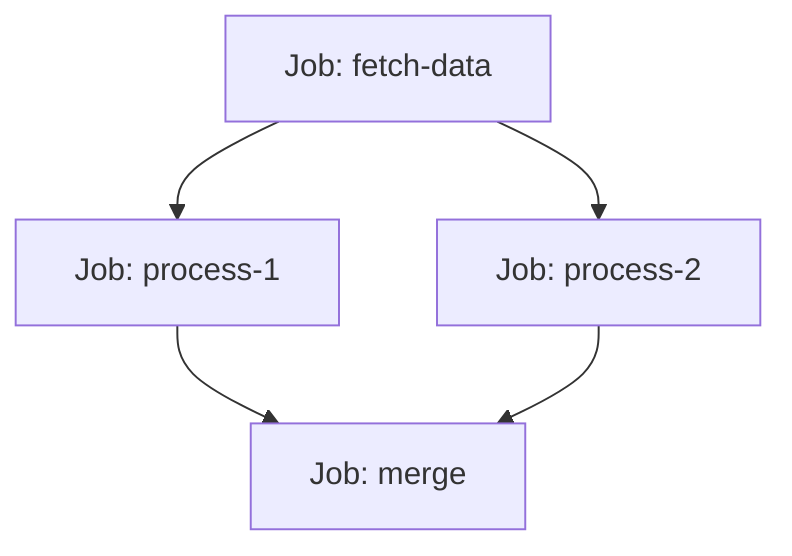
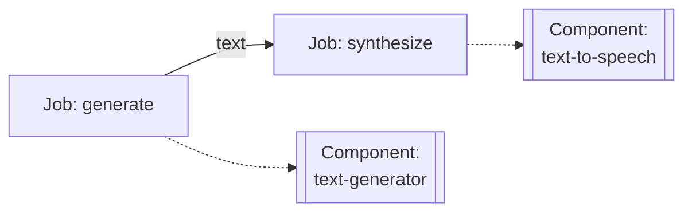
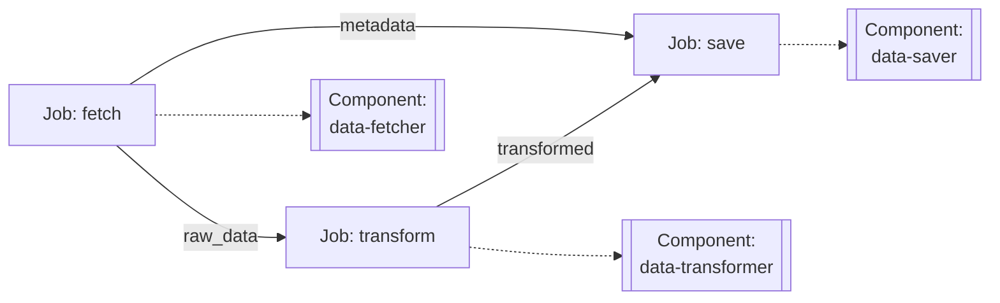
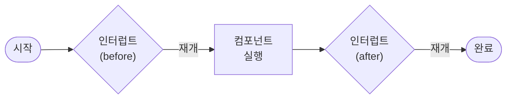
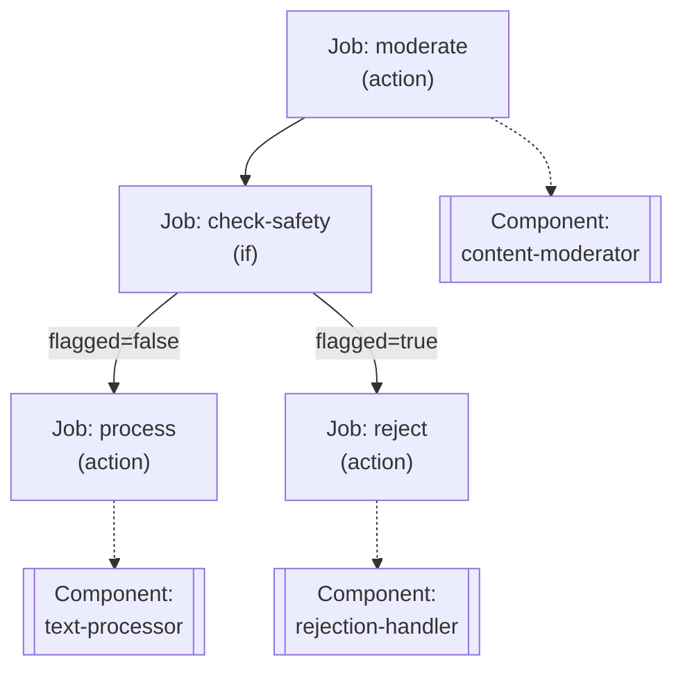
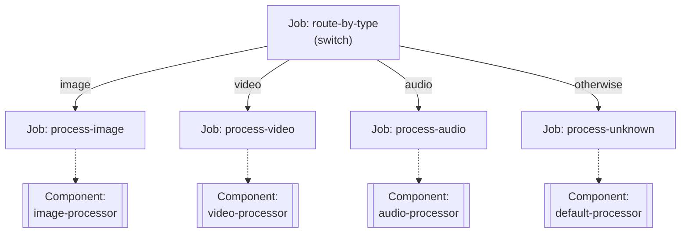
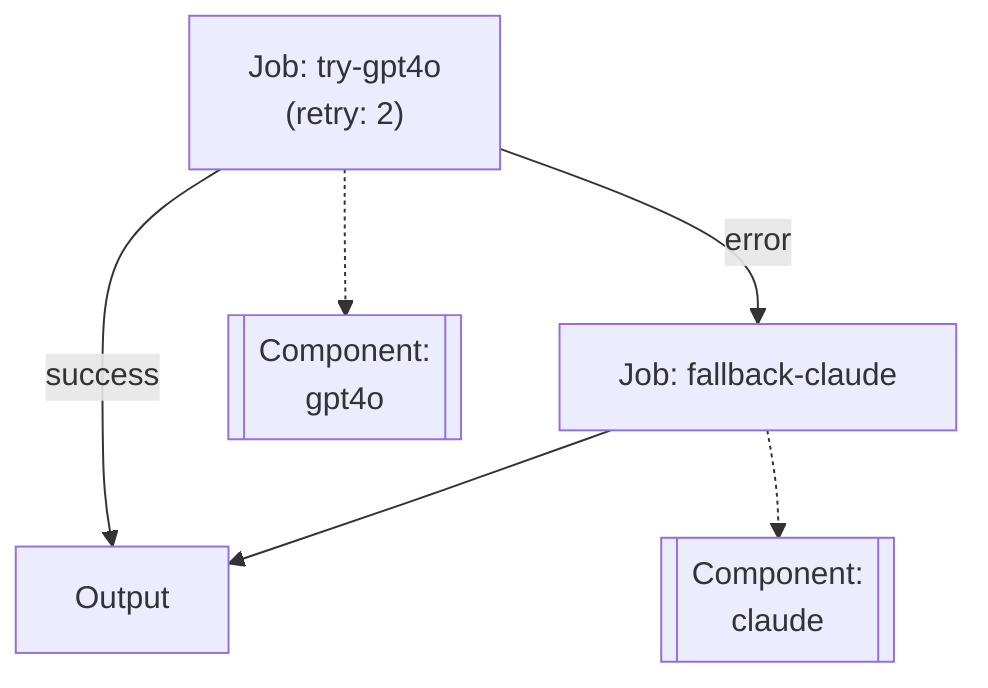

# 5장: 워크플로우 작성

이 장에서는 model-compose의 워크플로우 작성 방법을 다룹니다. 단일 작업부터 복잡한 여러 단계 워크플로우까지, 작업 간 데이터 전달, 조건부 실행, 스트리밍 모드, 에러 핸들링을 학습합니다.

## 5.1 워크플로우란?

**워크플로우(Workflow)**는 하나 이상의 작업(Job)을 조합하여 완전한 실행 파이프라인을 구성하는 실행 단위입니다. 워크플로우를 작성할 때는 다음 세 가지 핵심 요소를 정의해야 합니다:

### 1. 작업(Job) 정의
각 작업은 실행할 컴포넌트와 해당 컴포넌트에 전달할 입력을 지정합니다.

```yaml
jobs:
  - id: my-task
    component: my-component
    input:
      field: ${input.value}
```

### 2. 작업 간 의존성 관계
`depends_on` 필드로 작업 간의 실행 순서를 명시합니다. 이를 통해 순차 실행, 병렬 실행, 복잡한 실행 그래프를 정의할 수 있습니다.

```yaml
jobs:
  - id: task1
    component: component1

  - id: task2
    component: component2
    depends_on: [task1]  # task1 완료 후 실행
```

### 3. 입출력 정의
- **입력(input)**: 워크플로우 입력 또는 이전 작업의 출력을 현재 작업의 입력으로 매핑
- **출력(output)**: 작업의 결과를 워크플로우 출력 또는 다음 작업의 입력으로 사용

각 작업의 출력은 `${jobs.job_id.output}`에 저장되어, 이후 작업들에서 입력으로 참조할 수 있습니다.

```yaml
jobs:
  - id: task1
    component: component1
    input:
      data: ${input.user_data}     # 워크플로우 입력 사용
    output:
      result: ${output.processed}
    # 위 출력은 jobs.task1.output 변수에 저장됨

  - id: task2
    component: component2
    input:
      data: ${jobs.task1.output.result}  # task1의 출력을 입력으로 사용
    depends_on: [task1]
```

이 세 가지 요소를 조합하여 간단한 단일 작업부터 복잡한 여러 단계 파이프라인까지 다양한 워크플로우를 구성할 수 있습니다.

---

## 5.2 단일 작업 워크플로우

가장 간단한 형태의 워크플로우는 하나의 작업만 포함합니다.

### 기본 구조

```yaml
workflows:
  - id: simple-workflow
    jobs:
      - id: task
        component: my-component
        input:
          field: ${input.value}
```

### 간소화 형태

작업이 하나일 때는 `jobs`와 작업의 `id`를 생략할 수 있습니다. `id`가 생략되면 기본적으로 `__job__`으로 지정됩니다.

```yaml
workflows:
  - id: simple-workflow
    component: my-component
    input:
      field: ${input.value}
```

### 예제: 텍스트 생성

```yaml
components:
  - id: gpt4o
    type: http-client
    action:
      endpoint: https://api.openai.com/v1/chat/completions
      headers:
        Authorization: Bearer ${env.OPENAI_API_KEY}
        Content-Type: application/json
      body:
        model: gpt-4o
        messages:
          - role: user
            content: ${input.prompt}
      output:
        text: ${response.choices[0].message.content}

workflows:
  - id: generate-text
    jobs:
      - id: generate
        component: gpt4o
        input:
          prompt: ${input.prompt}
        output:
          result: ${output.text}
```

실행:
```bash
model-compose run generate-text --input '{"prompt": "Hello, AI!"}'
```

---

## 5.3 여러 단계 워크플로우

여러 작업을 순차적으로 실행하는 워크플로우입니다.

### 작업 의존성 (depends_on)

`depends_on` 필드를 사용하여 작업 간의 실행 순서를 명시적으로 정의할 수 있습니다. 이 필드는 현재 작업이 시작되기 전에 완료되어야 하는 작업들의 ID 목록을 지정합니다.

**기본 형식:**
```yaml
depends_on: [ job-id-1, job-id-2 ]
```

**주요 특징:**
- 여러 작업에 대한 의존성을 배열로 지정 가능
- 의존성이 있는 작업들이 모두 완료된 후에 실행
- 의존성이 없는 작업들은 병렬로 실행 가능
- 순환 의존성(circular dependency)은 허용되지 않음

### 순차 실행

```yaml
workflows:
  - id: multi-step
    jobs:
      - id: step1
        component: component1
        input: ${input}
        output:
          data1: ${output}

      - id: step2
        component: component2
        input:
          data: ${jobs.step1.output.data1}
        output:
          data2: ${output}
        depends_on: [step1]  # step1이 완료된 후 실행

      - id: step3
        component: component3
        input:
          data: ${jobs.step2.output.data2}
        depends_on: [step2]  # step2가 완료된 후 실행
```

### 병렬 실행

의존성이 없는 작업들은 동시에 실행됩니다:

```yaml
workflows:
  - id: parallel-workflow
    jobs:
      - id: task-a
        component: component-a
        input: ${input}
        output:
          result-a: ${output}

      - id: task-b
        component: component-b
        input: ${input}
        output:
          result-b: ${output}
      # task-a와 task-b는 병렬로 실행됨

      - id: combine
        component: combiner
        input:
          data-a: ${jobs.task-a.output.result-a}
          data-b: ${jobs.task-b.output.result-b}
        depends_on: [task-a, task-b]  # 두 작업이 모두 완료된 후 실행
```

### 복잡한 의존성 그래프

```yaml
workflows:
  - id: complex-workflow
    jobs:
      - id: fetch-data
        component: data-fetcher
        output:
          raw: ${output}

      - id: process-1
        component: processor-1
        input: ${jobs.fetch-data.output.raw}
        depends_on: [fetch-data]
        output:
          processed-1: ${output}

      - id: process-2
        component: processor-2
        input: ${jobs.fetch-data.output.raw}
        depends_on: [fetch-data]
        output:
          processed-2: ${output}

      - id: merge
        component: merger
        input:
          data-1: ${jobs.process-1.output.processed-1}
          data-2: ${jobs.process-2.output.processed-2}
        depends_on: [process-1, process-2]
        output:
          merged: ${output}
```

구조 다이어그램:

```mermaid
graph TB
    fetch["Job: fetch-data"]
    proc1["Job: process-1"]
    proc2["Job: process-2"]
    merge["Job: merge"]

    fetch --> proc1
    fetch --> proc2
    proc1 --> merge
    proc2 --> merge
```

### 예제: 텍스트 생성 후 음성 변환

```yaml
components:
  - id: text-generator
    type: http-client
    action:
      endpoint: https://api.openai.com/v1/chat/completions
      headers:
        Authorization: Bearer ${env.OPENAI_API_KEY}
        Content-Type: application/json
      body:
        model: gpt-4o
        messages:
          - role: user
            content: ${input.prompt}
      output:
        text: ${response.choices[0].message.content}

  - id: text-to-speech
    type: http-client
    action:
      endpoint: https://api.elevenlabs.io/v1/text-to-speech/${input.voice_id}
      headers:
        xi-api-key: ${env.ELEVENLABS_API_KEY}
        Content-Type: application/json
      body:
        text: ${input.text}
        model_id: eleven_multilingual_v2
      output: ${response as base64}

workflows:
  - id: text-to-voice
    jobs:
      - id: generate
        component: text-generator
        input:
          prompt: ${input.prompt}
        output:
          text: ${output.text}

      - id: synthesize
        component: text-to-speech
        input:
          text: ${jobs.generate.output.text}
          voice_id: ${input.voice_id}
        output:
          audio: ${output}
        depends_on: [ generate ]
```

구조 다이어그램:

```mermaid
graph LR
    job1["Job: generate"]
    job2["Job: synthesize"]

    job1 -->|text| job2

    job1 -.-> comp1[[Component:<br/>text-generator]]
    job2 -.-> comp2[[Component:<br/>text-to-speech]]
```

---

## 5.4 작업 간 데이터 전달

워크플로우에서 작업 간 데이터를 전달하는 방법입니다.

### 변수 바인딩 구문

```yaml
${input.field}              # 워크플로우 입력
${output.field}             # 현재 작업의 출력
${jobs.job-id.output.field} # 특정 작업의 출력
${env.VAR_NAME}             # 환경 변수
```

### 예제: 복합 데이터 전달

```yaml
workflows:
  - id: data-pipeline
    jobs:
      - id: fetch
        component: data-fetcher
        input:
          url: ${input.source_url}
        output:
          raw_data: ${output.data}
          metadata: ${output.meta}

      - id: transform
        component: data-transformer
        input:
          data: ${jobs.fetch.output.raw_data}
          options:
            format: json
            encoding: utf-8
        output:
          transformed: ${output.result}
        depends_on: [ fetch ]

      - id: save
        component: data-saver
        input:
          data: ${jobs.transform.output.transformed}
          metadata: ${jobs.fetch.output.metadata}
          destination: ${input.target_path}
        depends_on: [ transform, fetch ]
```

구조 다이어그램:

```mermaid
graph LR
    fetch["Job: fetch"]
    transform["Job: transform"]
    save["Job: save"]

    fetch -->|raw_data| transform
    fetch -->|metadata| save
    transform -->|transformed| save

    fetch -.-> comp1[[Component:<br/>data-fetcher]]
    transform -.-> comp2[[Component:<br/>data-transformer]]
    save -.-> comp3[[Component:<br/>data-saver]]
```

### 타입 변환

데이터 전달 시 타입 변환을 적용할 수 있습니다:

```yaml
workflows:
  - id: image-workflow
    jobs:
      - id: generate
        component: image-generator
        output:
          image_base64: ${output as base64}

      - id: process
        component: image-processor
        input:
          image: ${jobs.generate.output.image_base64 as image/png;base64}
```

### 워크플로우 출력

워크플로우는 호출자에게 반환할 최종 응답의 형태를 정의하기 위해 자체적으로 `output`을 선언할 수 있습니다. 표현식은 모든 Job이 종료된 뒤 평가되며, Job에서 사용하는 것과 동일한 변수 바인딩 문법을 지원합니다.

```yaml
workflows:
  - id: summarize
    jobs:
      - id: fetch
        component: data-fetcher
        input:
          url: ${input.source_url}

      - id: summarize
        component: summarizer
        input:
          text: ${jobs.fetch.output.body}
        depends_on: [ fetch ]

    output:
      summary: ${jobs.summarize.output.text}
      source: ${jobs.fetch.output.url}
```

`output`을 생략하면, 워크플로우 결과는 다른 Job이 의존하지 않는 **터미널 Job**들의 출력으로부터 도출됩니다. 여러 터미널 Job이 각각 딕셔너리를 반환하는 경우 해당 출력들이 병합되며, 그렇지 않은 경우 마지막 터미널 Job의 출력이 그대로 사용됩니다. 명시적으로 `output`을 정의하면 이 기본 병합 동작이 대체되어 응답 구조를 자유롭게 재구성하거나 이름을 바꿀 수 있습니다.

---

## 5.5 Job 타입

model-compose는 다양한 작업 유형을 지원하기 위해 여러 Job 타입을 제공합니다.

### 사용 가능한 Job 타입

| 타입 | 용도 | 설명 |
|------|------|------|
| `component` | 컴포넌트 실행 | 컴포넌트를 호출하여 작업 수행 (기본 타입) |
| `if` | 조건 분기 | 조건에 따라 다른 Job으로 라우팅 |
| `switch` | 다중 분기 | 값에 따라 여러 경로 중 하나로 라우팅 |
| `delay` | 대기 | 지정된 시간 동안 대기 |
| `filter` | 데이터 재구성 | 데이터의 일부를 추출하여 새로운 데이터로 구성 |
| `random-router` | 랜덤 라우팅 | 무작위로 Job 선택 |
| `for-each` | 반복 실행 | 컬렉션의 각 항목마다 컴포넌트를 한 번씩 실행 |

> **참고**: `type`을 명시하지 않으면 기본적으로 `component` 타입으로 처리됩니다.

### 공통 Job 필드

타입과 무관하게 모든 Job은 다음 필드를 지원합니다:

| 필드 | 타입 | 기본값 | 설명 |
|------|------|--------|------|
| `id` | `string` | `"__job__"` | 고유한 Job 식별자. |
| `name` | `string` | `null` | 사람이 읽기 쉬운 라벨. 웹 UI에서 그룹 라벨로 사용됩니다. |
| `depends_on` | `string[]` | `[]` | 이 Job 실행 전에 완료되어야 하는 Job ID 목록. |
| `max_run_count` | `int` | `5` | 하나의 워크플로우 실행 내에서 이 Job이 실행될 수 있는 최대 횟수 (라우팅에 의한 재실행 포함). |
| `interrupt` | object | `null` | Human-in-the-Loop 인터럽트 지점. 아래 [인터럽트 (Human-in-the-Loop)](#인터럽트-human-in-the-loop) 참조. |
| `hook` | object | `null` | Job 실행 전후에 동작하는 인라인 Python 훅. 아래 [훅](#훅) 참조. |
| `retry` | int/object | `null` | 실패 시 적용되는 재시도 정책. 아래 [재시도](#재시도) 참조. |
| `on_error` | string/object | `null` | 재시도가 모두 소진된 후 적용되는 대체 동작. 아래 [에러 처리](#에러-처리) 참조. |

인터럽트, 훅, 재시도, 에러 처리는 component, if, switch, delay, filter, for-each, random-router 등 모든 Job 타입에서 동작합니다.

#### 인터럽트 (Human-in-the-Loop)

Job이 실행되기 전 그리고/또는 실행된 후에 일시 중지하여, 사람(또는 다른 시스템)이 상태를 점검하거나 재정의할 수 있게 합니다. 각 단계는 `true`(항상 인터럽트) 또는 상세 설정을 받을 수 있습니다:

```yaml
jobs:
  - id: send-invoice
    component: mailer
    interrupt:
      before:
        message: "Confirm before sending"
        condition:
          input: ${input.amount}
          operator: gt
          value: 1000
      after: true
```

- **`message`**: 인터럽트 발생 시 사용자 또는 클라이언트에 표시할 텍스트.
- **`metadata`**: 클라이언트에 전달되는 구조화된 데이터 (예: 미리보기 페이로드).
- **`condition`**: 선택적 `{ operator, input, value }`; 조건이 참일 때만 인터럽트가 발동됩니다. [If Job](#if-job)과 동일한 연산자(`eq`, `neq`, `gt`, `gte`, `lt`, `lte`, `in`, `not-in`, `match`)를 사용합니다.

**인터럽트 주변의 태스크 라이프사이클:**

```
PENDING → PROCESSING → INTERRUPTED → PROCESSING → ... → COMPLETED / FAILED
```

재개될 때까지 태스크는 `INTERRUPTED` 상태를 유지합니다. `answer`와 함께 재개하면 Job의 입력(before 단계) 또는 출력(after 단계)이 대체되며, null 또는 빈 answer를 전달하면 데이터가 변경되지 않은 채 그대로 유지됩니다.

**재개 페이로드:**

모든 재개 호출에는 `task_id`, `job_id`, `run_id`가 필요하며, 선택적으로 `answer`를 함께 전달합니다. `run_id`는 `repeat_count > 1`인 `component` Job에서만 non-null 값을 갖습니다. 이 경우 병렬로 반복 실행되는 각 인스턴스가 독립적으로 인터럽트되기 때문입니다. 그 외의 모든 Job에서는 `null`을 전달합니다.

```bash
curl -X POST http://localhost:8080/api/tasks/{task_id}/resume \
  -H "Content-Type: application/json" \
  -d '{"job_id": "send-invoice", "run_id": null, "answer": {"approved": true}}'
```

CLI, WebSocket, MCP 흐름에 대해서는 [3장](./03-cli-usage.md#인터럽트-처리), [7장](./07-controller-configuration.md), [8장](./08-websocket-interface.md)을 참고하세요.

#### 훅

사람이 개입하여 일시 중지시키지 않고, Job 실행 전 그리고/또는 실행 후에 인라인 Python 코드를 실행합니다. 훅은 입력/출력을 정형화하거나, 부수 효과(로깅, 메트릭)를 처리하거나, 인프로세스 헬퍼를 연결하는 데 유용합니다.

```yaml
jobs:
  - id: enrich
    component: my-component
    hook:
      before:
        script: |
          async def hook(input, **kwargs):
              input["received_at"] = kwargs["run_id"]
              return input
      after:
        - script: |
            async def hook(input, output, **kwargs):
                output["enriched"] = True
                return output
        - script: |
            async def hook(input, output, **kwargs):
                # observation-only hook — return the value unchanged
                print(f"[{kwargs['phase']}] {kwargs['job_id']} produced {output}")
                return output
```

**훅 시그니처:**

- **Before 단계:** `async def hook(input, **kwargs)` — 반환된 값이 입력을 대체합니다.
- **After 단계:** `async def hook(input, output, **kwargs)` — 반환된 값이 출력을 대체합니다.

반환 값은 항상 그대로 사용됩니다. 데이터를 변경하지 않으려면 명시적으로 `return input`(또는 `return output`)을 해야 합니다. 동기와 비동기 함수 모두 지원됩니다.

**`kwargs` 필드 (`HookPoint`):**

| 필드 | 타입 | 설명 |
|------|------|------|
| `task_id` | `str` | 워크플로우 태스크 ID |
| `job_id` | `str` | Job ID |
| `run_id` | `str \| None` | 실행별 ID. `repeat_count > 1`인 `component` Job에서만 non-null |
| `phase` | `"before" \| "after"` | 이 훅이 바인딩된 단계 |

각 단계는 단일 훅 또는 훅 목록을 받을 수 있습니다. 목록이 주어지면 훅들은 순서대로 결과를 파이프처럼 이어받습니다.

**라우팅 Job(`if`, `switch`, `random-router`)과의 상호작용:** after 훅은 `output=None`으로 호출되며 반환 값은 무시됩니다. 즉, 라우팅 Job의 훅은 실질적으로 관찰 전용입니다.

**Job 당 실행 순서:** `before-interrupt → before-hook → job body → output template render → after-interrupt → after-hook`.

#### 재시도

Job이 예외를 던졌을 때 재시도합니다. 재시도 루프는 Job 내부에서 완결되며, `max_run_count`에 카운트되지 않습니다 (`max_run_count`는 라우팅에 의한 재실행만 추적합니다).

```yaml
jobs:
  - id: fetch
    component: http-api
    retry: 3               # 총 3회 시도, 대기 없음
```

또는 상세 형태:

```yaml
jobs:
  - id: fetch
    component: http-api
    retry:
      max_attempt_count: 5
      delay: 1s
      backoff: exponential   # fixed | exponential
      max_delay: 30s
```

Job 본문에서 발생한 모든 예외는 `max_attempt_count`만큼 재시도됩니다.

| 필드 | 타입 | 기본값 | 설명 |
|------|------|--------|------|
| `max_attempt_count` | `int` | `1` | `on_error`로 넘어가기 전 최초 시도를 포함한 총 시도 횟수. 1 이상이어야 합니다. |
| `delay` | string/number | `0` | 시도 사이의 기본 대기 시간 (`"1s"`, `"500ms"` 또는 초 단위 숫자). |
| `backoff` | `"fixed" \| "exponential"` | `"fixed"` | 시도가 반복될수록 대기 시간이 증가하는 방식. |
| `max_delay` | string/number | `null` | 백오프 적용 후 대기 시간의 상한. |

시도별 대기 시간 계산 (`n`은 현재 시도 번호, 1부터 시작):

- `fixed` → `base`
- `exponential` → `base × 2^(n − 1)`

재시도가 모두 소진되면 `on_error`가 설정된 경우 해당 정책이 적용되고, 그렇지 않으면 예외가 전파됩니다.

#### 에러 처리

재시도가 모두 소진된 이후 적용할 대체 동작을 정의합니다. `on_error`가 없으면 처리되지 않은 예외는 워크플로우를 실패시킵니다.

```yaml
jobs:
  - id: fetch
    component: http-api
    on_error: ignore       # 에러를 무시하고 null 반환
```

또는 상세 형태:

```yaml
jobs:
  - id: fetch
    component: http-api
    retry: 3
    on_error:
      output:
        status: failed
        reason: ${error.message}
      to: cleanup_job
```

`on_error: ignore` 문자열 형태는 `on_error: {}`의 축약형입니다 — 예외를 삼키고 `null`을 반환합니다.

| 필드 | 타입 | 기본값 | 설명 |
|------|------|--------|------|
| `output` | any | `null` | 실패 시 렌더링되는 대체 출력. `${error.*}` 변수 참조 가능. |
| `to` | `string` | `null` | 실패 시 라우팅할 Job ID (라우팅 Job의 대상과 동일하게 동작). |

**`on_error` 발동 시 결정 순서:**

1. `to`가 지정되어 있으면 → 해당 Job으로 라우팅 (`output`은 무시됨).
2. `output`이 지정되어 있으면 → 렌더링하여 반환.
3. 그 외 → `null` 반환.

**`output` 템플릿 내에서 사용 가능한 에러 변수:**

| 경로 | 설명 |
|------|------|
| `${error.message}` | 예외 메시지 (`str(e)`). |

`on_error`는 모든 재시도 시도가 실패한 후에만 발동합니다. 어떤 재시도라도 성공하면 `on_error`는 호출되지 않습니다.

### Component Job

컴포넌트를 실행하는 기본 Job 타입입니다. `type`을 생략하면 component job으로 처리됩니다.

#### 필드 ([공통 Job 필드](#공통-job-필드)에 추가)

| 필드 | 타입 | 기본값 | 설명 |
|------|------|--------|------|
| `component` | `string` 또는 object | `"__default__"` | 실행할 컴포넌트. 정의된 컴포넌트의 문자열 ID 또는 인라인 컴포넌트 설정 객체. |
| `action` | `string` | `"__default__"` | 컴포넌트에서 호출할 액션. 여러 액션이 있는 컴포넌트에서 특정 액션을 지정. |
| `input` | any | `null` | 컴포넌트에 전달할 입력 데이터. 변수 바인딩 지원 (`${input.field}`, `${jobs.*.output}`). |
| `output` | any | `null` | 출력 매핑. 컴포넌트의 출력을 추출하고 재구성하여 후속 Job에서 사용. |
| `repeat_count` | `int` 또는 `string` | `1` | 컴포넌트 실행 반복 횟수. 최소 1 이상. 각 반복은 서로 다른 `run_id`를 가지므로, 인터럽트와 훅이 실행마다 독립적으로 처리됩니다. |

#### 기본 구조

```yaml
jobs:
  - id: my-task
    type: component  # 생략 가능 (기본값)
    component: my-component
    action: my-action  # 다중 액션 컴포넌트인 경우
    input: ${input}
    output:
      result: ${output}
```

#### 인라인 컴포넌트

미리 정의된 컴포넌트를 ID로 참조하는 대신, 인라인으로 컴포넌트를 정의할 수 있습니다:

```yaml
jobs:
  - id: my-task
    component:
      type: http-client
      action:
        endpoint: https://api.example.com/run
        body:
          data: ${input.data}
        output: ${response.result}
```

#### 반복 실행

동일한 입력으로 컴포넌트를 여러 번 실행합니다. 결과는 배열로 수집됩니다:

```yaml
jobs:
  - id: generate-variants
    component: text-generator
    input:
      prompt: ${input.prompt}
    repeat_count: 3
```

`repeat_count`는 변수 바인딩도 지원합니다:

```yaml
repeat_count: ${input.count}
```

#### 예제: 사람의 승인이 필요한 셸 명령 실행

`interrupt`([공통 Job 필드](#공통-job-필드)에서 설명)는 셸 실행처럼 부수 효과가 있는 component Job을 게이팅하는 데 자주 사용됩니다:

```yaml
workflow:
  jobs:
    - id: run-command
      component: shell-executor
      input:
        command: ls -la
      interrupt:
        before:
          message: "실행 예정: ls -la"
          metadata:
            command: ls -la
        after:
          message: "명령 실행 완료. 위의 출력을 검토하세요."
      output:
        result: ${output as text}

component:
  id: shell-executor
  type: shell
  action:
    command: ["sh", "-c", "${input.command}"]
    output: ${result.stdout}
```

구조 다이어그램:

```mermaid
graph LR
    start(["시작"]) --> before{"인터럽트<br/>(before)"}
    before -->|재개| exec["컴포넌트<br/>실행"]
    exec --> after{"인터럽트<br/>(after)"}
    after -->|재개| done(["완료"])
```

### If Job

조건에 따라 다른 Job으로 분기합니다. 조건은 순서대로 평가되며, 처음 일치하는 조건이 라우팅 대상을 결정합니다.

#### 필드

| 필드 | 타입 | 기본값 | 설명 |
|------|------|--------|------|
| `input` | any | `null` | 조건들과 비교할 평가 대상 값. 변수 바인딩 지원. |
| `conditions` | `IfCondition[]` | `[]` | 순서대로 평가할 조건 목록. |
| `otherwise` | `string` | `null` | 조건이 하나도 일치하지 않을 때 라우팅할 Job ID. |
| `depends_on` | `string[]` | `[]` | 이 Job 실행 전에 완료되어야 하는 Job ID 목록. |

**IfCondition 필드:**

| 필드 | 타입 | 기본값 | 설명 |
|------|------|--------|------|
| `operator` | `string` | `"eq"` | 비교 연산자 (아래 참조). |
| `value` | any | `null` | 비교 대상 값. 변수 바인딩 지원. |
| `if_true` | `string` | `null` | 조건이 참일 때 라우팅할 Job ID. |
| `if_false` | `string` | `null` | 조건이 거짓일 때 라우팅할 Job ID. |

#### 지원하는 연산자

| 연산자 | 설명 |
|--------|------|
| `eq` | 같음 |
| `neq` | 같지 않음 |
| `gt` | 초과 |
| `gte` | 이상 |
| `lt` | 미만 |
| `lte` | 이하 |
| `in` | 포함됨 |
| `not-in` | 포함되지 않음 |
| `starts-with` | ~로 시작 |
| `ends-with` | ~로 끝남 |
| `match` | 정규식 매칭 |

#### 단일 조건 (약식)

조건이 하나일 때는 `conditions`로 감싸지 않고 Job에 직접 조건 필드를 작성할 수 있습니다:

```yaml
jobs:
  - id: condition-check
    type: if
    input: ${input.value}
    operator: eq
    value: "expected"
    if_true: job-when-true
    if_false: job-when-false
```

#### 다중 조건

```yaml
jobs:
  - id: multi-condition
    type: if
    input: ${input.score}
    conditions:
      - operator: gt
        value: 80
        if_true: excellent-handler
      - operator: gt
        value: 60
        if_true: good-handler
    otherwise: need-improvement-handler
```

### Switch Job

값의 정확한 일치에 따라 여러 경로 중 하나로 라우팅합니다. switch-case 문과 유사합니다.

#### 필드

| 필드 | 타입 | 기본값 | 설명 |
|------|------|--------|------|
| `input` | any | `null` | case와 비교할 값. 변수 바인딩 지원. |
| `cases` | `SwitchCase[]` | `[]` | 평가할 case 목록. |
| `otherwise` | `string` | `null` | 일치하는 case가 없을 때 라우팅할 Job ID. |
| `depends_on` | `string[]` | `[]` | 이 Job 실행 전에 완료되어야 하는 Job ID 목록. |

**SwitchCase 필드:**

| 필드 | 타입 | 설명 |
|------|------|------|
| `value` | `string` | input과 비교할 값. |
| `then` | `string` | 값이 일치할 때 라우팅할 Job ID. |

#### 단일 case (약식)

```yaml
jobs:
  - id: check-type
    type: switch
    input: ${input.type}
    value: "image"
    then: process-image
    otherwise: process-other
```

#### 다중 case

```yaml
jobs:
  - id: route-by-type
    type: switch
    input: ${input.type}
    cases:
      - value: "image"
        then: process-image
      - value: "video"
        then: process-video
      - value: "audio"
        then: process-audio
    otherwise: process-unknown
```

### Delay Job

지정된 시간 동안 대기하거나 특정 시간까지 기다립니다. `mode` 필드로 두 가지 모드를 선택합니다.

#### 필드 (time-interval)

| 필드 | 타입 | 기본값 | 설명 |
|------|------|--------|------|
| `mode` | `"time-interval"` | - | 지정된 시간만큼 대기. |
| `duration` | `number` 또는 `string` | - | 대기 시간 (밀리초). 변수 바인딩 지원. |
| `output` | any | `null` | 출력 매핑 (선택). |
| `depends_on` | `string[]` | `[]` | 이 Job 실행 전에 완료되어야 하는 Job ID 목록. |

```yaml
jobs:
  - id: wait
    type: delay
    mode: time-interval
    duration: 5000  # 5초
```

#### 필드 (specific-time)

| 필드 | 타입 | 기본값 | 설명 |
|------|------|--------|------|
| `mode` | `"specific-time"` | - | 특정 시간까지 대기. |
| `time` | `datetime` 또는 `string` | - | 대상 날짜/시간 (ISO 8601 형식). 변수 바인딩 지원. |
| `timezone` | `string` | `null` | 타임존 식별자 (예: `"Asia/Seoul"`, `"UTC"`). |
| `output` | any | `null` | 출력 매핑 (선택). |
| `depends_on` | `string[]` | `[]` | 이 Job 실행 전에 완료되어야 하는 Job ID 목록. |

```yaml
jobs:
  - id: wait-until
    type: delay
    mode: specific-time
    time: "2024-12-25T09:00:00"
    timezone: "Asia/Seoul"
```

### Filter Job

데이터의 일부를 추출하여 새로운 구조로 재구성합니다. 컴포넌트를 실행하지 않으며, 변수 바인딩으로 데이터를 변환하기만 합니다.

#### 필드

| 필드 | 타입 | 기본값 | 설명 |
|------|------|--------|------|
| `output` | any | `null` | 새로운 데이터 형태를 정의하는 출력 매핑. 변수 바인딩으로 워크플로우 입력이나 이전 Job의 출력에서 값을 추출. |
| `depends_on` | `string[]` | `[]` | 이 Job 실행 전에 완료되어야 하는 Job ID 목록. |

```yaml
jobs:
  - id: reshape-data
    type: filter
    output:
      user_id: ${input.user.id}
      user_name: ${input.user.profile.name}
      score: ${input.metrics.score}
```

### Random Router Job

여러 Job 중 무작위로 하나를 선택합니다. 균등 분배(동일 확률)와 가중 분배(사용자 지정 확률) 모드를 지원합니다.

#### 필드

| 필드 | 타입 | 기본값 | 설명 |
|------|------|--------|------|
| `mode` | `"uniform"` 또는 `"weighted"` | `"uniform"` | 라우팅 모드. `uniform`은 동일 확률, `weighted`는 각 경로의 `weight` 필드를 사용. |
| `routings` | `Routing[]` | `[]` | 가능한 라우팅 대상 목록. |
| `depends_on` | `string[]` | `[]` | 이 Job 실행 전에 완료되어야 하는 Job ID 목록. |

**Routing 필드:**

| 필드 | 타입 | 기본값 | 설명 |
|------|------|--------|------|
| `to` | `string` | - | 대상 Job ID. |
| `weight` | `number` | `null` | 가중 모드에서의 상대적 가중치. uniform 모드에서는 무시됨. |

#### 균등 분배

```yaml
jobs:
  - id: ab-test
    type: random-router
    mode: uniform
    routings:
      - to: variant-a
      - to: variant-b
```

#### 가중 분배 (70:20:10)

```yaml
jobs:
  - id: traffic-split
    type: random-router
    mode: weighted
    routings:
      - to: primary-model
        weight: 70
      - to: experimental-model
        weight: 20
      - to: fallback-model
        weight: 10
```

> **참고**: weight 값의 합이 100일 필요는 없습니다. 상대적 비율로 동작합니다.

---

## 5.6 조건부 실행

If와 Switch Job을 사용하여 조건에 따른 실행 흐름을 제어하는 방법입니다.

### 예제 1: If Job으로 콘텐츠 필터링

```yaml
components:
  - id: content-moderator
    type: http-client
    action:
      endpoint: https://api.openai.com/v1/moderations
      headers:
        Authorization: Bearer ${env.OPENAI_API_KEY}
        Content-Type: application/json
      body:
        input: ${input.text}
      output:
        flagged: ${response.results[0].flagged}

  - id: text-processor
    type: http-client
    action:
      endpoint: https://api.openai.com/v1/chat/completions
      headers:
        Authorization: Bearer ${env.OPENAI_API_KEY}
        Content-Type: application/json
      body:
        model: gpt-4o
        messages:
          - role: user
            content: ${input.text}
      output:
        result: ${response.choices[0].message.content}

  - id: rejection-handler
    type: http-client
    action:
      endpoint: https://api.example.com/log-rejection
      method: POST
      body:
        text: ${input.text}
        reason: "content_flagged"
      output: ${response}

workflows:
  - id: safe-processing
    jobs:
      - id: moderate
        component: content-moderator
        input:
          text: ${input.text}
        output:
          flagged: ${output.flagged}

      - id: check-safety
        type: if
        operator: eq
        input: ${jobs.moderate.output.flagged}
        value: false
        if_true: process
        if_false: reject
        depends_on: [ moderate ]

      - id: process
        component: text-processor
        input:
          text: ${input.text}
        output:
          result: ${output.result}

      - id: reject
        component: rejection-handler
        input:
          text: ${input.text}
```

구조 다이어그램:

```mermaid
graph TB
    moderate["Job: moderate<br/>(action)"]
    check["Job: check-safety<br/>(if)"]
    process["Job: process<br/>(action)"]
    reject["Job: reject<br/>(action)"]

    moderate --> check
    check -->|flagged=false| process
    check -->|flagged=true| reject

    moderate -.-> comp1[[Component:<br/>content-moderator]]
    process -.-> comp2[[Component:<br/>text-processor]]
    reject -.-> comp3[[Component:<br/>rejection-handler]]
```

### 예제 2: Switch Job으로 미디어 타입 처리

```yaml
components:
  - id: image-processor
    type: http-client
    action:
      endpoint: https://api.example.com/process-image
      body:
        image: ${input.data}
      output: ${response}

  - id: video-processor
    type: http-client
    action:
      endpoint: https://api.example.com/process-video
      body:
        video: ${input.data}
      output: ${response}

  - id: audio-processor
    type: http-client
    action:
      endpoint: https://api.example.com/process-audio
      body:
        audio: ${input.data}
      output: ${response}

  - id: default-processor
    type: http-client
    action:
      endpoint: https://api.example.com/process-unknown
      body:
        data: ${input.data}
      output: ${response}

workflows:
  - id: media-processing
    jobs:
      - id: route-by-type
        type: switch
        input: ${input.media_type}
        cases:
          - value: "image"
            then: process-image
          - value: "video"
            then: process-video
          - value: "audio"
            then: process-audio
        otherwise: process-unknown

      - id: process-image
        component: image-processor
        input:
          data: ${input.data}
        depends_on: [ route-by-type ]

      - id: process-video
        component: video-processor
        input:
          data: ${input.data}
        depends_on: [ route-by-type ]

      - id: process-audio
        component: audio-processor
        input:
          data: ${input.data}
        depends_on: [ route-by-type ]

      - id: process-unknown
        component: default-processor
        input:
          data: ${input.data}
        depends_on: [ route-by-type ]
```

구조 다이어그램:

```mermaid
graph TB
    route["Job: route-by-type<br/>(switch)"]
    img["Job: process-image"]
    vid["Job: process-video"]
    aud["Job: process-audio"]
    unk["Job: process-unknown"]

    route -->|"image"| img
    route -->|"video"| vid
    route -->|"audio"| aud
    route -->|"otherwise"| unk

    img -.-> comp1[[Component:<br/>image-processor]]
    vid -.-> comp2[[Component:<br/>video-processor]]
    aud -.-> comp3[[Component:<br/>audio-processor]]
    unk -.-> comp4[[Component:<br/>default-processor]]
```

---

## 5.7 스트리밍 모드

컴포넌트에서 스트리밍을 지원하는 경우, 실시간으로 데이터를 스트리밍할 수 있습니다.

### 컴포넌트에서 스트리밍 설정

#### 모델 컴포넌트

모델 컴포넌트는 액션 레벨에서 `streaming: true`를 설정하여 스트리밍을 활성화합니다:

```yaml
components:
  - id: local-llm
    type: model
    task: text-generation
    model: facebook/bart-large-cnn
    streaming: true  # 스트리밍 활성화
    action:
      prompt: ${input.text}
```

#### HTTP 컴포넌트

`http-client`와 `http-server` 컴포넌트는 API가 스트림 응답을 반환하면 자동으로 스트리밍 모드로 전환됩니다:

```yaml
components:
  - id: gpt4o-stream
    type: http-client
    action:
      endpoint: https://api.openai.com/v1/chat/completions
      headers:
        Authorization: Bearer ${env.OPENAI_API_KEY}
        Content-Type: application/json
      body:
        model: gpt-4o
        messages: ${input.messages}
        stream: true  # API에 스트리밍 요청
      output: ${response}
```

### 워크플로우에서 사용

```yaml
workflows:
  - id: chat
    jobs:
      - id: respond
        component: gpt4o-stream
        input:
          messages: ${input.messages}
    output: ${output}
```

> **참고**: 컴포넌트의 출력이 스트림이면 Job의 출력도 스트림이고, 마지막 Job의 출력이 스트림이면 워크플로우 출력도 스트림으로 반환됩니다.

### HTTP API로 스트리밍 요청

```bash
curl -X POST http://localhost:8080/api/workflows/runs \
  -H "Content-Type: application/json" \
  -d '{
    "workflow_id": "chat",
    "input": {
      "messages": [
        {"role": "user", "content": "Tell me a story"}
      ]
    }
  }'
```

> **참고**: 스트리밍 응답은 Server-Sent Events (SSE) 형식으로 전달됩니다.

> **더 자세한 내용은 [13장 스트리밍 모드](./13-streaming-mode.md)를 참고하세요.**

---

## 5.8 에러 핸들링

워크플로우 실행 중 발생할 수 있는 에러를 처리합니다.

### 재시도 설정

```yaml
workflows:
  - id: resilient-workflow
    jobs:
      - id: api-call
        component: external-api
        retry:
          max_retry_count: 3
          delay: 1000  # milliseconds
          backoff: exponential
        input: ${input}
```

### 폴백 처리

```yaml
workflows:
  - id: fallback-workflow
    jobs:
      - id: primary
        component: primary-service
        input: ${input}
        on_error: continue

      - id: fallback
        component: fallback-service
        condition: ${jobs.primary.error}
        input: ${input}
```

### 예제: 다중 모델 폴백

```yaml
components:
  - id: gpt4o
    type: http-client
    action:
      endpoint: https://api.openai.com/v1/chat/completions
      headers:
        Authorization: Bearer ${env.OPENAI_API_KEY}
        Content-Type: application/json
      body:
        model: gpt-4o
        messages: ${input.messages}
      output:
        text: ${response.choices[0].message.content}

  - id: claude
    type: http-client
    action:
      endpoint: https://api.anthropic.com/v1/messages
      headers:
        x-api-key: ${env.ANTHROPIC_API_KEY}
        anthropic-version: "2023-06-01"
        Content-Type: application/json
      body:
        model: claude-3-5-sonnet-20241022
        messages: ${input.messages}
        max_tokens: 1024
      output:
        text: ${response.content[0].text}

workflows:
  - id: robust-chat
    jobs:
      - id: try-gpt4o
        component: gpt4o
        retry:
          max_retry_count: 2
          delay: 500
        input:
          messages: ${input.messages}
        output:
          result: ${output.text}
        on_error: continue

      - id: fallback-claude
        component: claude
        condition: ${jobs.try-gpt4o.error}
        input:
          messages: ${input.messages}
        output:
          result: ${output.text}
        depends_on: [ try-gpt4o ]
```

구조 다이어그램:

```mermaid
graph TB
    try["Job: try-gpt4o<br/>(retry: 2)"]
    fallback["Job: fallback-claude"]

    try -->|success| output[Output]
    try -->|error| fallback
    fallback --> output

    try -.-> comp1[[Component:<br/>gpt4o]]
    fallback -.-> comp2[[Component:<br/>claude]]
```

### 에러 정보 접근

```yaml
workflows:
  - id: error-logging
    jobs:
      - id: risky-operation
        component: risky-api
        input: ${input}
        on_error: continue

      - id: log-error
        component: error-logger
        condition: ${jobs.risky-operation.error}
        input:
          error_message: ${jobs.risky-operation.error.message}
          error_code: ${jobs.risky-operation.error.code}
          timestamp: ${jobs.risky-operation.error.timestamp}
        depends_on: [ risky-operation ]
```

---

## 5.9 워크플로우 모범 사례

### 1. 명확한 작업 이름

```yaml
# Good
workflows:
  - id: user-onboarding
    jobs:
      - id: validate-email
        component: email-validator
      - id: create-account
        component: account-creator
      - id: send-welcome-email
        component: email-sender

# Bad
workflows:
  - id: workflow1
    jobs:
      - id: step1
        component: comp1
      - id: step2
        component: comp2
```

### 2. 작업 분해

복잡한 로직은 작은 작업으로 분해:

```yaml
# Good - 명확한 단계 분리
workflows:
  - id: content-pipeline
    jobs:
      - id: fetch-content
        component: content-fetcher
      - id: validate-content
        component: content-validator
      - id: transform-content
        component: content-transformer
      - id: publish-content
        component: content-publisher

# Bad - 하나의 거대한 작업
workflows:
  - id: content-pipeline
    jobs:
      - id: process-everything
        component: monolithic-processor
```

### 3. 재사용 가능한 워크플로우

```yaml
workflows:
  - id: preprocessing
    jobs:
      - id: clean
        component: data-cleaner
      - id: normalize
        component: data-normalizer

  - id: analysis
    jobs:
      - id: preprocess
        component: preprocessing-workflow
        input: ${input.raw_data}
      - id: analyze
        component: analyzer
        input: ${jobs.preprocess.output}
        depends_on:  [preprocess ]

components:
  - id: preprocessing-workflow
    type: workflow
    workflow: preprocessing
```

### 4. 입출력 문서화

```yaml
workflows:
  - id: image-generation
    # Input: { prompt: string, style: string, size: string }
    # Output: { image_url: string, width: number, height: number }
    jobs:
      - id: generate
        component: image-generator
        input:
          prompt: ${input.prompt}
          style: ${input.style}
          size: ${input.size}
```

### 5. 에러 핸들링 고려

중요한 작업에는 항상 재시도 또는 폴백 로직 추가:

```yaml
workflows:
  - id: critical-workflow
    jobs:
      - id: important-task
        component: critical-service
        retry:
          max_retry_count: 3
          delay: 1000
        on_error: continue

      - id: fallback-task
        component: backup-service
        condition: ${jobs.important-task.error}
        depends_on: [ important-task ]
```

---

## 다음 단계

실습해보세요:
- 단순한 단일 작업 워크플로우부터 시작
- 점진적으로 복잡한 여러 단계 워크플로우로 확장
- 에러 핸들링과 재시도 로직 추가
- 재사용 가능한 워크플로우 컴포넌트 구축

---

**다음 장**: [6장: 워크플로우 스키마](./06-workflow-schema.md)
