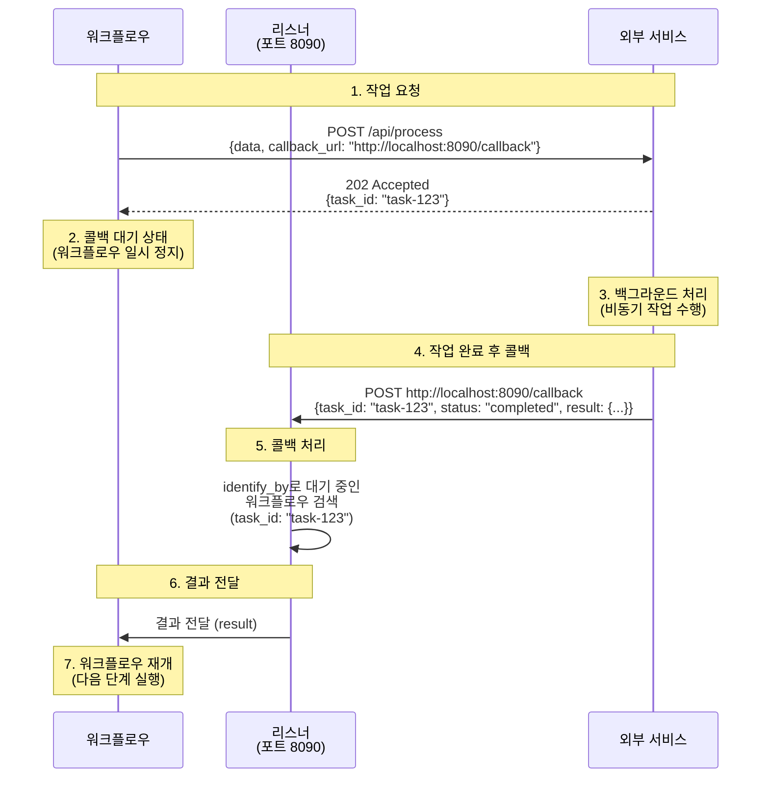
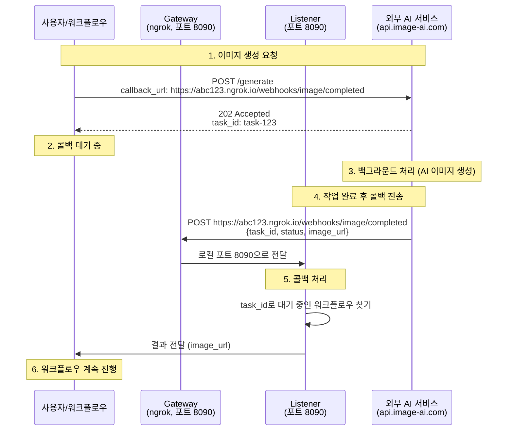

# 13. 시스템 통합

이 장에서는 외부 시스템과 통합하기 위한 리스너와 게이트웨이 기능을 다룹니다.

---

## 13.1 리스너 - 비동기 콜백

리스너는 외부 시스템으로부터 비동기 콜백을 받기 위한 HTTP 서버입니다. 작업 완료 후 결과를 콜백 URL로 전송하는 외부 서비스와 통합할 때 유용합니다.

### 13.1.1 리스너 개요

많은 외부 서비스는 즉시 결과를 반환하지 않고, 작업을 큐에 넣고 나중에 콜백 URL로 결과를 전송합니다:

1. 클라이언트가 외부 서비스에 작업 요청 (콜백 URL 포함)
2. 외부 서비스가 작업 ID 즉시 반환
3. 외부 서비스가 백그라운드에서 작업 처리
4. 작업 완료 후 콜백 URL로 결과 전송
5. 리스너가 콜백을 받아 대기 중인 요청에 결과 전달

### 13.1.2 HTTP 콜백 리스너 기본 설정

**간단한 콜백 리스너:**

```yaml
listener:
  type: http-callback
  host: 0.0.0.0
  port: 8090
  path: /callback
  method: POST
```

이 설정은 `http://0.0.0.0:8090/callback` 엔드포인트를 생성하여 POST 요청을 받습니다.

### 13.1.3 콜백 엔드포인트 설정

**단일 콜백 엔드포인트:**

```yaml
listener:
  type: http-callback
  host: 0.0.0.0
  port: 8090
  path: /webhook/completed           # 콜백 경로
  method: POST                       # HTTP 메서드
  identify_by: ${body.task_id}       # 작업 식별자
  status: ${body.status}             # 상태 필드
  success_when:                      # 성공 상태 값
    - "completed"
    - "success"
  fail_when:                         # 실패 상태 값
    - "failed"
    - "error"
  result: ${body.result}             # 결과 추출 경로
```

**다중 콜백 엔드포인트:**

```yaml
listener:
  type: http-callback
  host: 0.0.0.0
  port: 8090
  base_path: /webhooks                # 공통 베이스 경로
  callbacks:
    # 이미지 생성 완료 콜백
    - path: /image/completed
      method: POST
      identify_by: ${body.request_id}
      status: ${body.status}
      success_when: ["completed"]
      fail_when: ["failed"]
      result: ${body.image_url}

    # 비디오 처리 완료 콜백
    - path: /video/completed
      method: POST
      identify_by: ${body.task_id}
      status: ${body.state}
      success_when: ["done"]
      fail_when: ["error", "timeout"]
      result: ${body.output}

    # 일반 작업 완료 콜백
    - path: /task/callback
      method: POST
      identify_by: ${body.id}
      result: ${body.data}
```

### 13.1.4 콜백 필드 설명

| 필드 | 설명 | 필수 | 기본값 |
|------|------|------|--------|
| `path` | 콜백 엔드포인트 경로 | 예 | - |
| `method` | HTTP 메서드 | 아니오 | `POST` |
| `identify_by` | 작업 식별 필드 경로 | 아니오 | `__callback__` |
| `status` | 상태 확인 필드 경로 | 아니오 | - |
| `success_when` | 성공 상태 값 목록 | 아니오 | - |
| `fail_when` | 실패 상태 값 목록 | 아니오 | - |
| `result` | 결과 추출 필드 경로 | 아니오 | 전체 body |
| `bulk` | 단일 요청에 여러 항목 처리 | 아니오 | `false` |
| `item` | bulk 모드에서 항목 추출 경로 | 아니오 | - |

### 13.1.5 벌크(Bulk) 콜백 처리

여러 작업의 결과를 하나의 콜백 요청으로 받는 경우:

```yaml
listener:
  type: http-callback
  host: 0.0.0.0
  port: 8090
  path: /batch/completed
  method: POST
  bulk: true                          # 벌크 모드 활성화
  item: ${body.results}               # 결과 배열 경로
  identify_by: ${item.task_id}        # 각 항목의 식별자
  status: ${item.status}
  success_when: ["completed"]
  result: ${item.data}
```

콜백 요청 예시:
```json
{
  "results": [
    {
      "task_id": "task-1",
      "status": "completed",
      "data": {"url": "https://example.com/result1.png"}
    },
    {
      "task_id": "task-2",
      "status": "completed",
      "data": {"url": "https://example.com/result2.png"}
    }
  ]
}
```

### 13.1.6 리스너 고급 설정

**동시 실행 제어:**

```yaml
listener:
  type: http-callback
  host: 0.0.0.0
  port: 8090
  max_concurrent_count: 10            # 최대 동시 콜백 처리 수
  path: /callback
  method: POST
```

**런타임 설정:**

```yaml
listener:
  type: http-callback
  runtime: native                     # 또는 docker
  host: 0.0.0.0
  port: 8090
  path: /callback
```

### 13.1.7 리스너 작동 원리

리스너는 외부 서비스로부터 콜백을 받아 대기 중인 워크플로우에 결과를 전달합니다.

**기본 구조:**

```yaml
listener:
  type: http-callback
  host: 0.0.0.0
  port: 8090
  path: /callback
  identify_by: ${body.task_id}        # 어떤 워크플로우인지 식별
  result: ${body.result}              # 결과 추출
```

**워크플로우 실행 흐름:**



**단계별 설명:**

1. **워크플로우 시작**: 외부 서비스에 요청 전송 (콜백 URL 포함)
2. **즉시 응답**: 외부 서비스가 작업 ID 반환
3. **대기 상태**: 워크플로우는 콜백을 기다리며 일시 정지
4. **백그라운드 처리**: 외부 서비스가 비동기로 작업 수행
5. **콜백 전송**: 작업 완료 후 콜백 URL로 결과 전송
6. **리스너 수신**: 리스너가 콜백 수신하여 `identify_by`로 워크플로우 찾기
7. **워크플로우 재개**: 결과를 워크플로우에 전달하고 다음 단계 실행

**중요**: 리스너는 로컬 포트에서만 실행되므로, 외부에서 접근하려면 **게이트웨이**(13.2절)가 필요합니다. 게이트웨이와 함께 사용하는 완전한 예제는 **13.3절**에서 다룹니다.

### 13.1.8 콜백 데이터 매핑

리스너는 콜백 요청의 다양한 필드를 추출하고 매핑할 수 있습니다.

**단일 필드 추출:**

```yaml
listener:
  path: /webhook
  identify_by: ${body.task_id}
  result: ${body.output.url}          # 중첩된 필드 접근
```

**여러 필드 추출:**

```yaml
listener:
  path: /webhook
  identify_by: ${body.task_id}
  result:
    url: ${body.output.url}
    width: ${body.output.width}
    height: ${body.output.height}
    size: ${body.output.file_size}
```

**쿼리 파라미터 사용:**

```yaml
listener:
  path: /webhook
  identify_by: ${query.task_id}       # URL 쿼리에서 추출
  result: ${body}
```

콜백 요청 예시:
```
POST http://localhost:8090/webhook?task_id=task-123
Content-Type: application/json

{
  "status": "completed",
  "output": {
    "url": "https://example.com/result.png"
  }
}
```

---

## 13.2 게이트웨이 - HTTP 터널링

게이트웨이는 로컬에서 실행 중인 서비스를 인터넷에 공개하기 위한 터널링 서비스입니다. 개발 환경에서 웹훅을 테스트하거나 외부에서 로컬 서비스에 접근해야 할 때 유용합니다.

### 13.2.1 게이트웨이 개요

게이트웨이는 다음과 같은 상황에서 필요합니다:

- 로컬 개발 환경에서 외부 웹훅 테스트
- 방화벽 뒤의 서비스를 외부에 공개
- 임시 공개 URL이 필요한 경우
- 외부 서비스가 콜백 URL을 요구하는 경우

**지원 게이트웨이:**
- HTTP 터널: ngrok, Cloudflare Tunnel
- SSH 터널: SSH 리버스 터널

### 13.2.2 HTTP 터널 - ngrok

ngrok는 로컬 서버를 공개 URL로 노출하는 터널링 서비스입니다.

**기본 설정:**

```yaml
gateway:
  type: http-tunnel
  driver: ngrok
  port: 8080                          # 터널링할 로컬 포트
```

이 설정은 로컬 포트 8080을 ngrok 공개 URL로 노출합니다.

**전체 예제:**

```yaml
gateway:
  type: http-tunnel
  driver: ngrok
  port: 8090                          # 리스너 포트와 동일

listener:
  type: http-callback
  host: 0.0.0.0
  port: 8090
  path: /callback
  identify_by: ${body.task_id}
  result: ${body.result}

components:
  external-service:
    type: http-client
    base_url: https://api.external-service.com
    path: /process
    method: POST
    body:
      data: ${input.data}
      # gateway:8090.public_url을 사용하여 공개 URL 생성
      callback_url: ${gateway:8090.public_url}/callback
      callback_id: ${context.run_id}
    output: ${response}

workflow:
  title: External Service with Gateway
  jobs:
    - id: process
      component: external-service
      input: ${input}
      output: ${output}
```

실행 흐름:
1. 게이트웨이 시작: ngrok가 로컬 포트 8090을 공개 URL로 노출 (예: `https://abc123.ngrok.io`)
2. 리스너 시작: 포트 8090에서 콜백 대기
3. 워크플로우 실행: `${gateway:8090.public_url}`이 `https://abc123.ngrok.io`로 치환됨
4. 외부 서비스에 `https://abc123.ngrok.io/callback` 콜백 URL 전달
5. 외부 서비스가 작업 완료 후 공개 URL로 콜백 전송
6. ngrok가 요청을 로컬 포트 8090으로 전달
7. 리스너가 콜백 수신 후 워크플로우에 결과 전달

### 13.2.3 HTTP 터널 - Cloudflare

Cloudflare Tunnel은 무료로 사용할 수 있는 안정적인 터널링 서비스입니다.

**기본 설정:**

```yaml
gateway:
  type: http-tunnel
  driver: cloudflare
  port: 8080
```

**ngrok vs Cloudflare 비교:**

| 특징 | ngrok | Cloudflare |
|------|-------|------------|
| 무료 플랜 | 제한적 (시간당 요청 수 제한) | 무제한 |
| 설정 난이도 | 쉬움 | 중간 (계정 필요) |
| URL 형식 | `https://random.ngrok.io` | `https://random.trycloudflare.com` |
| 안정성 | 높음 | 매우 높음 |
| 속도 | 빠름 | 매우 빠름 |

### 13.2.4 SSH 터널

SSH 리버스 터널을 사용하여 원격 서버를 통해 로컬 서비스를 공개합니다.

**SSH 키 인증:**

```yaml
gateway:
  type: ssh-tunnel
  port: 8080
  connection:
    host: remote-server.com
    port: 22
    auth:
      type: keyfile
      username: user
      keyfile: ~/.ssh/id_rsa
```

**SSH 비밀번호 인증:**

```yaml
gateway:
  type: ssh-tunnel
  port: 8080
  connection:
    host: remote-server.com
    port: 22
    auth:
      type: password
      username: user
      password: ${env.SSH_PASSWORD}
```

SSH 터널은 다음과 같은 경우에 유용합니다:
- 자체 도메인을 사용하고 싶을 때
- 방화벽이 ngrok/Cloudflare를 차단할 때
- 기업 환경에서 승인된 서버만 사용해야 할 때

### 13.2.5 게이트웨이 고급 설정

**런타임 설정:**

```yaml
gateway:
  type: http-tunnel
  driver: ngrok
  runtime: native                     # 또는 docker
  port: 8080
```

**게이트웨이 변수 사용:**

게이트웨이가 설정되면 다음 변수를 사용할 수 있습니다:

```yaml
gateway:
  type: http-tunnel
  driver: ngrok
  port: 8080

components:
  service:
    type: http-client
    body:
      # 공개 URL 사용 (gateway:포트.public_url 형식)
      webhook_url: ${gateway:8080.public_url}/webhook

      # 포트 정보
      local_port: ${gateway:8080.port}
```

### 13.2.6 실전 예제: Slack 봇 웹훅

```yaml
gateway:
  type: http-tunnel
  driver: cloudflare
  port: 8090                          # 리스너 포트와 동일

listener:
  type: http-callback
  host: 0.0.0.0
  port: 8090
  base_path: /slack
  callbacks:
    - path: /events
      method: POST
      identify_by: ${body.event.client_msg_id}
      result: ${body.event}

components:
  slack-responder:
    type: http-client
    base_url: https://slack.com/api
    path: /chat.postMessage
    method: POST
    headers:
      Authorization: Bearer ${env.SLACK_BOT_TOKEN}
      Content-Type: application/json
    body:
      channel: ${input.channel}
      text: ${input.text}
    output: ${response}

workflow:
  title: Slack Event Handler
  jobs:
    - id: respond
      component: slack-responder
      input:
        channel: ${input.event.channel}
        text: "처리 완료: ${input.event.text}"
      output: ${output}
```

Slack 앱 설정:
1. Slack 앱 생성 (https://api.slack.com/apps)
2. `model-compose up` 실행 후 게이트웨이 로그에서 공개 URL 확인
3. Event Subscriptions 활성화
4. Request URL에 게이트웨이 공개 URL + 리스너 경로 입력 (예: `https://abc123.trycloudflare.com/slack/events`)
5. 봇 토큰 발급 및 `SLACK_BOT_TOKEN` 환경 변수 설정

---

## 13.3 리스너와 게이트웨이 함께 사용

리스너와 게이트웨이를 함께 사용하면 로컬 환경에서도 외부 웹훅을 안전하게 테스트할 수 있습니다.

### 13.3.1 통합 예제: 비동기 이미지 처리

```yaml
gateway:
  type: http-tunnel
  driver: ngrok
  port: 8090                          # 리스너 포트와 동일

listener:
  type: http-callback
  host: 0.0.0.0
  port: 8090
  base_path: /webhooks
  max_concurrent_count: 5
  callbacks:
    - path: /image/completed
      method: POST
      identify_by: ${body.task_id}
      status: ${body.status}
      success_when: ["completed", "success"]
      fail_when: ["failed", "error"]
      result:
        url: ${body.output.url}
        width: ${body.output.width}
        height: ${body.output.height}

components:
  image-generator:
    type: http-client
    base_url: https://api.image-ai.com/v1
    path: /generate
    method: POST
    headers:
      Authorization: Bearer ${env.IMAGE_AI_KEY}
    body:
      prompt: ${input.prompt}
      size: ${input.size | "1024x1024"}
      # 게이트웨이 공개 URL + 리스너 경로
      callback_url: ${gateway:8090.public_url}/webhooks/image/completed
      task_id: ${context.run_id}
    output:
      task_id: ${response.task_id}
      status: ${response.status}

  image-optimizer:
    type: http-client
    base_url: https://api.imageoptim.com
    path: /optimize
    method: POST
    headers:
      Authorization: Bearer ${env.IMAGEOPTIM_KEY}
    body:
      url: ${input.url}
      quality: 85
    output:
      optimized_url: ${response.url}
      original_size: ${response.original_size}
      compressed_size: ${response.compressed_size}

workflow:
  title: Image Generation and Optimization
  description: Generate image with AI and optimize it
  jobs:
    # 1단계: AI 이미지 생성 (비동기)
    - id: generate
      component: image-generator
      input:
        prompt: ${input.prompt}
        size: ${input.size}
      output:
        task_id: ${output.task_id}
        image_url: ${output.url}        # 콜백에서 받은 URL
        width: ${output.width}
        height: ${output.height}

    # 2단계: 이미지 최적화 (동기)
    - id: optimize
      component: image-optimizer
      input:
        url: ${jobs.generate.output.image_url}
      output:
        final_url: ${output.optimized_url}
        original_size: ${output.original_size}
        compressed_size: ${output.compressed_size}
        savings: ${output.original_size - output.compressed_size}
```

### 13.3.2 아키텍처 다이어그램



**흐름 설명:**

1. **요청 단계**: 워크플로우가 외부 AI 서비스에 이미지 생성 요청 (게이트웨이 공개 URL을 콜백 URL로 전달)
2. **대기 단계**: 워크플로우는 콜백을 받을 때까지 대기
3. **처리 단계**: 외부 서비스가 백그라운드에서 이미지 생성
4. **콜백 단계**: 완료 후 게이트웨이 공개 URL로 콜백 전송 → 게이트웨이가 로컬 리스너로 전달
5. **매칭 단계**: 리스너가 task_id로 대기 중인 워크플로우 찾기
6. **완료 단계**: 워크플로우에 결과 전달 및 다음 단계 진행

### 13.3.3 프로덕션 환경 고려사항

**로컬 개발:**
```yaml
gateway:
  type: http-tunnel
  driver: ngrok                       # 개발 중에는 ngrok 사용
  port: 8080

listener:
  host: 0.0.0.0
  port: 8090
```

**프로덕션 환경:**
```yaml
# gateway 설정 제거 (공인 IP/도메인 사용)

controller:
  type: http-server
  host: 0.0.0.0
  port: 443                           # HTTPS
  # SSL 설정 추가

listener:
  host: 0.0.0.0
  port: 8090

components:
  service:
    body:
      # 프로덕션 도메인 사용
      callback_url: https://api.yourdomain.com/webhooks/callback
      callback_id: ${listener.id}
```

---

## 13.4 시스템 통합 모범 사례

### 1. 리스너 보안

**타임아웃 설정:**

비동기 작업이 무한정 대기하지 않도록 타임아웃을 설정하세요:

```yaml
components:
  service:
    type: http-client
    timeout: 300000                   # 5분 타임아웃
    body:
      callback_url: ${listener.url}
```

**서명 검증:**

콜백 요청의 진위를 확인하기 위해 서명을 검증하세요:

```yaml
listener:
  callbacks:
    - path: /webhook
      # 서명 검증은 커스텀 로직으로 구현 필요
      identify_by: ${body.id}
      # 헤더의 서명 확인: ${header.X-Signature}
```

### 2. 게이트웨이 사용

**개발 환경에서만 사용:**

게이트웨이는 주로 개발/테스트 환경에서 사용하세요. 프로덕션에서는 공인 IP/도메인을 사용하는 것이 좋습니다.

**무료 플랜 제약:**

- ngrok 무료 플랜: 동시 연결 수 제한, 시간당 요청 수 제한
- Cloudflare: 무료 플랜은 제한 없음

### 3. 에러 처리

**콜백 실패 처리:**

```yaml
workflow:
  jobs:
    - id: async-task
      component: async-service
      input: ${input}
      on_error:
        - id: retry
          component: async-service
          input: ${input}
          retry:
            max_attempts: 3
            delay: 5000
```

**재시도 로직:**

외부 서비스가 콜백 전송에 실패할 수 있으므로 재시도 로직을 구현하세요.

### 4. 로깅 및 모니터링

**콜백 로깅:**

디버깅과 문제 해결을 위해 콜백 요청의 모든 정보를 저장합니다:

```yaml
listener:
  callbacks:
    - path: /webhook
      identify_by: ${body.task_id}
      result:
        task_id: ${body.task_id}         # 작업 식별자
        status: ${body.status}           # 작업 상태
        timestamp: ${body.timestamp}     # 콜백 수신 시간
        data: ${body}                    # 전체 페이로드 저장 (디버깅용)
```

이렇게 저장된 정보는 다음과 같은 목적으로 활용됩니다:
- 콜백 실패 시 원인 분석
- 외부 서비스 응답 시간 모니터링
- 데이터 무결성 검증
- 감사(audit) 로그 생성

**워크플로우 실행 추적:**

각 워크플로우 실행의 전체 흐름을 추적합니다:

```yaml
workflow:
  jobs:
    - id: request
      component: external-api
      input: ${input}
      output:
        request_time: ${context.timestamp}
        task_id: ${output.task_id}

    - id: log-request
      component: logger
      input:
        level: info
        message: "작업 요청: task_id=${jobs.request.output.task_id}"
        data: ${jobs.request.output}

    # 콜백 대기 및 결과 수신

    - id: log-result
      component: logger
      input:
        level: info
        message: "작업 완료: task_id=${jobs.request.output.task_id}"
        data: ${output}
```

**게이트웨이 URL 확인:**

게이트웨이 시작 후 공개 URL을 확인하고 기록합니다:

```bash
model-compose up
# 로그에서 게이트웨이 URL 확인
# [Gateway] Public URL: https://abc123.ngrok.io

# 공개 URL을 외부 서비스에 등록
# 예: Slack Event Subscriptions, GitHub Webhooks 등
```

게이트웨이가 시작될 때마다 새로운 URL이 생성될 수 있으므로, 자동화된 배포 스크립트에서 URL을 추출하여 외부 서비스에 자동 등록하는 것을 권장합니다.

**성능 메트릭 수집:**

```yaml
listener:
  callbacks:
    - path: /webhook
      identify_by: ${body.task_id}
      result:
        task_id: ${body.task_id}                        # 작업 ID
        result: ${body.result}                          # 실제 결과 데이터
        metrics:
          processing_time: ${body.processing_time_ms}   # 실제 처리 시간 (ms)
          queue_time: ${body.queue_time_ms}             # 큐 대기 시간 (ms)
```

이 메트릭을 사용하여:
- 외부 서비스의 평균 처리 시간 계산
- 성능 저하 감지 및 알림
- SLA(Service Level Agreement) 준수 모니터링

---

## 다음 단계

실습해보세요:
- 외부 비동기 API 통합
- 로컬 환경에서 웹훅 테스트
- Slack/Discord 봇 개발
- 결제 게이트웨이 웹훅 처리

---

**다음 장**: [14. 배포](./14-deployment.md)
