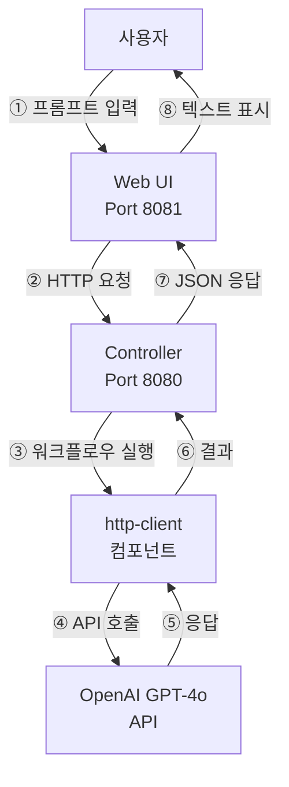
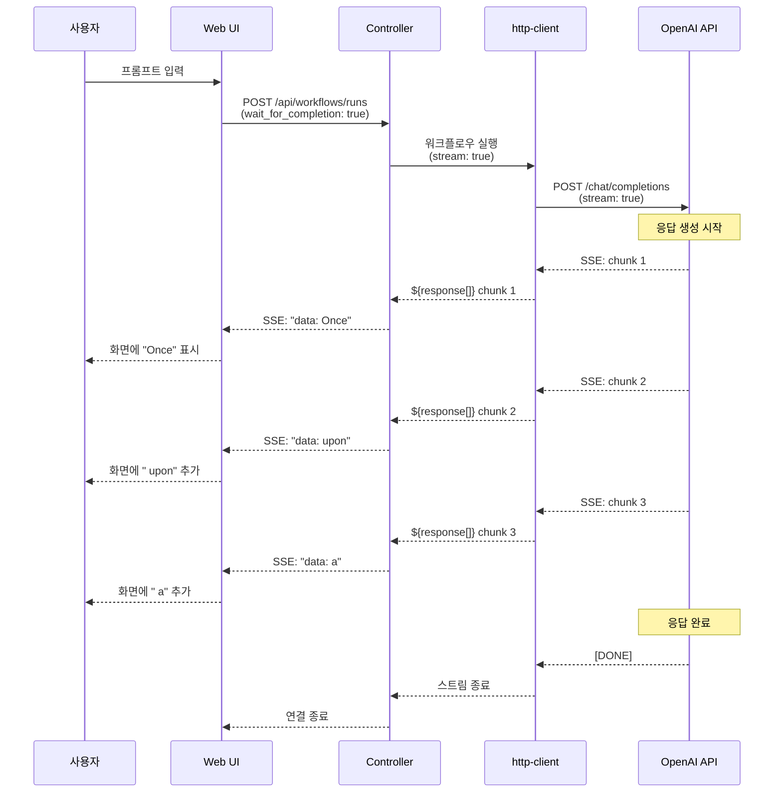
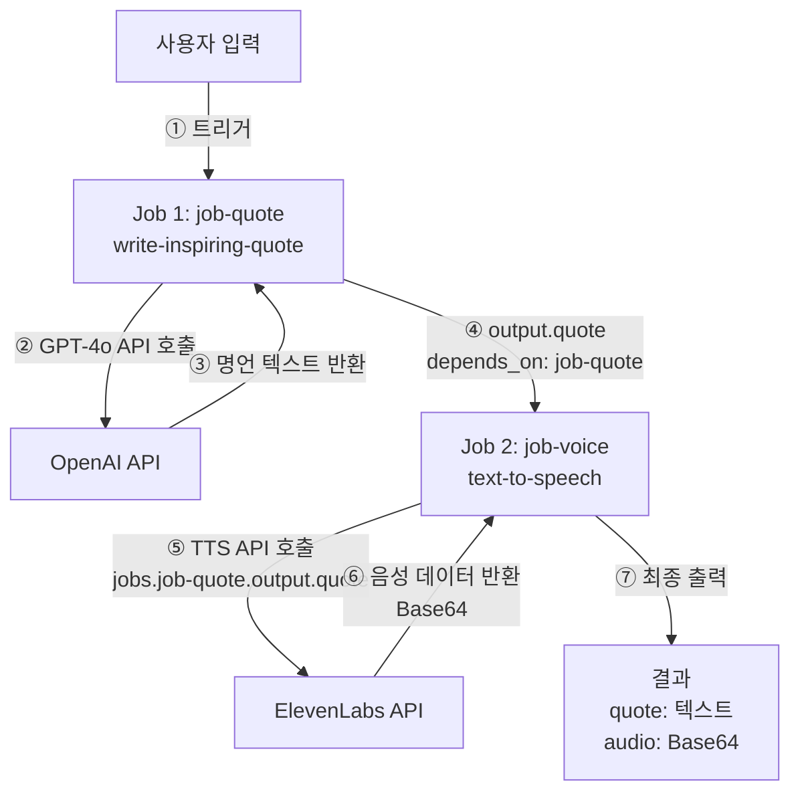
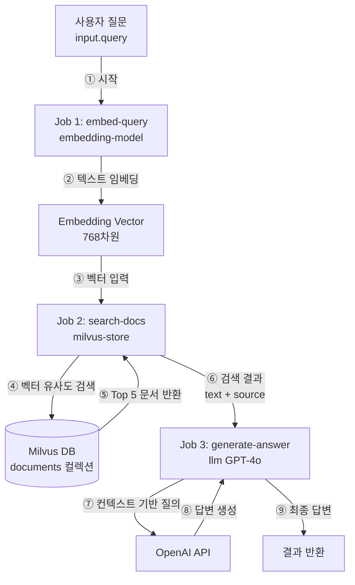
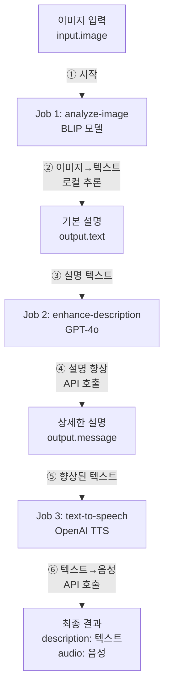
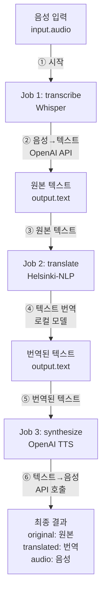

# 15. 실전 예제

이 장에서는 model-compose를 활용한 실제 사용 사례를 단계별로 설명합니다. 각 예제는 완전한 구성과 실행 방법을 포함합니다.

---

## 15.1 챗봇 구축

### 15.1.1 OpenAI GPT-4o 챗봇

**목표**: OpenAI GPT-4o를 사용한 간단한 대화형 챗봇 구축

**아키텍처 다이어그램**:



**구성 파일** (`model-compose.yml`):

```yaml
controller:
  type: http-server
  port: 8080
  base_path: /api
  webui:
    driver: gradio
    port: 8081

workflow:
  title: Chat with OpenAI GPT-4o
  description: Generate text responses using OpenAI's GPT-4o
  input: ${input}
  output: ${output}

component:
  type: http-client
  base_url: https://api.openai.com/v1
  action:
    path: /chat/completions
    method: POST
    headers:
      Authorization: Bearer ${env.OPENAI_API_KEY}
      Content-Type: application/json
    body:
      model: gpt-4o
      messages:
        - role: user
          content: ${input.prompt as text}
      temperature: ${input.temperature as number | 0.7}
    output:
      message: ${response.choices[0].message.content}
```

**환경 변수 설정** (`.env`):

```bash
OPENAI_API_KEY=sk-...
```

**실행 방법**:

```bash
# 컨트롤러 시작
model-compose up

# Web UI 접속
# http://localhost:8081
```

**주요 기능**:
- Gradio Web UI 자동 생성
- 온도(temperature) 파라미터 조정 가능
- 실시간 응답 표시

### 15.1.2 스트리밍 챗봇

**목표**: 실시간 타이핑 효과를 가진 스트리밍 챗봇

**구성 파일**:

```yaml
controller:
  type: http-server
  port: 8080
  webui:
    driver: gradio
    port: 8081

workflow:
  title: Streaming Chat
  output: ${output as text;sse-text}

component:
  type: http-client
  base_url: https://api.openai.com/v1
  action:
    path: /chat/completions
    method: POST
    headers:
      Authorization: Bearer ${env.OPENAI_API_KEY}
    body:
      model: gpt-4o
      messages:
        - role: user
          content: ${input.prompt as text}
      stream: true
    stream_format: json
    output: ${response[].choices[0].delta.content}
```

**특징**:
- SSE 프로토콜을 사용한 실시간 스트리밍
- Gradio에서 자동으로 타이핑 효과 적용
- 긴 응답에 대한 즉각적인 피드백

**스트리밍 흐름 다이어그램**:



---

## 15.2 음성 생성 파이프라인

### 15.2.1 텍스트를 음성으로 변환 (OpenAI TTS)

**목표**: OpenAI TTS API를 사용하여 텍스트를 음성으로 변환

**구성 파일**:

```yaml
controller:
  type: http-server
  port: 8080
  base_path: /api
  webui:
    driver: gradio
    port: 8081

workflow:
  title: Generate Speech with OpenAI TTS
  description: Convert input text into natural-sounding speech using OpenAI's TTS models.
  jobs:
    - id: speak
      component: openai-text-to-speech
      input: ${input}
      output: ${output as audio}

components:
  - id: openai-text-to-speech
    type: http-client
    action:
      endpoint: https://api.openai.com/v1/audio/speech
      method: POST
      headers:
        Authorization: Bearer ${env.OPENAI_API_KEY}
        Content-Type: application/json
      body:
        model: ${input.model as select/tts-1,tts-1-hd,gpt-4o-mini-tts | tts-1}
        input: ${input.text}
        voice: ${input.voice as select/alloy,ash,ballad,coral,echo,fable,onyx,nova,sage,shimmer,verse | nova}
        response_format: mp3
      output: ${response}
```

**지원 음성**:
- `alloy`, `ash`, `ballad`, `coral`, `echo`, `fable`
- `onyx`, `nova`, `sage`, `shimmer`, `verse`

**지원 모델**:
- `tts-1`: 빠른 응답
- `tts-1-hd`: 고품질 음성
- `gpt-4o-mini-tts`: 최신 모델

### 15.2.2 영감을 주는 명언 음성 생성

**목표**: GPT-4o로 명언 생성 후 ElevenLabs TTS로 음성 변환

**구성 파일**:

```yaml
controller:
  type: http-server
  port: 8080
  base_path: /api
  webui:
    driver: gradio
    port: 8081

workflow:
  title: Inspire with Voice
  description: Generate a motivational quote using GPT-4o and bring it to life by converting it into natural speech with ElevenLabs TTS.
  jobs:
    - id: job-quote
      component: write-inspiring-quote
      input: ${input}
      output: ${output}

    - id: job-voice
      component: text-to-speech
      input:
        text: ${jobs.job-quote.output.quote}
        voice_id: ${input.voice_id | JBFqnCBsd6RMkjVDRZzb}
      output:
        quote: ${jobs.job-quote.output.quote}
        audio: ${output as audio/mp3;base64}
      depends_on: [ job-quote ]

components:
  - id: write-inspiring-quote
    type: http-client
    base_url: https://api.openai.com/v1
    action:
      path: /chat/completions
      method: POST
      headers:
        Authorization: Bearer ${env.OPENAI_API_KEY}
        Content-Type: application/json
      body:
        model: gpt-4o
        messages:
          - role: user
            content: |
              Write an inspiring quote similar to the example below.
              Don't say anything else—just give me the quote.
              Aim for around 30 words.
              Example – Never give up. If there's something you want to become, be proud of it. Give yourself a chance.
              Don't think you're worthless—there's nothing to gain from that. Aim high. That's how life should be lived.
      output:
        quote: ${response.choices[0].message.content}

  - id: text-to-speech
    type: http-client
    action:
      endpoint: https://api.elevenlabs.io/v1/text-to-speech/${input.voice_id}?output_format=mp3_44100_128
      method: POST
      headers:
        Content-Type: application/json
        xi-api-key: ${env.ELEVENLABS_API_KEY}
      body:
        text: ${input.text}
        model_id: eleven_multilingual_v2
      output: ${response as base64}
```

**환경 변수**:

```bash
OPENAI_API_KEY=sk-...
ELEVENLABS_API_KEY=...
```

**워크플로우 설명**:
1. GPT-4o가 영감을 주는 명언 생성
2. ElevenLabs API가 명언을 음성으로 변환
3. Web UI에서 텍스트와 오디오 모두 표시

**워크플로우 다이어그램**:



---

## 15.3 이미지 분석 및 편집

### 15.3.1 이미지 캡셔닝 (Image-to-Text)

**목표**: 로컬 Vision 모델을 사용하여 이미지 설명 생성

**구성 파일**:

```yaml
controller:
  type: http-server
  port: 8080
  base_path: /api
  webui:
    driver: gradio
    port: 8081

workflow:
  title: Generate Text from Image
  description: Generate text based on a given image using a pretrained vision model.
  input: ${input}
  output:
    generated: ${output}

component:
  type: model
  task: image-to-text
  model: Salesforce/blip-image-captioning-large
  architecture: blip
  action:
    image: ${input.image as image}
    prompt: ${input.prompt as text}
```

**실행 예제**:

```bash
# 워크플로우 실행
model-compose run default --input '{"image": "path/to/image.jpg", "prompt": "Describe this image"}'
```

**지원 모델**:
- `Salesforce/blip-image-captioning-large`
- `Salesforce/blip-image-captioning-base`
- `nlpconnect/vit-gpt2-image-captioning`

### 15.3.2 이미지 편집 (OpenAI DALL-E)

**목표**: OpenAI DALL-E를 사용하여 이미지 편집

**구성 파일**:

```yaml
controller:
  type: http-server
  port: 8080
  webui:
    driver: gradio
    port: 8081

workflow:
  title: Edit Image with DALL-E
  description: Edit an existing image using OpenAI's DALL-E API
  component: dalle-edit
  input: ${input}
  output: ${output as image}

component:
  id: dalle-edit
  type: http-client
  action:
    endpoint: https://api.openai.com/v1/images/edits
    method: POST
    headers:
      Authorization: Bearer ${env.OPENAI_API_KEY}
    body:
      image: ${input.image as image}
      mask: ${input.mask as image}
      prompt: ${input.prompt as text}
      n: ${input.n as integer | 1}
      size: ${input.size as select/256x256,512x512,1024x1024 | 1024x1024}
    output: ${response.data[0].url}
```

**사용 시나리오**:
- 이미지 배경 변경
- 특정 영역 수정
- 스타일 변환

---

## 15.4 RAG 시스템 (벡터 DB 활용)

### 15.4.1 ChromaDB를 사용한 텍스트 임베딩 검색

**목표**: 텍스트 임베딩을 생성하고 ChromaDB에 저장한 후 유사도 검색

**구성 파일**:

```yaml
controller:
  type: http-server
  port: 8080
  base_path: /api
  webui:
    driver: gradio
    port: 8081

workflows:
  - id: insert-sentence-embedding
    title: Insert Text Embedding
    description: Generate text embedding and insert it into ChromaDB vector store
    jobs:
      - id: embedding-sentence
        component: embedding-model
        input: ${input}
        output: ${output}

      - id: insert-embedding
        component: vector-store
        action: insert
        input:
          vector: ${jobs.embedding-sentence.output}
          metadata: ${input}
        output: ${output as json}
        depends_on: [ embedding-sentence ]

  - id: search-sentence-embeddings
    title: Search Similar Embeddings
    description: Generate query embedding and search for similar vectors in ChromaDB
    jobs:
      - id: embedding-sentence
        component: embedding-model
        input: ${input}
        output: ${output}

      - id: search-embeddings
        component: vector-store
        action: search
        input:
          vector: ${jobs.embedding-sentence.output}
        output: ${output as object[]/id,score,metadata.text}
        depends_on: [ embedding-sentence ]

  - id: delete-sentence-embedding
    title: Delete Text Embedding
    description: Remove a specific vector from the ChromaDB collection
    component: vector-store
    action: delete
    input: ${input}
    output: ${output as json}

components:
  - id: vector-store
    type: vector-store
    driver: chroma
    actions:
      - id: insert
        collection: test
        method: insert
        vector: ${input.vector}
        metadata: ${input.metadata}

      - id: search
        collection: test
        method: search
        query: ${input.vector}
        output_fields: [ text ]

      - id: delete
        collection: test
        method: delete
        vector_id: ${input.vector_id}

  - id: embedding-model
    type: model
    task: text-embedding
    model: sentence-transformers/all-MiniLM-L6-v2
    action:
      text: ${input.text}
```

**API 사용 예제**:

```bash
# 1. 텍스트 삽입
curl -X POST http://localhost:8080/api/workflows/insert-sentence-embedding/runs \
  -H "Content-Type: application/json" \
  -d '{"input": {"text": "model-compose is a declarative AI orchestrator"}}'

# 2. 유사 텍스트 검색
curl -X POST http://localhost:8080/api/workflows/search-sentence-embeddings/runs \
  -H "Content-Type: application/json" \
  -d '{"input": {"text": "AI workflow tool"}}'

# 3. 삭제
curl -X POST http://localhost:8080/api/workflows/delete-sentence-embedding/runs \
  -H "Content-Type: application/json" \
  -d '{"input": {"vector_id": "id123"}}'
```

### 15.4.2 Milvus를 사용한 RAG 시스템

**목표**: Milvus 벡터 데이터베이스를 사용한 고성능 RAG 시스템

**구성 파일**:

```yaml
controller:
  type: http-server
  port: 8080

workflows:
  - id: rag-query
    title: RAG Query
    description: Retrieve relevant documents and generate answer
    jobs:
      - id: embed-query
        component: embedding-model
        input:
          text: ${input.query}
        output: ${output}

      - id: search-docs
        component: milvus-store
        action: search
        input:
          vector: ${jobs.embed-query.output}
        output: ${output}
        depends_on: [ embed-query ]

      - id: generate-answer
        component: llm
        input:
          context: ${jobs.search-docs.output}
          query: ${input.query}
        output: ${output}
        depends_on: [ search-docs ]

components:
  - id: embedding-model
    type: model
    task: text-embedding
    model: sentence-transformers/all-MiniLM-L6-v2
    action:
      text: ${input.text}

  - id: milvus-store
    type: vector-store
    driver: milvus
    host: localhost
    port: 19530
    actions:
      - id: search
        collection: documents
        method: search
        query: ${input.vector}
        top_k: 5
        output_fields: [ text, source ]

  - id: llm
    type: http-client
    base_url: https://api.openai.com/v1
    action:
      path: /chat/completions
      method: POST
      headers:
        Authorization: Bearer ${env.OPENAI_API_KEY}
      body:
        model: gpt-4o
        messages:
          - role: system
            content: Answer based on the following context: ${input.context}
          - role: user
            content: ${input.query}
      output: ${response.choices[0].message.content}
```

**특징**:
- 3단계 파이프라인: 임베딩 → 검색 → 생성
- Milvus 고성능 벡터 검색
- GPT-4o를 사용한 컨텍스트 기반 답변 생성

**RAG 파이프라인 다이어그램**:



---

## 15.5 Slack 봇 (MCP)

### 15.5.1 MCP 서버로 Slack 봇 구축

**목표**: MCP(Model Context Protocol) 서버를 사용하여 Slack 봇 구축

**구성 파일**:

```yaml
controller:
  type: mcp-server
  base_path: /mcp
  port: 8080
  webui:
    driver: gradio
    port: 8081

workflows:
  - id: send-message
    title: Send Message to Slack Channel
    description: Send a text message to a specified Slack channel using the Slack Web API
    action: chat-post-message
    input:
      channel: ${input.channel | ${env.DEFAULT_SLACK_CHANNEL_ID} @(description Slack channel ID for sending a message)}
      text: ${input.message @(description Message to send to Slack)}
    output: ${output as json}

  - id: list-channels
    title: List Slack Channels
    description: Retrieve a list of all available channels in the Slack workspace
    action: conversations-list
    output: ${output as object[]}

  - id: join-channel
    title: Join Slack Channel
    description: Join a specified Slack channel for the bot user
    action: conversations-join
    input:
      channel: ${input.channel | ${env.DEFAULT_SLACK_CHANNEL_ID}}
    output: ${output as json}

component:
  type: http-client
  base_url: https://slack.com/api
  headers:
    Authorization: Bearer ${env.SLACK_APP_TOKEN}
  actions:
    - id: chat-post-message
      path: /chat.postMessage
      method: POST
      body:
        channel: ${input.channel}
        text: ${input.text}
        attachments: ${input.attachments}
      headers:
        Content-Type: application/json
      output: ${response}

    - id: conversations-list
      path: /conversations.list
      method: GET
      params:
        limit: ${input.limit as integer | 200 @(description Maximum number of channels to retrieve)}
      headers:
        Content-Type: application/x-www-form-urlencoded
      output: ${response.channels as object[]/id,name}

    - id: conversations-join
      path: /conversations.join
      method: POST
      body:
        channel: ${input.channel}
      headers:
        Content-Type: application/json
      output: ${response}
```

**환경 변수**:

```bash
SLACK_APP_TOKEN=xoxb-...
DEFAULT_SLACK_CHANNEL_ID=C...
```

**MCP 서버 특징**:
- Claude Desktop 등의 MCP 클라이언트와 연동
- 여러 워크플로우를 도구(Tool)로 노출
- `@(description ...)` 어노테이션으로 파라미터 설명 제공

**Claude Desktop 설정** (`claude_desktop_config.json`):

```json
{
  "mcpServers": {
    "slack-bot": {
      "command": "npx",
      "args": [
        "-y",
        "@modelcontextprotocol/server-stdio",
        "http://localhost:8080/mcp"
      ]
    }
  }
}
```

### 15.5.2 AI 기반 Slack 자동 응답 봇

**목표**: Slack 메시지에 AI가 자동으로 응답하는 봇

**구성 파일**:

```yaml
controller:
  type: http-server
  port: 8080

listeners:
  - id: slack-events
    type: http-callback
    path: /slack/events
    method: POST
    callback:
      url: https://slack.com/api/chat.postMessage
      method: POST
      headers:
        Authorization: Bearer ${env.SLACK_BOT_TOKEN}
        Content-Type: application/json
      body:
        channel: ${webhook.event.channel}
        text: ${jobs.generate-reply.output.message}

gateway:
  type: ngrok
  port: 8080

workflow:
  title: AI Slack Reply
  jobs:
    - id: generate-reply
      component: gpt4o
      input:
        prompt: ${input.event.text}
      output: ${output}

component:
  id: gpt4o
  type: http-client
  base_url: https://api.openai.com/v1
  action:
    path: /chat/completions
    method: POST
    headers:
      Authorization: Bearer ${env.OPENAI_API_KEY}
    body:
      model: gpt-4o
      messages:
        - role: user
          content: ${input.prompt}
    output:
      message: ${response.choices[0].message.content}
```

**동작 흐름**:
1. Slack에서 메시지 이벤트 발생
2. ngrok 터널을 통해 워크플로우 트리거
3. GPT-4o가 응답 생성
4. 리스너 콜백이 Slack에 응답 전송

---

## 15.6 멀티모달 워크플로우

### 15.6.1 이미지 → 텍스트 → 음성 파이프라인

**목표**: 이미지를 분석하고 설명을 생성한 후 음성으로 변환

**구성 파일**:

```yaml
controller:
  type: http-server
  port: 8080
  webui:
    driver: gradio
    port: 8081

workflow:
  title: Image to Speech Pipeline
  description: Analyze image, generate description, and convert to speech
  jobs:
    - id: analyze-image
      component: image-analyzer
      input:
        image: ${input.image}
      output: ${output}

    - id: enhance-description
      component: gpt4o
      input:
        prompt: |
          Make this image description more engaging and detailed:
          ${jobs.analyze-image.output.text}
      output: ${output}
      depends_on: [ analyze-image ]

    - id: text-to-speech
      component: tts
      input:
        text: ${jobs.enhance-description.output.message}
      output:
        description: ${jobs.enhance-description.output.message}
        audio: ${output as audio}
      depends_on: [ enhance-description ]

components:
  - id: image-analyzer
    type: model
    task: image-to-text
    model: Salesforce/blip-image-captioning-large
    action:
      image: ${input.image as image}
      output:
        text: ${result}

  - id: gpt4o
    type: http-client
    base_url: https://api.openai.com/v1
    action:
      path: /chat/completions
      method: POST
      headers:
        Authorization: Bearer ${env.OPENAI_API_KEY}
      body:
        model: gpt-4o
        messages:
          - role: user
            content: ${input.prompt}
      output:
        message: ${response.choices[0].message.content}

  - id: tts
    type: http-client
    action:
      endpoint: https://api.openai.com/v1/audio/speech
      method: POST
      headers:
        Authorization: Bearer ${env.OPENAI_API_KEY}
      body:
        model: tts-1
        input: ${input.text}
        voice: nova
      output: ${response}
```

**3단계 파이프라인**:
1. **이미지 분석**: BLIP 모델이 이미지 설명 생성
2. **텍스트 향상**: GPT-4o가 설명을 더 자세하고 매력적으로 재작성
3. **음성 변환**: OpenAI TTS가 텍스트를 음성으로 변환

**멀티모달 파이프라인 다이어그램**:



### 15.6.2 음성 → 텍스트 → 번역 → 음성 파이프라인

**목표**: 음성을 다른 언어로 번역하여 음성으로 출력

**구성 파일**:

```yaml
controller:
  type: http-server
  port: 8080
  webui:
    driver: gradio
    port: 8081

workflow:
  title: Voice Translation Pipeline
  description: Transcribe audio, translate to target language, and synthesize speech
  jobs:
    - id: transcribe
      component: whisper
      input:
        audio: ${input.audio}
      output: ${output}

    - id: translate
      component: translator
      input:
        text: ${jobs.transcribe.output.text}
        target_lang: ${input.target_lang}
      output: ${output}
      depends_on: [ transcribe ]

    - id: synthesize
      component: tts
      input:
        text: ${jobs.translate.output.text}
      output:
        original: ${jobs.transcribe.output.text}
        translated: ${jobs.translate.output.text}
        audio: ${output as audio}
      depends_on: [ translate ]

components:
  - id: whisper
    type: http-client
    action:
      endpoint: https://api.openai.com/v1/audio/transcriptions
      method: POST
      headers:
        Authorization: Bearer ${env.OPENAI_API_KEY}
      body:
        file: ${input.audio as audio}
        model: whisper-1
      output:
        text: ${response.text}

  - id: translator
    type: model
    task: translation
    model: Helsinki-NLP/opus-mt-en-ko
    action:
      text: ${input.text as text}
      output:
        text: ${result}

  - id: tts
    type: http-client
    action:
      endpoint: https://api.openai.com/v1/audio/speech
      method: POST
      headers:
        Authorization: Bearer ${env.OPENAI_API_KEY}
      body:
        model: tts-1
        input: ${input.text}
        voice: nova
      output: ${response}
```

**4단계 파이프라인**:
1. **음성 인식**: Whisper가 음성을 텍스트로 변환
2. **번역**: Helsinki-NLP 모델이 텍스트 번역
3. **음성 합성**: OpenAI TTS가 번역된 텍스트를 음성으로 변환
4. **결과 출력**: 원본 텍스트, 번역 텍스트, 번역된 음성

**음성 번역 파이프라인 다이어그램**:



---

## 다음 단계

실습해보세요:
- 각 예제를 로컬에서 실행
- 예제를 수정하여 커스텀 워크플로우 구축
- 여러 예제를 조합하여 복잡한 파이프라인 구성
- 프로덕션 환경에 배포

---

**다음 장**: [16. 문제 해결](./16-troubleshooting.md)
