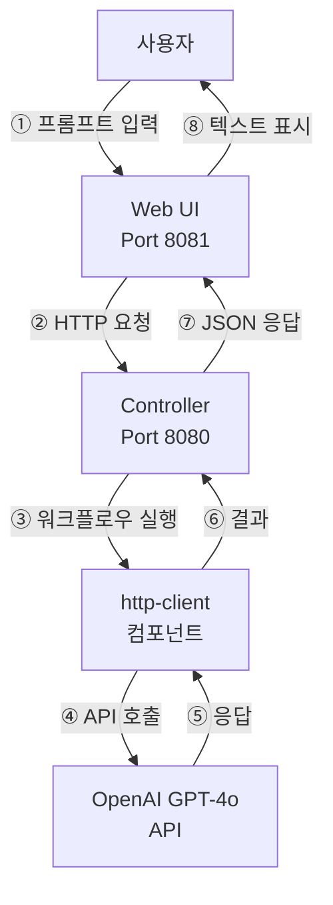
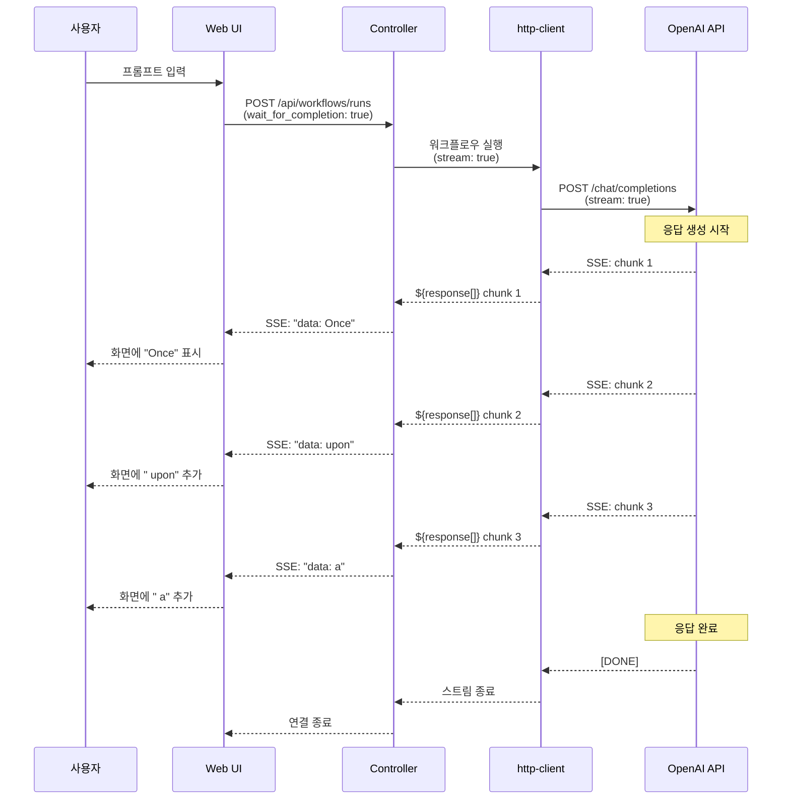
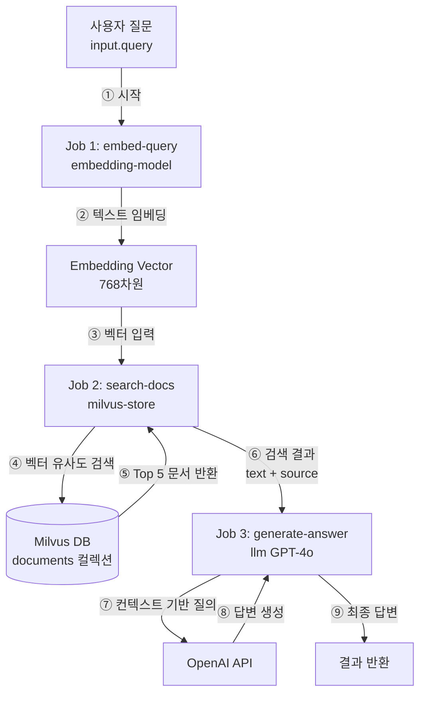
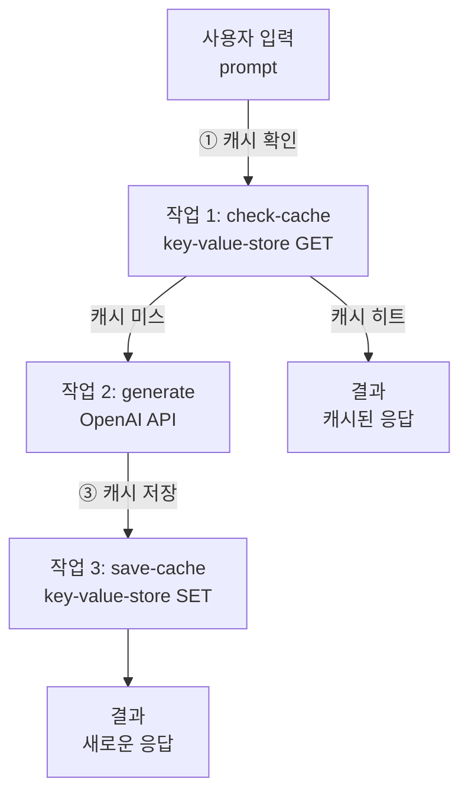
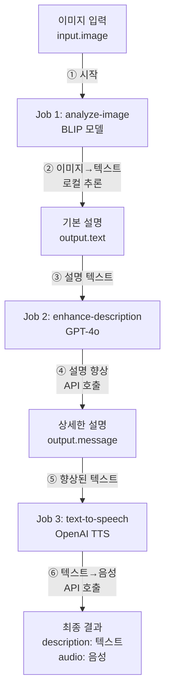
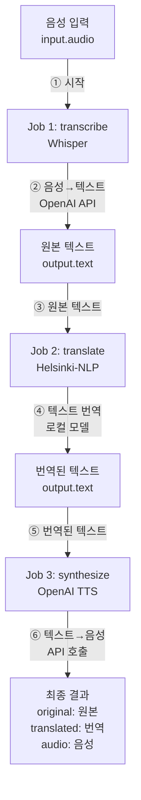
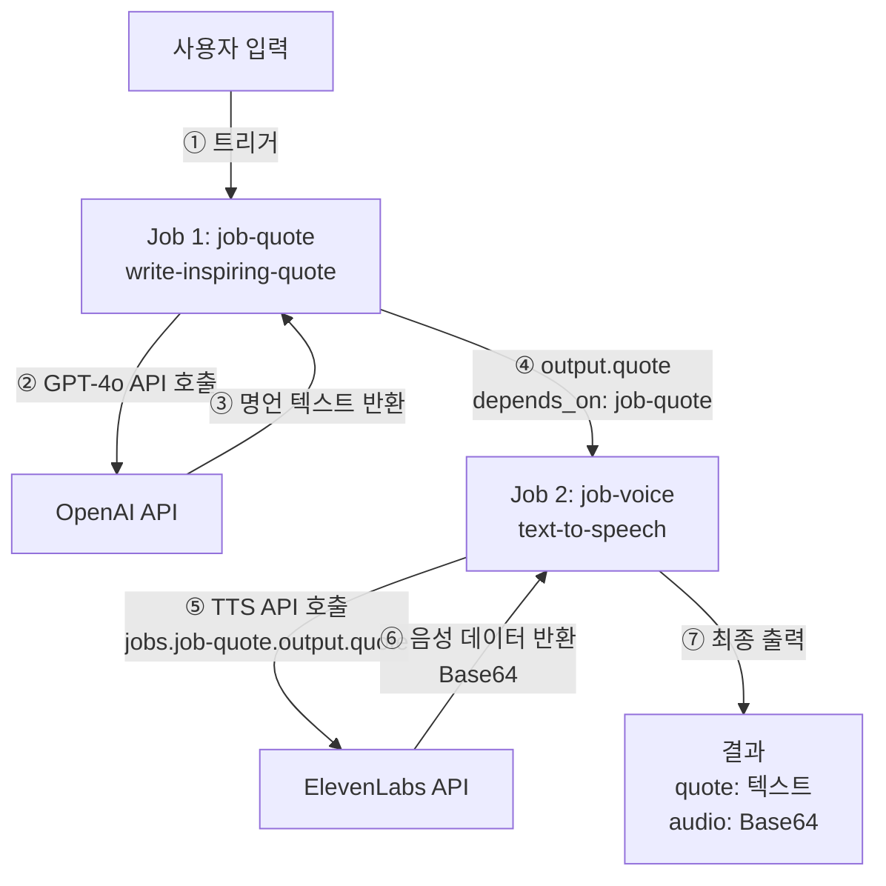
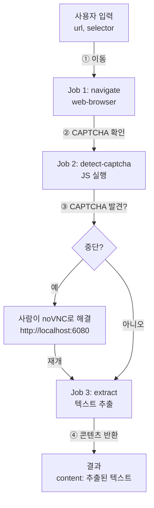
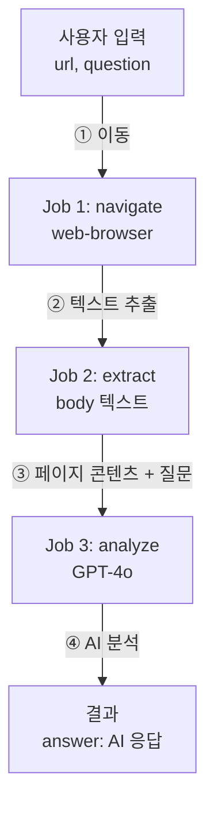

# 17. 실전 예제

이 장에서는 model-compose를 활용한 실제 사용 사례를 단계별로 설명합니다. 각 예제는 완전한 구성과 실행 방법을 포함합니다.

---

## 17.1 챗봇 구축

### 17.1.1 OpenAI GPT-4o 챗봇

**목표**: OpenAI GPT-4o를 사용한 간단한 대화형 챗봇 구축

**아키텍처 다이어그램**:



**구성 파일** (`model-compose.yml`):

```yaml
controller:
  type: http-server
  port: 8080
  base_path: /api
  webui:
    driver: gradio
    port: 8081

workflow:
  title: Chat with OpenAI GPT-4o
  description: Generate text responses using OpenAI's GPT-4o
  input: ${input}
  output: ${output}

component:
  type: http-client
  base_url: https://api.openai.com/v1
  action:
    path: /chat/completions
    method: POST
    headers:
      Authorization: Bearer ${env.OPENAI_API_KEY}
      Content-Type: application/json
    body:
      model: gpt-4o
      messages:
        - role: user
          content: ${input.prompt as text}
      temperature: ${input.temperature as number | 0.7}
    output:
      message: ${response.choices[0].message.content}
```

**환경 변수 설정** (`.env`):

```bash
OPENAI_API_KEY=sk-...
```

**실행 방법**:

```bash
# 컨트롤러 시작
model-compose up

# Web UI 접속
# http://localhost:8081
```

**주요 기능**:
- Gradio Web UI 자동 생성
- 온도(temperature) 파라미터 조정 가능
- 실시간 응답 표시

### 17.1.2 스트리밍 챗봇

**목표**: 실시간 타이핑 효과를 가진 스트리밍 챗봇

**구성 파일**:

```yaml
controller:
  type: http-server
  port: 8080
  webui:
    driver: gradio
    port: 8081

workflow:
  title: Streaming Chat
  output: ${output as sse-text}

component:
  type: http-client
  base_url: https://api.openai.com/v1
  action:
    path: /chat/completions
    method: POST
    headers:
      Authorization: Bearer ${env.OPENAI_API_KEY}
    body:
      model: gpt-4o
      messages:
        - role: user
          content: ${input.prompt as text}
      stream: true
    stream_format: json
    output: ${response[].choices[0].delta.content}
```

**특징**:
- SSE 프로토콜을 사용한 실시간 스트리밍
- Gradio에서 자동으로 타이핑 효과 적용
- 긴 응답에 대한 즉각적인 피드백

**스트리밍 흐름 다이어그램**:



---

## 17.2 RAG 시스템 (벡터 DB 활용)

### 17.2.1 ChromaDB를 사용한 텍스트 임베딩 검색

**목표**: 텍스트 임베딩을 생성하고 ChromaDB에 저장한 후 유사도 검색

**구성 파일**:

```yaml
controller:
  type: http-server
  port: 8080
  base_path: /api
  webui:
    driver: gradio
    port: 8081

workflows:
  - id: insert-sentence-embedding
    title: Insert Text Embedding
    description: Generate text embedding and insert it into ChromaDB vector store
    jobs:
      - id: embedding-sentence
        component: embedding-model
        input: ${input}
        output: ${output}

      - id: insert-embedding
        component: vector-store
        action: insert
        input:
          vector: ${jobs.embedding-sentence.output}
          metadata: ${input}
        output: ${output as json}
        depends_on: [ embedding-sentence ]

  - id: search-sentence-embeddings
    title: Search Similar Embeddings
    description: Generate query embedding and search for similar vectors in ChromaDB
    jobs:
      - id: embedding-sentence
        component: embedding-model
        input: ${input}
        output: ${output}

      - id: search-embeddings
        component: vector-store
        action: search
        input:
          vector: ${jobs.embedding-sentence.output}
        output: ${output as object[]/id,score,metadata.text}
        depends_on: [ embedding-sentence ]

  - id: delete-sentence-embedding
    title: Delete Text Embedding
    description: Remove a specific vector from the ChromaDB collection
    component: vector-store
    action: delete
    input: ${input}
    output: ${output as json}

components:
  - id: vector-store
    type: vector-store
    driver: chroma
    actions:
      - id: insert
        collection: test
        method: insert
        vector: ${input.vector}
        metadata: ${input.metadata}

      - id: search
        collection: test
        method: search
        query: ${input.vector}
        output_fields: [ text ]

      - id: delete
        collection: test
        method: delete
        vector_id: ${input.vector_id}

  - id: embedding-model
    type: model
    task: text-embedding
    model: sentence-transformers/all-MiniLM-L6-v2
    action:
      text: ${input.text}
```

**API 사용 예제**:

```bash
# 1. 텍스트 삽입
curl -X POST http://localhost:8080/api/workflows/insert-sentence-embedding/runs \
  -H "Content-Type: application/json" \
  -d '{"input": {"text": "model-compose is a declarative AI orchestrator"}}'

# 2. 유사 텍스트 검색
curl -X POST http://localhost:8080/api/workflows/search-sentence-embeddings/runs \
  -H "Content-Type: application/json" \
  -d '{"input": {"text": "AI workflow tool"}}'

# 3. 삭제
curl -X POST http://localhost:8080/api/workflows/delete-sentence-embedding/runs \
  -H "Content-Type: application/json" \
  -d '{"input": {"vector_id": "id123"}}'
```

### 17.2.2 Milvus를 사용한 RAG 시스템

**목표**: Milvus 벡터 데이터베이스를 사용한 고성능 RAG 시스템

**구성 파일**:

```yaml
controller:
  type: http-server
  port: 8080

workflows:
  - id: rag-query
    title: RAG Query
    description: Retrieve relevant documents and generate answer
    jobs:
      - id: embed-query
        component: embedding-model
        input:
          text: ${input.query}
        output: ${output}

      - id: search-docs
        component: milvus-store
        action: search
        input:
          vector: ${jobs.embed-query.output}
        output: ${output}
        depends_on: [ embed-query ]

      - id: generate-answer
        component: llm
        input:
          context: ${jobs.search-docs.output}
          query: ${input.query}
        output: ${output}
        depends_on: [ search-docs ]

components:
  - id: embedding-model
    type: model
    task: text-embedding
    model: sentence-transformers/all-MiniLM-L6-v2
    action:
      text: ${input.text}

  - id: milvus-store
    type: vector-store
    driver: milvus
    host: localhost
    port: 19530
    actions:
      - id: search
        collection: documents
        method: search
        query: ${input.vector}
        top_k: 5
        output_fields: [ text, source ]

  - id: llm
    type: http-client
    base_url: https://api.openai.com/v1
    action:
      path: /chat/completions
      method: POST
      headers:
        Authorization: Bearer ${env.OPENAI_API_KEY}
      body:
        model: gpt-4o
        messages:
          - role: system
            content: Answer based on the following context: ${input.context}
          - role: user
            content: ${input.query}
      output: ${response.choices[0].message.content}
```

**특징**:
- 3단계 파이프라인: 임베딩 → 검색 → 생성
- Milvus 고성능 벡터 검색
- GPT-4o를 사용한 컨텍스트 기반 답변 생성

**RAG 파이프라인 다이어그램**:



---

## 17.3 그래프 스토어 (지식 그래프 & 소셜 네트워크)

### 17.3.1 Neo4j를 사용한 지식 그래프

**목표**: 사람과 관계를 저장하는 지식 그래프를 구축하고 연결을 탐색

**구성 파일** (`model-compose.yml`):

```yaml
controller:
  adapter:
    type: http-server
    port: 8080
    base_path: /api
  webui:
    driver: gradio
    port: 8081

workflows:
  - id: add-person
    title: Add Person
    description: Add a person node to the knowledge graph
    jobs:
      - id: insert-node
        component: knowledge-graph
        action: add-person
        input: ${input}
        output: ${output as json}

  - id: add-friendship
    title: Add Friendship
    description: Create a KNOWS relationship between two people
    jobs:
      - id: insert-rel
        component: knowledge-graph
        action: add-relationship
        input: ${input}
        output: ${output as json}

  - id: find-connections
    title: Find Connections
    description: Traverse the graph to find connected people
    jobs:
      - id: traverse
        component: knowledge-graph
        action: find-connections
        input: ${input}
        output: ${output as json}

components:
  - id: knowledge-graph
    type: graph-store
    driver: neo4j
    url: bolt://localhost:7687
    username: neo4j
    password: password
    actions:
      - id: add-person
        method: insert
        nodes:
          label: Person
          properties:
            name: ${input.name}
            age: ${input.age}

      - id: add-relationship
        method: insert
        relationships:
          type: KNOWS
          from: ${input.from_id}
          to: ${input.to_id}
          properties:
            since: ${input.since}

      - id: find-person
        method: query
        query: "MATCH (p:Person {name: $name}) RETURN p"
        params:
          name: ${input.name}

      - id: find-connections
        method: traverse
        start_node: ${input.node_id}
        direction: both
        max_depth: 2
        relationship_types: [KNOWS]
```

**사전 요구사항**:
- Neo4j 로컬 실행 (`docker run -p 7687:7687 -e NEO4J_AUTH=neo4j/password neo4j`)

**실행 방법**:

```bash
# 서비스 시작
model-compose up

# 사람 추가
curl -X POST http://localhost:8080/api/workflows/add-person/run \
  -H 'Content-Type: application/json' \
  -d '{"input": {"name": "Alice", "age": 30}}'

# 친구 관계 생성
curl -X POST http://localhost:8080/api/workflows/add-friendship/run \
  -H 'Content-Type: application/json' \
  -d '{"input": {"from_id": "<alice_node_id>", "to_id": "<bob_node_id>", "since": 2020}}'

# 연결 탐색
curl -X POST http://localhost:8080/api/workflows/find-connections/run \
  -H 'Content-Type: application/json' \
  -d '{"input": {"node_id": "<alice_node_id>"}}'
```

**핵심 포인트**:
- `method: insert`에 `nodes`를 사용하면 그래프 노드 생성; `relationships`를 사용하면 엣지 생성
- `method: traverse`는 `max_depth` 홉까지 연결된 노드를 탐색
- `method: query`는 원시 Cypher 쿼리를 실행하여 최대 유연성 제공
- 삭제 시 `detach: true`(기본값)로 연결된 관계도 함께 제거
- 노드 ID는 Neo4j의 `elementId()` 형식으로 반환 (예: `4:abc:0`)

**파이프라인 다이어그램**:

```mermaid
graph TD
    A[사용자 입력<br/>name, age] -->|① 삽입| B[Job: add-person<br/>CREATE &#40;:Person&#41;]
    B --> C[노드 ID 반환]
    D[사용자 입력<br/>from_id, to_id] -->|② 연결| E[Job: add-relationship<br/>CREATE -[:KNOWS]->]
    F[사용자 입력<br/>node_id] -->|③ 탐색| G[Job: find-connections<br/>MATCH path *1..2]
    G --> H[연결된 노드들]
```

### 17.3.2 ArangoDB를 사용한 소셜 그래프

**목표**: 소셜 네트워크 그래프를 구축하고 ArangoDB를 사용하여 공통 친구 찾기

```yaml
components:
  - id: social-graph
    type: graph-store
    driver: arangodb
    host: localhost
    port: 8529
    username: root
    password: password
    database: social
    actions:
      - id: add-person
        method: insert
        collection: persons
        nodes:
          label: persons
          properties:
            name: ${input.name}
            age: ${input.age}

      - id: add-friendship
        method: insert
        edge_collection: friendships
        graph: social_graph
        relationships:
          type: friendships
          from: ${input.from_id}
          to: ${input.to_id}

      - id: mutual-friends
        method: query
        query: |
          FOR f1 IN OUTBOUND @person1 friendships
            FOR f2 IN OUTBOUND @person2 friendships
              FILTER f1._id == f2._id
              RETURN f1
        params:
          person1: ${input.person1_id}
          person2: ${input.person2_id}

      - id: find-network
        method: traverse
        start_node: ${input.person_id}
        graph: social_graph
        direction: both
        max_depth: 3
```

**핵심 포인트**:
- ArangoDB는 문서 ID에 `collection/key` 형식 사용 (예: `persons/12345`)
- 명명된 그래프(`graph: social_graph`)는 ArangoDB에서 미리 생성해야 함
- AQL 쿼리는 파라미터 바인딩에 `@param` 구문 사용
- 탐색은 `out`→`outbound`, `in`→`inbound`, `both`→`any`로 내부 매핑

---

## 17.4 키-값 스토어 (캐싱 & 세션)

### 17.4.1 API 응답 캐싱

**목표**: Redis에 LLM API 응답을 캐싱하여 동일한 프롬프트에 대한 중복 호출 방지

**설정 파일** (`model-compose.yml`):

```yaml
controller:
  adapter:
    type: http-server
    port: 8080

workflows:
  - id: cached-chat
    title: Cached Chat
    jobs:
      - id: check-cache
        component: cache
        action: get-response
        input:
          prompt: ${input.prompt}

      - id: generate
        component: openai
        condition: ${jobs.check-cache.output.cached == null}
        input:
          prompt: ${input.prompt}

      - id: save-cache
        component: cache
        action: set-response
        condition: ${jobs.check-cache.output.cached == null}
        input:
          prompt: ${input.prompt}
          response: ${jobs.generate.output.message}
    output:
      message: ${jobs.check-cache.output.cached ?? jobs.generate.output.message}

components:
  - id: cache
    type: key-value-store
    driver: redis
    host: localhost
    port: 6379
    actions:
      - id: get-response
        method: get
        key: "chat:${input.prompt}"
        output:
          cached: ${result.value}
      - id: set-response
        method: set
        key: "chat:${input.prompt}"
        value: ${input.response}
        ttl: 3600

  - id: openai
    type: http-client
    base_url: https://api.openai.com/v1
    action:
      path: /chat/completions
      method: POST
      headers:
        Authorization: Bearer ${env.OPENAI_API_KEY}
      body:
        model: gpt-4o
        messages:
          - role: user
            content: ${input.prompt as text}
      output:
        message: ${response.choices[0].message.content}
```

**API 사용**:

```bash
# 첫 번째 호출 - 생성 후 캐싱
curl -X POST http://localhost:8080/workflows/runs \
  -H "Content-Type: application/json" \
  -d '{"workflow_id": "cached-chat", "input": {"prompt": "Redis란 무엇인가요?"}}'

# 동일 프롬프트로 두 번째 호출 - 캐시된 결과 즉시 반환
curl -X POST http://localhost:8080/workflows/runs \
  -H "Content-Type: application/json" \
  -d '{"workflow_id": "cached-chat", "input": {"prompt": "Redis란 무엇인가요?"}}'
```

**파이프라인 다이어그램**:



### 17.4.2 세션 관리

**목표**: 자동 만료 기능을 가진 사용자 세션 데이터 저장

```yaml
components:
  - id: session
    type: key-value-store
    driver: redis
    url: redis://localhost:6379/1
    actions:
      - id: save
        method: set
        key: "session:${input.user_id}"
        value:
          history: ${input.history}
          preferences: ${input.preferences}
        ttl: 86400

      - id: load
        method: get
        key: "session:${input.user_id}"
        output:
          session: ${result.value}

      - id: logout
        method: delete
        key: "session:${input.user_id}"
```

**핵심 포인트**:
- 86400초(24시간) TTL로 세션 자동 만료
- 복합 객체(dict, list)는 JSON으로 직렬화되며, 조회 시 자동 역직렬화
- `url`과 `host`/`port`는 상호 배타적인 연결 옵션

---

## 17.5 멀티모달 워크플로우

### 17.5.1 이미지 → 텍스트 → 음성 파이프라인

**목표**: 이미지를 분석하고 설명을 생성한 후 음성으로 변환

**구성 파일**:

```yaml
controller:
  type: http-server
  port: 8080
  webui:
    driver: gradio
    port: 8081

workflow:
  title: Image to Speech Pipeline
  description: Analyze image, generate description, and convert to speech
  jobs:
    - id: analyze-image
      component: image-analyzer
      input:
        image: ${input.image}
      output: ${output}

    - id: enhance-description
      component: gpt4o
      input:
        prompt: |
          Make this image description more engaging and detailed:
          ${jobs.analyze-image.output.text}
      output: ${output}
      depends_on: [ analyze-image ]

    - id: text-to-speech
      component: tts
      input:
        text: ${jobs.enhance-description.output.message}
      output:
        description: ${jobs.enhance-description.output.message}
        audio: ${output as audio}
      depends_on: [ enhance-description ]

components:
  - id: image-analyzer
    type: model
    task: image-to-text
    model: Salesforce/blip-image-captioning-large
    action:
      image: ${input.image as image}
      output:
        text: ${result}

  - id: gpt4o
    type: http-client
    base_url: https://api.openai.com/v1
    action:
      path: /chat/completions
      method: POST
      headers:
        Authorization: Bearer ${env.OPENAI_API_KEY}
      body:
        model: gpt-4o
        messages:
          - role: user
            content: ${input.prompt}
      output:
        message: ${response.choices[0].message.content}

  - id: tts
    type: http-client
    action:
      endpoint: https://api.openai.com/v1/audio/speech
      method: POST
      headers:
        Authorization: Bearer ${env.OPENAI_API_KEY}
      body:
        model: tts-1
        input: ${input.text}
        voice: nova
      output: ${response}
```

**3단계 파이프라인**:
1. **이미지 분석**: BLIP 모델이 이미지 설명 생성
2. **텍스트 향상**: GPT-4o가 설명을 더 자세하고 매력적으로 재작성
3. **음성 변환**: OpenAI TTS가 텍스트를 음성으로 변환

**멀티모달 파이프라인 다이어그램**:



### 17.5.2 음성 → 텍스트 → 번역 → 음성 파이프라인

**목표**: 음성을 다른 언어로 번역하여 음성으로 출력

**구성 파일**:

```yaml
controller:
  type: http-server
  port: 8080
  webui:
    driver: gradio
    port: 8081

workflow:
  title: Voice Translation Pipeline
  description: Transcribe audio, translate to target language, and synthesize speech
  jobs:
    - id: transcribe
      component: whisper
      input:
        audio: ${input.audio}
      output: ${output}

    - id: translate
      component: translator
      input:
        text: ${jobs.transcribe.output.text}
        target_lang: ${input.target_lang}
      output: ${output}
      depends_on: [ transcribe ]

    - id: synthesize
      component: tts
      input:
        text: ${jobs.translate.output.text}
      output:
        original: ${jobs.transcribe.output.text}
        translated: ${jobs.translate.output.text}
        audio: ${output as audio}
      depends_on: [ translate ]

components:
  - id: whisper
    type: http-client
    action:
      endpoint: https://api.openai.com/v1/audio/transcriptions
      method: POST
      headers:
        Authorization: Bearer ${env.OPENAI_API_KEY}
      body:
        file: ${input.audio as audio}
        model: whisper-1
      output:
        text: ${response.text}

  - id: translator
    type: model
    task: translation
    model: Helsinki-NLP/opus-mt-en-ko
    action:
      text: ${input.text as text}
      output:
        text: ${result}

  - id: tts
    type: http-client
    action:
      endpoint: https://api.openai.com/v1/audio/speech
      method: POST
      headers:
        Authorization: Bearer ${env.OPENAI_API_KEY}
      body:
        model: tts-1
        input: ${input.text}
        voice: nova
      output: ${response}
```

**4단계 파이프라인**:
1. **음성 인식**: Whisper가 음성을 텍스트로 변환
2. **번역**: Helsinki-NLP 모델이 텍스트 번역
3. **음성 합성**: OpenAI TTS가 번역된 텍스트를 음성으로 변환
4. **결과 출력**: 원본 텍스트, 번역 텍스트, 번역된 음성

**음성 번역 파이프라인 다이어그램**:



---

## 17.6 음성 생성 파이프라인

### 17.6.1 텍스트를 음성으로 변환 (OpenAI TTS)

**목표**: OpenAI TTS API를 사용하여 텍스트를 음성으로 변환

**구성 파일**:

```yaml
controller:
  type: http-server
  port: 8080
  base_path: /api
  webui:
    driver: gradio
    port: 8081

workflow:
  title: Generate Speech with OpenAI TTS
  description: Convert input text into natural-sounding speech using OpenAI's TTS models.
  jobs:
    - id: speak
      component: openai-text-to-speech
      input: ${input}
      output: ${output as audio}

components:
  - id: openai-text-to-speech
    type: http-client
    action:
      endpoint: https://api.openai.com/v1/audio/speech
      method: POST
      headers:
        Authorization: Bearer ${env.OPENAI_API_KEY}
        Content-Type: application/json
      body:
        model: ${input.model as select/tts-1,tts-1-hd,gpt-4o-mini-tts | tts-1}
        input: ${input.text}
        voice: ${input.voice as select/alloy,ash,ballad,coral,echo,fable,onyx,nova,sage,shimmer,verse | nova}
        response_format: mp3
      output: ${response}
```

**지원 음성**:
- `alloy`, `ash`, `ballad`, `coral`, `echo`, `fable`
- `onyx`, `nova`, `sage`, `shimmer`, `verse`

**지원 모델**:
- `tts-1`: 빠른 응답
- `tts-1-hd`: 고품질 음성
- `gpt-4o-mini-tts`: 최신 모델

### 17.6.2 영감을 주는 명언 음성 생성

**목표**: GPT-4o로 명언 생성 후 ElevenLabs TTS로 음성 변환

**구성 파일**:

```yaml
controller:
  type: http-server
  port: 8080
  base_path: /api
  webui:
    driver: gradio
    port: 8081

workflow:
  title: Inspire with Voice
  description: Generate a motivational quote using GPT-4o and bring it to life by converting it into natural speech with ElevenLabs TTS.
  jobs:
    - id: job-quote
      component: write-inspiring-quote
      input: ${input}
      output: ${output}

    - id: job-voice
      component: text-to-speech
      input:
        text: ${jobs.job-quote.output.quote}
        voice_id: ${input.voice_id | JBFqnCBsd6RMkjVDRZzb}
      output:
        quote: ${jobs.job-quote.output.quote}
        audio: ${output as audio/mp3;base64}
      depends_on: [ job-quote ]

components:
  - id: write-inspiring-quote
    type: http-client
    base_url: https://api.openai.com/v1
    action:
      path: /chat/completions
      method: POST
      headers:
        Authorization: Bearer ${env.OPENAI_API_KEY}
        Content-Type: application/json
      body:
        model: gpt-4o
        messages:
          - role: user
            content: |
              Write an inspiring quote similar to the example below.
              Don't say anything else—just give me the quote.
              Aim for around 30 words.
              Example – Never give up. If there's something you want to become, be proud of it. Give yourself a chance.
              Don't think you're worthless—there's nothing to gain from that. Aim high. That's how life should be lived.
      output:
        quote: ${response.choices[0].message.content}

  - id: text-to-speech
    type: http-client
    action:
      endpoint: https://api.elevenlabs.io/v1/text-to-speech/${input.voice_id}?output_format=mp3_44100_128
      method: POST
      headers:
        Content-Type: application/json
        xi-api-key: ${env.ELEVENLABS_API_KEY}
      body:
        text: ${input.text}
        model_id: eleven_multilingual_v2
      output: ${response as base64}
```

**환경 변수**:

```bash
OPENAI_API_KEY=sk-...
ELEVENLABS_API_KEY=...
```

**워크플로우 설명**:
1. GPT-4o가 영감을 주는 명언 생성
2. ElevenLabs API가 명언을 음성으로 변환
3. Web UI에서 텍스트와 오디오 모두 표시

**워크플로우 다이어그램**:



---

## 17.7 이미지 분석 및 편집

### 17.7.1 이미지 캡셔닝 (Image-to-Text)

**목표**: 로컬 Vision 모델을 사용하여 이미지 설명 생성

**구성 파일**:

```yaml
controller:
  type: http-server
  port: 8080
  base_path: /api
  webui:
    driver: gradio
    port: 8081

workflow:
  title: Generate Text from Image
  description: Generate text based on a given image using a pretrained vision model.
  input: ${input}
  output:
    generated: ${output}

component:
  type: model
  task: image-to-text
  model: Salesforce/blip-image-captioning-large
  architecture: blip
  action:
    image: ${input.image as image}
    prompt: ${input.prompt as text}
```

**실행 예제**:

```bash
# 워크플로우 실행
model-compose run default --input '{"image": "path/to/image.jpg", "prompt": "Describe this image"}'
```

**지원 모델**:
- `Salesforce/blip-image-captioning-large`
- `Salesforce/blip-image-captioning-base`
- `nlpconnect/vit-gpt2-image-captioning`

### 17.7.2 이미지 편집 (OpenAI DALL-E)

**목표**: OpenAI DALL-E를 사용하여 이미지 편집

**구성 파일**:

```yaml
controller:
  type: http-server
  port: 8080
  webui:
    driver: gradio
    port: 8081

workflow:
  title: Edit Image with DALL-E
  description: Edit an existing image using OpenAI's DALL-E API
  component: dalle-edit
  input: ${input}
  output: ${output as image}

component:
  id: dalle-edit
  type: http-client
  action:
    endpoint: https://api.openai.com/v1/images/edits
    method: POST
    headers:
      Authorization: Bearer ${env.OPENAI_API_KEY}
    body:
      image: ${input.image as image}
      mask: ${input.mask as image}
      prompt: ${input.prompt as text}
      n: ${input.n as integer | 1}
      size: ${input.size as select/256x256,512x512,1024x1024 | 1024x1024}
    output: ${response.data[0].url}
```

**사용 시나리오**:
- 이미지 배경 변경
- 특정 영역 수정
- 스타일 변환

---

## 17.8 브라우저 자동화

### 17.8.1 CAPTCHA 대응 웹 스크래핑

**목표**: 페이지로 이동하고, CAPTCHA를 감지하며, noVNC를 통해 사람이 해결한 후 콘텐츠 추출

**사전 요구사항**:

noVNC가 포함된 헤드리스 Chrome 시작:

```bash
docker run -d -p 9222:9222 -p 6080:6080 \
  chromedp/headless-shell:latest
```

**구성 파일**:

```yaml
controller:
  type: http-server
  port: 8080
  webui:
    driver: gradio
    port: 8081

workflows:
  - id: scrape-with-fallback
    title: Scrape with CAPTCHA Fallback
    input:
      - id: url
        type: string
        description: Target URL to scrape
      - id: selector
        type: string
        description: CSS selector for content extraction
    jobs:
      - id: navigate
        component: browser
        action: navigate
        input:
          url: ${input.url}

      - id: detect-captcha
        component: browser
        action: check-captcha
        interrupt:
          after:
            condition:
              operator: eq
              input: ${output}
              value: true
            message: >
              CAPTCHA detected! Please solve it via noVNC at:
              http://localhost:6080/vnc.html
        depends_on: [ navigate ]

      - id: extract
        component: browser
        action: extract-text
        input:
          selector: ${input.selector}
        depends_on: [ detect-captcha ]
        output:
          content: "${output as text}"

components:
  - id: browser
    type: web-browser
    host: localhost
    port: 9222
    timeout: 30s
    actions:
      - id: navigate
        method: navigate
        url: "${input.url}"
        wait_until: networkidle

      - id: check-captcha
        method: evaluate
        expression: >
          !!(document.querySelector('[id*=captcha],[class*=captcha]')
            || document.querySelector('iframe[src*=captcha]')
            || document.querySelector('#cf-challenge-running'))

      - id: extract-text
        method: extract
        selector: "${input.selector}"
        extract_mode: text
```

**워크플로우**:
1. 대상 URL로 이동
2. JavaScript를 실행하여 CAPTCHA 요소 감지
3. CAPTCHA가 발견되면 워크플로우가 중단되고 noVNC URL을 표시하여 사람이 해결
4. 사람이 CAPTCHA를 해결하면 워크플로우가 재개되고 콘텐츠 추출

**워크플로우 다이어그램**:



### 17.8.2 로그인 후 보호된 콘텐츠 스크래핑

**목표**: 웹사이트에 자동 로그인하고 보호된 콘텐츠 추출

**구성 파일**:

```yaml
controller:
  type: http-server
  port: 8080
  webui:
    driver: gradio
    port: 8081

workflows:
  - id: login-and-scrape
    title: Login then Scrape
    input:
      - id: login_url
        type: string
      - id: username
        type: string
      - id: password
        type: string
      - id: content_url
        type: string
      - id: selector
        type: string
    jobs:
      - id: open-login
        component: browser
        action: navigate
        input:
          url: ${input.login_url}

      - id: fill-username
        component: browser
        action: type-text
        input:
          selector: "input[name='username']"
          text: ${input.username}
        depends_on: [ open-login ]

      - id: fill-password
        component: browser
        action: type-text
        input:
          selector: "input[name='password']"
          text: ${input.password}
        depends_on: [ fill-username ]

      - id: submit
        component: browser
        action: click
        input:
          selector: "button[type='submit']"
        depends_on: [ fill-password ]

      - id: navigate-content
        component: browser
        action: navigate
        input:
          url: ${input.content_url}
        depends_on: [ submit ]

      - id: extract-content
        component: browser
        action: extract-text
        input:
          selector: ${input.selector}
        depends_on: [ navigate-content ]
        output:
          content: ${output as text}

components:
  - id: browser
    type: web-browser
    host: localhost
    port: 9222
    timeout: 30s
    actions:
      - id: navigate
        method: navigate
        url: "${input.url}"
        wait_until: networkidle

      - id: type-text
        method: input-text
        selector: "${input.selector}"
        text: "${input.text}"

      - id: click
        method: click
        selector: "${input.selector}"

      - id: extract-text
        method: extract
        selector: "${input.selector}"
        extract_mode: text
```

**6단계 파이프라인**:
1. 로그인 페이지로 이동
2. 사용자명 필드 입력
3. 비밀번호 필드 입력
4. 제출 버튼 클릭
5. 보호된 콘텐츠 페이지로 이동
6. CSS 셀렉터로 콘텐츠 추출

### 17.8.3 AI 기반 웹 콘텐츠 분석

**목표**: 페이지로 이동하고 콘텐츠를 추출한 후 GPT-4o로 분석

**구성 파일**:

```yaml
controller:
  type: http-server
  port: 8080
  webui:
    driver: gradio
    port: 8081

workflows:
  - id: analyze-page
    title: Analyze Web Page with AI
    input:
      - id: url
        type: string
        description: URL to analyze
      - id: question
        type: string
        description: Question to ask about the page content
    jobs:
      - id: navigate
        component: browser
        action: navigate
        input:
          url: ${input.url}

      - id: extract
        component: browser
        action: extract-body
        depends_on: [ navigate ]

      - id: analyze
        component: gpt4o
        input:
          context: ${jobs.extract.output.content}
          question: ${input.question}
        depends_on: [ extract ]
        output:
          answer: ${output.message}

components:
  - id: browser
    type: web-browser
    host: localhost
    port: 9222
    timeout: 30s
    actions:
      - id: navigate
        method: navigate
        url: "${input.url}"
        wait_until: networkidle

      - id: extract-body
        method: extract
        selector: "body"
        extract_mode: text
        output:
          content: ${result}

  - id: gpt4o
    type: http-client
    base_url: https://api.openai.com/v1
    action:
      path: /chat/completions
      method: POST
      headers:
        Authorization: Bearer ${env.OPENAI_API_KEY}
      body:
        model: gpt-4o
        messages:
          - role: system
            content: |
              Answer questions based on the following web page content:
              ${input.context}
          - role: user
            content: ${input.question}
      output:
        message: ${response.choices[0].message.content}
```

**3단계 파이프라인**:
1. **이동**: 대상 페이지를 로드하고 네트워크 유휴 상태까지 대기
2. **추출**: 페이지 본문에서 모든 텍스트 콘텐츠 추출
3. **분석**: 사용자의 질문과 함께 콘텐츠를 GPT-4o에 전송

**파이프라인 다이어그램**:



---

## 17.9 Slack 봇 (MCP)

### 17.9.1 MCP 서버로 Slack 봇 구축

**목표**: MCP(Model Context Protocol) 서버를 사용하여 Slack 봇 구축

**구성 파일**:

```yaml
controller:
  type: mcp-server
  base_path: /mcp
  port: 8080
  webui:
    driver: gradio
    port: 8081

workflows:
  - id: send-message
    title: Send Message to Slack Channel
    description: Send a text message to a specified Slack channel using the Slack Web API
    action: chat-post-message
    input:
      channel: ${input.channel | ${env.DEFAULT_SLACK_CHANNEL_ID} @(description Slack channel ID for sending a message)}
      text: ${input.message @(description Message to send to Slack)}
    output: ${output as json}

  - id: list-channels
    title: List Slack Channels
    description: Retrieve a list of all available channels in the Slack workspace
    action: conversations-list
    output: ${output as object[]}

  - id: join-channel
    title: Join Slack Channel
    description: Join a specified Slack channel for the bot user
    action: conversations-join
    input:
      channel: ${input.channel | ${env.DEFAULT_SLACK_CHANNEL_ID}}
    output: ${output as json}

component:
  type: http-client
  base_url: https://slack.com/api
  headers:
    Authorization: Bearer ${env.SLACK_APP_TOKEN}
  actions:
    - id: chat-post-message
      path: /chat.postMessage
      method: POST
      body:
        channel: ${input.channel}
        text: ${input.text}
        attachments: ${input.attachments}
      headers:
        Content-Type: application/json
      output: ${response}

    - id: conversations-list
      path: /conversations.list
      method: GET
      params:
        limit: ${input.limit as integer | 200 @(description Maximum number of channels to retrieve)}
      headers:
        Content-Type: application/x-www-form-urlencoded
      output: ${response.channels as object[]/id,name}

    - id: conversations-join
      path: /conversations.join
      method: POST
      body:
        channel: ${input.channel}
      headers:
        Content-Type: application/json
      output: ${response}
```

**환경 변수**:

```bash
SLACK_APP_TOKEN=xoxb-...
DEFAULT_SLACK_CHANNEL_ID=C...
```

**MCP 서버 특징**:
- Claude Desktop 등의 MCP 클라이언트와 연동
- 여러 워크플로우를 도구(Tool)로 노출
- `@(description ...)` 어노테이션으로 파라미터 설명 제공

**Claude Desktop 설정** (`claude_desktop_config.json`):

```json
{
  "mcpServers": {
    "slack-bot": {
      "command": "npx",
      "args": [
        "-y",
        "@modelcontextprotocol/server-stdio",
        "http://localhost:8080/mcp"
      ]
    }
  }
}
```

### 17.9.2 AI 기반 Slack 자동 응답 봇

**목표**: Slack 메시지에 AI가 자동으로 응답하는 봇

**구성 파일**:

```yaml
controller:
  type: http-server
  port: 8080

listeners:
  - id: slack-events
    type: http-callback
    path: /slack/events
    method: POST
    callback:
      url: https://slack.com/api/chat.postMessage
      method: POST
      headers:
        Authorization: Bearer ${env.SLACK_BOT_TOKEN}
        Content-Type: application/json
      body:
        channel: ${webhook.event.channel}
        text: ${jobs.generate-reply.output.message}

gateway:
  type: ngrok
  port: 8080

workflow:
  title: AI Slack Reply
  jobs:
    - id: generate-reply
      component: gpt4o
      input:
        prompt: ${input.event.text}
      output: ${output}

component:
  id: gpt4o
  type: http-client
  base_url: https://api.openai.com/v1
  action:
    path: /chat/completions
    method: POST
    headers:
      Authorization: Bearer ${env.OPENAI_API_KEY}
    body:
      model: gpt-4o
      messages:
        - role: user
          content: ${input.prompt}
    output:
      message: ${response.choices[0].message.content}
```

**동작 흐름**:
1. Slack에서 메시지 이벤트 발생
2. ngrok 터널을 통해 워크플로우 트리거
3. GPT-4o가 응답 생성
4. 리스너 콜백이 Slack에 응답 전송

---

## 17.10 대화 메모리를 활용한 챗봇

### 17.10.1 상태 유지 챗봇 (model-memory)

**목표**: `model-memory` 컴포넌트를 사용하여 여러 대화 턴에 걸쳐 이전 대화 맥락을 기억하는 챗봇 구축

**구성 파일** (`model-compose.yml`):

```yaml
controller:
  type: http-server
  port: 8080
  base_path: /api
  webui:
    driver: gradio
    port: 8081

components:
  - id: gpt-4o
    type: http-client
    base_url: https://api.openai.com/v1
    action:
      path: /chat/completions
      method: POST
      headers:
        Authorization: Bearer ${env.OPENAI_API_KEY}
        Content-Type: application/json
      body:
        model: gpt-4o
        messages: ${input.messages}
      output: ${response.choices[0].message.content}

  - id: chat-memory
    type: model-memory
    storage:
      driver: sqlite
      path: ./memory.db
    window: 20
    summary:
      component: gpt-4o
      input:
        messages: ${messages}
      instruction: "다음 대화를 간결하게 요약해주세요:"
    actions:
      - id: load
        method: load
      - id: save
        method: save

workflows:
  - id: chat
    title: 메모리가 있는 챗봇
    description: 대화 히스토리를 기억하는 챗봇
    jobs:
      - id: load-memory
        component: chat-memory
        action: load
        input:
          session_id: ${input.session_id | default-session}

      - id: generate
        component: gpt-4o
        input:
          messages:
            - role: system
              content: 당신은 도움이 되는 어시스턴트입니다.
            - role: system
              content: "이전 대화 요약: ${jobs.load-memory.output.summary}"
            - ...${jobs.load-memory.output.messages}
            - role: user
              content: ${input.message as text}
        depends_on: [load-memory]

      - id: save-memory
        component: chat-memory
        action: save
        input:
          session_id: ${input.session_id | default-session}
          messages:
            - role: user
              content: ${input.message}
            - role: assistant
              content: ${jobs.generate.output}
        depends_on: [generate]
    output: ${jobs.generate.output}
```

**환경 변수** (`.env`):

```bash
OPENAI_API_KEY=sk-...
```

**실행 방법**:

```bash
# 컨트롤러 시작
model-compose up

# CLI로 테스트
model-compose run chat --input '{"session_id": "user-1", "message": "제 이름은 앨리스입니다"}'
model-compose run chat --input '{"session_id": "user-1", "message": "제 이름이 뭐였죠?"}'
# → 봇이 기억합니다: "당신의 이름은 앨리스입니다"
```

**동작 흐름**:
1. SQLite 저장소에서 대화 히스토리 로드
2. 요약 + 최근 메시지를 GPT-4o 컨텍스트에 포함
3. 전체 대화 맥락을 고려한 응답 생성
4. 사용자 메시지 + 어시스턴트 응답을 메모리에 저장
5. 윈도우를 초과하는 오래된 메시지는 자동으로 요약

### 17.10.2 Redis 메모리를 사용한 다중 사용자 챗봇

**목표**: Redis를 사용한 공유 메모리 저장소로 프로덕션에 적합한 다중 사용자 챗봇 구축

**구성 파일** (`model-compose.yml`):

```yaml
controller:
  type: http-server
  port: 8080

components:
  - id: gpt-4o
    type: http-client
    base_url: https://api.openai.com/v1
    action:
      path: /chat/completions
      method: POST
      headers:
        Authorization: Bearer ${env.OPENAI_API_KEY}
        Content-Type: application/json
      body:
        model: gpt-4o
        messages: ${input.messages}
      output: ${response.choices[0].message.content}

  - id: chat-memory
    type: model-memory
    storage:
      driver: redis
      url: ${env.REDIS_URL}
      password: ${env.REDIS_PASSWORD}
    window:
      max_turn_count: 30
      max_message_count: 100
    summary:
      component: gpt-4o
      instruction: "이 대화를 간략하게 요약해주세요:"
    actions:
      - id: load
        method: load
      - id: save
        method: save
      - id: delete
        method: delete

workflows:
  - id: chat
    jobs:
      - id: load-memory
        component: chat-memory
        action: load
        input:
          session_id: ${input.session_id}

      - id: generate
        component: gpt-4o
        input:
          messages:
            - role: system
              content: ${input.system_prompt | 당신은 도움이 되는 어시스턴트입니다.}
            - role: system
              content: "맥락: ${jobs.load-memory.output.summary}"
            - ...${jobs.load-memory.output.messages}
            - role: user
              content: ${input.message as text}
        depends_on: [load-memory]

      - id: save-memory
        component: chat-memory
        action: save
        input:
          session_id: ${input.session_id}
          messages:
            - role: user
              content: ${input.message}
            - role: assistant
              content: ${jobs.generate.output}
        depends_on: [generate]
    output: ${jobs.generate.output}

  - id: clear-history
    jobs:
      - id: delete
        component: chat-memory
        action: delete
        input:
          session_id: ${input.session_id}
```

**핵심 포인트**:
- Redis 저장소를 사용하면 여러 서버 인스턴스 간에 메모리 공유 가능
- `max_turn_count`와 `max_message_count`로 이중 윈도우 제어
- 세션 정리를 위한 별도의 `clear-history` 워크플로우

---

## 다음 단계

실습해보세요:
- 각 예제를 로컬에서 실행
- 예제를 수정하여 커스텀 워크플로우 구축
- 여러 예제를 조합하여 복잡한 파이프라인 구성
- 프로덕션 환경에 배포

---

**다음 장**: [18. 문제 해결](./18-troubleshooting.md)
