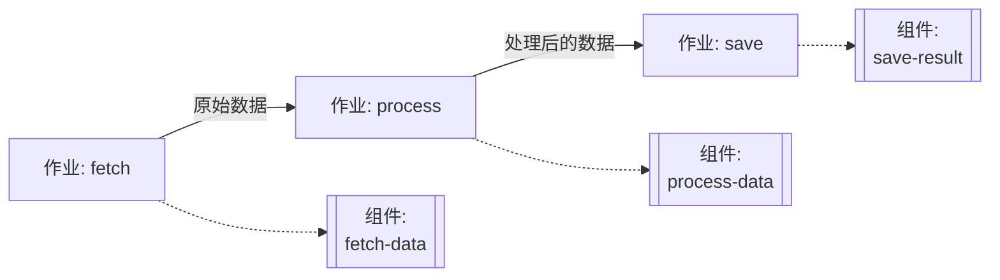
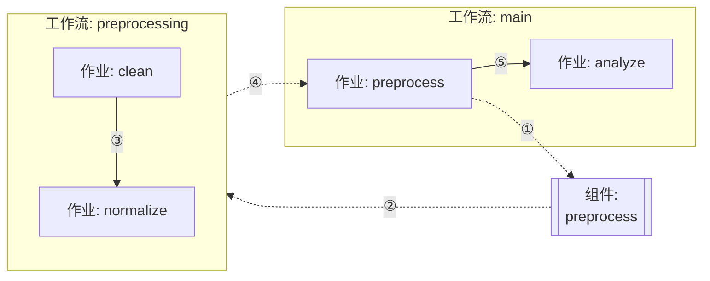

# 第 4 章：组件配置

本章介绍 model-compose 中的各种组件类型、定义方法、输入/输出映射和可重用性模式。

---

## 4.1 组件类型

model-compose 提供了多种组件类型来执行不同的任务。

### 可用的组件类型

| 类型 | 用途 | 主要用例 |
|------|---------|---------------|
| `http-client` | 外部 API 调用 | 集成 OpenAI、ElevenLabs 等 REST API |
| `http-server` | 提供 HTTP 服务 | 实现自定义 HTTP API 端点 |
| `mcp-server` | 提供 MCP 服务 | 实现模型上下文协议服务器 |
| `mcp-client` | MCP 客户端 | 与 MCP 服务器通信 |
| `model` | 运行本地 AI 模型 | 本地模型推理，如文本生成、图像分析等 |
| `model-trainer` | 训练模型 | 微调、LoRA 训练 |
| `datasets` | 加载数据集 | 加载和处理训练/评估数据集 |
| `vector-store` | 向量数据库集成 | 使用 Chroma、Milvus 等的 RAG 系统 |
| `workflow` | 调用工作流 | 将其他工作流作为子程序执行 |
| `shell` | 执行 shell 命令 | 运行脚本、系统命令 |
| `text-splitter` | 分割文本 | 将文档分割成块 |
| `image-processor` | 处理图像 | 图像转换、调整大小等 |

### 组件选择指南

**外部 API 集成**
- OpenAI、Anthropic 等 → `http-client`
- 自定义 REST API → `http-client`

**本地 AI 模型**
- 本地推理 → `model`
- 使用 vLLM、Ollama 等后端 → `http-server`
- 训练 → `model-trainer`

**数据处理**
- 文本分割 → `text-splitter`
- 图像处理 → `image-processor`
- 向量存储 → `vector-store`

**工作流组合**
- 子工作流 → `workflow`
- 系统任务 → `shell`

---

## 4.2 定义组件

### 基本结构

所有组件都遵循以下基本结构：

```yaml
components:
  - id: unique-component-id
    type: component-type
    # 类型特定的设置...
    output:
      # 输出映射...
```

### 必需属性

- `id`: 唯一的组件标识符
- `type`: 组件类型

### 可选属性

- `output`: 输出数据映射
- `actions`: 多个动作定义（多动作组件）

### 单动作组件 vs 多动作组件

组件可以定义为单动作或多动作。

#### 单动作组件

只执行一个任务的组件：

```yaml
components:
  - id: send-email
    type: http-client
    endpoint: https://api.email.com/send
    method: POST
    headers:
      Authorization: Bearer ${env.EMAIL_API_KEY}
    body:
      to: ${input.to}
      subject: ${input.subject}
      body: ${input.body}
    output: ${response}
```

使用方式：
```yaml
workflow:
  jobs:
    - component: send-email
      input:
        to: "user@example.com"
        subject: "Welcome"
        body: "Hello!"
```

#### 多动作组件

在单个组件中定义多个任务：

```yaml
components:
  - id: email-service
    type: http-client
    base_url: https://api.email.com
    headers:
      Authorization: Bearer ${env.EMAIL_API_KEY}
      Content-Type: application/json
    actions:
      - id: send
        path: /send
        method: POST
        body:
          to: ${input.to}
          subject: ${input.subject}
          body: ${input.body}
        output: ${response}

      - id: get-status
        path: /status/${input.message_id}
        method: GET
        output: ${response.status}

      - id: list-templates
        path: /templates
        method: GET
        output: ${response.templates}
```

使用方式：
```yaml
workflow:
  jobs:
    - id: send
      component: email-service
      action: send
      input:
        to: "user@example.com"
        subject: "Welcome"
        body: "Hello!"
      output:
        message_id: ${output.id}

    - id: check
      component: email-service
      action: get-status
      input:
        message_id: ${jobs.send.output.message_id}
```

#### 何时使用多动作？

**适合使用多动作的情况：**
- 使用同一 API 服务的多个端点
- 共享通用的身份验证/请求头
- 逻辑上相关的任务分组

**适合使用单动作的情况：**
- 简单且独立的任务
- 特定任务的有限重用
- 快速原型开发

---

## 4.3 输入/输出映射

### 输入映射

如何将数据传递给组件：

#### 方法 1: 直接映射

```yaml
components:
  - id: translator
    type: http-client
    endpoint: https://api.translate.com/v1/translate
    body:
      text: ${input.text}
      target_lang: ${input.language}
```

在工作流中使用：
```yaml
workflow:
  jobs:
    - component: translator
      input:
        text: "Hello"
        language: "ko"
```

#### 方法 2: 传递整个输入

```yaml
components:
  - id: processor
    type: http-client
    endpoint: https://api.example.com/process
    body: ${input}  # 原样传递整个输入
```

### 输出映射

如何提取组件结果：

#### 基本输出

```yaml
components:
  - id: chatgpt
    type: http-client
    endpoint: https://api.openai.com/v1/chat/completions
    body:
      model: gpt-4o
      messages: ${input.messages}
    output:
      content: ${response.choices[0].message.content}
      tokens: ${response.usage.total_tokens}
```

在工作流中使用：
```yaml
workflow:
  jobs:
    - component: chatgpt
      output:
        answer: ${output.content}  # 组件输出的 content 字段
        usage: ${output.tokens}     # 组件输出的 tokens 字段
```

#### 完整响应输出

```yaml
components:
  - id: api-call
    type: http-client
    endpoint: https://api.example.com/data
    output: ${response}  # 完整响应
```

#### 带类型转换

```yaml
components:
  - id: image-gen
    type: http-client
    endpoint: https://api.images.com/generate
    output: ${response.image as image/png;base64}
```

### 输入/输出流示例

```yaml
components:
  - id: step1
    type: http-client
    endpoint: https://api1.com/process
    body:
      data: ${input.raw_data}
    output:
      processed: ${response.result}

  - id: step2
    type: http-client
    endpoint: https://api2.com/analyze
    body:
      data: ${input.processed_data}
    output:
      analysis: ${response.insights}

workflow:
  jobs:
    - id: process
      component: step1
      input:
        raw_data: ${input.data}
      output:
        result: ${output.processed}

    - id: analyze
      component: step2
      input:
        processed_data: ${jobs.process.output.result}
      output:
        final: ${output.analysis}
```

---

## 4.4 可重用性模式

### 模式 1: 按模型分离组件

通过按模型或服务分离组件来分配明确的职责：

```yaml
components:
  # OpenAI GPT-4o 专用
  - id: gpt4o
    type: http-client
    endpoint: https://api.openai.com/v1/chat/completions
    headers:
      Authorization: Bearer ${env.OPENAI_API_KEY}
      Content-Type: application/json
    body:
      model: gpt-4o
      messages: ${input.messages}
      temperature: ${input.temperature | 0.7}
    output:
      content: ${response.choices[0].message.content}
      tokens: ${response.usage.total_tokens}

  # Anthropic Claude 专用
  - id: claude
    type: http-client
    endpoint: https://api.anthropic.com/v1/messages
    headers:
      x-api-key: ${env.ANTHROPIC_API_KEY}
      anthropic-version: "2023-06-01"
      Content-Type: application/json
    body:
      model: claude-3-5-sonnet-20241022
      messages: ${input.messages}
      max_tokens: ${input.max_tokens | 1024}
    output:
      content: ${response.content[0].text}

  # TTS 专用
  - id: elevenlabs-tts
    type: http-client
    endpoint: https://api.elevenlabs.io/v1/text-to-speech/${input.voice_id}
    headers:
      xi-api-key: ${env.ELEVENLABS_API_KEY}
      Content-Type: application/json
    body:
      text: ${input.text}
      model_id: eleven_multilingual_v2
    output: ${response as base64}
```

### 模式 2: 多动作组件

为一个服务定义多个动作：

```yaml
components:
  - id: slack
    type: http-client
    base_url: https://slack.com/api
    headers:
      Authorization: Bearer ${env.SLACK_TOKEN}
    actions:
      - id: send-message
        path: /chat.postMessage
        method: POST
        body:
          channel: ${input.channel}
          text: ${input.text}
        output: ${response}

      - id: list-channels
        path: /conversations.list
        method: GET
        output: ${response.channels}

      - id: get-user
        path: /users.info
        method: GET
        params:
          user: ${input.user_id}
        output: ${response.user}
```

使用方式：
```yaml
workflow:
  jobs:
    - id: send
      component: slack
      action: send-message
      input:
        channel: "#general"
        text: "Hello!"

    - id: list
      component: slack
      action: list-channels
```

### 模式 3: 组件链

通过组合小组件来构建复杂逻辑：

```yaml
components:
  - id: fetch-data
    type: http-client
    endpoint: https://api.data.com/fetch
    output: ${response.data}

  - id: process-data
    type: shell
    command: [python, process.py, ${input.data}]
    output:
      result: ${stdout}

  - id: save-result
    type: http-client
    endpoint: https://api.storage.com/save
    method: POST
    body:
      data: ${input.data}
    output: ${response}

workflow:
  jobs:
    - id: fetch
      component: fetch-data
      output:
        raw: ${output}

    - id: process
      component: process-data
      input:
        data: ${jobs.fetch.output.raw}
      output:
        processed: ${output.result}

    - id: save
      component: save-result
      input:
        data: ${jobs.process.output.processed}
```

结构图：


### 模式 4: 环境特定组件

根据环境使用不同的端点：

```yaml
# base.yml
components:
  - id: api-client
    type: http-client
    endpoint: ${env.API_ENDPOINT}/process
    headers:
      Authorization: Bearer ${env.API_KEY}
    body: ${input}
    output: ${response}
```

```bash
# 开发环境
export API_ENDPOINT=https://dev-api.example.com
export API_KEY=dev-key
model-compose up

# 生产环境
export API_ENDPOINT=https://api.example.com
export API_KEY=prod-key
model-compose up
```

### 模式 5: 工作流模块化

将工作流作为组件重用：

```yaml
components:
  - id: preprocess
    type: workflow
    workflow: preprocessing

workflows:
  - id: preprocessing
    jobs:
      - id: clean
        component: data-cleaner
      - id: normalize
        component: normalizer

  - id: main
    jobs:
      - id: preprocess
        component: preprocess
        input: ${input.raw_data}

      - id: analyze
        component: analyzer
        input: ${jobs.preprocess.output}
```

结构图：


---

## 4.5 运行时配置

组件可以在不同的运行时环境中执行，具体取决于您的需求。运行时决定了组件在何处以及如何运行。

### 可用的运行时

model-compose 支持三种运行时类型：

| 运行时 | 隔离级别 | 速度 | 开销 | 适用场景 |
|--------|---------|------|------|---------|
| `embedded` | 无 | 快 | 最小 | 轻量级任务，默认选择 |
| `process` | 进程级 | 中等 | 中等 | 重型模型，GPU 隔离 |
| `docker` | 容器级 | 慢 | 高 | 生产部署 |

### Embedded 运行时（默认）

在与控制器相同的进程中运行组件。

```yaml
components:
  - id: text-generator
    type: model
    runtime: embedded  # 或省略（embedded 是默认值）
    task: text-generation
    model: gpt2
```

**使用场景：**
- 简单的 API 调用
- 轻量级模型
- 需要快速响应
- 开发和测试

### Process 运行时

在独立的 Python 进程中运行组件，具有隔离的内存。

```yaml
components:
  - id: heavy-model
    type: model
    runtime: process
    task: text-generation
    model: meta-llama/Llama-3.1-70B
```

**使用场景：**
- 大型模型（70B+ 参数）
- 多 GPU 利用
- 阻塞操作
- 需要崩溃隔离

**高级配置：**

```yaml
components:
  - id: model-gpu-0
    type: model
    runtime:
      type: process
      env:
        CUDA_VISIBLE_DEVICES: "0"
      start_timeout: 120
      stop_timeout: 30
    task: image-generation
    model: stabilityai/stable-diffusion-xl-base-1.0
```

**多 GPU 示例：**

```yaml
components:
  - id: model-gpu-0
    type: model
    runtime:
      type: process
      env:
        CUDA_VISIBLE_DEVICES: "0"
    model: gpt2-large

  - id: model-gpu-1
    type: model
    runtime:
      type: process
      env:
        CUDA_VISIBLE_DEVICES: "1"
    model: stabilityai/stable-diffusion-v1-5

workflows:
  - id: multi-gpu-workflow
    jobs:
      - id: text
        component: model-gpu-0
        action: generate
      - id: image
        component: model-gpu-1
        action: generate
```

### Docker 运行时

在隔离的 Docker 容器中运行组件。

```yaml
components:
  - id: isolated-model
    type: model
    runtime: docker
    task: text-generation
    model: meta-llama/Llama-3.1-70B
```

**使用场景：**
- 生产部署
- 安全关键型工作负载
- 可重现的环境
- 多租户场景

### 运行时选择指南

**Embedded** → 大多数用例从这里开始
**Process** → 当需要隔离或重型工作负载时升级
**Docker** → 用于生产和安全要求

---

## 4.6 组件最佳实践

### 1. 清晰的命名

```yaml
# 好的示例
- id: openai-gpt4o-chat
- id: elevenlabs-tts-multilingual
- id: slack-send-message

# 不好的示例
- id: comp1
- id: api
- id: process
```

### 2. 记录输入/输出

```yaml
components:
  - id: translator
    type: http-client
    # 输入: { text: string, target_lang: string }
    # 输出: { translated: string, detected_lang: string }
    endpoint: https://api.translate.com/v1/translate
    body:
      text: ${input.text}
      target: ${input.target_lang}
    output:
      translated: ${response.translation}
      detected_lang: ${response.source_language}
```

### 3. 使用环境变量

```yaml
# 好的示例 - 使用环境变量
components:
  - id: api-client
    type: http-client
    endpoint: ${env.API_ENDPOINT}
    headers:
      Authorization: Bearer ${env.API_KEY}

# 不好的示例 - 硬编码
components:
  - id: api-client
    type: http-client
    endpoint: https://api.example.com
    headers:
      Authorization: Bearer sk-hardcoded-key
```

---

## 下一步

尝试以下内容：
- 实验不同的组件类型
- 构建可重用的组件库
- 将复杂的工作流分解为小组件

---

**下一章**: [5. 编写工作流](./05-writing-workflows.md)
