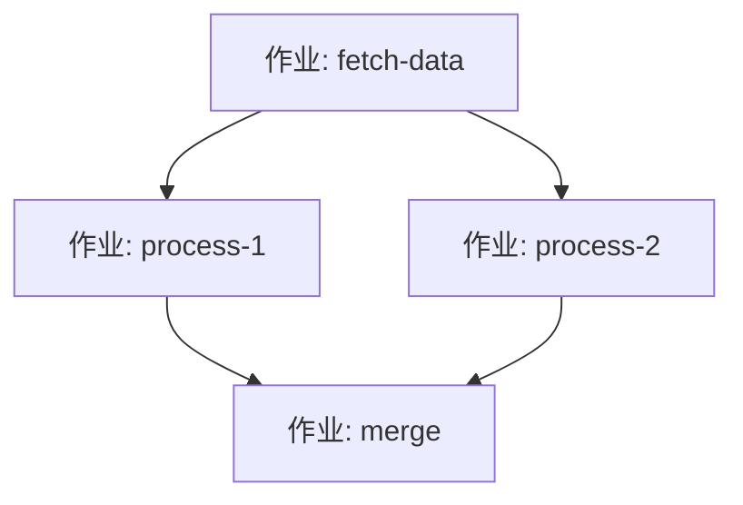
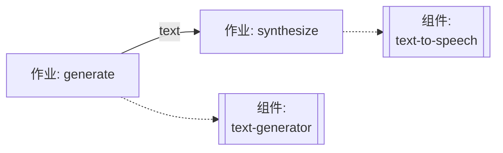
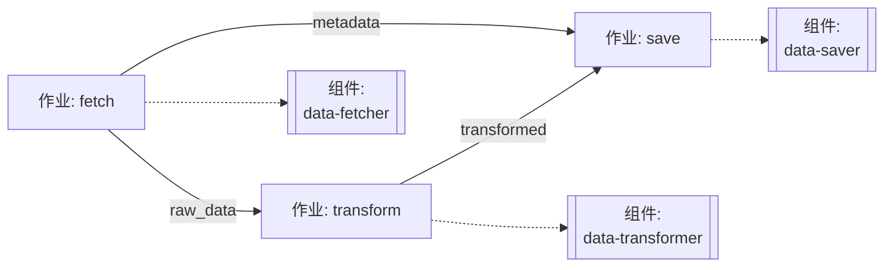
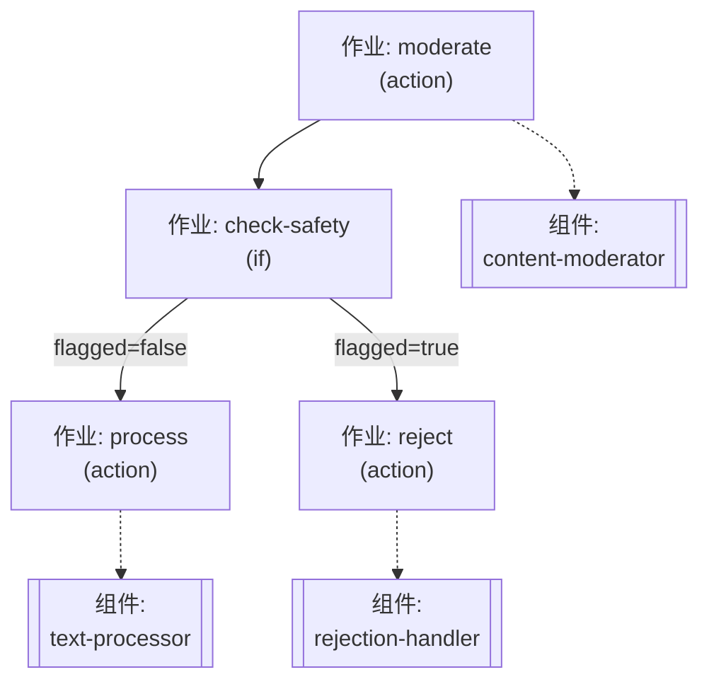
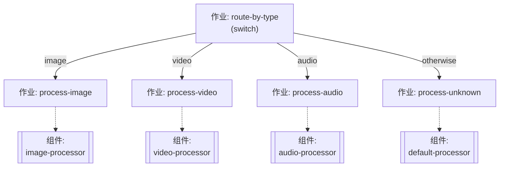
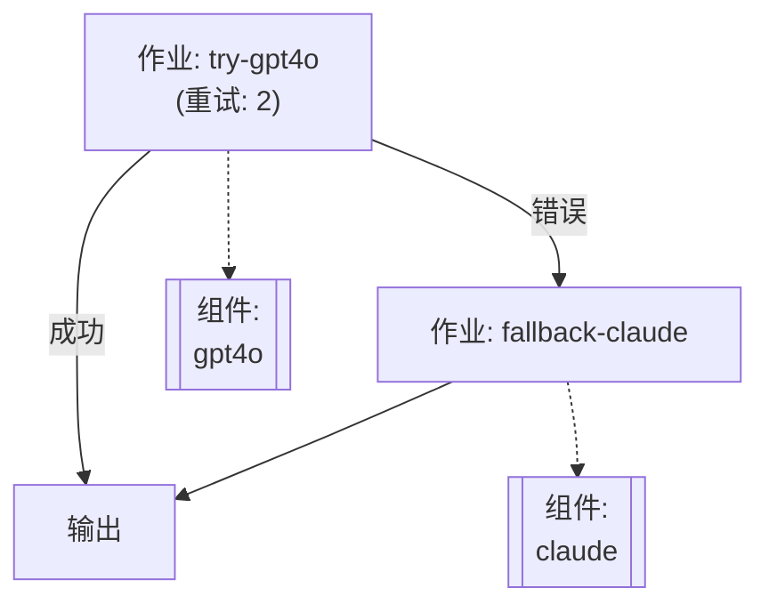

# 第 5 章：编写工作流

本章介绍如何在 model-compose 中编写工作流。从单作业工作流到复杂的多步骤流水线，您将学习作业之间的数据传递、条件执行、流式模式和错误处理。

## 5.1 什么是工作流？

**工作流**是一个执行单元，它组合一个或多个作业来形成一个完整的执行流水线。编写工作流时，您需要定义三个核心元素：

### 1. 作业定义
每个作业指定要执行的组件以及要传递给该组件的输入。

```yaml
jobs:
  - id: my-task
    component: my-component
    input:
      field: ${input.value}
```

### 2. 作业依赖关系
使用 `depends_on` 字段显式定义作业之间的执行顺序。这允许您创建顺序执行、并行执行或复杂的执行图。

```yaml
jobs:
  - id: task1
    component: component1

  - id: task2
    component: component2
    depends_on: [task1]  # task1 完成后执行
```

### 3. 输入/输出定义
- **input**: 将工作流输入或前一个作业的输出映射到当前作业的输入
- **output**: 将作业的结果用作工作流输出或作为后续作业的输入

每个作业的输出存储在 `${jobs.job_id.output}` 中，可以被后续作业作为输入引用。

```yaml
jobs:
  - id: task1
    component: component1
    input:
      data: ${input.user_data}     # 使用工作流输入
    output:
      result: ${output.processed}
    # 输出存储在 jobs.task1.output

  - id: task2
    component: component2
    input:
      data: ${jobs.task1.output.result}  # 使用 task1 的输出作为输入
    depends_on: [task1]
```

通过组合这三个元素，您可以构建从简单的单作业到复杂的多步骤流水线的工作流。

---

## 5.2 单作业工作流

最简单的工作流形式只包含一个作业。

### 基本结构

```yaml
workflows:
  - id: simple-workflow
    jobs:
      - id: task
        component: my-component
        input:
          field: ${input.value}
```

### 简化形式

当只有一个作业时，可以省略 `jobs` 和作业 `id`。如果省略 `id`，则默认为 `__job__`。

```yaml
workflows:
  - id: simple-workflow
    component: my-component
    input:
      field: ${input.value}
```

### 示例：文本生成

```yaml
components:
  - id: gpt4o
    type: http-client
    endpoint: https://api.openai.com/v1/chat/completions
    headers:
      Authorization: Bearer ${env.OPENAI_API_KEY}
      Content-Type: application/json
    body:
      model: gpt-4o
      messages:
        - role: user
          content: ${input.prompt}
    output:
      text: ${response.choices[0].message.content}

workflows:
  - id: generate-text
    jobs:
      - id: generate
        component: gpt4o
        input:
          prompt: ${input.prompt}
        output:
          result: ${output.text}
```

执行：
```bash
model-compose run generate-text --input '{"prompt": "Hello, AI!"}'
```

---

## 5.3 多步骤工作流

顺序执行多个作业的工作流。

### 作业依赖关系 (depends_on)

使用 `depends_on` 字段显式定义作业之间的执行顺序。此字段指定在当前作业开始之前必须完成的作业 ID 列表。

**基本格式：**
```yaml
depends_on: [job-id-1, job-id-2]
```

**关键特性：**
- 可以以数组形式指定对多个作业的依赖
- 在所有依赖作业完成后执行
- 没有依赖关系的作业可以并行运行
- 不允许循环依赖

### 顺序执行

```yaml
workflows:
  - id: multi-step
    jobs:
      - id: step1
        component: component1
        input: ${input}
        output:
          data1: ${output}

      - id: step2
        component: component2
        input:
          data: ${jobs.step1.output.data1}
        output:
          data2: ${output}
        depends_on: [step1]  # step1 完成后执行

      - id: step3
        component: component3
        input:
          data: ${jobs.step2.output.data2}
        depends_on: [step2]  # step2 完成后执行
```

### 并行执行

没有依赖关系的作业并发运行：

```yaml
workflows:
  - id: parallel-workflow
    jobs:
      - id: task-a
        component: component-a
        input: ${input}
        output:
          result-a: ${output}

      - id: task-b
        component: component-b
        input: ${input}
        output:
          result-b: ${output}
      # task-a 和 task-b 并行运行

      - id: combine
        component: combiner
        input:
          data-a: ${jobs.task-a.output.result-a}
          data-b: ${jobs.task-b.output.result-b}
        depends_on: [task-a, task-b]  # 两个任务完成后执行
```

### 复杂依赖图

```yaml
workflows:
  - id: complex-workflow
    jobs:
      - id: fetch-data
        component: data-fetcher
        output:
          raw: ${output}

      - id: process-1
        component: processor-1
        input: ${jobs.fetch-data.output.raw}
        depends_on: [fetch-data]
        output:
          processed-1: ${output}

      - id: process-2
        component: processor-2
        input: ${jobs.fetch-data.output.raw}
        depends_on: [fetch-data]
        output:
          processed-2: ${output}

      - id: merge
        component: merger
        input:
          data-1: ${jobs.process-1.output.processed-1}
          data-2: ${jobs.process-2.output.processed-2}
        depends_on: [process-1, process-2]
        output:
          merged: ${output}
```

结构图：


### 示例：文本生成和语音合成

```yaml
components:
  - id: text-generator
    type: http-client
    endpoint: https://api.openai.com/v1/chat/completions
    headers:
      Authorization: Bearer ${env.OPENAI_API_KEY}
      Content-Type: application/json
    body:
      model: gpt-4o
      messages:
        - role: user
          content: ${input.prompt}
    output:
      text: ${response.choices[0].message.content}

  - id: text-to-speech
    type: http-client
    endpoint: https://api.elevenlabs.io/v1/text-to-speech/${input.voice_id}
    headers:
      xi-api-key: ${env.ELEVENLABS_API_KEY}
      Content-Type: application/json
    body:
      text: ${input.text}
      model_id: eleven_multilingual_v2
    output: ${response as base64}

workflows:
  - id: text-to-voice
    jobs:
      - id: generate
        component: text-generator
        input:
          prompt: ${input.prompt}
        output:
          text: ${output.text}

      - id: synthesize
        component: text-to-speech
        input:
          text: ${jobs.generate.output.text}
          voice_id: ${input.voice_id}
        output:
          audio: ${output}
        depends_on: [ generate ]
```

结构图：


---

## 5.4 作业之间的数据传递

如何在工作流中的作业之间传递数据。

### 变量绑定语法

```yaml
${input.field}              # 工作流输入
${output.field}             # 当前作业输出
${jobs.job-id.output.field} # 特定作业输出
${env.VAR_NAME}             # 环境变量
```

### 示例：复杂数据传递

```yaml
workflows:
  - id: data-pipeline
    jobs:
      - id: fetch
        component: data-fetcher
        input:
          url: ${input.source_url}
        output:
          raw_data: ${output.data}
          metadata: ${output.meta}

      - id: transform
        component: data-transformer
        input:
          data: ${jobs.fetch.output.raw_data}
          options:
            format: json
            encoding: utf-8
        output:
          transformed: ${output.result}
        depends_on: [ fetch ]

      - id: save
        component: data-saver
        input:
          data: ${jobs.transform.output.transformed}
          metadata: ${jobs.fetch.output.metadata}
          destination: ${input.target_path}
        depends_on: [ transform, fetch ]
```

结构图：


### 类型转换

在数据传递期间可以应用类型转换：

```yaml
workflows:
  - id: image-workflow
    jobs:
      - id: generate
        component: image-generator
        output:
          image_base64: ${output as base64}

      - id: process
        component: image-processor
        input:
          image: ${jobs.generate.output.image_base64 as image/png;base64}
```

---

## 5.5 作业类型

model-compose 提供各种作业类型来支持不同的任务模式。

### 可用的作业类型

| 类型 | 用途 | 说明 |
|------|---------|-------------|
| `action` | 组件执行 | 调用组件执行任务（默认类型） |
| `if` | 条件分支 | 根据条件路由到不同的作业 |
| `switch` | 多路分支 | 根据值路由到多个路径之一 |
| `delay` | 等待 | 等待指定的持续时间 |
| `filter` | 数据重组 | 提取和重组数据为新形状 |
| `random-router` | 随机路由 | 随机选择一个作业 |

> **注意**: 如果未指定 `type`，则默认为 `action`。

### Action 作业

执行组件的默认作业类型。

```yaml
jobs:
  - id: my-task
    type: action  # 可选（默认）
    component: my-component
    action: my-action  # 对于多动作组件
    input: ${input}
    output:
      result: ${output}
```

### If 作业

根据条件分支到不同的作业。

#### 基本结构

```yaml
jobs:
  - id: condition-check
    type: if
    operator: eq          # 比较运算符
    input: ${input.value}
    value: "expected"
    if_true: job-when-true
    if_false: job-when-false
```

#### 支持的运算符

- `eq`: 等于
- `neq`: 不等于
- `gt`: 大于
- `gte`: 大于或等于
- `lt`: 小于
- `lte`: 小于或等于
- `in`: 包含
- `not-in`: 不包含
- `starts-with`: 以...开始
- `ends-with`: 以...结束
- `match`: 正则表达式匹配

#### 多个条件

```yaml
jobs:
  - id: multi-condition
    type: if
    conditions:
      - operator: gt
        input: ${input.score}
        value: 80
        if_true: excellent-handler
      - operator: gt
        input: ${input.score}
        value: 60
        if_true: good-handler
    otherwise: need-improvement-handler
```

### Switch 作业

根据值路由到多个路径之一。

#### 基本结构

```yaml
jobs:
  - id: route-by-type
    type: switch
    input: ${input.type}
    cases:
      - value: "image"
        then: process-image
      - value: "video"
        then: process-video
      - value: "audio"
        then: process-audio
    otherwise: process-unknown
```

### Delay 作业

等待指定的持续时间或直到特定时间。

#### 时间间隔等待 (time-interval)

```yaml
jobs:
  - id: wait
    type: delay
    mode: time-interval
    duration: 5000  # 毫秒
```

#### 等待到特定时间 (specific-time)

```yaml
jobs:
  - id: wait-until
    type: delay
    mode: specific-time
    time: "2024-12-25T09:00:00"
    timezone: "Asia/Seoul"  # 可选
```

### Filter 作业

提取数据的部分并重组为新形状。

```yaml
jobs:
  - id: reshape-data
    type: filter
    output:
      user_id: ${input.user.id}
      user_name: ${input.user.profile.name}
      score: ${input.metrics.score}
```

### Random Router 作业

随机选择多个作业之一。使用 `weight` 来调整每个路由的概率。

#### 均等分布 (50:50)

```yaml
jobs:
  - id: ab-test
    type: random-router
    routes:
      - id: variant-a
        weight: 50
      - id: variant-b
        weight: 50
```

#### 不均等分布 (70:20:10)

```yaml
jobs:
  - id: traffic-split
    type: random-router
    routes:
      - id: primary-model
        weight: 70
      - id: experimental-model
        weight: 20
      - id: fallback-model
        weight: 10
```

> **注意**: 权重值不需要总和为 100。它们作为相对比例工作。

---

## 5.6 条件执行

使用 If 和 Switch 作业根据条件控制执行流程。

### 示例 1: 使用 If 作业进行内容过滤

```yaml
components:
  - id: content-moderator
    type: http-client
    endpoint: https://api.openai.com/v1/moderations
    headers:
      Authorization: Bearer ${env.OPENAI_API_KEY}
      Content-Type: application/json
    body:
      input: ${input.text}
    output:
      flagged: ${response.results[0].flagged}

  - id: text-processor
    type: http-client
    endpoint: https://api.openai.com/v1/chat/completions
    headers:
      Authorization: Bearer ${env.OPENAI_API_KEY}
      Content-Type: application/json
    body:
      model: gpt-4o
      messages:
        - role: user
          content: ${input.text}
    output:
      result: ${response.choices[0].message.content}

  - id: rejection-handler
    type: http-client
    endpoint: https://api.example.com/log-rejection
    method: POST
    body:
      text: ${input.text}
      reason: "content_flagged"
    output: ${response}

workflows:
  - id: safe-processing
    jobs:
      - id: moderate
        component: content-moderator
        input:
          text: ${input.text}
        output:
          flagged: ${output.flagged}

      - id: check-safety
        type: if
        operator: eq
        input: ${jobs.moderate.output.flagged}
        value: false
        if_true: process
        if_false: reject
        depends_on: [ moderate ]

      - id: process
        component: text-processor
        input:
          text: ${input.text}
        output:
          result: ${output.result}

      - id: reject
        component: rejection-handler
        input:
          text: ${input.text}
```

结构图：


### 示例 2: 使用 Switch 作业处理媒体类型

```yaml
components:
  - id: image-processor
    type: http-client
    endpoint: https://api.example.com/process-image
    body:
      image: ${input.data}
    output: ${response}

  - id: video-processor
    type: http-client
    endpoint: https://api.example.com/process-video
    body:
      video: ${input.data}
    output: ${response}

  - id: audio-processor
    type: http-client
    endpoint: https://api.example.com/process-audio
    body:
      audio: ${input.data}
    output: ${response}

  - id: default-processor
    type: http-client
    endpoint: https://api.example.com/process-unknown
    body:
      data: ${input.data}
    output: ${response}

workflows:
  - id: media-processing
    jobs:
      - id: route-by-type
        type: switch
        input: ${input.media_type}
        cases:
          - value: "image"
            then: process-image
          - value: "video"
            then: process-video
          - value: "audio"
            then: process-audio
        otherwise: process-unknown

      - id: process-image
        component: image-processor
        input:
          data: ${input.data}
        depends_on: [ route-by-type ]

      - id: process-video
        component: video-processor
        input:
          data: ${input.data}
        depends_on: [ route-by-type ]

      - id: process-audio
        component: audio-processor
        input:
          data: ${input.data}
        depends_on: [ route-by-type ]

      - id: process-unknown
        component: default-processor
        input:
          data: ${input.data}
        depends_on: [ route-by-type ]
```

结构图：


---

## 5.7 流式模式

当组件支持流式传输时，您可以实时流式传输数据。

> **有关更多详细信息，请参阅 [第 11 章：流式模式](./11-streaming-mode.md)。**

### 组件中的流式配置

#### Model 组件

Model 组件通过在动作级别设置 `streaming: true` 来启用流式传输：

```yaml
components:
  - id: local-llm
    type: model
    task: text-generation
    model:
      provider: huggingface
      repository: meta-llama/Llama-2-7b-hf
      token: ${env.HUGGINGFACE_TOKEN}
    text: ${input.prompt}
    streaming: true  # 启用流式传输
```

#### HTTP 组件

`http-client` 和 `http-server` 组件在 API 返回流式响应时自动切换到流式模式：

```yaml
components:
  - id: gpt4o-stream
    type: http-client
    endpoint: https://api.openai.com/v1/chat/completions
    headers:
      Authorization: Bearer ${env.OPENAI_API_KEY}
      Content-Type: application/json
    body:
      model: gpt-4o
      messages: ${input.messages}
      stream: true  # 从 API 请求流式传输
    output: ${response}
```

> **注意**: `http-client` 和 `http-server` 会自动检测来自 API 的流式响应，因此不需要显式的 `streaming` 设置。

### 在工作流中使用流式传输

```yaml
workflows:
  - id: chat
    jobs:
      - id: respond
        component: gpt4o-stream
        input:
          messages: ${input.messages}
    output: ${output}
```

> **注意**: 如果组件的输出是流，则作业的输出也是流。如果最后一个作业的输出是流，则工作流输出也作为流返回。

### 通过 HTTP API 请求流式传输

```bash
curl -X POST http://localhost:8080/api/workflows/runs \
  -H "Content-Type: application/json" \
  -d '{
    "workflow_id": "chat",
    "input": {
      "messages": [
        {"role": "user", "content": "Tell me a story"}
      ]
    }
  }'
```

> **注意**: 流式响应以服务器发送事件 (SSE) 格式传递。

---

## 5.8 错误处理

处理工作流执行期间可能发生的错误。

### 重试配置

```yaml
workflows:
  - id: resilient-workflow
    jobs:
      - id: api-call
        component: external-api
        retry:
          max_retry_count: 3
          delay: 1000  # 毫秒
          backoff: exponential
        input: ${input}
```

### 回退处理

```yaml
workflows:
  - id: fallback-workflow
    jobs:
      - id: primary
        component: primary-service
        input: ${input}
        on_error: continue

      - id: fallback
        component: fallback-service
        condition: ${jobs.primary.error}
        input: ${input}
```

### 示例：多模型回退

```yaml
components:
  - id: gpt4o
    type: http-client
    endpoint: https://api.openai.com/v1/chat/completions
    headers:
      Authorization: Bearer ${env.OPENAI_API_KEY}
      Content-Type: application/json
    body:
      model: gpt-4o
      messages: ${input.messages}
    output:
      text: ${response.choices[0].message.content}

  - id: claude
    type: http-client
    endpoint: https://api.anthropic.com/v1/messages
    headers:
      x-api-key: ${env.ANTHROPIC_API_KEY}
      anthropic-version: "2023-06-01"
      Content-Type: application/json
    body:
      model: claude-3-5-sonnet-20241022
      messages: ${input.messages}
      max_tokens: 1024
    output:
      text: ${response.content[0].text}

workflows:
  - id: robust-chat
    jobs:
      - id: try-gpt4o
        component: gpt4o
        retry:
          max_retry_count: 2
          delay: 500
        input:
          messages: ${input.messages}
        output:
          result: ${output.text}
        on_error: continue

      - id: fallback-claude
        component: claude
        condition: ${jobs.try-gpt4o.error}
        input:
          messages: ${input.messages}
        output:
          result: ${output.text}
        depends_on: [ try-gpt4o ]
```

结构图：


### 访问错误信息

```yaml
workflows:
  - id: error-logging
    jobs:
      - id: risky-operation
        component: risky-api
        input: ${input}
        on_error: continue

      - id: log-error
        component: error-logger
        condition: ${jobs.risky-operation.error}
        input:
          error_message: ${jobs.risky-operation.error.message}
          error_code: ${jobs.risky-operation.error.code}
          timestamp: ${jobs.risky-operation.error.timestamp}
        depends_on: [ risky-operation ]
```

---

## 5.9 工作流最佳实践

### 1. 清晰的作业名称

```yaml
# 好的示例
workflows:
  - id: user-onboarding
    jobs:
      - id: validate-email
        component: email-validator
      - id: create-account
        component: account-creator
      - id: send-welcome-email
        component: email-sender

# 不好的示例
workflows:
  - id: workflow1
    jobs:
      - id: step1
        component: comp1
      - id: step2
        component: comp2
```

### 2. 作业分解

将复杂逻辑分解为较小的作业：

```yaml
# 好的示例 - 清晰的步骤分离
workflows:
  - id: content-pipeline
    jobs:
      - id: fetch-content
        component: content-fetcher
      - id: validate-content
        component: content-validator
      - id: transform-content
        component: content-transformer
      - id: publish-content
        component: content-publisher

# 不好的示例 - 一个庞大的作业
workflows:
  - id: content-pipeline
    jobs:
      - id: process-everything
        component: monolithic-processor
```

### 3. 可重用工作流

```yaml
components:
  - id: preprocessing-workflow
    type: workflow
    workflow: preprocessing

workflows:
  - id: preprocessing
    jobs:
      - id: clean
        component: data-cleaner
      - id: normalize
        component: data-normalizer

  - id: analysis
    jobs:
      - id: preprocess
        component: preprocessing-workflow
        input: ${input.raw_data}
      - id: analyze
        component: analyzer
        input: ${jobs.preprocess.output}
        depends_on: [ preprocess ]
```

### 4. 记录输入和输出

```yaml
workflows:
  - id: image-generation
    # 输入: { prompt: string, style: string, size: string }
    # 输出: { image_url: string, width: number, height: number }
    jobs:
      - id: generate
        component: image-generator
        input:
          prompt: ${input.prompt}
          style: ${input.style}
          size: ${input.size}
```

### 5. 考虑错误处理

始终为关键作业添加重试或回退逻辑：

```yaml
workflows:
  - id: critical-workflow
    jobs:
      - id: important-task
        component: critical-service
        retry:
          max_retry_count: 3
          delay: 1000
        on_error: continue

      - id: fallback-task
        component: backup-service
        condition: ${jobs.important-task.error}
        depends_on: [ important-task ]
```

---

## 下一步

尝试以下内容：
- 从简单的单作业工作流开始
- 逐渐扩展到复杂的多步骤工作流
- 添加错误处理和重试逻辑
- 构建可重用的工作流组件

---

**下一章**: [6. 控制器配置](./06-controller-configuration.md)
