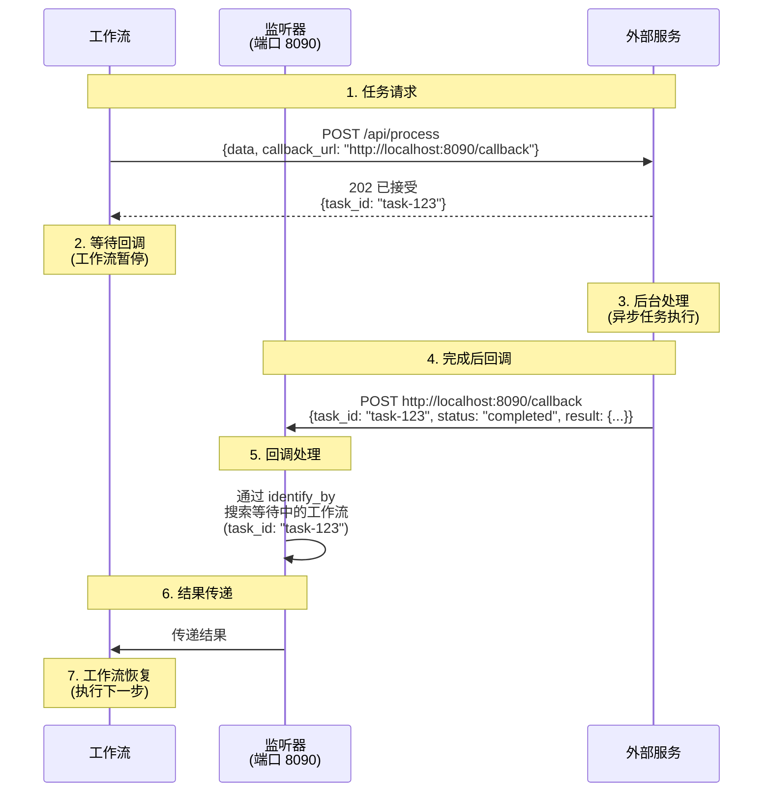
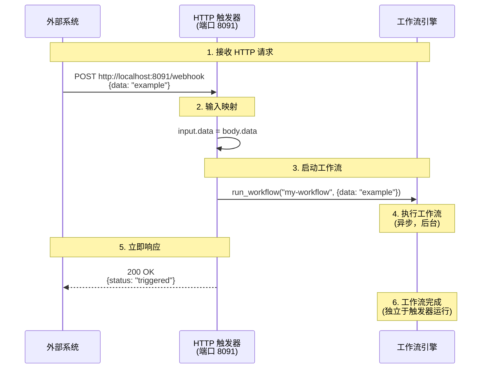
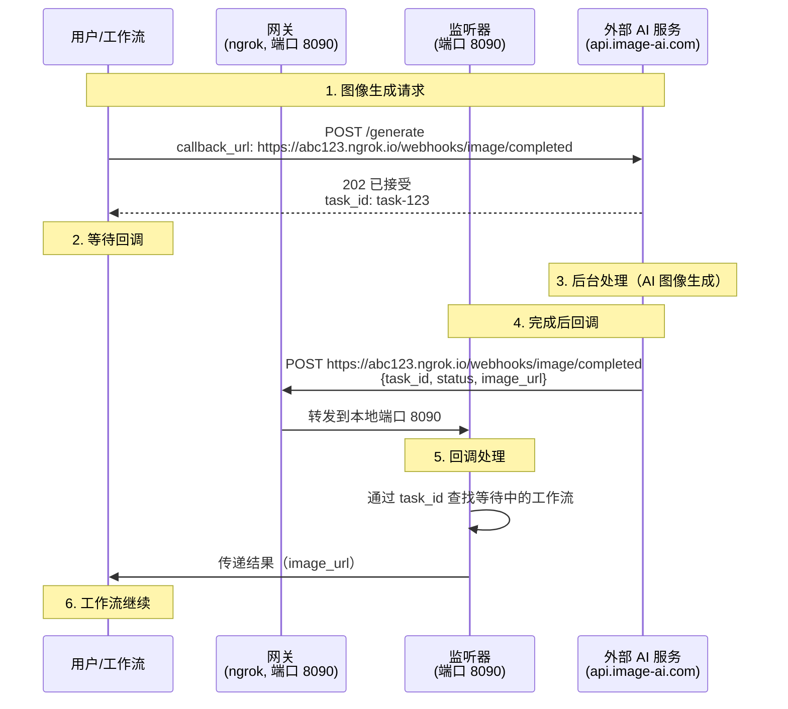

# 13. 系统集成

本章介绍用于与外部系统集成的监听器和网关。

---

## 13.1 监听器概述

监听器是用于与外部系统通信的 HTTP 服务器。有两种类型：

### 监听器类型

**1. HTTP 回调 (http-callback)**
- 接收来自外部服务的**异步回调**，并将结果传递给**等待中的工作流**
- 使用场景：异步 API 集成（图像生成、视频处理、支付处理等）
- 行为：工作流在等待回调时暂停

**2. HTTP 触发器 (http-trigger)**
- 接收来自外部来源的 HTTP 请求，并**立即启动工作流**
- 使用场景：接收 Webhook、提供 REST API 端点
- 行为：每个请求启动一个新的工作流实例

### 对比

| 功能 | HTTP 回调 | HTTP 触发器 |
|---------|--------------|--------------|
| **用途** | 接收异步任务结果 | 启动工作流 |
| **工作流** | 已在运行（等待状态） | 新启动 |
| **响应** | 传递给等待中的工作流 | 立即启动工作流 |
| **示例** | 外部 API 回调、支付完成 | Webhook 接收、REST API |
| **标识符** | 通过 `identify_by` 匹配等待中的工作流 | 总是启动新工作流 |

---

## 13.2 HTTP 回调监听器

HTTP 回调监听器接收来自外部服务的异步回调。当与在任务完成后将结果发送到回调 URL 的服务集成时很有用。

### 13.2.1 HTTP 回调概述

许多外部服务不会立即返回结果，而是将任务排队并稍后将结果发送到回调 URL：

1. 客户端向外部服务发送任务请求（包括回调 URL）
2. 外部服务立即返回任务 ID
3. 外部服务在后台处理任务
4. 完成后，向回调 URL 发送结果
5. 监听器接收回调并将结果传递给等待中的工作流

### 13.2.2 基本 HTTP 回调配置

**简单回调监听器：**

```yaml
listener:
  type: http-callback
  host: 0.0.0.0
  port: 8090
  path: /callback
  method: POST
```

这将在 `http://0.0.0.0:8090/callback` 创建一个接受 POST 请求的端点。

### 13.2.3 回调端点配置

**单个回调端点：**

```yaml
listener:
  type: http-callback
  host: 0.0.0.0
  port: 8090
  path: /webhook/completed           # 回调路径
  method: POST                        # HTTP 方法
  identify_by: ${body.task_id}       # 任务标识符
  status: ${body.status}              # 状态字段
  success_when:                       # 成功状态值
    - "completed"
    - "success"
  fail_when:                          # 失败状态值
    - "failed"
    - "error"
  result: ${body.result}              # 结果提取路径
```

**多个回调端点：**

```yaml
listener:
  type: http-callback
  host: 0.0.0.0
  port: 8090
  base_path: /webhooks                # 通用基础路径
  callbacks:
    # 图像生成完成回调
    - path: /image/completed
      method: POST
      identify_by: ${body.request_id}
      status: ${body.status}
      success_when: ["completed"]
      fail_when: ["failed"]
      result: ${body.image_url}

    # 视频处理完成回调
    - path: /video/completed
      method: POST
      identify_by: ${body.task_id}
      status: ${body.state}
      success_when: ["done"]
      fail_when: ["error", "timeout"]
      result: ${body.output}

    # 通用任务完成回调
    - path: /task/callback
      method: POST
      identify_by: ${body.id}
      result: ${body.data}
```

### 13.2.4 回调字段说明

| 字段 | 说明 | 必需 | 默认值 |
|-------|-------------|----------|---------|
| `path` | 回调端点路径 | 是 | - |
| `method` | HTTP 方法 | 否 | `POST` |
| `identify_by` | 任务标识字段路径 | 否 | `__callback__` |
| `status` | 状态检查字段路径 | 否 | - |
| `success_when` | 成功状态值列表 | 否 | - |
| `fail_when` | 失败状态值列表 | 否 | - |
| `result` | 结果提取字段路径 | 否 | 整个 body |
| `bulk` | 在单个请求中处理多个项目 | 否 | `false` |
| `item` | 批量模式下的项目提取路径 | 否 | - |

### 13.2.5 批量回调处理

当在单个回调请求中接收多个任务的结果时：

```yaml
listener:
  type: http-callback
  host: 0.0.0.0
  port: 8090
  path: /batch/completed
  method: POST
  bulk: true                          # 启用批量模式
  item: ${body.results}               # 结果数组路径
  identify_by: ${item.task_id}        # 每个项目的标识符
  status: ${item.status}
  success_when: ["completed"]
  result: ${item.data}
```

回调请求示例：
```json
{
  "results": [
    {
      "task_id": "task-1",
      "status": "completed",
      "data": {"url": "https://example.com/result1.png"}
    },
    {
      "task_id": "task-2",
      "status": "completed",
      "data": {"url": "https://example.com/result2.png"}
    }
  ]
}
```

### 13.2.6 高级 HTTP 回调配置

**并发控制：**

```yaml
listener:
  type: http-callback
  host: 0.0.0.0
  port: 8090
  max_concurrent_count: 10            # 最大并发回调处理数
  path: /callback
  method: POST
```

**运行时配置：**

```yaml
listener:
  type: http-callback
  runtime: native                     # 或 docker
  host: 0.0.0.0
  port: 8090
  path: /callback
```

### 13.2.7 HTTP 回调工作原理

监听器接收来自外部服务的回调并将结果传递给等待中的工作流。

**基本结构：**

```yaml
listener:
  type: http-callback
  host: 0.0.0.0
  port: 8090
  path: /callback
  identify_by: ${body.task_id}        # 识别哪个工作流
  result: ${body.result}              # 提取结果
```

**工作流执行流程：**



**分步说明：**

1. **工作流启动**：向外部服务发送请求（包括回调 URL）
2. **立即响应**：外部服务返回任务 ID
3. **等待状态**：工作流暂停等待回调
4. **后台处理**：外部服务执行异步任务
5. **发送回调**：完成后，向回调 URL 发送结果
6. **监听器接收**：监听器接收回调并使用 `identify_by` 查找工作流
7. **工作流恢复**：将结果传递给工作流并执行下一步

**重要提示**：监听器仅在本地端口上运行。要从外部来源访问，您需要一个**网关**（第 13.4 节）。第 **13.5 节**涵盖了使用网关的完整示例。

### 13.2.8 回调数据映射

监听器可以从回调请求中提取和映射各种字段。

**单字段提取：**

```yaml
listener:
  path: /webhook
  identify_by: ${body.task_id}
  result: ${body.output.url}          # 嵌套字段访问
```

**多字段提取：**

```yaml
listener:
  path: /webhook
  identify_by: ${body.task_id}
  result:
    url: ${body.output.url}
    width: ${body.output.width}
    height: ${body.output.height}
    size: ${body.output.file_size}
```

**使用查询参数：**

```yaml
listener:
  path: /webhook
  identify_by: ${query.task_id}       # 从 URL 查询提取
  result: ${body}
```

回调请求示例：
```
POST http://localhost:8090/webhook?task_id=task-123
Content-Type: application/json

{
  "status": "completed",
  "output": {
    "url": "https://example.com/result.png"
  }
}
```

---

## 13.3 HTTP 触发器监听器

HTTP 触发器监听器接收来自外部来源的 HTTP 请求并立即启动工作流。可用作 REST API 端点或 Webhook 接收器。

### 13.3.1 HTTP 触发器概述

HTTP 触发器在以下情况下很有用：

- 从外部系统接收 Webhook（GitHub、Slack、Discord 等）
- 提供 REST API 端点
- 手动触发工作流
- 事件驱动的自动化需求

**与 HTTP 回调的区别：**
- HTTP 回调：将结果传递给已在运行的工作流
- HTTP 触发器：启动新的工作流实例

### 13.3.2 基本 HTTP 触发器配置

**简单触发器监听器：**

```yaml
listener:
  type: http-trigger
  host: 0.0.0.0
  port: 8091
  path: /trigger/my-workflow
  method: POST
  workflow: my-workflow
  input:
    data: ${body.data}
```

这将在 `http://0.0.0.0:8091/trigger/my-workflow` 创建一个端点，在接收到 POST 请求时启动 `my-workflow`。

### 13.3.3 触发器端点配置

**单个触发器端点：**

```yaml
listener:
  type: http-trigger
  host: 0.0.0.0
  port: 8091
  path: /webhooks/deploy
  method: POST
  workflow: deployment-workflow
  input:
    repo: ${body.repository.name}
    branch: ${body.ref}
    commit: ${body.head_commit.id}
```

**多个触发器端点：**

```yaml
listener:
  type: http-trigger
  host: 0.0.0.0
  port: 8091
  base_path: /api
  triggers:
    # GitHub 推送事件
    - path: /github/push
      method: POST
      workflow: ci-build
      input:
        repository: ${body.repository.name}
        branch: ${body.ref}
        pusher: ${body.pusher.name}

    # Slack 斜杠命令
    - path: /slack/command
      method: POST
      workflow: slack-handler
      input:
        command: ${body.command}
        text: ${body.text}
        user: ${body.user_name}
        channel: ${body.channel_id}

    # 手动触发
    - path: /manual/process
      method: POST
      workflow: data-processing
      input:
        file_url: ${body.file_url}
        options: ${body.options}
```

### 13.3.4 触发器字段说明

| 字段 | 说明 | 必需 | 默认值 |
|-------|-------------|----------|---------|
| `path` | 触发器端点路径 | 是 | - |
| `method` | HTTP 方法 | 否 | `POST` |
| `workflow` | 要执行的工作流 ID | 是 | - |
| `input` | 工作流输入映射 | 否 | 整个 body |
| `bulk` | 在单个请求中执行多个工作流 | 否 | `false` |
| `item` | 批量模式下的项目提取路径 | 否 | - |

### 13.3.5 批量触发器处理

一次处理多个项目，为每个项目执行工作流：

```yaml
listener:
  type: http-trigger
  host: 0.0.0.0
  port: 8091
  path: /batch/process
  method: POST
  bulk: true
  item: ${body.items}
  workflow: item-processor
  input:
    item_id: ${item.id}
    data: ${item.data}
```

请求示例：
```json
{
  "items": [
    {"id": "item-1", "data": {"name": "Product A"}},
    {"id": "item-2", "data": {"name": "Product B"}},
    {"id": "item-3", "data": {"name": "Product C"}}
  ]
}
```

此请求启动 3 个独立的工作流实例。

### 13.3.6 HTTP 触发器工作原理

**基本结构：**

```yaml
listener:
  type: http-trigger
  port: 8091
  path: /webhook
  workflow: my-workflow
  input:
    data: ${body.data}
```

**执行流程：**



**分步说明：**

1. **接收请求**：外部系统向触发器端点发送 HTTP 请求
2. **输入映射**：根据 `input` 配置将请求数据转换为工作流输入
3. **启动工作流**：异步启动新的工作流实例
4. **立即响应**：立即返回响应而不等待工作流完成
5. **后台执行**：工作流独立运行至完成

**重要提示**：HTTP 触发器仅启动工作流并立即返回。要接收工作流结果，您需要单独的机制（HTTP 回调、数据库查询等）。

### 13.3.7 输入数据映射

您可以将 HTTP 请求中的各种字段映射到工作流输入。

**Body 字段提取：**

```yaml
listener:
  type: http-trigger
  path: /webhook
  workflow: my-workflow
  input:
    name: ${body.user.name}
    email: ${body.user.email}
    action: ${body.action}
```

**使用查询参数：**

```yaml
listener:
  type: http-trigger
  path: /webhook
  workflow: my-workflow
  input:
    token: ${query.token}
    mode: ${query.mode}
    data: ${body}
```

请求示例：
```
POST http://localhost:8091/webhook?token=abc123&mode=test
Content-Type: application/json

{
  "user": "john",
  "action": "process"
}
```

**复杂映射：**

```yaml
listener:
  type: http-trigger
  path: /webhook
  workflow: my-workflow
  input:
    auth:
      token: ${query.token}
      user: ${body.user}
    payload:
      data: ${body.data}
      timestamp: ${body.timestamp}
```

### 13.3.8 实际示例

**GitHub Webhook 处理：**

```yaml
listener:
  type: http-trigger
  host: 0.0.0.0
  port: 8091
  path: /github/webhook
  method: POST
  workflow: github-ci
  input:
    event: ${body.action}
    repository: ${body.repository.full_name}
    branch: ${body.pull_request.head.ref}
    author: ${body.pull_request.user.login}

workflow:
  id: github-ci
  title: GitHub CI Pipeline
  jobs:
    - id: checkout
      component: git-clone
      input:
        repo: ${input.repository}
        branch: ${input.branch}

    - id: test
      component: run-tests
      depends_on: [checkout]

    - id: notify
      component: github-status
      depends_on: [test]
      input:
        status: ${jobs.test.output.success}
```

**Slack Webhook 处理：**

```yaml
listener:
  type: http-trigger
  host: 0.0.0.0
  port: 8091
  path: /slack/events
  method: POST
  workflow: slack-bot
  input:
    event_type: ${body.event.type}
    user: ${body.event.user}
    channel: ${body.event.channel}
    text: ${body.event.text}

workflow:
  id: slack-bot
  title: Slack Bot Handler
  jobs:
    - id: process-message
      component: nlp-analyzer
      input:
        text: ${input.text}

    - id: reply
      component: slack-client
      depends_on: [process-message]
      input:
        channel: ${input.channel}
        text: "Processing complete: ${jobs.process-message.output.result}"
```

---

## 13.4 网关 - HTTP 隧道

网关是用于将本地运行的服务暴露到互联网的隧道服务。在开发中测试 Webhook 或需要外部访问本地服务时很有用。

### 13.4.1 网关概述

在以下场景中需要网关：

- 在本地开发中测试外部 Webhook
- 暴露防火墙后的服务
- 需要临时公共 URL
- 外部服务需要回调 URL

**支持的网关：**
- HTTP 隧道：ngrok、Cloudflare Tunnel
- SSH 隧道：SSH 反向隧道

### 13.4.2 HTTP 隧道 - ngrok

ngrok 是一个隧道服务，通过公共 URL 暴露本地服务器。

**基本配置：**

```yaml
gateway:
  type: http-tunnel
  driver: ngrok
  port: 8080                          # 要隧道的本地端口
```

这将通过 ngrok 公共 URL 暴露本地端口 8080。

**完整示例：**

```yaml
gateway:
  type: http-tunnel
  driver: ngrok
  port: 8090                          # 与监听器端口相同

listener:
  type: http-callback
  host: 0.0.0.0
  port: 8090
  path: /callback
  identify_by: ${body.task_id}
  result: ${body.result}

components:
  external-service:
    type: http-client
    base_url: https://api.external-service.com
    path: /process
    method: POST
    body:
      data: ${input.data}
      # 使用 gateway:8090.public_url 生成公共 URL
      callback_url: ${gateway:8090.public_url}/callback
      callback_id: ${context.run_id}
    output: ${response}

workflow:
  title: External Service with Gateway
  jobs:
    - id: process
      component: external-service
      input: ${input}
      output: ${output}
```

执行流程：
1. 网关启动：ngrok 使用公共 URL 暴露本地端口 8090（例如 `https://abc123.ngrok.io`）
2. 监听器启动：在端口 8090 上等待回调
3. 工作流执行：`${gateway:8090.public_url}` 被替换为 `https://abc123.ngrok.io`
4. 回调 URL `https://abc123.ngrok.io/callback` 发送到外部服务
5. 外部服务完成后向公共 URL 发送回调
6. ngrok 将请求转发到本地端口 8090
7. 监听器接收回调并将结果传递给工作流

### 13.4.3 HTTP 隧道 - Cloudflare

Cloudflare Tunnel 是一个稳定的隧道服务，可免费使用。

**基本配置：**

```yaml
gateway:
  type: http-tunnel
  driver: cloudflare
  port: 8080
```

**ngrok vs Cloudflare 对比：**

| 功能 | ngrok | Cloudflare |
|---------|-------|------------|
| 免费套餐 | 有限（每小时请求限制） | 无限制 |
| 设置难度 | 简单 | 中等（需要账户） |
| URL 格式 | `https://random.ngrok.io` | `https://random.trycloudflare.com` |
| 稳定性 | 高 | 非常高 |
| 速度 | 快 | 非常快 |

### 13.4.4 SSH 隧道

使用 SSH 反向隧道通过远程服务器暴露本地服务。

**SSH 密钥认证：**

```yaml
gateway:
  type: ssh-tunnel
  port: 8080
  connection:
    host: remote-server.com
    port: 22
    auth:
      type: keyfile
      username: user
      keyfile: ~/.ssh/id_rsa
```

**SSH 密码认证：**

```yaml
gateway:
  type: ssh-tunnel
  port: 8080
  connection:
    host: remote-server.com
    port: 22
    auth:
      type: password
      username: user
      password: ${env.SSH_PASSWORD}
```

SSH 隧道在以下情况下很有用：
- 使用自定义域名
- 防火墙阻止 ngrok/Cloudflare
- 企业环境仅允许批准的服务器

### 13.4.5 高级网关配置

**运行时配置：**

```yaml
gateway:
  type: http-tunnel
  driver: ngrok
  runtime: native                     # 或 docker
  port: 8080
```

**使用网关变量：**

当配置网关时，这些变量可用：

```yaml
gateway:
  type: http-tunnel
  driver: ngrok
  port: 8080

components:
  service:
    type: http-client
    body:
      # 使用公共 URL（gateway:port.public_url 格式）
      webhook_url: ${gateway:8080.public_url}/webhook

      # 端口信息
      local_port: ${gateway:8080.port}
```

### 13.4.6 真实示例：Slack Bot Webhook

```yaml
gateway:
  type: http-tunnel
  driver: cloudflare
  port: 8090                          # 与监听器端口相同

listener:
  type: http-callback
  host: 0.0.0.0
  port: 8090
  base_path: /slack
  callbacks:
    - path: /events
      method: POST
      identify_by: ${body.event.client_msg_id}
      result: ${body.event}

components:
  slack-responder:
    type: http-client
    base_url: https://slack.com/api
    path: /chat.postMessage
    method: POST
    headers:
      Authorization: Bearer ${env.SLACK_BOT_TOKEN}
      Content-Type: application/json
    body:
      channel: ${input.channel}
      text: ${input.text}
    output: ${response}

workflow:
  title: Slack Event Handler
  jobs:
    - id: respond
      component: slack-responder
      input:
        channel: ${input.event.channel}
        text: "Processing complete: ${input.event.text}"
      output: ${output}
```

Slack 应用设置：
1. 创建 Slack 应用（https://api.slack.com/apps）
2. 运行 `model-compose up` 并检查网关日志中的公共 URL
3. 启用事件订阅
4. 在请求 URL 中输入网关公共 URL + 监听器路径（例如 `https://abc123.trycloudflare.com/slack/events`）
5. 颁发 bot token 并设置 `SLACK_BOT_TOKEN` 环境变量

---

## 13.5 同时使用监听器和网关

同时使用监听器和网关可以在本地环境中安全测试外部 Webhook。

### 13.5.1 集成示例：异步图像处理

```yaml
gateway:
  type: http-tunnel
  driver: ngrok
  port: 8090                          # 与监听器端口相同

listener:
  type: http-callback
  host: 0.0.0.0
  port: 8090
  base_path: /webhooks
  max_concurrent_count: 5
  callbacks:
    - path: /image/completed
      method: POST
      identify_by: ${body.task_id}
      status: ${body.status}
      success_when: ["completed", "success"]
      fail_when: ["failed", "error"]
      result:
        url: ${body.output.url}
        width: ${body.output.width}
        height: ${body.output.height}

components:
  image-generator:
    type: http-client
    base_url: https://api.image-ai.com/v1
    path: /generate
    method: POST
    headers:
      Authorization: Bearer ${env.IMAGE_AI_KEY}
    body:
      prompt: ${input.prompt}
      size: ${input.size | "1024x1024"}
      # 网关公共 URL + 监听器路径
      callback_url: ${gateway:8090.public_url}/webhooks/image/completed
      task_id: ${context.run_id}
    output:
      task_id: ${response.task_id}
      status: ${response.status}

  image-optimizer:
    type: http-client
    base_url: https://api.imageoptim.com
    path: /optimize
    method: POST
    headers:
      Authorization: Bearer ${env.IMAGEOPTIM_KEY}
    body:
      url: ${input.url}
      quality: 85
    output:
      optimized_url: ${response.url}
      original_size: ${response.original_size}
      compressed_size: ${response.compressed_size}

workflow:
  title: Image Generation and Optimization
  description: Generate image with AI and optimize it
  jobs:
    # 步骤 1：AI 图像生成（异步）
    - id: generate
      component: image-generator
      input:
        prompt: ${input.prompt}
        size: ${input.size}
      output:
        task_id: ${output.task_id}
        image_url: ${output.url}        # 来自回调的 URL
        width: ${output.width}
        height: ${output.height}

    # 步骤 2：图像优化（同步）
    - id: optimize
      component: image-optimizer
      input:
        url: ${jobs.generate.output.image_url}
      output:
        final_url: ${output.optimized_url}
        original_size: ${output.original_size}
        compressed_size: ${output.compressed_size}
        savings: ${output.original_size - output.compressed_size}
```

### 13.5.2 架构图



**流程说明：**

1. **请求阶段**：工作流向外部 AI 服务发送图像生成请求（网关公共 URL 作为回调 URL）
2. **等待阶段**：工作流等待直到收到回调
3. **处理阶段**：外部服务在后台生成图像
4. **回调阶段**：完成后，向网关公共 URL 发送回调 → 网关转发到本地监听器
5. **匹配阶段**：监听器通过 task_id 查找等待中的工作流
6. **完成阶段**：将结果传递给工作流并继续下一步

### 13.5.3 生产环境注意事项

**本地开发：**
```yaml
gateway:
  type: http-tunnel
  driver: ngrok                       # 开发期间使用 ngrok
  port: 8080

listener:
  host: 0.0.0.0
  port: 8090
```

**生产环境：**
```yaml
# 移除网关配置（使用公共 IP/域名）

controller:
  type: http-server
  host: 0.0.0.0
  port: 443                           # HTTPS
  # 添加 SSL 配置

listener:
  host: 0.0.0.0
  port: 8090

components:
  service:
    body:
      # 使用生产域名
      callback_url: https://api.yourdomain.com/webhooks/callback
      callback_id: ${context.run_id}
```

---

## 13.6 系统集成最佳实践

### 1. 监听器安全

**超时配置：**

设置超时，使异步任务不会无限期等待：

```yaml
components:
  service:
    type: http-client
    timeout: 300000                   # 5 分钟超时
    body:
      callback_url: ${gateway:8090.public_url}/callback
```

**签名验证：**

验证签名以确认回调请求的真实性：

```yaml
listener:
  callbacks:
    - path: /webhook
      # 签名验证需要自定义逻辑
      identify_by: ${body.id}
      # 验证 header 中的签名：${header.X-Signature}
```

### 2. 网关使用

**仅在开发中使用：**

主要在开发/测试环境中使用网关。在生产中使用公共 IP/域名。

**免费套餐限制：**

- ngrok 免费套餐：连接限制、每小时请求限制
- Cloudflare：免费套餐无限制

### 3. 错误处理

**回调失败处理：**

```yaml
workflow:
  jobs:
    - id: async-task
      component: async-service
      input: ${input}
      on_error:
        - id: retry
          component: async-service
          input: ${input}
          retry:
            max_retry_count: 3
            delay: 5000
```

**重试逻辑：**

实现重试逻辑，因为外部服务可能无法发送回调。

### 4. 日志和监控

**回调日志记录：**

存储所有回调请求信息以便调试和故障排除：

```yaml
listener:
  callbacks:
    - path: /webhook
      identify_by: ${body.task_id}
      result:
        task_id: ${body.task_id}                              # 任务 ID
        status: ${body.status}                                # 任务状态
        timestamp: ${body.timestamp}                          # 回调接收时间
        data: ${body}                                         # 存储完整负载（用于调试）
```

这些存储的信息用于：
- 回调失败时的根本原因分析
- 监控外部服务响应时间
- 数据完整性验证
- 审计日志生成

**工作流执行跟踪：**

跟踪每个工作流执行的整个流程：

```yaml
workflow:
  jobs:
    - id: request
      component: external-api
      input: ${input}
      output:
        request_time: ${context.timestamp}
        task_id: ${output.task_id}

    - id: log-request
      component: logger
      input:
        level: info
        message: "Task requested: task_id=${jobs.request.output.task_id}"
        data: ${jobs.request.output}

    # 等待回调并接收结果

    - id: log-result
      component: logger
      input:
        level: info
        message: "Task completed: task_id=${jobs.request.output.task_id}"
        data: ${output}
```

**网关 URL 验证：**

在网关启动后验证并记录公共 URL：

```bash
model-compose up
# 检查日志中的网关 URL
# [Gateway] Public URL: https://abc123.ngrok.io

# 向外部服务注册公共 URL
# 例如：Slack 事件订阅、GitHub Webhooks 等
```

由于网关可能在每次启动时生成新的 URL，建议从自动化部署脚本中提取 URL 并自动向外部服务注册。

**性能指标收集：**

```yaml
listener:
  callbacks:
    - path: /webhook
      identify_by: ${body.task_id}
      result:
        task_id: ${body.task_id}                              # 任务 ID
        result: ${body.result}                                # 实际结果数据
        metrics:
          processing_time: ${body.processing_time_ms}         # 实际处理时间（毫秒）
          queue_time: ${body.queue_time_ms}                   # 队列等待时间（毫秒）
          total_time: ${body.processing_time_ms + body.queue_time_ms}  # 总时间
```

使用这些指标来：
- 计算外部服务的平均处理时间
- 检测性能下降并发送警报
- 监控 SLA（服务水平协议）合规性

---

## 下一步

尝试这些场景：
- 外部异步 API 集成
- 在本地环境中测试 Webhook
- Slack/Discord bot 开发
- 支付网关 Webhook 处理

---

**下一章**：[14. 部署](./14-deployment.md)
