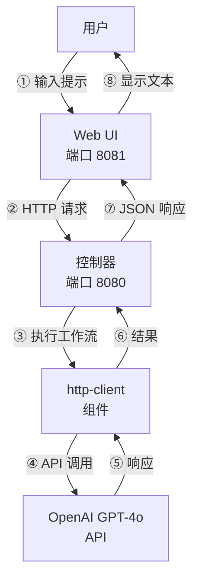
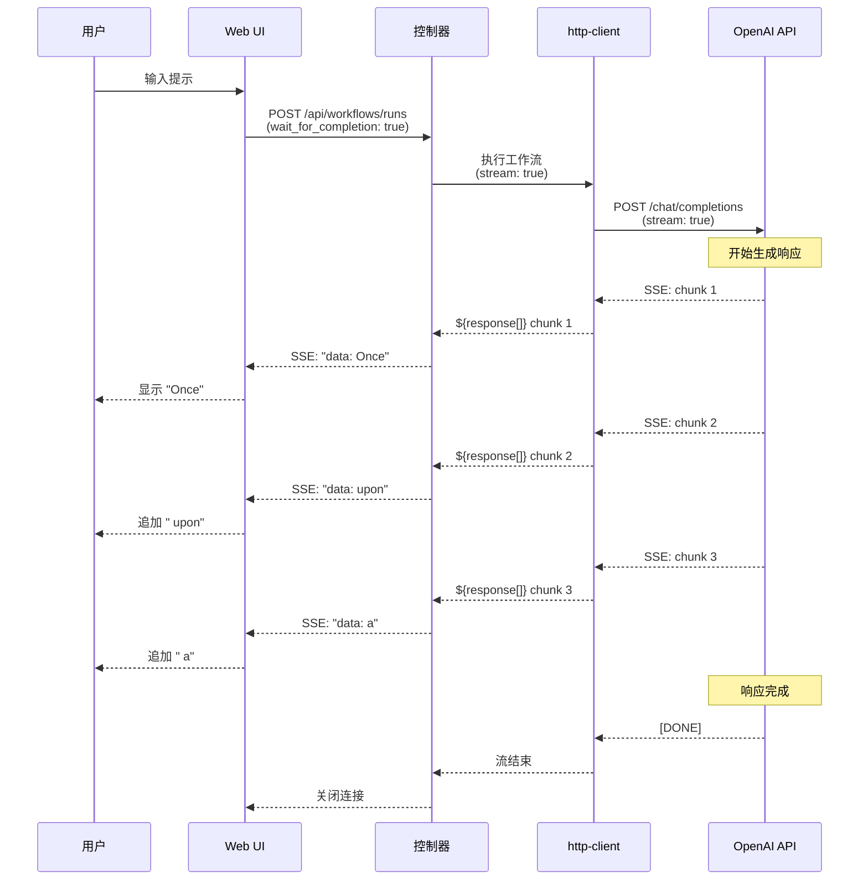
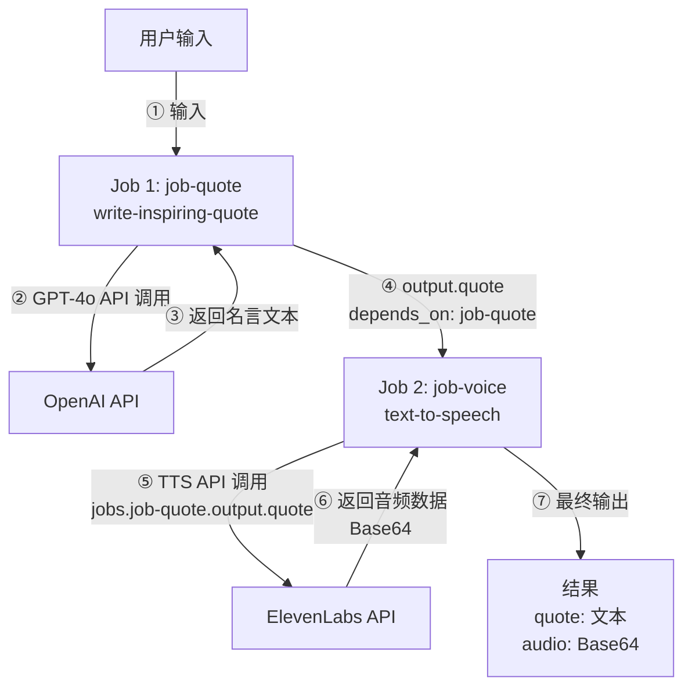
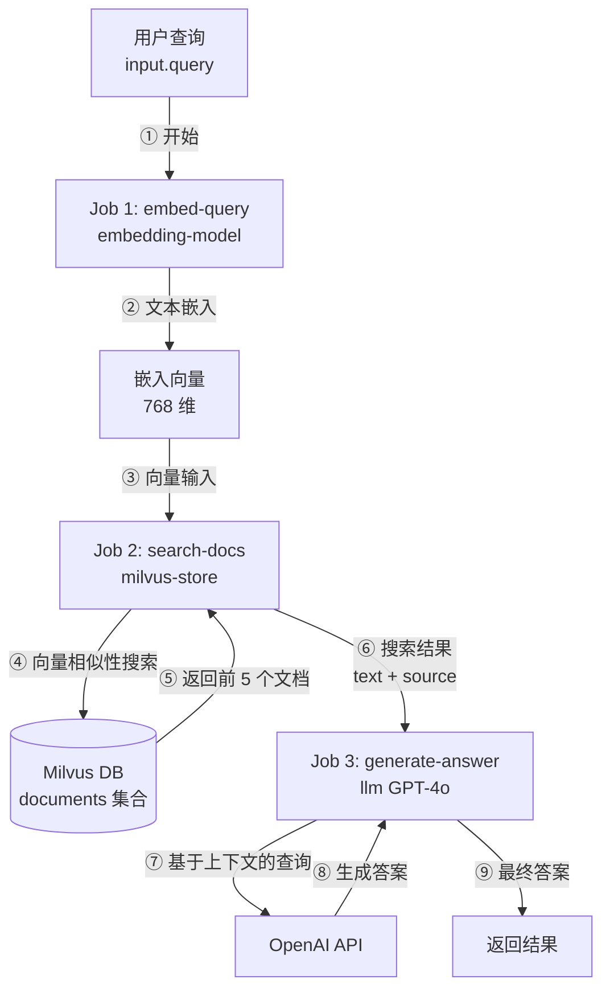
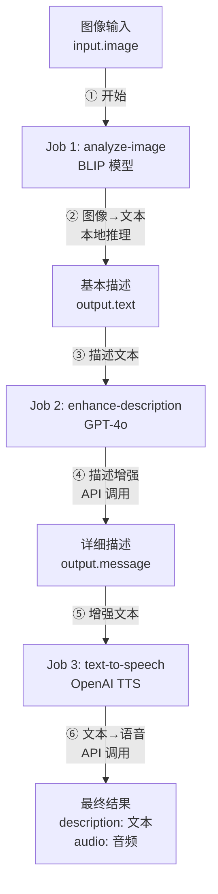
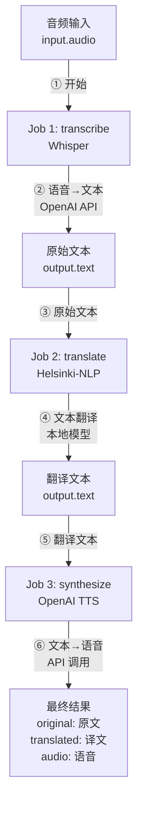

# 15. 实际示例

本章提供使用 model-compose 的真实用例的逐步说明。每个示例都包含完整的配置和执行说明。

---

## 15.1 构建聊天机器人

### 15.1.1 OpenAI GPT-4o 聊天机器人

**目标**：使用 OpenAI GPT-4o 构建一个简单的对话聊天机器人

**配置文件** (`model-compose.yml`)：

```yaml
controller:
  type: http-server
  port: 8080
  base_path: /api
  webui:
    driver: gradio
    port: 8081

workflow:
  title: Chat with OpenAI GPT-4o
  description: Generate text responses using OpenAI's GPT-4o
  input: ${input}
  output: ${output}

component:
  type: http-client
  base_url: https://api.openai.com/v1
  action:
    path: /chat/completions
    method: POST
    headers:
      Authorization: Bearer ${env.OPENAI_API_KEY}
      Content-Type: application/json
    body:
      model: gpt-4o
      messages:
        - role: user
          content: ${input.prompt as text}
      temperature: ${input.temperature as number | 0.7}
    output:
      message: ${response.choices[0].message.content}
```

**环境变量** (`.env`)：

```bash
OPENAI_API_KEY=sk-...
```

**运行方法**：

```bash
# 启动控制器
model-compose up

# 访问 Web UI
# http://localhost:8081
```

**主要功能**：
- 自动生成 Gradio Web UI
- 可调节 temperature 参数
- 实时响应显示

**架构图**：



### 15.1.2 流式聊天机器人

**目标**：构建具有实时打字效果的流式聊天机器人

**配置文件**：

```yaml
controller:
  type: http-server
  port: 8080
  webui:
    driver: gradio
    port: 8081

workflow:
  title: Streaming Chat
  output: ${output as text;sse-text}

component:
  type: http-client
  base_url: https://api.openai.com/v1
  action:
    path: /chat/completions
    method: POST
    headers:
      Authorization: Bearer ${env.OPENAI_API_KEY}
    body:
      model: gpt-4o
      messages:
        - role: user
          content: ${input.prompt as text}
      stream: true
    stream_format: json
    output: ${response[].choices[0].delta.content}
```

**功能**：
- 使用 SSE 协议的实时流式传输
- Gradio 中的自动打字效果
- 对长响应的即时反馈

**流式传输流程图**：



---

## 15.2 语音生成管道

### 15.2.1 文本转语音（OpenAI TTS）

**目标**：使用 OpenAI TTS API 将文本转换为语音

**配置文件**：

```yaml
controller:
  type: http-server
  port: 8080
  base_path: /api
  webui:
    driver: gradio
    port: 8081

workflow:
  title: Generate Speech with OpenAI TTS
  description: Convert input text into natural-sounding speech using OpenAI's TTS models.
  jobs:
    - id: speak
      component: openai-text-to-speech
      input: ${input}
      output: ${output as audio}

components:
  - id: openai-text-to-speech
    type: http-client
    action:
      endpoint: https://api.openai.com/v1/audio/speech
      method: POST
      headers:
        Authorization: Bearer ${env.OPENAI_API_KEY}
        Content-Type: application/json
      body:
        model: ${input.model as select/tts-1,tts-1-hd,gpt-4o-mini-tts | tts-1}
        input: ${input.text}
        voice: ${input.voice as select/alloy,ash,ballad,coral,echo,fable,onyx,nova,sage,shimmer,verse | nova}
        response_format: mp3
      output: ${response}
```

**支持的语音**：
- `alloy`, `ash`, `ballad`, `coral`, `echo`, `fable`
- `onyx`, `nova`, `sage`, `shimmer`, `verse`

**支持的模型**：
- `tts-1`：快速响应
- `tts-1-hd`：高质量音频
- `gpt-4o-mini-tts`：最新模型

### 15.2.2 励志名言语音生成

**目标**：使用 GPT-4o 生成励志名言并使用 ElevenLabs TTS 转换为语音

**配置文件**：

```yaml
controller:
  type: http-server
  port: 8080
  base_path: /api
  webui:
    driver: gradio
    port: 8081

workflow:
  title: Inspire with Voice
  description: Generate a motivational quote using GPT-4o and bring it to life by converting it into natural speech with ElevenLabs TTS.
  jobs:
    - id: job-quote
      component: write-inspiring-quote
      input: ${input}
      output: ${output}

    - id: job-voice
      component: text-to-speech
      input:
        text: ${jobs.job-quote.output.quote}
        voice_id: ${input.voice_id | JBFqnCBsd6RMkjVDRZzb}
      output:
        quote: ${jobs.job-quote.output.quote}
        audio: ${output as audio/mp3;base64}
      depends_on: [ job-quote ]

components:
  - id: write-inspiring-quote
    type: http-client
    base_url: https://api.openai.com/v1
    action:
      path: /chat/completions
      method: POST
      headers:
        Authorization: Bearer ${env.OPENAI_API_KEY}
        Content-Type: application/json
      body:
        model: gpt-4o
        messages:
          - role: user
            content: |
              Write an inspiring quote similar to the example below.
              Don't say anything else—just give me the quote.
              Aim for around 30 words.
              Example – Never give up. If there's something you want to become, be proud of it. Give yourself a chance.
              Don't think you're worthless—there's nothing to gain from that. Aim high. That's how life should be lived.
      output:
        quote: ${response.choices[0].message.content}

  - id: text-to-speech
    type: http-client
    action:
      endpoint: https://api.elevenlabs.io/v1/text-to-speech/${input.voice_id}?output_format=mp3_44100_128
      method: POST
      headers:
        Content-Type: application/json
        xi-api-key: ${env.ELEVENLABS_API_KEY}
      body:
        text: ${input.text}
        model_id: eleven_multilingual_v2
      output: ${response as base64}
```

**环境变量**：

```bash
OPENAI_API_KEY=sk-...
ELEVENLABS_API_KEY=...
```

**工作流说明**：
1. GPT-4o 生成励志名言
2. ElevenLabs API 将名言转换为语音
3. Web UI 同时显示文本和音频

**工作流程图**：



---

## 15.3 图像分析和编辑

### 15.3.1 图像描述（图像转文本）

**目标**：使用本地视觉模型生成图像描述

**配置文件**：

```yaml
controller:
  type: http-server
  port: 8080
  base_path: /api
  webui:
    driver: gradio
    port: 8081

workflow:
  title: Generate Text from Image
  description: Generate text based on a given image using a pretrained vision model.
  input: ${input}
  output:
    generated: ${output}

component:
  type: model
  task: image-to-text
  model: Salesforce/blip-image-captioning-large
  architecture: blip
  action:
    image: ${input.image as image}
    prompt: ${input.prompt as text}
```

**执行示例**：

```bash
# 运行工作流
model-compose run default --input '{"image": "path/to/image.jpg", "prompt": "Describe this image"}'
```

**支持的模型**：
- `Salesforce/blip-image-captioning-large`
- `Salesforce/blip-image-captioning-base`
- `nlpconnect/vit-gpt2-image-captioning`

### 15.3.2 图像编辑（OpenAI DALL-E）

**目标**：使用 OpenAI DALL-E 编辑图像

**配置文件**：

```yaml
controller:
  type: http-server
  port: 8080
  webui:
    driver: gradio
    port: 8081

workflow:
  title: Edit Image with DALL-E
  description: Edit an existing image using OpenAI's DALL-E API
  component: dalle-edit
  input: ${input}
  output: ${output as image}

component:
  id: dalle-edit
  type: http-client
  action:
    endpoint: https://api.openai.com/v1/images/edits
    method: POST
    headers:
      Authorization: Bearer ${env.OPENAI_API_KEY}
    body:
      image: ${input.image as image}
      mask: ${input.mask as image}
      prompt: ${input.prompt as text}
      n: ${input.n as integer | 1}
      size: ${input.size as select/256x256,512x512,1024x1024 | 1024x1024}
    output: ${response.data[0].url}
```

**使用场景**：
- 更改图像背景
- 修改特定区域
- 风格转换

---

## 15.4 RAG 系统（使用向量数据库）

### 15.4.1 使用 ChromaDB 进行文本嵌入搜索

**目标**：生成文本嵌入，存储到 ChromaDB，并执行相似性搜索

**配置文件**：

```yaml
controller:
  type: http-server
  port: 8080
  base_path: /api
  webui:
    driver: gradio
    port: 8081

workflows:
  - id: insert-sentence-embedding
    title: Insert Text Embedding
    description: Generate text embedding and insert it into ChromaDB vector store
    jobs:
      - id: embedding-sentence
        component: embedding-model
        input: ${input}
        output: ${output}

      - id: insert-embedding
        component: vector-store
        action: insert
        input:
          vector: ${jobs.embedding-sentence.output}
          metadata: ${input}
        output: ${output as json}
        depends_on: [ embedding-sentence ]

  - id: search-sentence-embeddings
    title: Search Similar Embeddings
    description: Generate query embedding and search for similar vectors in ChromaDB
    jobs:
      - id: embedding-sentence
        component: embedding-model
        input: ${input}
        output: ${output}

      - id: search-embeddings
        component: vector-store
        action: search
        input:
          vector: ${jobs.embedding-sentence.output}
        output: ${output as object[]/id,score,metadata.text}
        depends_on: [ embedding-sentence ]

  - id: delete-sentence-embedding
    title: Delete Text Embedding
    description: Remove a specific vector from the ChromaDB collection
    component: vector-store
    action: delete
    input: ${input}
    output: ${output as json}

components:
  - id: vector-store
    type: vector-store
    driver: chroma
    actions:
      - id: insert
        collection: test
        method: insert
        vector: ${input.vector}
        metadata: ${input.metadata}

      - id: search
        collection: test
        method: search
        query: ${input.vector}
        output_fields: [ text ]

      - id: delete
        collection: test
        method: delete
        vector_id: ${input.vector_id}

  - id: embedding-model
    type: model
    task: text-embedding
    model: sentence-transformers/all-MiniLM-L6-v2
    action:
      text: ${input.text}
```

**API 使用示例**：

```bash
# 1. 插入文本
curl -X POST http://localhost:8080/api/workflows/insert-sentence-embedding/runs \
  -H "Content-Type: application/json" \
  -d '{"input": {"text": "model-compose is a declarative AI orchestrator"}}'

# 2. 搜索相似文本
curl -X POST http://localhost:8080/api/workflows/search-sentence-embeddings/runs \
  -H "Content-Type: application/json" \
  -d '{"input": {"text": "AI workflow tool"}}'

# 3. 删除
curl -X POST http://localhost:8080/api/workflows/delete-sentence-embedding/runs \
  -H "Content-Type: application/json" \
  -d '{"input": {"vector_id": "id123"}}'
```

### 15.4.2 使用 Milvus 的 RAG 系统

**目标**：使用 Milvus 向量数据库构建高性能 RAG 系统

**配置文件**：

```yaml
controller:
  type: http-server
  port: 8080

workflows:
  - id: rag-query
    title: RAG Query
    description: Retrieve relevant documents and generate answer
    jobs:
      - id: embed-query
        component: embedding-model
        input:
          text: ${input.query}
        output: ${output}

      - id: search-docs
        component: milvus-store
        action: search
        input:
          vector: ${jobs.embed-query.output}
        output: ${output}
        depends_on: [ embed-query ]

      - id: generate-answer
        component: llm
        input:
          context: ${jobs.search-docs.output}
          query: ${input.query}
        output: ${output}
        depends_on: [ search-docs ]

components:
  - id: embedding-model
    type: model
    task: text-embedding
    model: sentence-transformers/all-MiniLM-L6-v2
    action:
      text: ${input.text}

  - id: milvus-store
    type: vector-store
    driver: milvus
    host: localhost
    port: 19530
    actions:
      - id: search
        collection: documents
        method: search
        query: ${input.vector}
        top_k: 5
        output_fields: [ text, source ]

  - id: llm
    type: http-client
    base_url: https://api.openai.com/v1
    action:
      path: /chat/completions
      method: POST
      headers:
        Authorization: Bearer ${env.OPENAI_API_KEY}
      body:
        model: gpt-4o
        messages:
          - role: system
            content: Answer based on the following context: ${input.context}
          - role: user
            content: ${input.query}
      output: ${response.choices[0].message.content}
```

**功能**：
- 3 阶段管道：嵌入 → 搜索 → 生成
- Milvus 高性能向量搜索
- 使用 GPT-4o 基于上下文生成答案

**RAG 管道图**：



---

## 15.5 Slack Bot（MCP）

### 15.5.1 使用 MCP 服务器构建 Slack Bot

**目标**：使用 MCP（模型上下文协议）服务器构建 Slack bot

**配置文件**：

```yaml
controller:
  type: mcp-server
  base_path: /mcp
  port: 8080
  webui:
    driver: gradio
    port: 8081

workflows:
  - id: send-message
    title: Send Message to Slack Channel
    description: Send a text message to a specified Slack channel using the Slack Web API
    action: chat-post-message
    input:
      channel: ${input.channel | ${env.DEFAULT_SLACK_CHANNEL_ID} @(description Slack channel ID for sending a message)}
      text: ${input.message @(description Message to send to Slack)}
    output: ${output as json}

  - id: list-channels
    title: List Slack Channels
    description: Retrieve a list of all available channels in the Slack workspace
    action: conversations-list
    output: ${output as object[]}

  - id: join-channel
    title: Join Slack Channel
    description: Join a specified Slack channel for the bot user
    action: conversations-join
    input:
      channel: ${input.channel | ${env.DEFAULT_SLACK_CHANNEL_ID}}
    output: ${output as json}

component:
  type: http-client
  base_url: https://slack.com/api
  headers:
    Authorization: Bearer ${env.SLACK_APP_TOKEN}
  actions:
    - id: chat-post-message
      path: /chat.postMessage
      method: POST
      body:
        channel: ${input.channel}
        text: ${input.text}
        attachments: ${input.attachments}
      headers:
        Content-Type: application/json
      output: ${response}

    - id: conversations-list
      path: /conversations.list
      method: GET
      params:
        limit: ${input.limit as integer | 200 @(description Maximum number of channels to retrieve)}
      headers:
        Content-Type: application/x-www-form-urlencoded
      output: ${response.channels as object[]/id,name}

    - id: conversations-join
      path: /conversations.join
      method: POST
      body:
        channel: ${input.channel}
      headers:
        Content-Type: application/json
      output: ${response}
```

**环境变量**：

```bash
SLACK_APP_TOKEN=xoxb-...
DEFAULT_SLACK_CHANNEL_ID=C...
```

**MCP 服务器功能**：
- 与 Claude Desktop 等 MCP 客户端集成
- 将多个工作流公开为工具
- 使用 `@(description ...)` 注释提供参数描述

**Claude Desktop 配置** (`claude_desktop_config.json`)：

```json
{
  "mcpServers": {
    "slack-bot": {
      "command": "npx",
      "args": [
        "-y",
        "@modelcontextprotocol/server-stdio",
        "http://localhost:8080/mcp"
      ]
    }
  }
}
```

### 15.5.2 AI 驱动的 Slack 自动回复 Bot

**目标**：构建使用 AI 自动响应 Slack 消息的 bot

**配置文件**：

```yaml
controller:
  type: http-server
  port: 8080

listeners:
  - id: slack-events
    type: http-callback
    path: /slack/events
    method: POST
    callback:
      url: https://slack.com/api/chat.postMessage
      method: POST
      headers:
        Authorization: Bearer ${env.SLACK_BOT_TOKEN}
        Content-Type: application/json
      body:
        channel: ${webhook.event.channel}
        text: ${jobs.generate-reply.output.message}

gateway:
  type: ngrok
  port: 8080

workflow:
  title: AI Slack Reply
  jobs:
    - id: generate-reply
      component: gpt4o
      input:
        prompt: ${input.event.text}
      output: ${output}

component:
  id: gpt4o
  type: http-client
  base_url: https://api.openai.com/v1
  action:
    path: /chat/completions
    method: POST
    headers:
      Authorization: Bearer ${env.OPENAI_API_KEY}
    body:
      model: gpt-4o
      messages:
        - role: user
          content: ${input.prompt}
    output:
      message: ${response.choices[0].message.content}
```

**工作流程**：
1. Slack 消息事件发生
2. 通过 ngrok 隧道触发工作流
3. GPT-4o 生成响应
4. 监听器回调将响应发送到 Slack

---

## 15.6 多模态工作流

### 15.6.1 图像 → 文本 → 语音管道

**目标**：分析图像、生成描述并转换为语音

**配置文件**：

```yaml
controller:
  type: http-server
  port: 8080
  webui:
    driver: gradio
    port: 8081

workflow:
  title: Image to Speech Pipeline
  description: Analyze image, generate description, and convert to speech
  jobs:
    - id: analyze-image
      component: image-analyzer
      input:
        image: ${input.image}
      output: ${output}

    - id: enhance-description
      component: gpt4o
      input:
        prompt: |
          Make this image description more engaging and detailed:
          ${jobs.analyze-image.output.text}
      output: ${output}
      depends_on: [ analyze-image ]

    - id: text-to-speech
      component: tts
      input:
        text: ${jobs.enhance-description.output.message}
      output:
        description: ${jobs.enhance-description.output.message}
        audio: ${output as audio}
      depends_on: [ enhance-description ]

components:
  - id: image-analyzer
    type: model
    task: image-to-text
    model: Salesforce/blip-image-captioning-large
    action:
      image: ${input.image as image}
      output:
        text: ${result}

  - id: gpt4o
    type: http-client
    base_url: https://api.openai.com/v1
    action:
      path: /chat/completions
      method: POST
      headers:
        Authorization: Bearer ${env.OPENAI_API_KEY}
      body:
        model: gpt-4o
        messages:
          - role: user
            content: ${input.prompt}
      output:
        message: ${response.choices[0].message.content}

  - id: tts
    type: http-client
    action:
      endpoint: https://api.openai.com/v1/audio/speech
      method: POST
      headers:
        Authorization: Bearer ${env.OPENAI_API_KEY}
      body:
        model: tts-1
        input: ${input.text}
        voice: nova
      output: ${response}
```

**3 阶段管道**：
1. **图像分析**：BLIP 模型生成图像描述
2. **文本增强**：GPT-4o 将描述改写得更详细和吸引人
3. **语音转换**：OpenAI TTS 将文本转换为语音

**多模态管道图**：



### 15.6.2 语音 → 文本 → 翻译 → 语音管道

**目标**：将口语翻译成另一种语言并输出语音

**配置文件**：

```yaml
controller:
  type: http-server
  port: 8080
  webui:
    driver: gradio
    port: 8081

workflow:
  title: Voice Translation Pipeline
  description: Transcribe audio, translate to target language, and synthesize speech
  jobs:
    - id: transcribe
      component: whisper
      input:
        audio: ${input.audio}
      output: ${output}

    - id: translate
      component: translator
      input:
        text: ${jobs.transcribe.output.text}
        target_lang: ${input.target_lang}
      output: ${output}
      depends_on: [ transcribe ]

    - id: synthesize
      component: tts
      input:
        text: ${jobs.translate.output.text}
      output:
        original: ${jobs.transcribe.output.text}
        translated: ${jobs.translate.output.text}
        audio: ${output as audio}
      depends_on: [ translate ]

components:
  - id: whisper
    type: http-client
    action:
      endpoint: https://api.openai.com/v1/audio/transcriptions
      method: POST
      headers:
        Authorization: Bearer ${env.OPENAI_API_KEY}
      body:
        file: ${input.audio as audio}
        model: whisper-1
      output:
        text: ${response.text}

  - id: translator
    type: model
    task: translation
    model: Helsinki-NLP/opus-mt-en-ko
    action:
      text: ${input.text as text}
      output:
        text: ${result}

  - id: tts
    type: http-client
    action:
      endpoint: https://api.openai.com/v1/audio/speech
      method: POST
      headers:
        Authorization: Bearer ${env.OPENAI_API_KEY}
      body:
        model: tts-1
        input: ${input.text}
        voice: nova
      output: ${response}
```

**4 阶段管道**：
1. **语音识别**：Whisper 将语音转换为文本
2. **翻译**：Helsinki-NLP 模型翻译文本
3. **语音合成**：OpenAI TTS 将翻译的文本转换为语音
4. **输出**：原始文本、翻译文本和翻译的音频

**语音翻译管道图**：



---

## 下一步

练习：
- 在本地运行每个示例
- 修改示例以构建自定义工作流
- 组合多个示例以创建复杂管道
- 部署到生产环境

---

**下一章**：[15. 故障排除](./15-troubleshooting.md)
