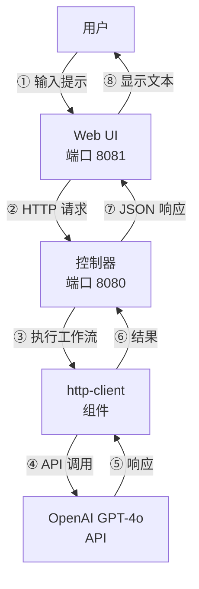
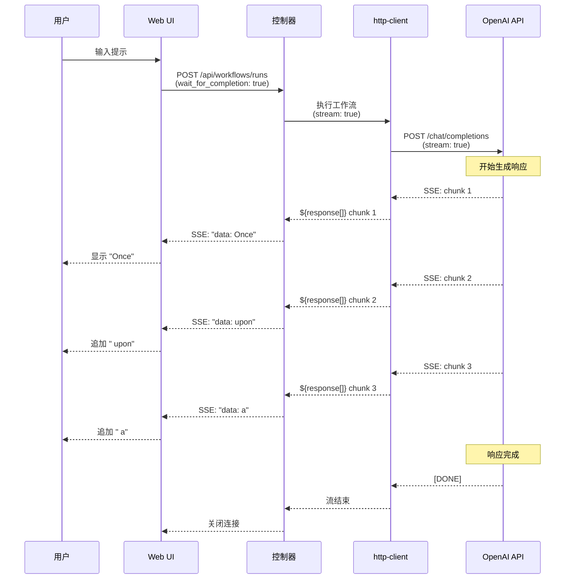
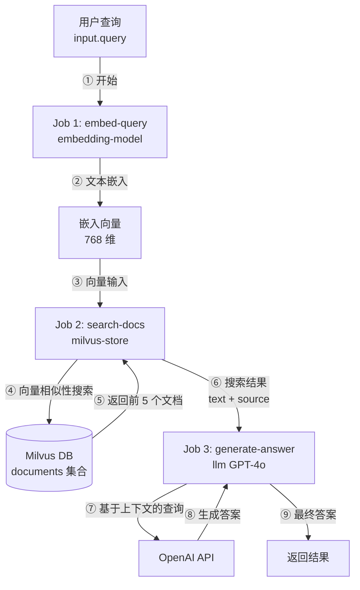
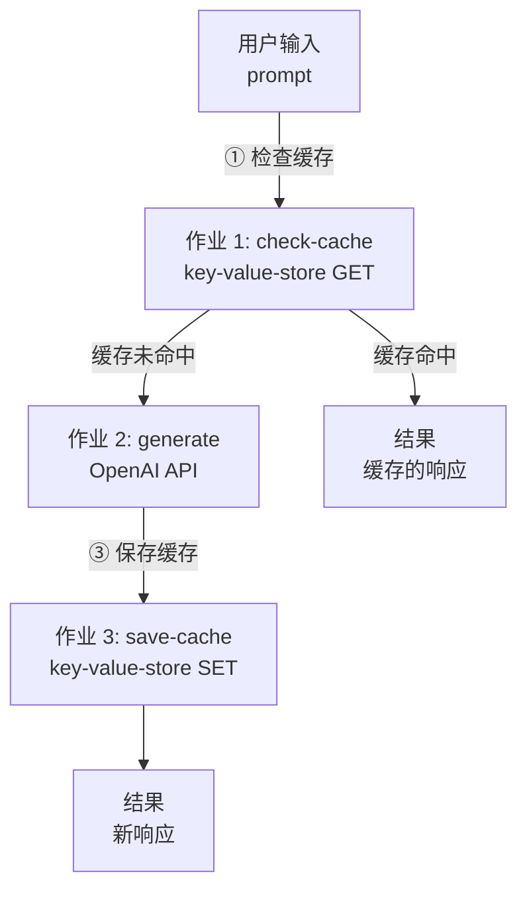
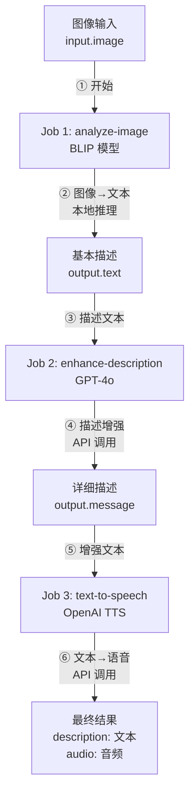
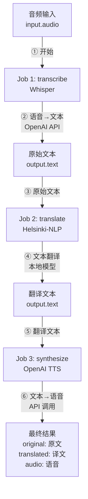
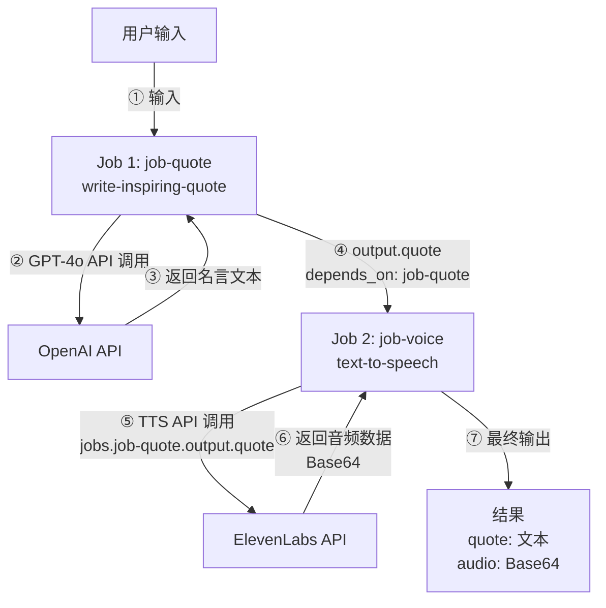
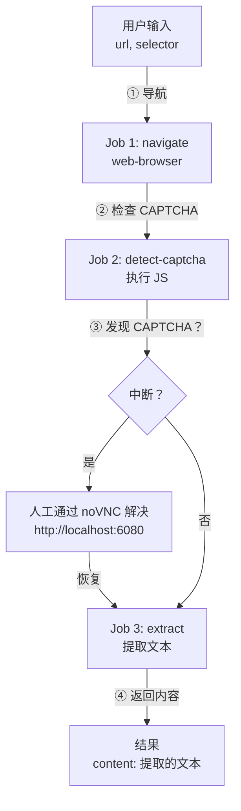
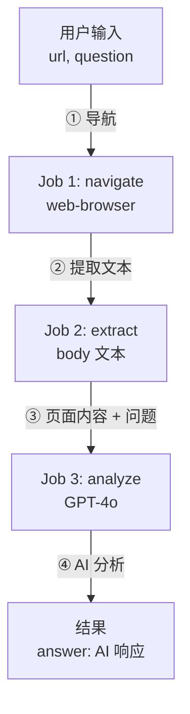

# 15. 实际示例

本章提供使用 model-compose 的真实用例的逐步说明。每个示例都包含完整的配置和执行说明。

---

## 16.1 构建聊天机器人

### 16.1.1 OpenAI GPT-4o 聊天机器人

**目标**：使用 OpenAI GPT-4o 构建一个简单的对话聊天机器人

**配置文件** (`model-compose.yml`)：

```yaml
controller:
  type: http-server
  port: 8080
  base_path: /api
  webui:
    driver: gradio
    port: 8081

workflow:
  title: Chat with OpenAI GPT-4o
  description: Generate text responses using OpenAI's GPT-4o
  input: ${input}
  output: ${output}

component:
  type: http-client
  base_url: https://api.openai.com/v1
  action:
    path: /chat/completions
    method: POST
    headers:
      Authorization: Bearer ${env.OPENAI_API_KEY}
      Content-Type: application/json
    body:
      model: gpt-4o
      messages:
        - role: user
          content: ${input.prompt as text}
      temperature: ${input.temperature as number | 0.7}
    output:
      message: ${response.choices[0].message.content}
```

**环境变量** (`.env`)：

```bash
OPENAI_API_KEY=sk-...
```

**运行方法**：

```bash
# 启动控制器
model-compose up

# 访问 Web UI
# http://localhost:8081
```

**主要功能**：
- 自动生成 Gradio Web UI
- 可调节 temperature 参数
- 实时响应显示

**架构图**：



### 16.1.2 流式聊天机器人

**目标**：构建具有实时打字效果的流式聊天机器人

**配置文件**：

```yaml
controller:
  type: http-server
  port: 8080
  webui:
    driver: gradio
    port: 8081

workflow:
  title: Streaming Chat
  output: ${output as sse-text}

component:
  type: http-client
  base_url: https://api.openai.com/v1
  action:
    path: /chat/completions
    method: POST
    headers:
      Authorization: Bearer ${env.OPENAI_API_KEY}
    body:
      model: gpt-4o
      messages:
        - role: user
          content: ${input.prompt as text}
      stream: true
    stream_format: json
    output: ${response[].choices[0].delta.content}
```

**功能**：
- 使用 SSE 协议的实时流式传输
- Gradio 中的自动打字效果
- 对长响应的即时反馈

**流式传输流程图**：



---

## 16.2 RAG 系统（使用向量数据库）

### 16.2.1 使用 ChromaDB 进行文本嵌入搜索

**目标**：生成文本嵌入，存储到 ChromaDB，并执行相似性搜索

**配置文件**：

```yaml
controller:
  type: http-server
  port: 8080
  base_path: /api
  webui:
    driver: gradio
    port: 8081

workflows:
  - id: insert-sentence-embedding
    title: Insert Text Embedding
    description: Generate text embedding and insert it into ChromaDB vector store
    jobs:
      - id: embedding-sentence
        component: embedding-model
        input: ${input}
        output: ${output}

      - id: insert-embedding
        component: vector-store
        action: insert
        input:
          vector: ${jobs.embedding-sentence.output}
          metadata: ${input}
        output: ${output as json}
        depends_on: [ embedding-sentence ]

  - id: search-sentence-embeddings
    title: Search Similar Embeddings
    description: Generate query embedding and search for similar vectors in ChromaDB
    jobs:
      - id: embedding-sentence
        component: embedding-model
        input: ${input}
        output: ${output}

      - id: search-embeddings
        component: vector-store
        action: search
        input:
          vector: ${jobs.embedding-sentence.output}
        output: ${output as object[]/id,score,metadata.text}
        depends_on: [ embedding-sentence ]

  - id: delete-sentence-embedding
    title: Delete Text Embedding
    description: Remove a specific vector from the ChromaDB collection
    component: vector-store
    action: delete
    input: ${input}
    output: ${output as json}

components:
  - id: vector-store
    type: vector-store
    driver: chroma
    actions:
      - id: insert
        collection: test
        method: insert
        vector: ${input.vector}
        metadata: ${input.metadata}

      - id: search
        collection: test
        method: search
        query: ${input.vector}
        output_fields: [ text ]

      - id: delete
        collection: test
        method: delete
        vector_id: ${input.vector_id}

  - id: embedding-model
    type: model
    task: text-embedding
    model: sentence-transformers/all-MiniLM-L6-v2
    action:
      text: ${input.text}
```

**API 使用示例**：

```bash
# 1. 插入文本
curl -X POST http://localhost:8080/api/workflows/insert-sentence-embedding/runs \
  -H "Content-Type: application/json" \
  -d '{"input": {"text": "model-compose is a declarative AI orchestrator"}}'

# 2. 搜索相似文本
curl -X POST http://localhost:8080/api/workflows/search-sentence-embeddings/runs \
  -H "Content-Type: application/json" \
  -d '{"input": {"text": "AI workflow tool"}}'

# 3. 删除
curl -X POST http://localhost:8080/api/workflows/delete-sentence-embedding/runs \
  -H "Content-Type: application/json" \
  -d '{"input": {"vector_id": "id123"}}'
```

### 16.2.2 使用 Milvus 的 RAG 系统

**目标**：使用 Milvus 向量数据库构建高性能 RAG 系统

**配置文件**：

```yaml
controller:
  type: http-server
  port: 8080

workflows:
  - id: rag-query
    title: RAG Query
    description: Retrieve relevant documents and generate answer
    jobs:
      - id: embed-query
        component: embedding-model
        input:
          text: ${input.query}
        output: ${output}

      - id: search-docs
        component: milvus-store
        action: search
        input:
          vector: ${jobs.embed-query.output}
        output: ${output}
        depends_on: [ embed-query ]

      - id: generate-answer
        component: llm
        input:
          context: ${jobs.search-docs.output}
          query: ${input.query}
        output: ${output}
        depends_on: [ search-docs ]

components:
  - id: embedding-model
    type: model
    task: text-embedding
    model: sentence-transformers/all-MiniLM-L6-v2
    action:
      text: ${input.text}

  - id: milvus-store
    type: vector-store
    driver: milvus
    host: localhost
    port: 19530
    actions:
      - id: search
        collection: documents
        method: search
        query: ${input.vector}
        top_k: 5
        output_fields: [ text, source ]

  - id: llm
    type: http-client
    base_url: https://api.openai.com/v1
    action:
      path: /chat/completions
      method: POST
      headers:
        Authorization: Bearer ${env.OPENAI_API_KEY}
      body:
        model: gpt-4o
        messages:
          - role: system
            content: Answer based on the following context: ${input.context}
          - role: user
            content: ${input.query}
      output: ${response.choices[0].message.content}
```

**功能**：
- 3 阶段管道：嵌入 → 搜索 → 生成
- Milvus 高性能向量搜索
- 使用 GPT-4o 基于上下文生成答案

**RAG 管道图**：



---

## 16.3 图存储（知识图谱与社交网络）

### 16.3.1 使用 Neo4j 构建知识图谱

**目标**：构建存储人物及其关系的知识图谱，并遍历连接

**配置文件** (`model-compose.yml`)：

```yaml
controller:
  adapter:
    type: http-server
    port: 8080
    base_path: /api
  webui:
    driver: gradio
    port: 8081

workflows:
  - id: add-person
    title: Add Person
    description: Add a person node to the knowledge graph
    jobs:
      - id: insert-node
        component: knowledge-graph
        action: add-person
        input: ${input}
        output: ${output as json}

  - id: add-friendship
    title: Add Friendship
    description: Create a KNOWS relationship between two people
    jobs:
      - id: insert-rel
        component: knowledge-graph
        action: add-relationship
        input: ${input}
        output: ${output as json}

  - id: find-connections
    title: Find Connections
    description: Traverse the graph to find connected people
    jobs:
      - id: traverse
        component: knowledge-graph
        action: find-connections
        input: ${input}
        output: ${output as json}

components:
  - id: knowledge-graph
    type: graph-store
    driver: neo4j
    url: bolt://localhost:7687
    username: neo4j
    password: password
    actions:
      - id: add-person
        method: insert
        nodes:
          label: Person
          properties:
            name: ${input.name}
            age: ${input.age}

      - id: add-relationship
        method: insert
        relationships:
          type: KNOWS
          from: ${input.from_id}
          to: ${input.to_id}
          properties:
            since: ${input.since}

      - id: find-person
        method: query
        query: "MATCH (p:Person {name: $name}) RETURN p"
        params:
          name: ${input.name}

      - id: find-connections
        method: traverse
        start_node: ${input.node_id}
        direction: both
        max_depth: 2
        relationship_types: [KNOWS]
```

**前置条件**：
- 本地运行 Neo4j (`docker run -p 7687:7687 -e NEO4J_AUTH=neo4j/password neo4j`)

**运行方法**：

```bash
# 启动服务
model-compose up

# 添加人物
curl -X POST http://localhost:8080/api/workflows/add-person/run \
  -H 'Content-Type: application/json' \
  -d '{"input": {"name": "Alice", "age": 30}}'

# 创建友谊关系
curl -X POST http://localhost:8080/api/workflows/add-friendship/run \
  -H 'Content-Type: application/json' \
  -d '{"input": {"from_id": "<alice_node_id>", "to_id": "<bob_node_id>", "since": 2020}}'

# 查找连接
curl -X POST http://localhost:8080/api/workflows/find-connections/run \
  -H 'Content-Type: application/json' \
  -d '{"input": {"node_id": "<alice_node_id>"}}'
```

**关键要点**：
- `method: insert` 配合 `nodes` 创建图节点；配合 `relationships` 创建边
- `method: traverse` 发现 `max_depth` 跳内的连接节点
- `method: query` 执行原始 Cypher 查询，提供最大灵活性
- 删除时 `detach: true`（默认值）确保连接的关系也一并删除
- 节点 ID 以 Neo4j 的 `elementId()` 格式返回（例如 `4:abc:0`）

**管道图**：

```mermaid
graph TD
    A[用户输入<br/>name, age] -->|① 插入| B[Job: add-person<br/>CREATE &#40;:Person&#41;]
    B --> C[返回节点 ID]
    D[用户输入<br/>from_id, to_id] -->|② 连接| E[Job: add-relationship<br/>CREATE -[:KNOWS]->]
    F[用户输入<br/>node_id] -->|③ 遍历| G[Job: find-connections<br/>MATCH path *1..2]
    G --> H[连接的节点]
```

### 16.3.2 使用 ArangoDB 构建社交图谱

**目标**：构建社交网络图谱，使用 ArangoDB 查找共同好友

```yaml
components:
  - id: social-graph
    type: graph-store
    driver: arangodb
    host: localhost
    port: 8529
    username: root
    password: password
    database: social
    actions:
      - id: add-person
        method: insert
        collection: persons
        nodes:
          label: persons
          properties:
            name: ${input.name}
            age: ${input.age}

      - id: add-friendship
        method: insert
        edge_collection: friendships
        graph: social_graph
        relationships:
          type: friendships
          from: ${input.from_id}
          to: ${input.to_id}

      - id: mutual-friends
        method: query
        query: |
          FOR f1 IN OUTBOUND @person1 friendships
            FOR f2 IN OUTBOUND @person2 friendships
              FILTER f1._id == f2._id
              RETURN f1
        params:
          person1: ${input.person1_id}
          person2: ${input.person2_id}

      - id: find-network
        method: traverse
        start_node: ${input.person_id}
        graph: social_graph
        direction: both
        max_depth: 3
```

**关键要点**：
- ArangoDB 使用 `collection/key` 格式的文档 ID（例如 `persons/12345`）
- 命名图（`graph: social_graph`）必须在 ArangoDB 中预先创建
- AQL 查询使用 `@param` 语法进行参数绑定
- 遍历内部映射：`out`→`outbound`，`in`→`inbound`，`both`→`any`

---

## 16.4 键值存储（缓存与会话）

### 16.4.1 API 响应缓存

**目标**：将 LLM API 响应缓存到 Redis，避免对相同提示的重复调用

**配置文件**（`model-compose.yml`）：

```yaml
controller:
  adapter:
    type: http-server
    port: 8080

workflows:
  - id: cached-chat
    title: Cached Chat
    jobs:
      - id: check-cache
        component: cache
        action: get-response
        input:
          prompt: ${input.prompt}

      - id: generate
        component: openai
        condition: ${jobs.check-cache.output.cached == null}
        input:
          prompt: ${input.prompt}

      - id: save-cache
        component: cache
        action: set-response
        condition: ${jobs.check-cache.output.cached == null}
        input:
          prompt: ${input.prompt}
          response: ${jobs.generate.output.message}
    output:
      message: ${jobs.check-cache.output.cached ?? jobs.generate.output.message}

components:
  - id: cache
    type: key-value-store
    driver: redis
    host: localhost
    port: 6379
    actions:
      - id: get-response
        method: get
        key: "chat:${input.prompt}"
        output:
          cached: ${result.value}
      - id: set-response
        method: set
        key: "chat:${input.prompt}"
        value: ${input.response}
        ttl: 3600

  - id: openai
    type: http-client
    base_url: https://api.openai.com/v1
    action:
      path: /chat/completions
      method: POST
      headers:
        Authorization: Bearer ${env.OPENAI_API_KEY}
      body:
        model: gpt-4o
        messages:
          - role: user
            content: ${input.prompt as text}
      output:
        message: ${response.choices[0].message.content}
```

**API 使用**：

```bash
# 第一次调用 - 生成并缓存
curl -X POST http://localhost:8080/workflows/runs \
  -H "Content-Type: application/json" \
  -d '{"workflow_id": "cached-chat", "input": {"prompt": "什么是 Redis？"}}'

# 相同提示的第二次调用 - 立即返回缓存结果
curl -X POST http://localhost:8080/workflows/runs \
  -H "Content-Type: application/json" \
  -d '{"workflow_id": "cached-chat", "input": {"prompt": "什么是 Redis？"}}'
```

**流水线图**：



### 16.4.2 会话管理

**目标**：存储具有自动过期功能的用户会话数据

```yaml
components:
  - id: session
    type: key-value-store
    driver: redis
    url: redis://localhost:6379/1
    actions:
      - id: save
        method: set
        key: "session:${input.user_id}"
        value:
          history: ${input.history}
          preferences: ${input.preferences}
        ttl: 86400

      - id: load
        method: get
        key: "session:${input.user_id}"
        output:
          session: ${result.value}

      - id: logout
        method: delete
        key: "session:${input.user_id}"
```

**关键要点**：
- TTL 为 86400 秒（24 小时），自动过期会话
- 复杂对象（dict、list）序列化为 JSON，检索时自动反序列化
- `url` 和 `host`/`port` 是互斥的连接选项

---

## 16.5 多模态工作流

### 16.5.1 图像 → 文本 → 语音管道

**目标**：分析图像、生成描述并转换为语音

**配置文件**：

```yaml
controller:
  type: http-server
  port: 8080
  webui:
    driver: gradio
    port: 8081

workflow:
  title: Image to Speech Pipeline
  description: Analyze image, generate description, and convert to speech
  jobs:
    - id: analyze-image
      component: image-analyzer
      input:
        image: ${input.image}
      output: ${output}

    - id: enhance-description
      component: gpt4o
      input:
        prompt: |
          Make this image description more engaging and detailed:
          ${jobs.analyze-image.output.text}
      output: ${output}
      depends_on: [ analyze-image ]

    - id: text-to-speech
      component: tts
      input:
        text: ${jobs.enhance-description.output.message}
      output:
        description: ${jobs.enhance-description.output.message}
        audio: ${output as audio}
      depends_on: [ enhance-description ]

components:
  - id: image-analyzer
    type: model
    task: image-to-text
    model: Salesforce/blip-image-captioning-large
    action:
      image: ${input.image as image}
      output:
        text: ${result}

  - id: gpt4o
    type: http-client
    base_url: https://api.openai.com/v1
    action:
      path: /chat/completions
      method: POST
      headers:
        Authorization: Bearer ${env.OPENAI_API_KEY}
      body:
        model: gpt-4o
        messages:
          - role: user
            content: ${input.prompt}
      output:
        message: ${response.choices[0].message.content}

  - id: tts
    type: http-client
    action:
      endpoint: https://api.openai.com/v1/audio/speech
      method: POST
      headers:
        Authorization: Bearer ${env.OPENAI_API_KEY}
      body:
        model: tts-1
        input: ${input.text}
        voice: nova
      output: ${response}
```

**3 阶段管道**：
1. **图像分析**：BLIP 模型生成图像描述
2. **文本增强**：GPT-4o 将描述改写得更详细和吸引人
3. **语音转换**：OpenAI TTS 将文本转换为语音

**多模态管道图**：



### 16.5.2 语音 → 文本 → 翻译 → 语音管道

**目标**：将口语翻译成另一种语言并输出语音

**配置文件**：

```yaml
controller:
  type: http-server
  port: 8080
  webui:
    driver: gradio
    port: 8081

workflow:
  title: Voice Translation Pipeline
  description: Transcribe audio, translate to target language, and synthesize speech
  jobs:
    - id: transcribe
      component: whisper
      input:
        audio: ${input.audio}
      output: ${output}

    - id: translate
      component: translator
      input:
        text: ${jobs.transcribe.output.text}
        target_lang: ${input.target_lang}
      output: ${output}
      depends_on: [ transcribe ]

    - id: synthesize
      component: tts
      input:
        text: ${jobs.translate.output.text}
      output:
        original: ${jobs.transcribe.output.text}
        translated: ${jobs.translate.output.text}
        audio: ${output as audio}
      depends_on: [ translate ]

components:
  - id: whisper
    type: http-client
    action:
      endpoint: https://api.openai.com/v1/audio/transcriptions
      method: POST
      headers:
        Authorization: Bearer ${env.OPENAI_API_KEY}
      body:
        file: ${input.audio as audio}
        model: whisper-1
      output:
        text: ${response.text}

  - id: translator
    type: model
    task: translation
    model: Helsinki-NLP/opus-mt-en-ko
    action:
      text: ${input.text as text}
      output:
        text: ${result}

  - id: tts
    type: http-client
    action:
      endpoint: https://api.openai.com/v1/audio/speech
      method: POST
      headers:
        Authorization: Bearer ${env.OPENAI_API_KEY}
      body:
        model: tts-1
        input: ${input.text}
        voice: nova
      output: ${response}
```

**4 阶段管道**：
1. **语音识别**：Whisper 将语音转换为文本
2. **翻译**：Helsinki-NLP 模型翻译文本
3. **语音合成**：OpenAI TTS 将翻译的文本转换为语音
4. **输出**：原始文本、翻译文本和翻译的音频

**语音翻译管道图**：



---

## 16.6 语音生成管道

### 16.6.1 文本转语音（OpenAI TTS）

**目标**：使用 OpenAI TTS API 将文本转换为语音

**配置文件**：

```yaml
controller:
  type: http-server
  port: 8080
  base_path: /api
  webui:
    driver: gradio
    port: 8081

workflow:
  title: Generate Speech with OpenAI TTS
  description: Convert input text into natural-sounding speech using OpenAI's TTS models.
  jobs:
    - id: speak
      component: openai-text-to-speech
      input: ${input}
      output: ${output as audio}

components:
  - id: openai-text-to-speech
    type: http-client
    action:
      endpoint: https://api.openai.com/v1/audio/speech
      method: POST
      headers:
        Authorization: Bearer ${env.OPENAI_API_KEY}
        Content-Type: application/json
      body:
        model: ${input.model as select/tts-1,tts-1-hd,gpt-4o-mini-tts | tts-1}
        input: ${input.text}
        voice: ${input.voice as select/alloy,ash,ballad,coral,echo,fable,onyx,nova,sage,shimmer,verse | nova}
        response_format: mp3
      output: ${response}
```

**支持的语音**：
- `alloy`, `ash`, `ballad`, `coral`, `echo`, `fable`
- `onyx`, `nova`, `sage`, `shimmer`, `verse`

**支持的模型**：
- `tts-1`：快速响应
- `tts-1-hd`：高质量音频
- `gpt-4o-mini-tts`：最新模型

### 16.6.2 励志名言语音生成

**目标**：使用 GPT-4o 生成励志名言并使用 ElevenLabs TTS 转换为语音

**配置文件**：

```yaml
controller:
  type: http-server
  port: 8080
  base_path: /api
  webui:
    driver: gradio
    port: 8081

workflow:
  title: Inspire with Voice
  description: Generate a motivational quote using GPT-4o and bring it to life by converting it into natural speech with ElevenLabs TTS.
  jobs:
    - id: job-quote
      component: write-inspiring-quote
      input: ${input}
      output: ${output}

    - id: job-voice
      component: text-to-speech
      input:
        text: ${jobs.job-quote.output.quote}
        voice_id: ${input.voice_id | JBFqnCBsd6RMkjVDRZzb}
      output:
        quote: ${jobs.job-quote.output.quote}
        audio: ${output as audio/mp3;base64}
      depends_on: [ job-quote ]

components:
  - id: write-inspiring-quote
    type: http-client
    base_url: https://api.openai.com/v1
    action:
      path: /chat/completions
      method: POST
      headers:
        Authorization: Bearer ${env.OPENAI_API_KEY}
        Content-Type: application/json
      body:
        model: gpt-4o
        messages:
          - role: user
            content: |
              Write an inspiring quote similar to the example below.
              Don't say anything else—just give me the quote.
              Aim for around 30 words.
              Example – Never give up. If there's something you want to become, be proud of it. Give yourself a chance.
              Don't think you're worthless—there's nothing to gain from that. Aim high. That's how life should be lived.
      output:
        quote: ${response.choices[0].message.content}

  - id: text-to-speech
    type: http-client
    action:
      endpoint: https://api.elevenlabs.io/v1/text-to-speech/${input.voice_id}?output_format=mp3_44100_128
      method: POST
      headers:
        Content-Type: application/json
        xi-api-key: ${env.ELEVENLABS_API_KEY}
      body:
        text: ${input.text}
        model_id: eleven_multilingual_v2
      output: ${response as base64}
```

**环境变量**：

```bash
OPENAI_API_KEY=sk-...
ELEVENLABS_API_KEY=...
```

**工作流说明**：
1. GPT-4o 生成励志名言
2. ElevenLabs API 将名言转换为语音
3. Web UI 同时显示文本和音频

**工作流程图**：



---

## 16.7 图像分析和编辑

### 16.7.1 图像描述（图像转文本）

**目标**：使用本地视觉模型生成图像描述

**配置文件**：

```yaml
controller:
  type: http-server
  port: 8080
  base_path: /api
  webui:
    driver: gradio
    port: 8081

workflow:
  title: Generate Text from Image
  description: Generate text based on a given image using a pretrained vision model.
  input: ${input}
  output:
    generated: ${output}

component:
  type: model
  task: image-to-text
  model: Salesforce/blip-image-captioning-large
  architecture: blip
  action:
    image: ${input.image as image}
    prompt: ${input.prompt as text}
```

**执行示例**：

```bash
# 运行工作流
model-compose run default --input '{"image": "path/to/image.jpg", "prompt": "Describe this image"}'
```

**支持的模型**：
- `Salesforce/blip-image-captioning-large`
- `Salesforce/blip-image-captioning-base`
- `nlpconnect/vit-gpt2-image-captioning`

### 16.7.2 图像编辑（OpenAI DALL-E）

**目标**：使用 OpenAI DALL-E 编辑图像

**配置文件**：

```yaml
controller:
  type: http-server
  port: 8080
  webui:
    driver: gradio
    port: 8081

workflow:
  title: Edit Image with DALL-E
  description: Edit an existing image using OpenAI's DALL-E API
  component: dalle-edit
  input: ${input}
  output: ${output as image}

component:
  id: dalle-edit
  type: http-client
  action:
    endpoint: https://api.openai.com/v1/images/edits
    method: POST
    headers:
      Authorization: Bearer ${env.OPENAI_API_KEY}
    body:
      image: ${input.image as image}
      mask: ${input.mask as image}
      prompt: ${input.prompt as text}
      n: ${input.n as integer | 1}
      size: ${input.size as select/256x256,512x512,1024x1024 | 1024x1024}
    output: ${response.data[0].url}
```

**使用场景**：
- 更改图像背景
- 修改特定区域
- 风格转换

---

## 16.8 浏览器自动化

### 16.8.1 带 CAPTCHA 回退的网页抓取

**目标**：导航到页面，检测 CAPTCHA，通过 noVNC 暂停等待人工解决，然后提取内容

**前置条件**：

启动带 noVNC 的无头 Chrome：

```bash
docker run -d -p 9222:9222 -p 6080:6080 \
  chromedp/headless-shell:latest
```

**配置文件**：

```yaml
controller:
  type: http-server
  port: 8080
  webui:
    driver: gradio
    port: 8081

workflows:
  - id: scrape-with-fallback
    title: Scrape with CAPTCHA Fallback
    input:
      - id: url
        type: string
        description: Target URL to scrape
      - id: selector
        type: string
        description: CSS selector for content extraction
    jobs:
      - id: navigate
        component: browser
        action: navigate
        input:
          url: ${input.url}

      - id: detect-captcha
        component: browser
        action: check-captcha
        interrupt:
          after:
            condition:
              operator: eq
              input: ${output}
              value: true
            message: >
              CAPTCHA detected! Please solve it via noVNC at:
              http://localhost:6080/vnc.html
        depends_on: [ navigate ]

      - id: extract
        component: browser
        action: extract-text
        input:
          selector: ${input.selector}
        depends_on: [ detect-captcha ]
        output:
          content: "${output as text}"

components:
  - id: browser
    type: web-browser
    host: localhost
    port: 9222
    timeout: 30s
    actions:
      - id: navigate
        method: navigate
        url: "${input.url}"
        wait_until: networkidle

      - id: check-captcha
        method: evaluate
        expression: >
          !!(document.querySelector('[id*=captcha],[class*=captcha]')
            || document.querySelector('iframe[src*=captcha]')
            || document.querySelector('#cf-challenge-running'))

      - id: extract-text
        method: extract
        selector: "${input.selector}"
        extract_mode: text
```

**工作流程**：
1. 导航到目标 URL
2. 执行 JavaScript 检测 CAPTCHA 元素
3. 如果发现 CAPTCHA，工作流中断并显示 noVNC URL 供人工解决
4. 人工解决 CAPTCHA 后，工作流恢复并提取内容

**工作流程图**：



### 16.8.2 登录后抓取受保护内容

**目标**：自动登录网站并提取受保护的内容

**配置文件**：

```yaml
controller:
  type: http-server
  port: 8080
  webui:
    driver: gradio
    port: 8081

workflows:
  - id: login-and-scrape
    title: Login then Scrape
    input:
      - id: login_url
        type: string
      - id: username
        type: string
      - id: password
        type: string
      - id: content_url
        type: string
      - id: selector
        type: string
    jobs:
      - id: open-login
        component: browser
        action: navigate
        input:
          url: ${input.login_url}

      - id: fill-username
        component: browser
        action: type-text
        input:
          selector: "input[name='username']"
          text: ${input.username}
        depends_on: [ open-login ]

      - id: fill-password
        component: browser
        action: type-text
        input:
          selector: "input[name='password']"
          text: ${input.password}
        depends_on: [ fill-username ]

      - id: submit
        component: browser
        action: click
        input:
          selector: "button[type='submit']"
        depends_on: [ fill-password ]

      - id: navigate-content
        component: browser
        action: navigate
        input:
          url: ${input.content_url}
        depends_on: [ submit ]

      - id: extract-content
        component: browser
        action: extract-text
        input:
          selector: ${input.selector}
        depends_on: [ navigate-content ]
        output:
          content: ${output as text}

components:
  - id: browser
    type: web-browser
    host: localhost
    port: 9222
    timeout: 30s
    actions:
      - id: navigate
        method: navigate
        url: "${input.url}"
        wait_until: networkidle

      - id: type-text
        method: input-text
        selector: "${input.selector}"
        text: "${input.text}"

      - id: click
        method: click
        selector: "${input.selector}"

      - id: extract-text
        method: extract
        selector: "${input.selector}"
        extract_mode: text
```

**6 阶段管道**：
1. 导航到登录页面
2. 填写用户名字段
3. 填写密码字段
4. 点击提交按钮
5. 导航到受保护的内容页面
6. 使用 CSS 选择器提取内容

### 16.8.3 AI 驱动的网页内容分析

**目标**：导航到页面，提取内容，然后使用 GPT-4o 进行分析

**配置文件**：

```yaml
controller:
  type: http-server
  port: 8080
  webui:
    driver: gradio
    port: 8081

workflows:
  - id: analyze-page
    title: Analyze Web Page with AI
    input:
      - id: url
        type: string
        description: URL to analyze
      - id: question
        type: string
        description: Question to ask about the page content
    jobs:
      - id: navigate
        component: browser
        action: navigate
        input:
          url: ${input.url}

      - id: extract
        component: browser
        action: extract-body
        depends_on: [ navigate ]

      - id: analyze
        component: gpt4o
        input:
          context: ${jobs.extract.output.content}
          question: ${input.question}
        depends_on: [ extract ]
        output:
          answer: ${output.message}

components:
  - id: browser
    type: web-browser
    host: localhost
    port: 9222
    timeout: 30s
    actions:
      - id: navigate
        method: navigate
        url: "${input.url}"
        wait_until: networkidle

      - id: extract-body
        method: extract
        selector: "body"
        extract_mode: text
        output:
          content: ${result}

  - id: gpt4o
    type: http-client
    base_url: https://api.openai.com/v1
    action:
      path: /chat/completions
      method: POST
      headers:
        Authorization: Bearer ${env.OPENAI_API_KEY}
      body:
        model: gpt-4o
        messages:
          - role: system
            content: |
              Answer questions based on the following web page content:
              ${input.context}
          - role: user
            content: ${input.question}
      output:
        message: ${response.choices[0].message.content}
```

**3 阶段管道**：
1. **导航**：加载目标页面并等待网络空闲
2. **提取**：从页面 body 中提取所有文本内容
3. **分析**：将内容和用户的问题发送给 GPT-4o

**管道图**：



---

## 16.9 Slack Bot（MCP）

### 16.9.1 使用 MCP 服务器构建 Slack Bot

**目标**：使用 MCP（模型上下文协议）服务器构建 Slack bot

**配置文件**：

```yaml
controller:
  type: mcp-server
  base_path: /mcp
  port: 8080
  webui:
    driver: gradio
    port: 8081

workflows:
  - id: send-message
    title: Send Message to Slack Channel
    description: Send a text message to a specified Slack channel using the Slack Web API
    action: chat-post-message
    input:
      channel: ${input.channel | ${env.DEFAULT_SLACK_CHANNEL_ID} @(description Slack channel ID for sending a message)}
      text: ${input.message @(description Message to send to Slack)}
    output: ${output as json}

  - id: list-channels
    title: List Slack Channels
    description: Retrieve a list of all available channels in the Slack workspace
    action: conversations-list
    output: ${output as object[]}

  - id: join-channel
    title: Join Slack Channel
    description: Join a specified Slack channel for the bot user
    action: conversations-join
    input:
      channel: ${input.channel | ${env.DEFAULT_SLACK_CHANNEL_ID}}
    output: ${output as json}

component:
  type: http-client
  base_url: https://slack.com/api
  headers:
    Authorization: Bearer ${env.SLACK_APP_TOKEN}
  actions:
    - id: chat-post-message
      path: /chat.postMessage
      method: POST
      body:
        channel: ${input.channel}
        text: ${input.text}
        attachments: ${input.attachments}
      headers:
        Content-Type: application/json
      output: ${response}

    - id: conversations-list
      path: /conversations.list
      method: GET
      params:
        limit: ${input.limit as integer | 200 @(description Maximum number of channels to retrieve)}
      headers:
        Content-Type: application/x-www-form-urlencoded
      output: ${response.channels as object[]/id,name}

    - id: conversations-join
      path: /conversations.join
      method: POST
      body:
        channel: ${input.channel}
      headers:
        Content-Type: application/json
      output: ${response}
```

**环境变量**：

```bash
SLACK_APP_TOKEN=xoxb-...
DEFAULT_SLACK_CHANNEL_ID=C...
```

**MCP 服务器功能**：
- 与 Claude Desktop 等 MCP 客户端集成
- 将多个工作流公开为工具
- 使用 `@(description ...)` 注释提供参数描述

**Claude Desktop 配置** (`claude_desktop_config.json`)：

```json
{
  "mcpServers": {
    "slack-bot": {
      "command": "npx",
      "args": [
        "-y",
        "@modelcontextprotocol/server-stdio",
        "http://localhost:8080/mcp"
      ]
    }
  }
}
```

### 16.9.2 AI 驱动的 Slack 自动回复 Bot

**目标**：构建使用 AI 自动响应 Slack 消息的 bot

**配置文件**：

```yaml
controller:
  type: http-server
  port: 8080

listeners:
  - id: slack-events
    type: http-callback
    path: /slack/events
    method: POST
    callback:
      url: https://slack.com/api/chat.postMessage
      method: POST
      headers:
        Authorization: Bearer ${env.SLACK_BOT_TOKEN}
        Content-Type: application/json
      body:
        channel: ${webhook.event.channel}
        text: ${jobs.generate-reply.output.message}

gateway:
  type: ngrok
  port: 8080

workflow:
  title: AI Slack Reply
  jobs:
    - id: generate-reply
      component: gpt4o
      input:
        prompt: ${input.event.text}
      output: ${output}

component:
  id: gpt4o
  type: http-client
  base_url: https://api.openai.com/v1
  action:
    path: /chat/completions
    method: POST
    headers:
      Authorization: Bearer ${env.OPENAI_API_KEY}
    body:
      model: gpt-4o
      messages:
        - role: user
          content: ${input.prompt}
    output:
      message: ${response.choices[0].message.content}
```

**工作流程**：
1. Slack 消息事件发生
2. 通过 ngrok 隧道触发工作流
3. GPT-4o 生成响应
4. 监听器回调将响应发送到 Slack

---

## 17.10 带对话记忆的聊天机器人

### 17.10.1 有状态聊天机器人 (model-memory)

**目标**：使用 `model-memory` 组件构建一个能够跨多轮对话记住先前上下文的聊天机器人。

**配置文件** (`model-compose.yml`)：

```yaml
controller:
  type: http-server
  port: 8080
  base_path: /api
  webui:
    driver: gradio
    port: 8081

components:
  - id: gpt-4o
    type: http-client
    base_url: https://api.openai.com/v1
    action:
      path: /chat/completions
      method: POST
      headers:
        Authorization: Bearer ${env.OPENAI_API_KEY}
        Content-Type: application/json
      body:
        model: gpt-4o
        messages: ${input.messages}
      output: ${response.choices[0].message.content}

  - id: chat-memory
    type: model-memory
    storage:
      driver: sqlite
      path: ./memory.db
    window: 20
    summary:
      component: gpt-4o
      input:
        messages: ${messages}
      instruction: "请简洁地总结以下对话："
    actions:
      - id: load
        method: load
      - id: save
        method: save

workflows:
  - id: chat
    title: 带记忆的聊天机器人
    description: 能记住对话历史的聊天机器人
    jobs:
      - id: load-memory
        component: chat-memory
        action: load
        input:
          session_id: ${input.session_id | default-session}

      - id: generate
        component: gpt-4o
        input:
          messages:
            - role: system
              content: 你是一个有用的助手。
            - role: system
              content: "之前的对话摘要：${jobs.load-memory.output.summary}"
            - ...${jobs.load-memory.output.messages}
            - role: user
              content: ${input.message as text}
        depends_on: [load-memory]

      - id: save-memory
        component: chat-memory
        action: save
        input:
          session_id: ${input.session_id | default-session}
          messages:
            - role: user
              content: ${input.message}
            - role: assistant
              content: ${jobs.generate.output}
        depends_on: [generate]
    output: ${jobs.generate.output}
```

**环境变量** (`.env`)：

```bash
OPENAI_API_KEY=sk-...
```

**运行方法**：

```bash
# 启动控制器
model-compose up

# 通过 CLI 测试
model-compose run chat --input '{"session_id": "user-1", "message": "我叫爱丽丝"}'
model-compose run chat --input '{"session_id": "user-1", "message": "我叫什么名字？"}'
# → 机器人会记住："你叫爱丽丝"
```

**工作流程**：
1. 从 SQLite 存储加载对话历史
2. 将摘要 + 最近消息作为 GPT-4o 的上下文
3. 在完整对话上下文中生成响应
4. 将用户消息 + 助手回复保存到记忆中
5. 超出窗口范围的旧消息会自动被总结

### 17.10.2 使用 Redis 记忆的多用户聊天

**目标**：使用 Redis 共享内存存储构建适合生产环境的多用户聊天机器人。

**配置文件** (`model-compose.yml`)：

```yaml
controller:
  type: http-server
  port: 8080

components:
  - id: gpt-4o
    type: http-client
    base_url: https://api.openai.com/v1
    action:
      path: /chat/completions
      method: POST
      headers:
        Authorization: Bearer ${env.OPENAI_API_KEY}
        Content-Type: application/json
      body:
        model: gpt-4o
        messages: ${input.messages}
      output: ${response.choices[0].message.content}

  - id: chat-memory
    type: model-memory
    storage:
      driver: redis
      url: ${env.REDIS_URL}
      password: ${env.REDIS_PASSWORD}
    window:
      max_turn_count: 30
      max_message_count: 100
    summary:
      component: gpt-4o
      instruction: "请简要总结这段对话："
    actions:
      - id: load
        method: load
      - id: save
        method: save
      - id: delete
        method: delete

workflows:
  - id: chat
    jobs:
      - id: load-memory
        component: chat-memory
        action: load
        input:
          session_id: ${input.session_id}

      - id: generate
        component: gpt-4o
        input:
          messages:
            - role: system
              content: ${input.system_prompt | 你是一个有用的助手。}
            - role: system
              content: "上下文：${jobs.load-memory.output.summary}"
            - ...${jobs.load-memory.output.messages}
            - role: user
              content: ${input.message as text}
        depends_on: [load-memory]

      - id: save-memory
        component: chat-memory
        action: save
        input:
          session_id: ${input.session_id}
          messages:
            - role: user
              content: ${input.message}
            - role: assistant
              content: ${jobs.generate.output}
        depends_on: [generate]
    output: ${jobs.generate.output}

  - id: clear-history
    jobs:
      - id: delete
        component: chat-memory
        action: delete
        input:
          session_id: ${input.session_id}
```

**要点**：
- Redis 存储支持在多个服务器实例之间共享记忆
- `max_turn_count` 和 `max_message_count` 提供双重窗口控制
- 独立的 `clear-history` 工作流用于会话清理

---

## 下一步

练习：
- 在本地运行每个示例
- 修改示例以构建自定义工作流
- 组合多个示例以创建复杂管道
- 部署到生产环境

---

**下一章**：[17. 故障排除](./17-troubleshooting.md)
