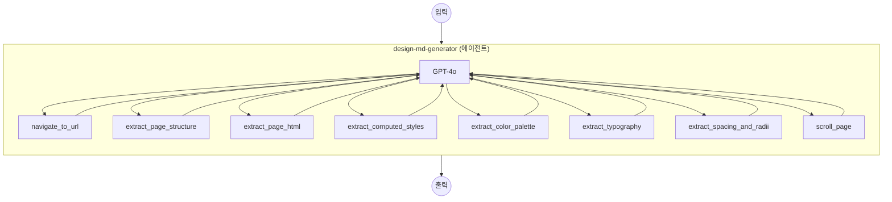

# DESIGN.md Generator 예제

이 예제는 AI 에이전트가 웹사이트의 비주얼 디자인 시스템을 분석하고 포괄적인 DESIGN.md 문서를 생성하는 과정을 보여줍니다. `web-browser` 컴포넌트를 사용한 헤드리스 브라우저 자동화와 GPT-4o 기반 `agent` 컴포넌트를 활용합니다.

## 개요

이 예제는 Docker 컨테이너 내에서 Chromium 브라우저를 실행하고, AI 에이전트를 통해 웹사이트의 디자인 시스템을 체계적으로 검사합니다:

1. **탐색**: 헤드리스 브라우저를 사용하여 대상 URL로 이동
2. **추출**: 여러 브라우저 도구를 통해 디자인 토큰(색상, 타이포그래피, 간격, 테두리 반경, 계산된 스타일) 추출
3. **합성**: 색상 팔레트, 타이포그래피 규칙, 컴포넌트 스타일링, 레이아웃 원칙 등을 포함하는 포괄적인 DESIGN.md 문서 생성

주요 특징:

- **에이전트 기반 분석**: GPT-4o 에이전트가 8개의 브라우저 도구를 사용하여 다중 패스 디자인 검사 전략 수행
- **Docker System 모듈**: Chromium, Xvfb, x11vnc, noVNC, socat을 supervisord로 관리하는 단일 컨테이너
- **CDP (Chrome DevTools Protocol)**: CDP를 통해 Chromium과 통신하여 페이지 탐색, DOM 추출, JavaScript 실행 수행
- **noVNC 원격 데스크톱**: `http://localhost:6080/vnc.html`에서 분석 과정을 모니터링할 수 있는 브라우저 화면 제공
- **Gradio Web UI**: `http://localhost:8081`에서 URL을 입력하고 생성된 DESIGN.md를 확인할 수 있는 인터랙티브 인터페이스

## 준비사항

### 필수 요구사항

- model-compose가 설치되어 PATH에서 사용 가능
- Docker가 설치되어 실행 중
- OpenAI API 키 (GPT-4o)

### 환경 구성

1. 이 예제 디렉토리로 이동:
   ```bash
   cd examples/design-md-generator
   ```

2. 환경 변수 샘플 파일을 복사하고 API 키를 설정:
   ```bash
   cp .env.sample .env
   ```

3. `.env` 파일을 편집하여 OpenAI API 키를 설정:
   ```env
   OPENAI_API_KEY=your-api-key-here
   ```

## 실행 방법

1. **서비스 시작:**
   ```bash
   model-compose up
   ```
   Docker 이미지를 빌드(필요 시)하고 브라우저 컨테이너를 시작합니다.

2. **워크플로우 실행:**

   **Web UI 사용:**
   - Web UI 열기: http://localhost:8081
   - URL을 입력하고 (예: `https://stripe.com`) Run 클릭
   - 에이전트가 사이트를 분석하고 DESIGN.md 문서를 생성

   **API 사용:**
   ```bash
   curl -X POST http://localhost:8080/api/workflows/main/runs \
     -H "Content-Type: application/json" \
     -d '{"input": {"url": "https://stripe.com"}}'
   ```

   **CLI 사용:**
   ```bash
   model-compose run main --input '{"url": "https://stripe.com"}'
   ```

3. **브라우저 모니터링** (선택사항):
   - http://localhost:6080/vnc.html 에서 noVNC를 열어 에이전트가 페이지를 탐색하고 검사하는 과정을 실시간으로 확인

4. **서비스 중지:**
   ```bash
   model-compose down
   ```

## 워크플로우 세부사항

### "DESIGN.md Generator" 워크플로우 (기본)

**설명**: 웹사이트의 디자인 시스템을 분석하고 포괄적인 DESIGN.md 문서를 생성합니다.

#### 작업 흐름



에이전트는 다중 패스 분석 전략을 따릅니다:
1. **패스 1 — 구조 개요**: URL로 이동하여 페이지 구조 및 폰트 임포트 추출
2. **패스 2 — 데이터 추출**: 주요 요소에서 색상 팔레트, 타이포그래피, 간격, 계산된 스타일 추출
3. **패스 3 — 세부 검사**: 브랜드별 컴포넌트(히어로, 가격 카드, 기능 그리드 등) 검사
4. **패스 4 — 합성**: 추출된 모든 데이터를 DESIGN.md 문서로 통합

#### 입력 파라미터

| 파라미터 | 유형 | 필수 | 기본값 | 설명 |
|----------|------|------|--------|------|
| `url` | string | 예 | — | 분석할 대상 웹사이트 URL (예: `https://stripe.com`) |

#### 출력 형식

| 필드 | 유형 | 설명 |
|------|------|------|
| `design_md` | text | 생성된 DESIGN.md 문서 내용 |
| `messages` | json | 에이전트와 GPT-4o 간의 전체 대화 메시지 |

## 컴포넌트 세부사항

### Browser 컴포넌트 (`browser`)

- **유형**: `web-browser`
- **드라이버**: Chrome (CDP)
- **호스트**: `localhost:9222`
- **타임아웃**: 60초
- **동시성**: 1 (직렬 실행)

#### 사용 가능한 액션

| 액션 | 메서드 | 설명 |
|------|--------|------|
| `navigate` | `navigate` | URL로 이동하고 페이지 로드 대기 |
| `extract-html` | `extract` | CSS 셀렉터로 HTML 콘텐츠 추출 |
| `extract-text` | `extract` | CSS 셀렉터로 텍스트 콘텐츠 추출 |
| `evaluate` | `evaluate` | 페이지에서 임의의 JavaScript 실행 |
| `scroll` | `scroll` | 픽셀 오프셋만큼 페이지 스크롤 |

### GPT-4o 컴포넌트 (`gpt-4o`)

- **유형**: `http-client`
- **API**: OpenAI Chat Completions (`/v1/chat/completions`)
- **모델**: `gpt-4o`
- **최대 토큰**: 16,384

### Design MD Generator 컴포넌트 (`design-md-generator`)

- **유형**: `agent`
- **모델**: GPT-4o (`gpt-4o` 컴포넌트를 통해 사용)
- **최대 반복 횟수**: 20
- **도구**: 디자인 검사를 위한 8개의 브라우저 기반 워크플로우

#### 에이전트 도구

| 도구 | 설명 |
|------|------|
| `navigate_to_url` | 브라우저에서 URL 열기 |
| `extract_page_structure` | 페이지 구조 개요 가져오기 (섹션, ID, 클래스, 헤딩) |
| `extract_page_html` | CSS 셀렉터로 특정 요소의 HTML 가져오기 |
| `extract_computed_styles` | 요소의 정확한 계산된 CSS 가져오기 (색상, 폰트, 간격, 그림자) |
| `extract_color_palette` | 모든 요소에서 고유한 배경, 텍스트, 테두리, 그림자 색상 스캔 |
| `extract_typography` | 모든 텍스트 요소에서 고유한 폰트 조합 스캔 |
| `extract_spacing_and_radii` | 모든 고유한 간격 및 테두리 반경 값 수집 |
| `scroll_page` | 페이지를 스크롤하여 하단 콘텐츠 표시 |

## 시스템 세부사항

### Docker 컨테이너 아키텍처

`chrome-with-novnc` 시스템은 supervisord로 관리되는 단일 Alpine 기반 컨테이너에서 다음 서비스를 실행합니다:

| 서비스 | 포트 | 설명 |
|--------|------|------|
| Xvfb | — | 가상 프레임버퍼 (디스플레이 `:99`, 1920x1080) |
| Chromium | 9222 | CDP 원격 디버깅이 활성화된 브라우저 |
| x11vnc | 5900 | 가상 디스플레이를 미러링하는 VNC 서버 |
| noVNC | 6080 | 웹 기반 VNC 클라이언트 |
| socat | 9223 | 외부 CDP 접근을 위한 TCP 프록시 |

**포트 매핑**: `9222→9223` (CDP), `6080→6080` (noVNC)

## 커스터마이징

### 다른 모델 사용
`gpt-4o` 컴포넌트를 다른 OpenAI 호환 모델로 교체:
```yaml
components:
  - id: gpt-4o
    type: http-client
    base_url: https://api.openai.com/v1
    action:
      body:
        model: gpt-4o-mini  # 또는 다른 모델
        max_tokens: 16384
```

### 에이전트 반복 횟수 조정
복잡한 사이트의 더 정밀한 분석을 위해 `max_iteration_count` 증가:
```yaml
components:
  - id: design-md-generator
    type: agent
    max_iteration_count: 30  # 기본값: 20
```

### 화면 해상도 변경
`Dockerfile`에서 환경 변수를 설정:
```dockerfile
ENV SCREEN_WIDTH=2560
ENV SCREEN_HEIGHT=1440
```

## 문제 해결

### 일반적인 문제

1. **컨테이너 빌드 실패**: Docker가 실행 중인지 확인 (`docker info`)
2. **CDP 연결 타임아웃**: 컨테이너 시작에 수 초가 걸릴 수 있습니다. model-compose가 설정된 타임아웃(60초) 내에서 자동으로 재시도합니다
3. **에이전트 반복 한도 초과**: 복잡한 사이트는 더 많은 반복이 필요할 수 있습니다. 에이전트 컴포넌트에서 `max_iteration_count`를 증가하세요
4. **noVNC 접근 불가**: 포트 `6080`이 사용 중인지 확인 (`lsof -i :6080`)
5. **OpenAI API 오류**: `OPENAI_API_KEY`가 유효하고 충분한 쿼터가 있는지 확인하세요
6. **공유 메모리 오류**: 컨테이너가 Chromium 충돌 방지를 위해 `shm_size: 2gb`를 사용합니다. 필요 시 증가하세요
