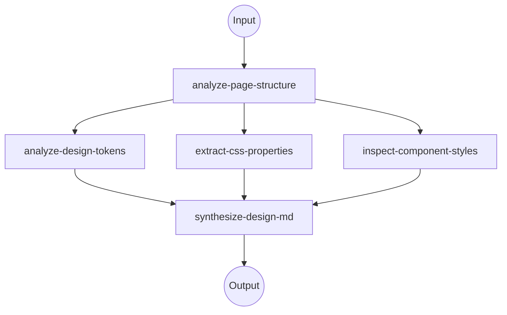

# DESIGN.md Generator Example

This example demonstrates a declarative pipeline that analyzes a website's visual design system and generates a comprehensive DESIGN.md document, using headless browser automation with the `web-browser` component and specialized AI sub-agents powered by GPT-4o.

## Overview

This example runs a Chromium browser inside a Docker container and uses a multi-step pipeline to systematically inspect a website's design system:

1. **Analyze Page Structure** — Navigate to the target URL and extract page structure, head HTML, and font sources
2. **Analyze Design Tokens** — Extract color palette, typography styles, and spacing/border-radius values
3. **Extract CSS Properties** — AI sub-agent analyzes the CSS architecture and extracts meaningful custom properties (design tokens), filtering out framework noise
4. **Inspect Component Styles** — AI sub-agent inspects specific UI components (nav, hero, buttons, cards, footer) and extracts computed styles
5. **Synthesize** — A single LLM call compiles all extracted data into a comprehensive DESIGN.md document

Key features:

- **Declarative Pipeline**: 5-step workflow orchestrated by model-compose with no top-level agent overhead
- **AI Sub-Agents**: Specialized agents for CSS property extraction and component style inspection adapt their strategies per site
- **Parallel Execution**: Steps 2, 3, and 4 run in parallel after step 1 completes
- **Docker System Module**: Single container running Chromium, Xvfb, x11vnc, noVNC, and socat via supervisord
- **CDP (Chrome DevTools Protocol)**: Communicates with Chromium for navigation, DOM extraction, and JavaScript evaluation
- **noVNC Remote Desktop**: Provides browser-visible UI at `http://localhost:6080/vnc.html` for monitoring the analysis
- **Gradio Web UI**: Interactive interface at `http://localhost:8081` to submit URLs and view generated DESIGN.md

## Preparation

### Prerequisites

- model-compose installed and available in your PATH
- Docker installed and running
- OpenAI API key (GPT-4o)

### Environment Configuration

1. Navigate to this example directory:
   ```bash
   cd examples/design-md-generator
   ```

2. Copy the environment sample file and add your API key:
   ```bash
   cp .env.sample .env
   ```

3. Edit `.env` and set your OpenAI API key:
   ```env
   OPENAI_API_KEY=your-api-key-here
   ```

## How to Run

1. **Start the service:**
   ```bash
   model-compose up
   ```
   This builds the Docker image (if needed) and starts the browser container.

2. **Run the workflow:**

   **Using Web UI:**
   - Open the Web UI: http://localhost:8081
   - Enter a URL (e.g., `https://stripe.com`) and click Run
   - The agent will analyze the site and generate a DESIGN.md document

   **Using API:**
   ```bash
   curl -X POST http://localhost:8080/api/workflows/runs \
     -H "Content-Type: application/json" \
     -d '{"input": {"url": "https://stripe.com"}}'
   ```

   **Using CLI:**
   ```bash
   model-compose run main --input '{"url": "https://stripe.com"}'
   ```

3. **Monitor the browser** (optional):
   - Open noVNC at http://localhost:6080/vnc.html to watch the agent navigate and inspect pages in real-time

4. **Stop the service:**
   ```bash
   model-compose down
   ```

## Workflow Details

### "DESIGN.md Generator" Workflow (Default)

**Description**: Analyze a website's design system and generate a comprehensive DESIGN.md document.

#### Job Flow



The pipeline runs 5 jobs in sequence and parallel:
1. **analyze-page-structure** — Navigate to URL, extract page structure, head HTML, and font sources
2. **analyze-design-tokens** — Extract color palette, typography, and spacing/border-radius values (parallel)
3. **extract-css-properties** — AI sub-agent extracts CSS custom properties, filtering framework noise (parallel)
4. **inspect-component-styles** — AI sub-agent inspects UI components and extracts computed styles (parallel)
5. **synthesize-design-md** — Single LLM call compiles all data into DESIGN.md

Steps 2, 3, and 4 run in parallel after step 1 completes. Step 5 waits for all three to finish.

#### Input Parameters

| Parameter | Type | Required | Default | Description |
|-----------|------|----------|---------|-------------|
| `url` | string | Yes | — | Target website URL to analyze (e.g., `https://stripe.com`) |

#### Output Format

| Field | Type | Description |
|-------|------|-------------|
| `design_md` | text | The generated DESIGN.md document content |

## Component Details

### Browser Component (`browser`)

- **Type**: `web-browser`
- **Driver**: Chrome (CDP)
- **Host**: `localhost:9222`
- **Timeout**: 60 seconds
- **Concurrency**: 1 (serial execution)

#### Available Actions

| Action | Method | Description |
|--------|--------|-------------|
| `navigate` | `navigate` | Navigate to a URL and wait for page load |
| `extract-html` | `extract` | Extract HTML content by CSS selector |
| `extract-text` | `extract` | Extract text content by CSS selector |
| `evaluate` | `evaluate` | Execute arbitrary JavaScript in the page |
| `scroll` | `scroll` | Scroll the page by pixel offset |

### GPT-4o Component (`gpt-4o`)

- **Type**: `http-client`
- **API**: OpenAI Chat Completions (`/v1/chat/completions`)
- **Model**: `gpt-4o`
- **Max Tokens**: 16,384

### Component Inspector (`component-inspector`)

- **Type**: `agent`
- **Model**: GPT-4o (via the `gpt-4o` component)
- **Max Iterations**: 10
- **Role**: Inspects specific UI components on a loaded page and extracts computed styles

| Tool | Description |
|------|-------------|
| `extract_computed_styles` | Get exact computed CSS of elements (colors, fonts, spacing, shadows) |
| `extract_page_html` | Get HTML of specific elements via CSS selector |
| `scroll_page` | Scroll the page to reveal below-the-fold content |

### CSS Property Extractor (`css-property-extractor`)

- **Type**: `agent`
- **Model**: GPT-4o (via the `gpt-4o` component)
- **Max Iterations**: 3
- **Role**: Extracts CSS custom properties (design tokens) and filters out framework noise

| Tool | Description |
|------|-------------|
| `extract_css_custom_properties` | Extract all CSS custom properties, with optional `skip_prefixes` to filter framework variables |

## System Details

### Docker Container Architecture

The `chrome-with-novnc` system runs a single Alpine-based container with the following services managed by supervisord:

| Service | Port | Description |
|---------|------|-------------|
| Xvfb | — | Virtual framebuffer (display `:99`, 1920x1080) |
| Chromium | 9222 | Browser with CDP remote debugging |
| x11vnc | 5900 | VNC server mirroring the virtual display |
| noVNC | 6080 | Web-based VNC client |
| socat | 9223 | TCP proxy for external CDP access |

**Port mapping**: `9222→9223` (CDP), `6080→6080` (noVNC)

## Customization

### Use a Different Model
Replace the `gpt-4o` component with another OpenAI-compatible model:
```yaml
components:
  - id: gpt-4o
    type: http-client
    base_url: https://api.openai.com/v1
    action:
      body:
        model: gpt-4o-mini  # or any other model
        max_tokens: 16384
```

### Adjust Sub-Agent Iterations
Increase `max_iteration_count` for more thorough analysis of complex sites:
```yaml
components:
  - id: component-inspector
    type: agent
    max_iteration_count: 15  # default: 10

  - id: css-property-extractor
    type: agent
    max_iteration_count: 5  # default: 3
```

### Change Screen Resolution
Set environment variables in the `Dockerfile`:
```dockerfile
ENV SCREEN_WIDTH=2560
ENV SCREEN_HEIGHT=1440
```

## Troubleshooting

### Common Issues

1. **Container build fails**: Ensure Docker is running (`docker info`)
2. **CDP connection timeout**: The container may take a few seconds to start. model-compose retries automatically within the configured timeout (60s)
3. **Sub-agent exceeds iteration limit**: Complex sites may require more iterations. Increase `max_iteration_count` in `component-inspector` or `css-property-extractor`
4. **noVNC not accessible**: Check that port `6080` is not in use (`lsof -i :6080`)
5. **OpenAI API errors**: Verify your `OPENAI_API_KEY` is valid and has sufficient quota
6. **Shared memory errors**: The container uses `shm_size: 2gb` to prevent Chromium crashes. Increase if needed
