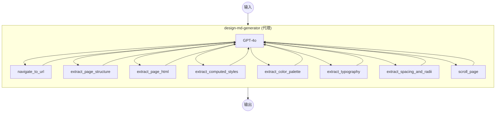

# DESIGN.md Generator 示例

此示例演示 AI 代理分析网站的视觉设计系统并生成综合 DESIGN.md 文档的过程，使用 `web-browser` 组件进行无头浏览器自动化，并使用基于 GPT-4o 的 `agent` 组件。

## 概述

此示例在 Docker 容器中运行 Chromium 浏览器，并通过 AI 代理系统性地检查网站的设计系统：

1. **导航**：使用无头浏览器导航到目标 URL
2. **提取**：通过多个浏览器工具提取设计令牌（颜色、排版、间距、圆角、计算样式）
3. **合成**：生成包含颜色调色板、排版规则、组件样式、布局原则等的综合 DESIGN.md 文档

主要特点：

- **代理驱动分析**：GPT-4o 代理使用 8 个浏览器工具执行多轮设计检查策略
- **Docker System 模块**：通过 supervisord 管理 Chromium、Xvfb、x11vnc、noVNC 和 socat 的单一容器
- **CDP (Chrome DevTools Protocol)**：通过 CDP 与 Chromium 通信，实现页面导航、DOM 提取和 JavaScript 执行
- **noVNC 远程桌面**：在 `http://localhost:6080/vnc.html` 提供浏览器可视界面，用于监控分析过程
- **Gradio Web UI**：在 `http://localhost:8081` 提供交互式界面，用于提交 URL 和查看生成的 DESIGN.md

## 准备工作

### 前置条件

- 已安装 model-compose 并在您的 PATH 中可用
- 已安装 Docker 并正在运行
- OpenAI API 密钥 (GPT-4o)

### 环境配置

1. 导航到此示例目录：
   ```bash
   cd examples/design-md-generator
   ```

2. 复制环境变量示例文件并设置 API 密钥：
   ```bash
   cp .env.sample .env
   ```

3. 编辑 `.env` 文件并设置 OpenAI API 密钥：
   ```env
   OPENAI_API_KEY=your-api-key-here
   ```

## 运行方式

1. **启动服务：**
   ```bash
   model-compose up
   ```
   构建 Docker 镜像（如需要）并启动浏览器容器。

2. **运行工作流：**

   **通过 Web UI：**
   - 打开 Web UI：http://localhost:8081
   - 输入 URL（例如 `https://stripe.com`）并点击 Run
   - 代理将分析网站并生成 DESIGN.md 文档

   **通过 API：**
   ```bash
   curl -X POST http://localhost:8080/api/workflows/main/runs \
     -H "Content-Type: application/json" \
     -d '{"input": {"url": "https://stripe.com"}}'
   ```

   **通过 CLI：**
   ```bash
   model-compose run main --input '{"url": "https://stripe.com"}'
   ```

3. **监控浏览器**（可选）：
   - 在 http://localhost:6080/vnc.html 打开 noVNC，实时观看代理导航和检查页面的过程

4. **停止服务：**
   ```bash
   model-compose down
   ```

## 工作流详情

### "DESIGN.md Generator" 工作流（默认）

**描述**：分析网站的设计系统并生成综合 DESIGN.md 文档。

#### 作业流程



代理遵循多轮分析策略：
1. **第 1 轮 — 结构概览**：导航到 URL，提取页面结构和字体导入
2. **第 2 轮 — 数据提取**：从关键元素中提取颜色调色板、排版、间距和计算样式
3. **第 3 轮 — 细节检查**：检查品牌特定组件（英雄区域、定价卡片、功能网格等）
4. **第 4 轮 — 合成**：将所有提取的数据整合为 DESIGN.md 文档

#### 输入参数

| 参数 | 类型 | 必需 | 默认值 | 描述 |
|------|------|------|--------|------|
| `url` | string | 是 | — | 要分析的目标网站 URL（例如 `https://stripe.com`） |

#### 输出格式

| 字段 | 类型 | 描述 |
|------|------|------|
| `design_md` | text | 生成的 DESIGN.md 文档内容 |
| `messages` | json | 代理与 GPT-4o 之间的完整对话消息 |

## 组件详情

### Browser 组件 (`browser`)

- **类型**：`web-browser`
- **驱动**：Chrome (CDP)
- **主机**：`localhost:9222`
- **超时**：60 秒
- **并发数**：1（串行执行）

#### 可用操作

| 操作 | 方法 | 描述 |
|------|------|------|
| `navigate` | `navigate` | 导航到 URL 并等待页面加载 |
| `extract-html` | `extract` | 通过 CSS 选择器提取 HTML 内容 |
| `extract-text` | `extract` | 通过 CSS 选择器提取文本内容 |
| `evaluate` | `evaluate` | 在页面中执行任意 JavaScript |
| `scroll` | `scroll` | 按像素偏移量滚动页面 |

### GPT-4o 组件 (`gpt-4o`)

- **类型**：`http-client`
- **API**：OpenAI Chat Completions (`/v1/chat/completions`)
- **模型**：`gpt-4o`
- **最大令牌数**：16,384

### Design MD Generator 组件 (`design-md-generator`)

- **类型**：`agent`
- **模型**：GPT-4o（通过 `gpt-4o` 组件）
- **最大迭代次数**：20
- **工具**：8 个用于设计检查的浏览器工作流

#### 代理工具

| 工具 | 描述 |
|------|------|
| `navigate_to_url` | 在浏览器中打开 URL |
| `extract_page_structure` | 获取页面结构概要（区域、ID、类名、标题） |
| `extract_page_html` | 通过 CSS 选择器获取特定元素的 HTML |
| `extract_computed_styles` | 获取元素的精确计算 CSS（颜色、字体、间距、阴影） |
| `extract_color_palette` | 扫描所有元素的唯一背景色、文本色、边框色和阴影色 |
| `extract_typography` | 扫描所有文本元素的唯一字体组合 |
| `extract_spacing_and_radii` | 收集所有唯一的间距和圆角值 |
| `scroll_page` | 滚动页面以显示下方内容 |

## 系统详情

### Docker 容器架构

`chrome-with-novnc` 系统在单个基于 Alpine 的容器中运行以下由 supervisord 管理的服务：

| 服务 | 端口 | 描述 |
|------|------|------|
| Xvfb | — | 虚拟帧缓冲（显示 `:99`，1920x1080） |
| Chromium | 9222 | 启用 CDP 远程调试的浏览器 |
| x11vnc | 5900 | 镜像虚拟显示的 VNC 服务器 |
| noVNC | 6080 | 基于 Web 的 VNC 客户端 |
| socat | 9223 | 用于外部 CDP 访问的 TCP 代理 |

**端口映射**：`9222→9223` (CDP)，`6080→6080` (noVNC)

## 自定义

### 使用不同的模型
将 `gpt-4o` 组件替换为其他 OpenAI 兼容模型：
```yaml
components:
  - id: gpt-4o
    type: http-client
    base_url: https://api.openai.com/v1
    action:
      body:
        model: gpt-4o-mini  # 或其他模型
        max_tokens: 16384
```

### 调整代理迭代次数
增加 `max_iteration_count` 以对复杂网站进行更精细的分析：
```yaml
components:
  - id: design-md-generator
    type: agent
    max_iteration_count: 30  # 默认值：20
```

### 更改屏幕分辨率
在 `Dockerfile` 中设置环境变量：
```dockerfile
ENV SCREEN_WIDTH=2560
ENV SCREEN_HEIGHT=1440
```

## 故障排除

### 常见问题

1. **容器构建失败**：确认 Docker 正在运行 (`docker info`)
2. **CDP 连接超时**：容器启动可能需要几秒钟。model-compose 在配置的超时时间（60 秒）内自动重试
3. **代理超过迭代限制**：复杂网站可能需要更多迭代次数。在代理组件中增加 `max_iteration_count`
4. **无法访问 noVNC**：检查端口 `6080` 是否被占用 (`lsof -i :6080`)
5. **OpenAI API 错误**：验证 `OPENAI_API_KEY` 是否有效且配额充足
6. **共享内存错误**：容器使用 `shm_size: 2gb` 防止 Chromium 崩溃。如需要可以增加
