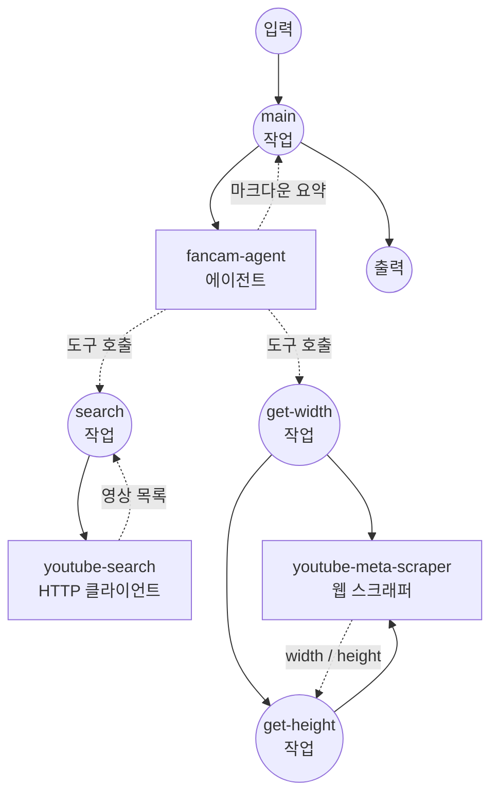

# K-POP 직캠 컬렉터 예제

이 예제는 자연어 프롬프트로부터 YouTube에서 K-POP 직캠 영상을 찾아주는 자율 에이전트(autonomous agent) 워크플로우를 보여줍니다. 선택적으로 방향(세로/portrait)으로 결과를 필터링할 수도 있습니다. GPT-4o 에이전트와 YouTube Data API 기반의 두 개의 private 도구 워크플로우, 그리고 경량 웹 스크래퍼를 결합한 구조입니다.

## 개요

이 워크플로우는 다음과 같은 엔드-투-엔드 K-POP 직캠 발굴 서비스를 제공합니다:

1. **자연어 의도 처리**: 한국어, 영어, 또는 혼합 언어로 작성한 자유 형식 프롬프트를 입력 받음
2. **에이전트 기반 검색**: GPT-4o 에이전트가 프롬프트를 YouTube 검색 쿼리로 변환하고, 결과가 부족하면 다른 키워드로 재시도
3. **방향 기반 필터링**: 세로/portrait/vertical 요청 시, 각 후보 영상의 watch 페이지에서 `og:video:width` / `og:video:height`를 확인
4. **마크다운 요약**: 제목, 채널, 게시일, 시청 URL을 포함한 큐레이션 목록 반환

## 준비사항

### 필수 요구사항

- model-compose가 설치되어 PATH에서 사용 가능
- GPT-4o 접근 권한이 있는 OpenAI API 키
- YouTube Data API v3 키 (Google Cloud 프로젝트에서 YouTube Data API v3 활성화)
- 웹 스크래핑 의존성:
  ```bash
  pip install beautifulsoup4 lxml
  ```

### API 서비스 요구사항

**OpenAI API:**
- GPT-4o 모델 접근
- 도구(tool/function) 호출이 가능한 Chat completions 엔드포인트

**YouTube Data API v3:**
- `search.list` 엔드포인트
- 기본 일일 쿼터 10,000 단위 (검색 1회당 100 단위 소모)

### 환경 구성

1. 이 예제 디렉토리로 이동:
   ```bash
   cd examples/kpop-fancam-collector
   ```

2. 샘플 환경 파일 복사:
   ```bash
   cp .env.sample .env
   ```

3. `.env` 파일을 편집하여 API 키 추가:
   ```env
   YOUTUBE_API_KEY=your-actual-youtube-data-api-key
   OPENAI_API_KEY=your-actual-openai-api-key
   ```

## 실행 방법

1. **서비스 시작:**
   ```bash
   model-compose up
   ```

   서비스가 시작됩니다:
   - API 엔드포인트: http://localhost:8080/api
   - 웹 UI: http://localhost:8081

2. **워크플로우 실행:**

   **API 사용:**
   ```bash
   # 일반 직캠 검색
   curl -X POST http://localhost:8080/api/workflows/runs \
     -H "Content-Type: application/json" \
     -d '{
       "input": {
         "prompt": "에스파 카리나 직캠 최근 것 위주로 모아줘"
       }
     }'

   # 세로 직캠만
   curl -X POST http://localhost:8080/api/workflows/runs \
     -H "Content-Type: application/json" \
     -d '{
       "input": {
         "prompt": "카리나 직캠 영상 중에서 세로 영상만 모아줘"
       }
     }'
   ```

   **웹 UI 사용:**
   - 웹 UI 열기: http://localhost:8081
   - 자연어 프롬프트 입력
   - "Run Workflow" 버튼 클릭

   **CLI 사용:**
   ```bash
   model-compose run --input '{"prompt": "카리나 직캠 영상 중에서 세로 영상만 모아줘"}'
   ```

## 컴포넌트 세부사항

### 직캠 에이전트 컴포넌트 (fancam-agent)
- **유형**: Agent 컴포넌트
- **목적**: 자연어로부터 YouTube 검색과 방향 필터링을 조율
- **모델**: OpenAI GPT-4o (`gpt-4o` HTTP client 컴포넌트 경유)
- **도구**:
  - `search-fancams` — YouTube Data API를 통한 키워드 검색
  - `get-video-dimensions` — watch 페이지에서 `og:video:width` / `og:video:height` 추출
- **동작**:
  - 결과가 부족하면 다양한 쿼리 변형(한국어/영어, 직캠/fancam 유무)을 시도
  - 프롬프트가 세로/portrait/vertical 직캠을 요청하면 `height > width`인 영상만 남김
  - 영상을 임의로 만들어내지 않음 — 검색 도구가 실제로 반환한 결과만 나열

### YouTube 검색 컴포넌트 (youtube-search)
- **유형**: HTTP client 컴포넌트
- **목적**: YouTube Data API를 통한 키워드 검색
- **API**: YouTube Data API v3 — `GET /search`
- **기능**:
  - `videoEmbeddable=true` 필터로 결과 영상을 모두 커스텀 플레이어에서 안전하게 재생 가능
  - 정렬 방식 설정 가능 (`relevance`, `date`, `viewCount`)
  - 선택적 `publishedAfter` (RFC3339), `regionCode`

### YouTube 메타 스크래퍼 컴포넌트 (youtube-meta-scraper)
- **유형**: Web scraper 컴포넌트
- **목적**: YouTube watch 페이지에서 특정 `<meta property="...">` 값 하나를 추출
- **기능**:
  - 정적 HTML 스크래핑 (JavaScript 실행 불필요)
  - `get-video-dimensions`가 `og:video:width`와 `og:video:height`를 각각 가져올 때 사용

### GPT-4o 컴포넌트 (gpt-4o)
- **유형**: HTTP client 컴포넌트
- **목적**: 에이전트가 사용하는 OpenAI Chat Completions 엔드포인트
- **API**: 도구(tool/function) 호출이 가능한 OpenAI Chat Completions

## 워크플로우 세부사항

### "K-POP Fancam Collector" 워크플로우 (main, 기본)

**설명**: 자연어 프롬프트를 기반으로 YouTube에서 K-POP 직캠을 찾는 자율 에이전트.

#### 작업 흐름



#### 입력 매개변수

| 매개변수   | 유형 | 필수   | 기본값 | 설명 |
|-----------|------|--------|--------|------|
| `prompt`  | text | 예     | —      | 수집할 직캠을 설명하는 자연어 프롬프트 |

#### 출력 형식

| 필드       | 유형      | 설명 |
|-----------|----------|------|
| `summary` | markdown | 제목, 채널, 게시일, 시청 URL을 포함한 직캠 큐레이션 목록 |
| `messages`| json     | 에이전트와 LLM 사이의 전체 대화 로그 (디버깅용) |

### Private 도구 워크플로우

다음 워크플로우는 에이전트의 도구로 노출되며 `/api/workflows`에는 표시되지 않습니다. 직접 호출하고 싶다면 `model-compose.yml`에서 `private: true`를 꺼두면 됩니다.

- **`search-fancams`** — YouTube Data API 키워드 검색. 입력: `query`, `max_results`, `order`, `published_after`, `region_code`.
- **`get-video-dimensions`** — 한 영상의 OpenGraph 메타 태그를 스크래핑해 `{video_id, width, height}`를 반환.

## 맞춤화

### 에이전트 검색 동작 조정
`fancam-agent` 컴포넌트의 `system_prompt`를 수정해서 쿼리 생성 방식, 결과 중복 제거 방식, 요약 형식을 바꿀 수 있습니다.

### 다른 LLM 사용
`gpt-4o` 컴포넌트의 `base_url`과 요청 body의 모델명을 바꾸면 Azure OpenAI, OpenRouter 등 chat-completions 호환 엔드포인트로 교체할 수 있습니다.

### YouTube 검색 기본값 조정
`search-fancams`의 기본값(예: `region_code | KR`, `max_results | 15`)을 지역이나 쿼터 예산에 맞게 변경합니다.

### 스크래퍼의 JavaScript 렌더링 활성화
YouTube가 OpenGraph 메타 태그를 JS 렌더링 이후에만 노출하도록 바뀐다면, `youtube-meta-scraper` 컴포넌트에서 `enable_javascript: true`로 설정합니다 (Playwright 필요).

## 참고 사항

- **YouTube 쿼터**: `search.list` 한 번에 100 쿼터 단위가 소모됩니다. 기본 일일 한도가 10,000이므로 하루 약 100회 검색이 가능합니다. 에이전트는 한 프롬프트에 여러 번 도구를 호출할 수 있습니다.
- **임베드 가능한 영상만**: `search-fancams`는 `videoEmbeddable=true`로 필터링하므로 결과 영상은 모두 커스텀 플레이어에서 안전하게 재생 가능합니다.
- **방향 판정은 best-effort**: `get-video-dimensions`는 watch 페이지의 OpenGraph 메타 태그를 읽습니다. YouTube가 마크업을 바꾸거나 스크래핑을 제한하면 일부 영상에서 실패할 수 있는데, 에이전트는 그런 영상을 건너뛰도록 지시되어 있습니다.
- **임의 생성 금지**: 에이전트는 검색 도구가 실제로 반환한 영상만 결과에 포함하도록 설정되어 있습니다. 이상한 결과가 보이면 video ID를 직접 확인해 보세요.
