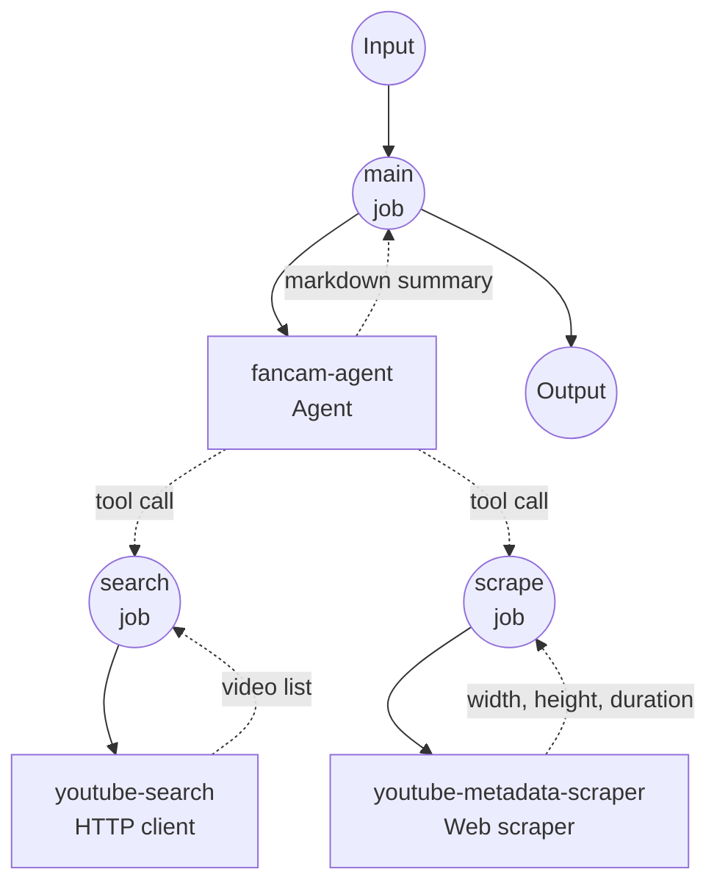

# K-POP Fancam Collector Example

This example demonstrates an autonomous agent workflow that searches YouTube for K-POP fancam videos from a natural-language prompt, and optionally filters them by orientation (portrait/vertical). It combines a GPT-4o agent with two private tool workflows backed by the YouTube Data API and a lightweight web scraper.

## Overview

This workflow provides an end-to-end K-POP fancam discovery service that:

1. **Natural-language Intent**: Accepts free-form prompts in Korean, English, or mixed language
2. **Agent-Driven Search**: A GPT-4o agent decides how to translate the prompt into YouTube queries and may retry with different keywords
3. **Orientation & Duration Metadata**: For each candidate the agent can fetch width, height, and ISO 8601 duration from the watch page — used for vertical-only filtering and richer summaries
4. **Markdown Summary**: Returns a curated list with titles, channels, publish dates, and watch URLs

## Preparation

### Prerequisites

- model-compose installed and available in your PATH
- OpenAI API key with GPT-4o access
- YouTube Data API v3 key (Google Cloud project with YouTube Data API v3 enabled)
- Web scraping dependencies:
  ```bash
  pip install beautifulsoup4 lxml
  ```

### API Service Requirements

**OpenAI API:**
- GPT-4o model access
- Chat completions endpoint with tool/function calling

**YouTube Data API v3:**
- `search.list` endpoint
- Default daily quota of 10,000 units (each search costs 100 units)

### Environment Configuration

1. Navigate to this example directory:
   ```bash
   cd examples/kpop-fancam-collector
   ```

2. Copy the sample environment file:
   ```bash
   cp .env.sample .env
   ```

3. Edit `.env` and add your API keys:
   ```env
   YOUTUBE_API_KEY=your-actual-youtube-data-api-key
   OPENAI_API_KEY=your-actual-openai-api-key
   ```

## How to Run

1. **Start the service:**
   ```bash
   model-compose up
   ```

   The service will start:
   - API endpoint: http://localhost:8080/api
   - Web UI: http://localhost:8081

2. **Run the workflow:**

   **Using API:**
   ```bash
   # General fancam search
   curl -X POST http://localhost:8080/api/workflows/runs \
     -H "Content-Type: application/json" \
     -d '{
       "input": {
         "prompt": "Collect recent aespa Karina fancams"
       }
     }'

   # Vertical (portrait) fancams only
   curl -X POST http://localhost:8080/api/workflows/runs \
     -H "Content-Type: application/json" \
     -d '{
       "input": {
         "prompt": "Collect vertical fancams of Karina only"
       }
     }'
   ```

   **Using Web UI:**
   - Open the Web UI: http://localhost:8081
   - Enter a natural-language prompt
   - Click "Run Workflow"

   **Using CLI:**
   ```bash
   model-compose run --input '{"prompt": "Collect vertical fancams of Karina only"}'
   ```

## Component Details

### Fancam Agent Component (fancam-agent)
- **Type**: Agent component
- **Purpose**: Orchestrate YouTube searches and orientation filtering from natural language
- **Model**: OpenAI GPT-4o (via the `gpt-4o` HTTP client component)
- **Tools**:
  - `search-fancams` — keyword search through the YouTube Data API
  - `get-video-metadata` — extracts `og:video:width`, `og:video:height`, and ISO 8601 duration from the watch page
- **Behavior**:
  - Tries multiple query variations (Korean/English, with/without 직캠/fancam) when results are sparse
  - When the prompt asks for vertical/portrait/세로 fancams, filters candidates by `height > width`
  - Never invents videos — only lists what the search tool actually returned

### YouTube Search Component (youtube-search)
- **Type**: HTTP client component
- **Purpose**: Keyword search against YouTube Data API
- **API**: YouTube Data API v3 — `GET /search`
- **Features**:
  - Filters `videoEmbeddable=true` so every result is playable in a custom player
  - Configurable sort order (`relevance`, `date`, `viewCount`)
  - Optional `publishedAfter` (RFC3339) and `regionCode`

### YouTube Metadata Scraper Component (youtube-metadata-scraper)
- **Type**: Web scraper component
- **Purpose**: Read `og:video:width`, `og:video:height`, and `itemprop="duration"` meta tags from a YouTube watch page
- **Features**:
  - Static HTML scraping (no JavaScript execution required)
  - Dict-form `selector` extracts all three fields (width, height, duration) from a single page fetch — keys map directly to result fields
  - `rate_limit: { interval: 1500ms }` enforces at least 1.5s between calls to avoid Google rate limiting (429)
  - Duration is returned in ISO 8601 format (e.g. `PT3M14S`) — the agent converts it to mm:ss for the summary

### GPT-4o Component (gpt-4o)
- **Type**: HTTP client component
- **Purpose**: OpenAI Chat Completions endpoint used by the agent
- **API**: OpenAI Chat Completions with tool/function calling

## Workflow Details

### "K-POP Fancam Collector" Workflow (main, default)

**Description**: An autonomous agent that searches YouTube for K-POP fancams based on a natural-language prompt.

#### Job Flow



#### Input Parameters

| Parameter | Type | Required | Default | Description |
|-----------|------|----------|---------|-------------|
| `prompt`  | text | yes      | —       | Natural-language description of the fancams to collect |

#### Output Format

| Field      | Type           | Description |
|------------|----------------|-------------|
| `summary`  | markdown       | Curated list of fancams with titles, channels, dates, and watch URLs |
| `messages` | json           | Full conversation log between the agent and the LLM (useful for debugging) |

### Private Tool Workflows

These are exposed to the agent as tools and not listed on `/api/workflows`. Flip `private: true` off in `model-compose.yml` if you want to call them directly.

- **`search-fancams`** — Keyword search via YouTube Data API. Inputs: `query`, `max_results`, `order`, `published_after`, `region_code`.
- **`get-video-metadata`** — Returns `{video_id, width, height, duration}` for one video by scraping OpenGraph and Schema.org meta tags.

## Customization

### Adjust agent search behavior
Edit the `system_prompt` in the `fancam-agent` component to change how queries are generated, how results are deduplicated, or how the summary is formatted.

### Use a different LLM
Swap the `gpt-4o` component with any chat-completions-compatible endpoint (Azure OpenAI, OpenRouter, etc.) by changing `base_url` and the model name in the request body.

### Tune YouTube search defaults
Change defaults in `search-fancams` (e.g. `region_code | KR`, `max_results | 15`) to match your locale or quota budget.

### Enable JavaScript rendering for the scraper
If YouTube changes the watch page so OpenGraph meta tags require JS, set `enable_javascript: true` on the `youtube-metadata-scraper` component (requires Playwright).

## Notes

- **YouTube quota**: Each `search.list` call costs 100 quota units. The default daily limit is 10,000, so roughly 100 searches per day. The agent may call the tool multiple times per prompt.
- **Embeddable only**: `search-fancams` filters `videoEmbeddable=true`, so every result is safe for use in a custom video player.
- **Metadata is best-effort**: `get-video-metadata` reads OpenGraph and Schema.org meta tags on the watch page. If YouTube changes the markup or rate-limits the scrape, the tool may fail for some videos — the agent is instructed to skip those.
- **No invention**: The agent is instructed to only list videos the search tool actually returned. Cross-check video IDs if anything looks off.
