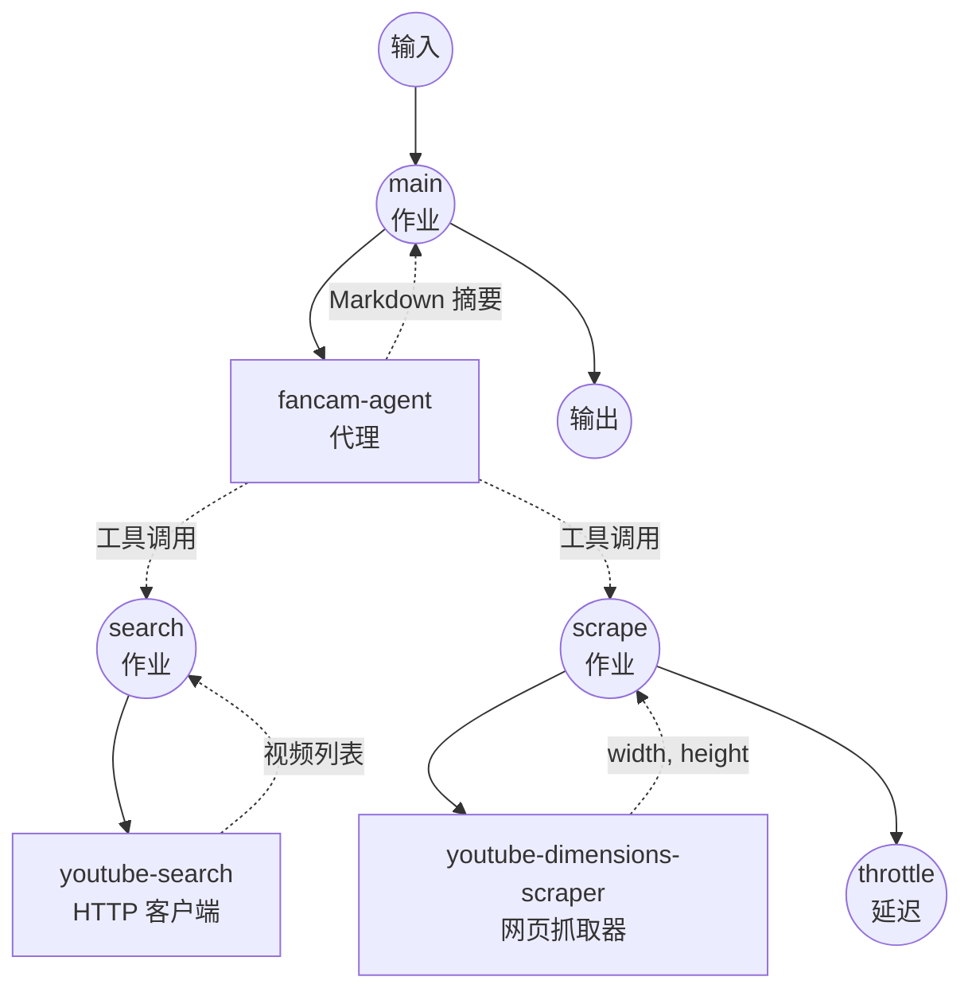

# K-POP 直拍收集器示例

本示例演示一个自主代理(autonomous agent)工作流,根据自然语言提示在 YouTube 上搜索 K-POP 直拍(fancam)视频,并可选地按方向(竖屏/portrait)进行过滤。该示例将 GPT-4o 代理与两个基于 YouTube Data API 的私有工具工作流和一个轻量级网页抓取器结合在一起。

## 概述

该工作流提供端到端的 K-POP 直拍发现服务:

1. **自然语言意图**: 接受中文、英语或混合语言的自由格式提示
2. **代理驱动的搜索**: GPT-4o 代理决定如何将提示翻译为 YouTube 查询,并在结果不足时尝试不同的关键词
3. **方向过滤**: 当请求竖屏/portrait/vertical 直拍时,代理会检查每个候选视频 watch 页面的 `og:video:width` / `og:video:height`
4. **Markdown 摘要**: 返回包含标题、频道、发布日期和观看 URL 的精选列表

## 准备

### 前置条件

- 已安装 model-compose 并在 PATH 中可用
- 具有 GPT-4o 访问权限的 OpenAI API 密钥
- YouTube Data API v3 密钥(在 Google Cloud 项目中启用 YouTube Data API v3)
- 网页抓取依赖:
  ```bash
  pip install beautifulsoup4 lxml
  ```

### API 服务要求

**OpenAI API:**
- GPT-4o 模型访问权限
- 支持工具(tool/function)调用的 Chat completions 端点

**YouTube Data API v3:**
- `search.list` 端点
- 默认每日配额 10,000 个单位(每次搜索消耗 100 个单位)

### 环境配置

1. 进入本示例目录:
   ```bash
   cd examples/kpop-fancam-collector
   ```

2. 复制示例环境文件:
   ```bash
   cp .env.sample .env
   ```

3. 编辑 `.env` 并添加 API 密钥:
   ```env
   YOUTUBE_API_KEY=your-actual-youtube-data-api-key
   OPENAI_API_KEY=your-actual-openai-api-key
   ```

## 如何运行

1. **启动服务:**
   ```bash
   model-compose up
   ```

   服务将启动:
   - API 端点: http://localhost:8080/api
   - 网页界面: http://localhost:8081

2. **运行工作流:**

   **使用 API:**
   ```bash
   # 一般直拍搜索
   curl -X POST http://localhost:8080/api/workflows/runs \
     -H "Content-Type: application/json" \
     -d '{
       "input": {
         "prompt": "收集 aespa Karina 最近的直拍视频"
       }
     }'

   # 仅竖屏直拍
   curl -X POST http://localhost:8080/api/workflows/runs \
     -H "Content-Type: application/json" \
     -d '{
       "input": {
         "prompt": "只收集 Karina 的竖屏直拍视频"
       }
     }'
   ```

   **使用网页界面:**
   - 打开网页界面: http://localhost:8081
   - 输入自然语言提示
   - 点击 "Run Workflow"

   **使用 CLI:**
   ```bash
   model-compose run --input '{"prompt": "只收集 Karina 的竖屏直拍视频"}'
   ```

## 组件详情

### 直拍代理组件 (fancam-agent)
- **类型**: Agent 组件
- **目的**: 从自然语言协调 YouTube 搜索与方向过滤
- **模型**: OpenAI GPT-4o (通过 `gpt-4o` HTTP client 组件)
- **工具**:
  - `search-fancams` — 通过 YouTube Data API 进行关键词搜索
  - `get-video-dimensions` — 从 watch 页面提取 `og:video:width` / `og:video:height`
- **行为**:
  - 在结果稀少时尝试多种查询变体(中英文、有无"直拍"/"fancam")
  - 当提示要求竖屏/portrait/vertical 直拍时,只保留 `height > width` 的视频
  - 不虚构视频 — 仅列出搜索工具实际返回的结果

### YouTube 搜索组件 (youtube-search)
- **类型**: HTTP client 组件
- **目的**: 通过 YouTube Data API 进行关键词搜索
- **API**: YouTube Data API v3 — `GET /search`
- **特性**:
  - 使用 `videoEmbeddable=true` 过滤,所有结果均可安全用于自定义播放器
  - 可配置排序方式(`relevance`、`date`、`viewCount`)
  - 可选的 `publishedAfter`(RFC3339)与 `regionCode`

### YouTube 视频尺寸抓取组件 (youtube-dimensions-scraper)
- **类型**: Web scraper 组件
- **目的**: 在一次抓取中从 YouTube watch 页面读取 `og:video:width` 与 `og:video:height` 元标签
- **特性**:
  - 静态 HTML 抓取(无需执行 JavaScript)
  - 通过列表形式 `selector` 在一次页面抓取中同时提取两个尺寸值
  - `max_concurrent_count: 1` 与每次调用后的 throttle 延迟,避免 Google 速率限制(429)

### GPT-4o 组件 (gpt-4o)
- **类型**: HTTP client 组件
- **目的**: 代理使用的 OpenAI Chat Completions 端点
- **API**: 支持工具(tool/function)调用的 OpenAI Chat Completions

## 工作流详情

### "K-POP Fancam Collector" 工作流 (main, 默认)

**描述**: 根据自然语言提示在 YouTube 上搜索 K-POP 直拍的自主代理。

#### 作业流程



#### 输入参数

| 参数      | 类型 | 必需 | 默认值 | 描述 |
|----------|------|------|--------|------|
| `prompt` | text | 是   | —      | 描述需要收集的直拍的自然语言提示 |

#### 输出格式

| 字段       | 类型     | 描述 |
|-----------|---------|------|
| `summary` | markdown| 包含标题、频道、发布日期和观看 URL 的直拍精选列表 |
| `messages`| json    | 代理与 LLM 之间的完整对话日志(用于调试) |

### 私有工具工作流

以下工作流作为代理的工具暴露,不会出现在 `/api/workflows` 列表中。如需直接调试调用,可在 `model-compose.yml` 中关闭 `private: true`。

- **`search-fancams`** — YouTube Data API 关键词搜索。输入: `query`、`max_results`、`order`、`published_after`、`region_code`。
- **`get-video-dimensions`** — 通过抓取 OpenGraph 元标签返回某个视频的 `{video_id, width, height}`。

## 自定义

### 调整代理搜索行为
编辑 `fancam-agent` 组件的 `system_prompt`,可以更改查询生成方式、结果去重方式以及摘要格式。

### 使用其他 LLM
更改 `gpt-4o` 组件的 `base_url` 和请求体中的模型名称,即可切换到任何兼容 chat-completions 的端点(Azure OpenAI、OpenRouter 等)。

### 调整 YouTube 搜索默认值
更改 `search-fancams` 中的默认值(例如 `region_code | KR`、`max_results | 15`)以匹配地区或配额预算。

### 为抓取器启用 JavaScript 渲染
如果 YouTube 更改了 watch 页面使 OpenGraph 元标签依赖于 JS 渲染,可以在 `youtube-dimensions-scraper` 组件上设置 `enable_javascript: true`(需要 Playwright)。

## 注意事项

- **YouTube 配额**: 每次 `search.list` 调用消耗 100 个配额单位。默认日配额是 10,000,因此每天大约可以执行 100 次搜索。代理在一次提示中可能多次调用搜索工具。
- **仅可嵌入视频**: `search-fancams` 使用 `videoEmbeddable=true` 过滤,所有结果均可安全用于自定义视频播放器。
- **方向判定为尽力而为(best-effort)**: `get-video-dimensions` 读取 watch 页面的 OpenGraph 元标签。如果 YouTube 更改了标记或限制了抓取,某些视频可能会失败 — 代理被指示跳过这些视频。
- **不虚构结果**: 代理被指示只列出搜索工具实际返回的视频。如果发现可疑结果,请核对 video ID。
