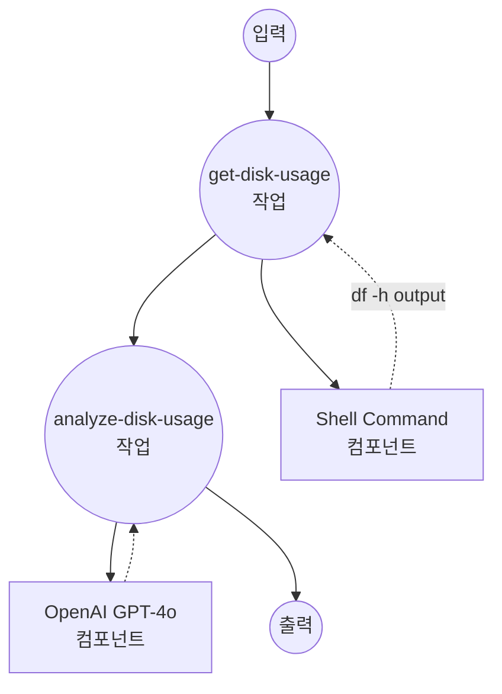

# 디스크 사용량 분석 예제

이 예제는 시스템 디스크 사용량을 자동으로 분석하고 GPT-4o를 사용하여 상세한 분석을 제공하는 워크플로우를 보여줍니다.

## 개요

이 워크플로우는 다음 프로세스를 통해 작동합니다:

1. **디스크 사용량 수집**: `df -h` 명령을 실행하여 현재 시스템 디스크 사용량 정보 수집
2. **AI 분석**: OpenAI GPT-4o 모델을 사용하여 디스크 사용량 데이터 분석 및 권장사항 제공

## 준비사항

### 필수 요구사항

- model-compose가 설치되어 PATH에서 사용 가능
- OpenAI API 키

### 환경 구성

1. 이 예제 디렉토리로 이동:
   ```bash
   cd examples/analyze-disk-usage
   ```

2. 샘플 환경 파일 복사:
   ```bash
   cp .env.sample .env
   ```

3. `.env` 파일을 편집하여 OpenAI API 키 추가:
   ```env
   OPENAI_API_KEY=your-actual-openai-api-key
   ```

## 실행 방법

1. **서비스 시작:**
   ```bash
   model-compose up
   ```

2. **워크플로우 실행:**

   **API 사용:**
   ```bash
   curl -X POST http://localhost:8080/api/workflows/runs \
     -H "Content-Type: application/json" \
     -d '{}'
   ```

   **웹 UI 사용:**
   - Web UI 열기: http://localhost:8081
   - "Run Workflow" 버튼 클릭

   **CLI 사용:**
   ```bash
   model-compose run
   ```

## 컴포넌트 세부사항

### Shell Command 컴포넌트 (get-disk-usage)
- **유형**: Shell 컴포넌트
- **목적**: 시스템 디스크 사용량 명령 실행
- **명령**: `df -h`
- **출력**: 사람이 읽을 수 있는 형식의 원시 디스크 사용량 정보

### OpenAI GPT-4o 컴포넌트 (gpt-4o)
- **유형**: HTTP client 컴포넌트
- **목적**: AI 기반 디스크 사용량 분석
- **API**: OpenAI GPT-4o Chat Completions
- **기능**: 디스크 사용량 데이터 분석 및 권장사항 제공

## 워크플로우 세부사항

### "Analyze Disk Usage with GPT-4o" 워크플로우 (기본)

**설명**: 시스템에서 df -h 출력을 자동으로 검색하고 OpenAI의 GPT-4o를 사용하여 상세한 디스크 사용량 분석 생성

#### 작업 흐름

1. **get-disk-usage**: 시스템 디스크 사용량 정보 수집
2. **analyze-disk-usage**: GPT-4o를 통한 디스크 사용량 분석 및 권장사항 생성



#### 입력 매개변수

| 매개변수 | 유형 | 필수 | 기본값 | 설명 |
|---------|------|------|--------|------|
| - | - | - | - | 이 워크플로우는 입력 매개변수가 필요하지 않습니다 |

#### 출력 형식

| 필드 | 유형 | 설명 |
|-----|------|------|
| `usage` | text | `df -h` 명령의 원시 디스크 사용량 출력 |
| `advice` | markdown | 디스크 사용량 최적화를 위한 AI 생성 분석 및 권장사항 |

## 예제 출력

실행 시 워크플로우는 다음을 제공합니다:

- 현재 디스크 사용 상태
- 높은 사용량을 가진 볼륨에 대한 경고
- 디스크 공간 확보를 위한 구체적인 권장사항

## 사용자 정의

- `system_prompt`를 수정하여 분석 접근 방식 변경
- 다른 AI 모델(GPT-3.5, Claude 등)로 교체
- 더 많은 시스템 정보 수집을 위한 추가 컴포넌트 추가
