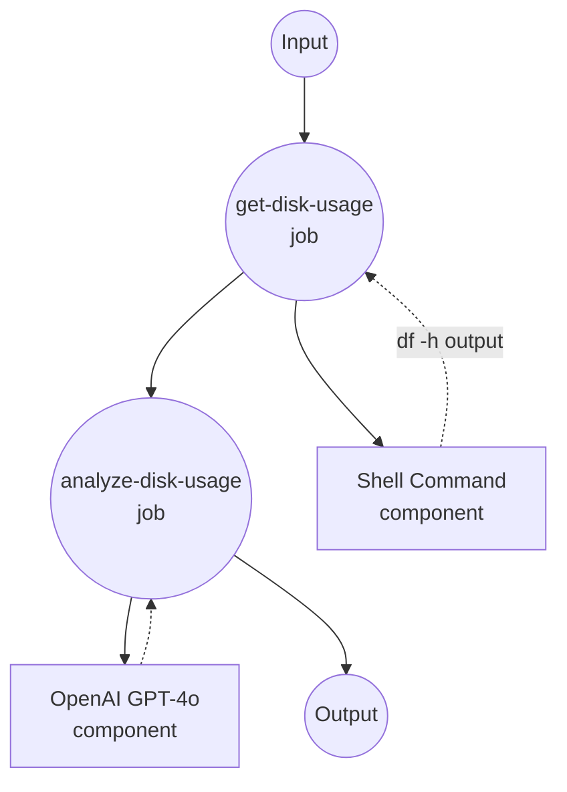

# Analyze Disk Usage Example

This example demonstrates a workflow that automatically analyzes system disk usage and provides detailed analysis using GPT-4o.

## Overview

This workflow operates through the following process:

1. **Collect Disk Usage**: Executes `df -h` command to gather current system disk usage information
2. **AI Analysis**: Uses OpenAI GPT-4o model to analyze disk usage data and provide recommendations

## Preparation

### Prerequisites

- model-compose installed and available in your PATH
- OpenAI API key

### Environment Configuration

1. Navigate to this example directory:
   ```bash
   cd examples/analyze-disk-usage
   ```

2. Copy the sample environment file:
   ```bash
   cp .env.sample .env
   ```

3. Edit `.env` and add your OpenAI API key:
   ```env
   OPENAI_API_KEY=your-actual-openai-api-key
   ```

## How to Run

1. **Start the service:**
   ```bash
   model-compose up
   ```

2. **Run the workflow:**

   **Using API:**
   ```bash
   curl -X POST http://localhost:8080/api/workflows/__default__/runs \
     -H "Content-Type: application/json" \
     -d '{}'
   ```

   **Using Web UI:**
   - Open the Web UI: http://localhost:8081
   - Click the "Run Workflow" button

   **Using CLI:**
   ```bash
   model-compose run
   ```

## Component Details

### get-disk-usage
- **Type**: Shell component
- **Purpose**: Executes system disk usage command
- **Command**: `df -h`
- **Output**: Raw disk usage information in human-readable format

### gpt-4o
- **Type**: HTTP client component
- **Purpose**: AI-powered disk usage analysis
- **API**: OpenAI GPT-4o Chat Completions
- **Function**: Analyzes disk usage data and provides recommendations

## Workflow Details

### "Analyze Disk Usage with GPT-4o" Workflow (Default)

**Description**: Automatically retrieve df -h output from the system and generate a detailed disk usage analysis using OpenAI's GPT-4o.

#### Job Flow

1. **get-disk-usage**: Collect system disk usage information
2. **analyze-disk-usage**: Generate disk usage analysis and recommendations via GPT-4o



#### Input Parameters

| Parameter | Type | Required | Default | Description |
|-----------|------|----------|---------|-------------|
| - | - | - | - | This workflow requires no input parameters |

#### Output Format

| Field | Type | Description |
|-------|------|-------------|
| `usage` | text | Raw disk usage output from `df -h` command |
| `advice` | markdown | AI-generated analysis and recommendations for disk usage optimization |

## Example Output

When executed, the workflow provides:

- Current disk usage status
- Warnings for volumes with high usage
- Specific recommendations for freeing up disk space

## Customization

- Modify `system_prompt` to change analysis approach
- Replace with other AI models (GPT-3.5, Claude, etc.)
- Add additional components for collecting more system information