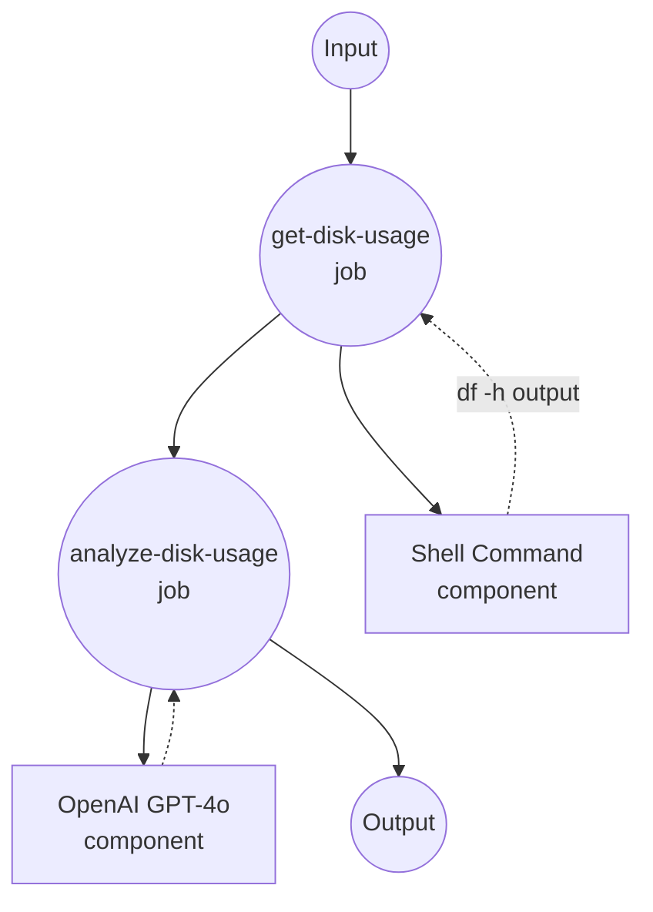

# 磁盘使用分析示例

此示例演示了一个自动分析系统磁盘使用情况并使用 GPT-4o 提供详细分析的工作流。

## 概述

此工作流通过以下流程运行：

1. **收集磁盘使用情况**：执行 `df -h` 命令收集当前系统磁盘使用信息
2. **AI 分析**：使用 OpenAI GPT-4o 模型分析磁盘使用数据并提供建议

## 准备工作

### 前置条件

- 已安装 model-compose 并在您的 PATH 中可用
- OpenAI API 密钥

### 环境配置

1. 导航到此示例目录：
   ```bash
   cd examples/analyze-disk-usage
   ```

2. 复制示例环境文件：
   ```bash
   cp .env.sample .env
   ```

3. 编辑 `.env` 并添加您的 OpenAI API 密钥：
   ```env
   OPENAI_API_KEY=your-actual-openai-api-key
   ```

## 运行方式

1. **启动服务：**
   ```bash
   model-compose up
   ```

2. **运行工作流：**

   **使用 API：**
   ```bash
   curl -X POST http://localhost:8080/api/workflows/runs \
     -H "Content-Type: application/json" \
     -d '{}'
   ```

   **使用 Web UI：**
   - 打开 Web UI：http://localhost:8081
   - 点击"运行工作流"按钮

   **使用 CLI：**
   ```bash
   model-compose run
   ```

## 组件详情

### Shell 命令组件 (get-disk-usage)
- **类型**：Shell 组件
- **用途**：执行系统磁盘使用命令
- **命令**：`df -h`
- **输出**：人类可读格式的原始磁盘使用信息

### OpenAI GPT-4o 组件 (gpt-4o)
- **类型**：HTTP 客户端组件
- **用途**：AI 驱动的磁盘使用分析
- **API**：OpenAI GPT-4o Chat Completions
- **功能**：分析磁盘使用数据并提供建议

## 工作流详情

### "使用 GPT-4o 分析磁盘使用情况"工作流（默认）

**描述**：自动从系统获取 df -h 输出，并使用 OpenAI 的 GPT-4o 生成详细的磁盘使用分析。

#### 作业流程

1. **get-disk-usage**：收集系统磁盘使用信息
2. **analyze-disk-usage**：通过 GPT-4o 生成磁盘使用分析和建议



#### 输入参数

| 参数 | 类型 | 必需 | 默认值 | 描述 |
|-----------|------|----------|---------|-------------|
| - | - | - | - | 此工作流不需要输入参数 |

#### 输出格式

| 字段 | 类型 | 描述 |
|-------|------|-------------|
| `usage` | text | `df -h` 命令的原始磁盘使用输出 |
| `advice` | markdown | AI 生成的磁盘使用优化分析和建议 |

## 示例输出

执行时，工作流提供：

- 当前磁盘使用状态
- 高使用率卷的警告
- 释放磁盘空间的具体建议

## 自定义

- 修改 `system_prompt` 以更改分析方法
- 替换为其他 AI 模型（GPT-3.5、Claude 等）
- 添加额外组件以收集更多系统信息
