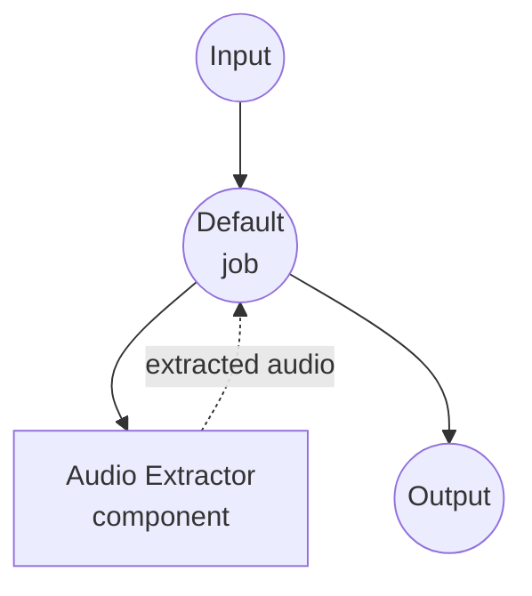

# Audio Extractor Example

This example demonstrates an audio extractor using the `audio-extractor` component, showcasing how model-compose can orchestrate ffmpeg-based audio extraction from video or audio files with configurable encoding options.

## Overview

This workflow provides an audio extraction service that:

1. **Audio Extraction**: Extracts audio from video files (MP4, MKV, MOV, etc.) or re-encodes audio files
2. **Format Conversion**: Converts to various audio formats (MP3, WAV, FLAC, AAC, M4A, Opus, OGG)
3. **Configurable Encoding**: Supports audio codec, bitrate, and multi-track selection
4. **File Input/Output**: Shows how binary file data flows through components and workflows
5. **Web UI Integration**: Provides a Gradio-based interface with dropdown selectors for all options

## Preparation

### Prerequisites

- model-compose installed and available in your PATH
- [ffmpeg](https://ffmpeg.org/) installed and available in your PATH

### Environment Configuration

1. Navigate to this example directory:
   ```bash
   cd examples/audio-extractor
   ```

2. Verify ffmpeg is installed:
   ```bash
   ffmpeg -version
   ```

## How to Run

1. **Start the service:**
   ```bash
   model-compose up
   ```

2. **Run the workflow:**

   **Using Web UI:**
   - Open the Web UI: http://localhost:8081
   - Upload a video or audio file
   - Select output format, codec, and bitrate
   - Click the "Run Workflow" button
   - Download the extracted audio file

   **Using API:**
   ```bash
   curl -X POST http://localhost:8080/api/workflows/runs \
     -H "Content-Type: multipart/form-data" \
     -F "source=@input.mp4" \
     -F "format=mp3" \
     -F "codec=libmp3lame" \
     -F "bitrate=192k"
   ```

   **Using CLI:**
   ```bash
   model-compose run --input '{"source": "path/to/input.mp4", "format": "mp3"}'
   ```

## Component Details

### Audio Extractor Component
- **Type**: `audio-extractor`
- **Driver**: ffmpeg
- **Purpose**: Extract audio from video or audio files with configurable encoding settings

## Workflow Details

### "Audio Extractor" Workflow (Default)

**Description**: Extracts audio from a video or audio file using ffmpeg.

#### Job Flow



#### Input Parameters

| Parameter | Type | Required | Default | Description |
|-----------|------|----------|---------|-------------|
| `source` | file | Yes | - | The video or audio file to extract audio from |
| `format` | select | No | `mp3` | Output format: mp3, wav, flac, aac, m4a, opus, ogg |
| `codec` | select | No | `libmp3lame` | Audio codec: libmp3lame, pcm_s16le, flac, aac, libopus, libvorbis, copy |
| `bitrate` | select | No | `192k` | Audio bitrate: 64k, 128k, 192k, 256k, 320k |

#### Output Format

| Field | Type | Description |
|-------|------|-------------|
| `audio` | audio | The extracted audio file |

## Supported Formats

### Input
ffmpeg supports a wide range of container formats, including:

- **Video containers**: MP4, MKV, MOV, AVI, WebM, FLV, TS
- **Audio containers**: MP3, WAV, FLAC, AAC, M4A, OGG, Opus

### Output
This example supports the following audio output formats:

- **MP3** - MPEG-1 Audio Layer III (lossy)
- **WAV** - Waveform Audio (uncompressed)
- **FLAC** - Free Lossless Audio Codec
- **AAC** - Advanced Audio Coding (lossy)
- **M4A** - MPEG-4 Audio container
- **Opus** - Modern lossy codec
- **OGG** - Ogg Vorbis container

## Tips

- **Lossless extraction**: Use `format=flac` or `format=wav` with `codec=flac`/`pcm_s16le` to preserve audio quality
- **Copy without re-encoding**: Use `codec=copy` to extract the original audio stream without transcoding (fastest, no quality loss)
- **Multi-track sources**: The `track` field on the component action accepts an integer index (e.g. `track: 1`) to select a specific audio track from MKV, MP4, or other multi-track containers
- **Smallest file size**: Use `format=opus` with a low bitrate for the best compression

## Troubleshooting

### Common Issues

1. **ffmpeg Not Found**: Ensure ffmpeg is installed and available in your PATH
2. **Unsupported Codec**: Some codec/format combinations may not be compatible (e.g. libmp3lame with flac)
3. **Track Not Found**: If the source has only one audio track, keep `track: 0` (the default)
4. **Copy Codec Fails**: `codec=copy` only works when the source codec matches the output format
