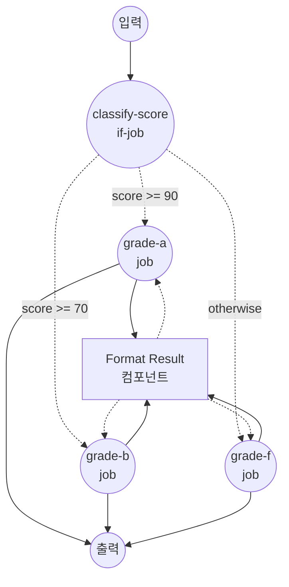

# `if`를 사용한 조건 라우팅 예제

이 예제는 `if` job 타입을 보여줍니다. 하나 이상의 조건을 평가하여 결과에 따라 워크플로우를 서로 다른 job으로 라우팅합니다.

## 개요

이 워크플로우는 다음 과정을 통해 동작합니다:

1. **조건 평가**: `classify-score` job이 `${input.score}` 값을 여러 임계값과 순서대로 비교합니다
2. **분기 라우팅**: 가장 먼저 일치한 조건에 따라 등급별 job으로 워크플로우가 라우팅됩니다
3. **결과 포맷팅**: 선택된 분기가 공통 `format-result` shell 컴포넌트를 호출하여 등급, 점수, 메시지를 담은 작은 객체를 반환합니다

분기 규칙:

- `score >= 90`이면 `grade-a`
- `score >= 70`이면 `grade-b`
- 그 외에는 `grade-f` (`otherwise` 분기)

## 준비사항

### 필수 요구사항

- model-compose가 설치되어 PATH에서 사용 가능

### 환경 구성

1. 이 예제 디렉토리로 이동:
   ```bash
   cd examples/conditional-routing/if
   ```

2. 추가 환경 구성 불필요 - 로컬 `shell` 컴포넌트만 사용하므로 외부 의존성이 없습니다.

## 실행 방법

1. **서비스 시작:**
   ```bash
   model-compose up
   ```

2. **워크플로우 실행:**

   **API 사용:**
   ```bash
   curl -X POST http://localhost:8080/api/workflows/runs \
     -H "Content-Type: application/json" \
     -d '{"input": {"score": 95}}'
   ```

   **웹 UI 사용:**
   - Web UI 열기: http://localhost:8081
   - 숫자 `score` 값 입력
   - "Run Workflow" 버튼 클릭

   **CLI 사용:**
   ```bash
   # A 등급
   model-compose run --input '{"score": 95}'

   # B 등급
   model-compose run --input '{"score": 75}'

   # F 등급 (otherwise 분기)
   model-compose run --input '{"score": 40}'
   ```

## 컴포넌트 세부사항

### Format Result 컴포넌트 (format-result)
- **유형**: Shell 컴포넌트
- **목적**: 주어진 점수에 대해 부여된 등급을 설명하는 한 줄을 렌더링
- **명령**: `echo "[Grade ${input.grade}] score=${input.score} - ${input.message}"`
- **출력**: `grade`, `score`, `message` 및 렌더링된 `stdout` 라인을 포함하는 객체

## 워크플로우 세부사항

### "Conditional Routing with `if` Job" 워크플로우 (기본)

**설명**: 입력의 숫자 `score` 값에 따라 워크플로우를 서로 다른 job으로 라우팅합니다. 여러 조건과 `otherwise` 폴백을 사용하는 `if` job 타입을 시연합니다.

#### 작업 흐름

1. **classify-score**: 구성된 조건에 따라 `${input.score}`를 평가하고 일치하는 등급 job으로 라우팅
2. **grade-a / grade-b / grade-f**: 이 중 하나(그리고 오직 하나)만 실행되어, 분기별 입력으로 `format-result` 컴포넌트를 호출



#### 입력 매개변수

| 매개변수 | 유형 | 필수 | 기본값 | 설명 |
|---------|------|------|--------|------|
| `score` | integer | 예 | - | 등급 분기를 선택하는 데 사용되는 0~100 사이의 시험 점수 |

#### 출력 형식

| 필드 | 유형 | 설명 |
|-----|------|------|
| `grade` | text | 점수에 부여된 등급 (`A`, `B`, 또는 `F`) |
| `score` | integer | 그대로 반환된 입력 점수 |
| `message` | text | 결과를 설명하는 사람이 읽기 좋은 메시지 |
| `rendered` | text | `echo` 명령이 출력한 전체 라인 |

## 예시 출력

```json
{
  "grade": "A",
  "score": 95,
  "message": "Excellent work!",
  "rendered": "[Grade A] score=95 - Excellent work!\n"
}
```

## 사용자 정의

- **임계값 조정** — `classify-score.conditions` 아래의 `value:` 필드를 변경하여 다른 기준값 사용 (예: A 등급에 `value: 80`)
- **등급 추가** — 추가 job (`grade-c`, `grade-d`)과 해당 `conditions` 항목을 덧붙임. 가장 먼저 일치하는 조건이 선택되므로 가장 엄격한 것부터 느슨한 순으로 정렬
- **다른 연산자 사용** — `gte`는 사용 가능한 조건 연산자 중 어느 것으로든 교체 가능: `eq`, `neq`, `gt`, `gte`, `lt`, `lte`, `in`, `not-in`, `starts-with`, `ends-with`, `match`
- **`if_false`도 활용** — 각 조건은 `if_true`, `if_false`를 함께 또는 한쪽만 지원. 일치한 조건의 해당 분기에 라우팅 대상이 없으면 다음 조건으로 평가가 이어집니다

## 참고 사항

- `${input.score as integer}`는 값을 정수로 캐스팅하므로, 입력이 JSON 숫자(CLI / HTTP API)로 들어오든 문자열(Gradio WebUI 폼 필드)로 들어오든 비교가 동일하게 동작합니다. 캐스팅이 없으면 `"95" >= 90` 비교에서 `TypeError`가 발생합니다.
- 조건은 정의된 순서대로 평가되며, 가장 먼저 일치하는 조건이 선택됩니다.
- 일치하는 조건이 없고 `otherwise`가 생략된 경우, 워크플로우는 하위 분기를 실행하지 않고 종료됩니다.
