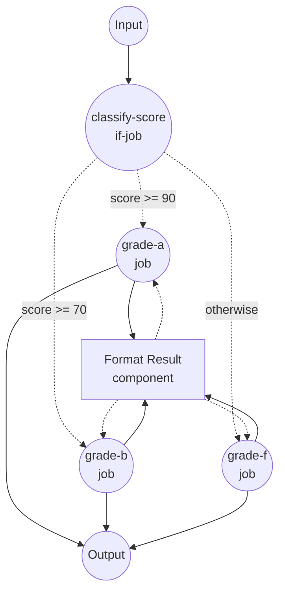

# Conditional Routing with `if` Example

This example demonstrates the `if` job type, which evaluates one or more conditions and routes the workflow to a different job depending on the result.

## Overview

This workflow operates through the following process:

1. **Evaluate Conditions**: The `classify-score` job inspects `${input.score}` and evaluates it against multiple thresholds in order
2. **Route to Branch**: Based on the first matching condition, the workflow is routed to one of the grade-specific jobs
3. **Format Result**: The selected branch invokes the shared `format-result` shell component and returns a small object with the grade, score, and a message

Branching rules:

- `score >= 90` routes to `grade-a`
- `score >= 70` routes to `grade-b`
- everything else routes to `grade-f` (the `otherwise` branch)

## Preparation

### Prerequisites

- model-compose installed and available in your PATH

### Environment Configuration

1. Navigate to this example directory:
   ```bash
   cd examples/conditional-routing/if
   ```

2. No additional environment configuration is required — this example uses only the local `shell` component and has no external dependencies.

## How to Run

1. **Start the service:**
   ```bash
   model-compose up
   ```

2. **Run the workflow:**

   **Using API:**
   ```bash
   curl -X POST http://localhost:8080/api/workflows/runs \
     -H "Content-Type: application/json" \
     -d '{"input": {"score": 95}}'
   ```

   **Using Web UI:**
   - Open the Web UI: http://localhost:8081
   - Enter a numeric `score` value
   - Click the "Run Workflow" button

   **Using CLI:**
   ```bash
   # A grade
   model-compose run --input '{"score": 95}'

   # B grade
   model-compose run --input '{"score": 75}'

   # F grade (otherwise branch)
   model-compose run --input '{"score": 40}'
   ```

## Component Details

### Format Result Component (format-result)
- **Type**: Shell component
- **Purpose**: Renders a single line describing the assigned grade for the given score
- **Command**: `echo "[Grade ${input.grade}] score=${input.score} - ${input.message}"`
- **Output**: An object containing `grade`, `score`, `message`, and the rendered `stdout` line

## Workflow Details

### "Conditional Routing with `if` Job" Workflow (Default)

**Description**: Routes the workflow to a different job based on the numeric `score` value in the input. Demonstrates the `if` job type with multiple conditions and an `otherwise` fallback.

#### Job Flow

1. **classify-score**: Evaluates `${input.score}` against the configured conditions and routes to the matching grade job
2. **grade-a / grade-b / grade-f**: One (and only one) of these runs, calling the `format-result` component with branch-specific input



#### Input Parameters

| Parameter | Type | Required | Default | Description |
|-----------|------|----------|---------|-------------|
| `score` | integer | Yes | - | Test score from 0 to 100 used to select a grade branch |

#### Output Format

| Field | Type | Description |
|-------|------|-------------|
| `grade` | text | Letter grade assigned to the score (`A`, `B`, or `F`) |
| `score` | integer | Echoed input score |
| `message` | text | Human-readable message describing the result |
| `rendered` | text | The full line emitted by the `echo` command |

## Example Output

```json
{
  "grade": "A",
  "score": 95,
  "message": "Excellent work!",
  "rendered": "[Grade A] score=95 - Excellent work!\n"
}
```

## Customization

- **Adjust thresholds** — change the `value:` fields under `classify-score.conditions` to use different cut-offs (for example, `value: 80` for an `A`).
- **Add more grades** — append additional jobs (`grade-c`, `grade-d`) and matching `conditions` entries. The first matching condition wins, so keep them ordered from strictest to loosest.
- **Use other operators** — `gte` can be swapped for any of the available condition operators: `eq`, `neq`, `gt`, `gte`, `lt`, `lte`, `in`, `not-in`, `starts-with`, `ends-with`, `match`.
- **Use `if_false` too** — each condition supports `if_true`, `if_false`, or both. If a matched condition has no route for its branch, evaluation falls through to the next condition.

## Notes

- `${input.score as integer}` casts the value so the comparison works whether the input arrives as a JSON number (CLI / HTTP API) or a string (Gradio WebUI form fields). Without the cast, comparing `"95" >= 90` raises a `TypeError`.
- Conditions are evaluated in order. The first one that matches wins.
- If no condition matches and `otherwise` is omitted, the workflow ends without running a downstream branch.
