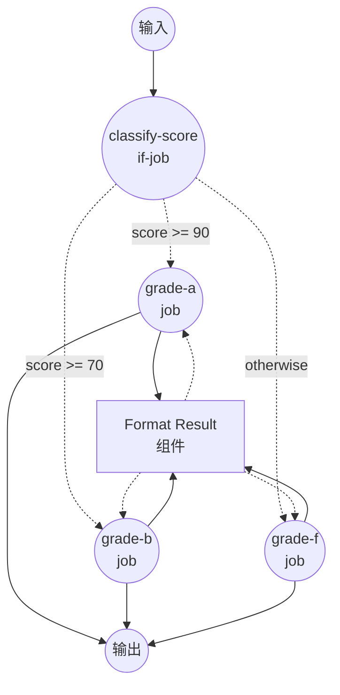

# 使用 `if` 的条件路由示例

此示例演示了 `if` 作业类型：评估一个或多个条件，并根据评估结果将工作流路由到不同的作业。

## 概述

此工作流通过以下过程运行：

1. **评估条件**：`classify-score` 作业按顺序将 `${input.score}` 与多个阈值进行比较
2. **路由到分支**：根据第一个匹配的条件，工作流被路由到对应等级的作业
3. **格式化结果**：所选分支调用共享的 `format-result` shell 组件，并返回一个包含等级、分数和消息的小型对象

分支规则：

- 当 `score >= 90` 时路由到 `grade-a`
- 当 `score >= 70` 时路由到 `grade-b`
- 其余情况路由到 `grade-f`（`otherwise` 分支）

## 准备工作

### 前置条件

- 已安装 model-compose 并在您的 PATH 中可用

### 环境配置

1. 导航到此示例目录：
   ```bash
   cd examples/conditional-routing/if
   ```

2. 不需要额外的环境配置 — 此示例仅使用本地 `shell` 组件，没有外部依赖。

## 运行方式

1. **启动服务：**
   ```bash
   model-compose up
   ```

2. **运行工作流：**

   **使用 API：**
   ```bash
   curl -X POST http://localhost:8080/api/workflows/runs \
     -H "Content-Type: application/json" \
     -d '{"input": {"score": 95}}'
   ```

   **使用 Web UI：**
   - 打开 Web UI：http://localhost:8081
   - 输入数字 `score` 值
   - 点击 "Run Workflow" 按钮

   **使用 CLI：**
   ```bash
   # A 等级
   model-compose run --input '{"score": 95}'

   # B 等级
   model-compose run --input '{"score": 75}'

   # F 等级（otherwise 分支）
   model-compose run --input '{"score": 40}'
   ```

## 组件详情

### Format Result 组件（format-result）
- **类型**：Shell 组件
- **用途**：渲染一行文本，描述为给定分数分配的等级
- **命令**：`echo "[Grade ${input.grade}] score=${input.score} - ${input.message}"`
- **输出**：包含 `grade`、`score`、`message` 以及渲染后的 `stdout` 行的对象

## 工作流详情

### "Conditional Routing with `if` Job" 工作流（默认）

**描述**：根据输入中的数字 `score` 值将工作流路由到不同的作业。演示带有多个条件和 `otherwise` 回退的 `if` 作业类型。

#### 作业流程

1. **classify-score**：按配置的条件评估 `${input.score}`，并路由到匹配的等级作业
2. **grade-a / grade-b / grade-f**：其中一个（且仅一个）作业会运行，使用分支特定的输入调用 `format-result` 组件



#### 输入参数

| 参数 | 类型 | 必需 | 默认值 | 描述 |
|-----|------|------|--------|------|
| `score` | integer | 是 | - | 用于选择等级分支的 0 到 100 之间的考试分数 |

#### 输出格式

| 字段 | 类型 | 描述 |
|-----|------|------|
| `grade` | text | 分配给该分数的字母等级（`A`、`B` 或 `F`） |
| `score` | integer | 原样返回的输入分数 |
| `message` | text | 描述结果的易读消息 |
| `rendered` | text | `echo` 命令输出的完整行 |

## 示例输出

```json
{
  "grade": "A",
  "score": 95,
  "message": "Excellent work!",
  "rendered": "[Grade A] score=95 - Excellent work!\n"
}
```

## 自定义

- **调整阈值** — 修改 `classify-score.conditions` 下的 `value:` 字段以使用不同的临界值（例如，将 A 等级设置为 `value: 80`）
- **添加更多等级** — 追加额外的作业（`grade-c`、`grade-d`）和对应的 `conditions` 条目。第一个匹配的条件生效，因此请按从严到宽的顺序排列
- **使用其他运算符** — `gte` 可以替换为任何可用的条件运算符：`eq`、`neq`、`gt`、`gte`、`lt`、`lte`、`in`、`not-in`、`starts-with`、`ends-with`、`match`
- **同时使用 `if_false`** — 每个条件支持 `if_true`、`if_false` 或两者同时使用。如果匹配的条件没有对应分支的路由目标，求值将继续到下一个条件

## 注意事项

- `${input.score as integer}` 会将值转换为整数，因此无论输入以 JSON 数字形式（CLI / HTTP API）还是字符串形式（Gradio WebUI 表单字段）传入，比较都能正常工作。若不进行转换，`"95" >= 90` 比较会抛出 `TypeError`。
- 条件按定义顺序求值，第一个匹配的条件生效。
- 如果没有条件匹配且省略了 `otherwise`，工作流将不会运行下游分支即结束。
