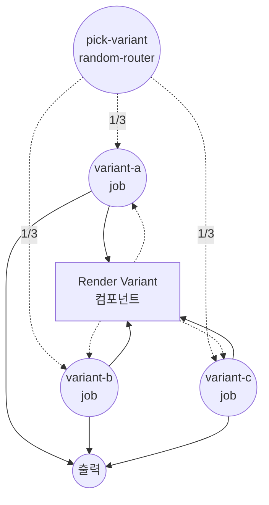
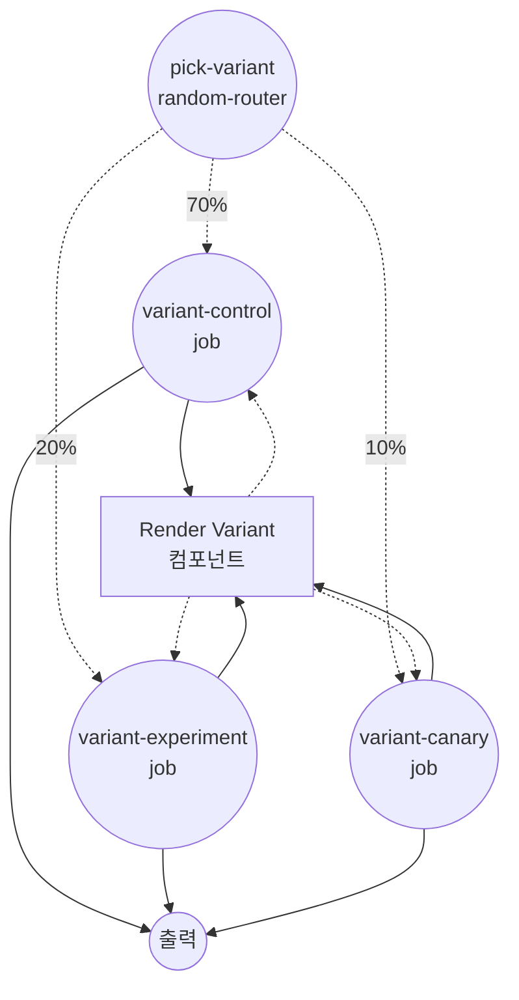

# `random-router`를 사용한 조건 라우팅 예제

이 예제는 `random-router` job 타입을 보여줍니다. 각 실행마다 무작위 선택으로 여러 하위 job 중 하나로 라우팅합니다. `uniform`(균등 확률)과 `weighted`(상대 확률) 두 모드를 지원하며, A/B 테스트, 카나리아 롤아웃, 변형들 간의 부하 분산에 적합합니다.

## 개요

이 예제는 동일한 `render-variant` 컴포넌트를 공유하는 두 워크플로우를 정의합니다:

1. **`uniform-routing`** — 세 변형(`A`, `B`, `C`) 중 하나를 균등한 확률로 선택
2. **`weighted-routing`** — 세 변형(`control`, `experiment`, `canary`) 중 하나를 상대 가중치 `7 : 2 : 1` (70% / 20% / 10%)로 선택

각 변형은 동일한 shell 컴포넌트를 실행하고, 선택된 변형 이름과 렌더링된 라인을 담은 작은 객체를 반환합니다.

## 준비사항

### 필수 요구사항

- model-compose가 설치되어 PATH에서 사용 가능

### 환경 구성

1. 이 예제 디렉토리로 이동:
   ```bash
   cd examples/conditional-routing/random
   ```

2. 추가 환경 구성 불필요 - 로컬 `shell` 컴포넌트만 사용하므로 외부 의존성이 없습니다.

## 실행 방법

1. **서비스 시작:**
   ```bash
   model-compose up
   ```

2. **워크플로우 실행:**

   **API 사용:**
   ```bash
   # 균등 라우팅
   curl -X POST http://localhost:8080/api/workflows/uniform-routing/runs \
     -H "Content-Type: application/json" \
     -d '{}'

   # 가중치 라우팅
   curl -X POST http://localhost:8080/api/workflows/weighted-routing/runs \
     -H "Content-Type: application/json" \
     -d '{}'
   ```

   **웹 UI 사용:**
   - Web UI 열기: http://localhost:8081
   - **Uniform Random Routing**과 **Weighted Random Routing** 탭 사이를 전환
   - "Run Workflow" 버튼을 여러 번 눌러 무작위 분포 관찰

   **CLI 사용:**
   ```bash
   # 균등 라우팅 — 각 변형이 약 1/3 확률로 선택
   for i in 1 2 3 4 5 6; do model-compose run uniform-routing; done

   # 가중치 라우팅 — 'control'이 약 70% 확률로 선택
   for i in 1 2 3 4 5 6; do model-compose run weighted-routing; done
   ```

## 컴포넌트 세부사항

### Render Variant 컴포넌트 (render-variant)
- **유형**: Shell 컴포넌트
- **목적**: 선택된 변형 이름을 표시하는 한 줄을 렌더링
- **명령**: `echo "Selected variant: ${input.variant}"`
- **출력**: `variant` 및 렌더링된 `stdout` 라인을 포함하는 객체

## 워크플로우 세부사항

### "Uniform Random Routing" 워크플로우 (`uniform-routing`)

**설명**: 각 실행을 균등한 확률로 세 변형 중 하나로 라우팅합니다. `uniform` 모드의 `random-router` job을 시연합니다.

#### 작업 흐름

1. **pick-variant**: `variant-a`, `variant-b`, `variant-c` 중 하나를 균등 무작위로 선택
2. **variant-a / variant-b / variant-c**: 이 중 하나(그리고 오직 하나)만 실행되어, 변형 레이블로 `render-variant` 컴포넌트를 호출



### "Weighted Random Routing" 워크플로우 (`weighted-routing`)

**설명**: 각 실행을 구성된 가중치에 따라 세 변형 중 하나로 라우팅합니다. `weighted` 모드의 `random-router` job을 시연합니다. 가중치는 상대값이며 합이 1일 필요는 없습니다.

#### 작업 흐름

1. **pick-variant**: `variant-control`, `variant-experiment`, `variant-canary` 중 하나를 가중치 `7 : 2 : 1`로 선택
2. **variant-control / variant-experiment / variant-canary**: 이 중 하나(그리고 오직 하나)만 실행되어, 변형 레이블로 `render-variant` 컴포넌트를 호출



#### 입력 매개변수

두 워크플로우 모두 입력 매개변수를 받지 않습니다 — 라우팅 결정은 전적으로 난수 발생기에 의해 이루어집니다.

#### 출력 형식

| 필드 | 유형 | 설명 |
|-----|------|------|
| `variant` | text | 무작위 추첨에서 선택된 변형의 이름 |
| `rendered` | text | `echo` 명령이 출력한 전체 라인 |

## 예시 출력

```json
{
  "variant": "control",
  "rendered": "Selected variant: control\n"
}
```

## 사용자 정의

- **변형 추가** — 추가 job과 해당 `routings` 항목을 덧붙임. `uniform` 모드에서는 모든 항목이 동일한 확률을 얻고, `weighted` 모드에서는 `weight`에 비례한 확률을 얻습니다
- **모드 전환** — `mode: uniform` ↔ `mode: weighted` 변경. `weighted` 모드에서는 각 라우팅 항목에 `weight:`를 지정해야 하며, 가중치가 없거나 0 이하인 항목은 건너뜁니다
- **실제 분기에 연결** — 각 변형 job을 서로 다른 HTTP 클라이언트, 모델 또는 다른 컴포넌트 호출로 교체하여 실제 구현을 A/B 테스트할 수 있음

## 참고 사항

- 결정은 실행마다 한 번만 이루어지며, 선택된 분기로 진입한 후에는 바뀌지 않습니다.
- `weighted` 모드에서 가중치는 상대값이므로 `[7, 2, 1]`과 `[0.7, 0.2, 0.1]`은 동일하게 동작합니다.
- 각 `routing.weight`는 변수 시스템을 통해 렌더링되므로, 입력에 따라 가중치를 동적으로 조정할 수 있습니다 (예: 시간이 지남에 따라 실험 비율 점진 증가).
- 입력 값에 기반한 결정적 라우팅이 필요하면 [`if`](../if) 또는 [`switch`](../switch)를 사용하세요.
