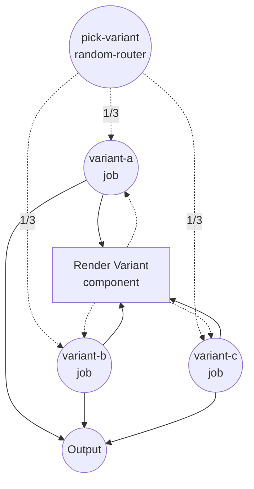
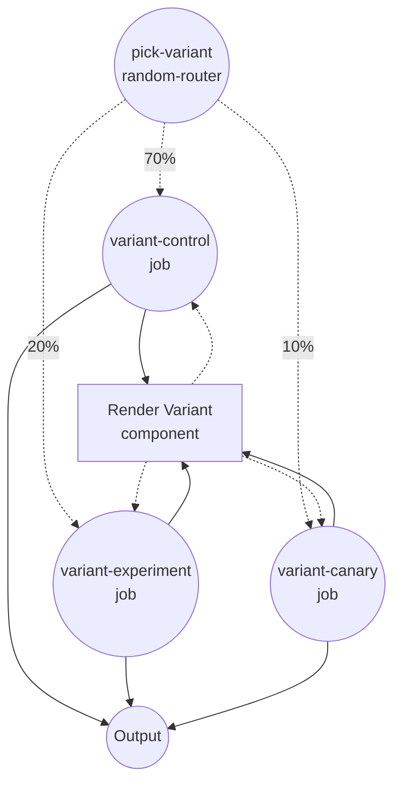

# Conditional Routing with `random-router` Example

This example demonstrates the `random-router` job type, which routes each run to one of several downstream jobs by random selection. It supports two modes — `uniform` (equal chance) and `weighted` (relative probabilities) — and is well suited for A/B tests, canary rollouts, and load balancing across variants.

## Overview

This example defines two workflows that share the same `render-variant` component:

1. **`uniform-routing`** — picks one of three variants (`A`, `B`, `C`) with equal probability
2. **`weighted-routing`** — picks one of three variants (`control`, `experiment`, `canary`) with relative weights `7 : 2 : 1` (70% / 20% / 10%)

Each variant runs the same shell component and returns a small object with the chosen variant name and a rendered line.

## Preparation

### Prerequisites

- model-compose installed and available in your PATH

### Environment Configuration

1. Navigate to this example directory:
   ```bash
   cd examples/conditional-routing/random
   ```

2. No additional environment configuration is required — this example uses only the local `shell` component and has no external dependencies.

## How to Run

1. **Start the service:**
   ```bash
   model-compose up
   ```

2. **Run a workflow:**

   **Using API:**
   ```bash
   # Uniform routing
   curl -X POST http://localhost:8080/api/workflows/uniform-routing/runs \
     -H "Content-Type: application/json" \
     -d '{}'

   # Weighted routing
   curl -X POST http://localhost:8080/api/workflows/weighted-routing/runs \
     -H "Content-Type: application/json" \
     -d '{}'
   ```

   **Using Web UI:**
   - Open the Web UI: http://localhost:8081
   - Switch between the **Uniform Random Routing** and **Weighted Random Routing** tabs
   - Click the "Run Workflow" button multiple times to observe the random distribution

   **Using CLI:**
   ```bash
   # Uniform routing — each variant appears about 1/3 of the time
   for i in 1 2 3 4 5 6; do model-compose run uniform-routing; done

   # Weighted routing — 'control' wins ~70% of runs
   for i in 1 2 3 4 5 6; do model-compose run weighted-routing; done
   ```

## Component Details

### Render Variant Component (render-variant)
- **Type**: Shell component
- **Purpose**: Renders a single line that names the selected variant
- **Command**: `echo "Selected variant: ${input.variant}"`
- **Output**: An object containing `variant` and the rendered `stdout` line

## Workflow Details

### "Uniform Random Routing" Workflow (`uniform-routing`)

**Description**: Routes each run to one of three variants with equal probability. Demonstrates the `random-router` job in `uniform` mode.

#### Job Flow

1. **pick-variant**: Picks one of `variant-a`, `variant-b`, `variant-c` uniformly at random
2. **variant-a / variant-b / variant-c**: One (and only one) of these runs, calling the `render-variant` component with a variant label



### "Weighted Random Routing" Workflow (`weighted-routing`)

**Description**: Routes each run to one of three variants with the configured weights. Demonstrates the `random-router` job in `weighted` mode. Weights are relative — they do not need to sum to 1.

#### Job Flow

1. **pick-variant**: Picks one of `variant-control`, `variant-experiment`, `variant-canary` with weights `7 : 2 : 1`
2. **variant-control / variant-experiment / variant-canary**: One (and only one) of these runs, calling the `render-variant` component with a variant label



#### Input Parameters

Neither workflow takes any input parameters — the routing decision is made entirely by the random number generator.

#### Output Format

| Field | Type | Description |
|-------|------|-------------|
| `variant` | text | Name of the variant that won the random draw |
| `rendered` | text | The full line emitted by the `echo` command |

## Example Output

```json
{
  "variant": "control",
  "rendered": "Selected variant: control\n"
}
```

## Customization

- **Add more variants** — append additional jobs and matching `routings` entries. In `uniform` mode every entry gets the same chance; in `weighted` mode the chance is proportional to its `weight`.
- **Switch modes** — change `mode: uniform` ↔ `mode: weighted`. In `weighted` mode you must supply a `weight:` on each routing entry; entries with no weight or a non-positive weight are skipped.
- **Wire to real branches** — replace each variant job with calls to different HTTP clients, models, or any other component to A/B-test real implementations side by side.

## Notes

- The decision is made once per run; it does not change once the workflow continues into the chosen branch.
- For `weighted` mode, weights are relative — `[7, 2, 1]` and `[0.7, 0.2, 0.1]` behave identically.
- Each `routing.weight` is rendered through the variable system, so weights can be driven by inputs (for example, to ramp up an experiment over time).
- If you need deterministic routing based on the input value, use [`if`](../if) or [`switch`](../switch) instead.
