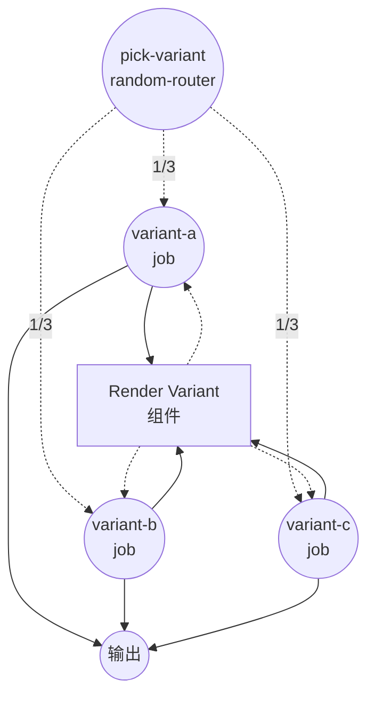
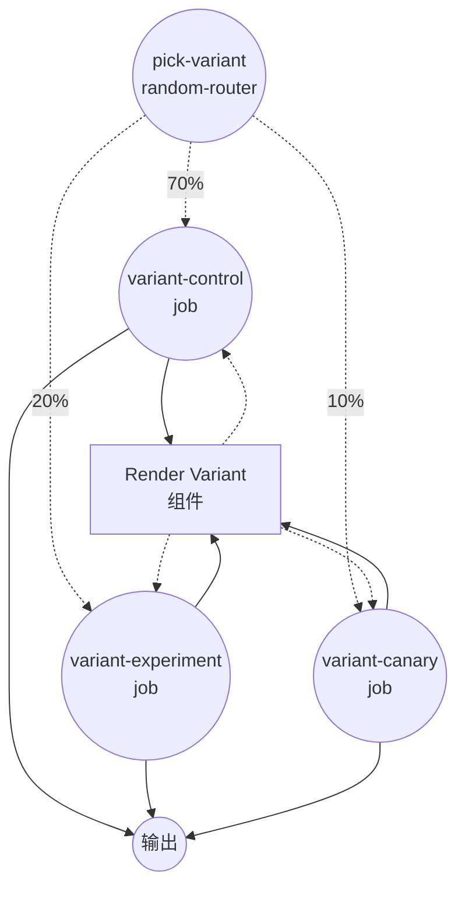

# 使用 `random-router` 的条件路由示例

此示例演示了 `random-router` 作业类型：通过随机选择将每次运行路由到多个下游作业之一。它支持两种模式 — `uniform`（等概率）和 `weighted`（相对概率），非常适合 A/B 测试、金丝雀发布以及在多个变体之间进行负载均衡。

## 概述

此示例定义了两个共享同一个 `render-variant` 组件的工作流：

1. **`uniform-routing`** — 以相等的概率从三个变体（`A`、`B`、`C`）中选择一个
2. **`weighted-routing`** — 以相对权重 `7 : 2 : 1`（70% / 20% / 10%）从三个变体（`control`、`experiment`、`canary`）中选择一个

每个变体都运行相同的 shell 组件，并返回一个包含所选变体名称和渲染行的小型对象。

## 准备工作

### 前置条件

- 已安装 model-compose 并在您的 PATH 中可用

### 环境配置

1. 导航到此示例目录：
   ```bash
   cd examples/conditional-routing/random
   ```

2. 不需要额外的环境配置 — 此示例仅使用本地 `shell` 组件，没有外部依赖。

## 运行方式

1. **启动服务：**
   ```bash
   model-compose up
   ```

2. **运行工作流：**

   **使用 API：**
   ```bash
   # 均匀路由
   curl -X POST http://localhost:8080/api/workflows/uniform-routing/runs \
     -H "Content-Type: application/json" \
     -d '{}'

   # 加权路由
   curl -X POST http://localhost:8080/api/workflows/weighted-routing/runs \
     -H "Content-Type: application/json" \
     -d '{}'
   ```

   **使用 Web UI：**
   - 打开 Web UI：http://localhost:8081
   - 在 **Uniform Random Routing** 和 **Weighted Random Routing** 标签之间切换
   - 多次点击 "Run Workflow" 按钮以观察随机分布

   **使用 CLI：**
   ```bash
   # 均匀路由 — 每个变体大约出现 1/3 的时间
   for i in 1 2 3 4 5 6; do model-compose run uniform-routing; done

   # 加权路由 — 'control' 大约占 70% 的运行
   for i in 1 2 3 4 5 6; do model-compose run weighted-routing; done
   ```

## 组件详情

### Render Variant 组件（render-variant）
- **类型**：Shell 组件
- **用途**：渲染一行文本，标明所选的变体
- **命令**：`echo "Selected variant: ${input.variant}"`
- **输出**：包含 `variant` 以及渲染后的 `stdout` 行的对象

## 工作流详情

### "Uniform Random Routing" 工作流（`uniform-routing`）

**描述**：以相等的概率将每次运行路由到三个变体之一。演示 `uniform` 模式下的 `random-router` 作业。

#### 作业流程

1. **pick-variant**：以均匀随机方式从 `variant-a`、`variant-b`、`variant-c` 中选择一个
2. **variant-a / variant-b / variant-c**：其中一个（且仅一个）作业会运行，以变体标签调用 `render-variant` 组件



### "Weighted Random Routing" 工作流（`weighted-routing`）

**描述**：根据配置的权重将每次运行路由到三个变体之一。演示 `weighted` 模式下的 `random-router` 作业。权重为相对值 — 总和不必为 1。

#### 作业流程

1. **pick-variant**：以权重 `7 : 2 : 1` 从 `variant-control`、`variant-experiment`、`variant-canary` 中选择一个
2. **variant-control / variant-experiment / variant-canary**：其中一个（且仅一个）作业会运行，以变体标签调用 `render-variant` 组件



#### 输入参数

两个工作流均不接受任何输入参数 — 路由决策完全由随机数生成器做出。

#### 输出格式

| 字段 | 类型 | 描述 |
|-----|------|------|
| `variant` | text | 在随机抽取中胜出的变体名称 |
| `rendered` | text | `echo` 命令输出的完整行 |

## 示例输出

```json
{
  "variant": "control",
  "rendered": "Selected variant: control\n"
}
```

## 自定义

- **添加更多变体** — 追加额外的作业和对应的 `routings` 条目。在 `uniform` 模式下，每个条目获得相同的概率；在 `weighted` 模式下，概率与其 `weight` 成正比
- **切换模式** — 修改 `mode: uniform` ↔ `mode: weighted`。在 `weighted` 模式下，必须为每个路由条目提供 `weight:`；没有权重或权重不大于 0 的条目将被跳过
- **接入真实分支** — 将每个变体作业替换为对不同的 HTTP 客户端、模型或其他组件的调用，以便并排进行真实实现的 A/B 测试

## 注意事项

- 决策仅在每次运行中做出一次，一旦工作流进入所选分支就不会再改变。
- 在 `weighted` 模式下，权重为相对值 — `[7, 2, 1]` 和 `[0.7, 0.2, 0.1]` 表现完全相同。
- 每个 `routing.weight` 通过变量系统渲染，因此可以根据输入动态调整权重（例如，随时间逐步提高实验的比例）。
- 如果需要基于输入值的确定性路由，请使用 [`if`](../if) 或 [`switch`](../switch)。
