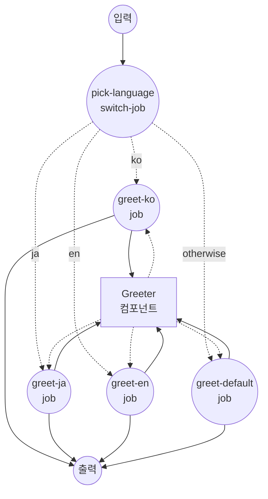

# `switch`를 사용한 조건 라우팅 예제

이 예제는 `switch` job 타입을 보여줍니다. 입력 값을 케이스 목록과 비교하여 일치하는 job으로 워크플로우를 라우팅합니다.

## 개요

이 워크플로우는 다음 과정을 통해 동작합니다:

1. **입력 값 매칭**: `pick-language` job이 `${input.language}` 값을 읽고 선언된 케이스와 순서대로 비교합니다
2. **분기 라우팅**: 처음으로 일치한 케이스에 따라 해당 인사말 job으로 워크플로우가 라우팅됩니다
3. **인사말 렌더링**: 선택된 분기가 공통 `greeter` shell 컴포넌트를 현지화된 메시지와 함께 호출하여, 언어, 메시지, 렌더링된 라인을 담은 작은 객체를 반환합니다

분기 규칙:

- `language == "ko"`이면 `greet-ko`
- `language == "ja"`이면 `greet-ja`
- `language == "en"`이면 `greet-en`
- 그 외에는 `greet-default` (`otherwise` 분기)

## 준비사항

### 필수 요구사항

- model-compose가 설치되어 PATH에서 사용 가능

### 환경 구성

1. 이 예제 디렉토리로 이동:
   ```bash
   cd examples/conditional-routing/switch
   ```

2. 추가 환경 구성 불필요 - 로컬 `shell` 컴포넌트만 사용하므로 외부 의존성이 없습니다.

## 실행 방법

1. **서비스 시작:**
   ```bash
   model-compose up
   ```

2. **워크플로우 실행:**

   **API 사용:**
   ```bash
   curl -X POST http://localhost:8080/api/workflows/runs \
     -H "Content-Type: application/json" \
     -d '{"input": {"language": "ko", "name": "한열"}}'
   ```

   **웹 UI 사용:**
   - Web UI 열기: http://localhost:8081
   - `language` 코드(`ko`, `ja`, `en` 또는 그 외 값)와 `name` 입력
   - "Run Workflow" 버튼 클릭

   **CLI 사용:**
   ```bash
   # 한국어
   model-compose run --input '{"language": "ko", "name": "한열"}'

   # 일본어
   model-compose run --input '{"language": "ja", "name": "Taro"}'

   # 영어
   model-compose run --input '{"language": "en", "name": "Alex"}'

   # 폴백 분기
   model-compose run --input '{"language": "fr", "name": "Marie"}'
   ```

## 컴포넌트 세부사항

### Greeter 컴포넌트 (greeter)
- **유형**: Shell 컴포넌트
- **목적**: 주어진 이름에 대해 현지화된 인사말 한 줄을 렌더링
- **명령**: `echo "[${input.language}] ${input.text}"`
- **출력**: `language`, `message` 및 렌더링된 `stdout` 라인을 포함하는 객체

## 워크플로우 세부사항

### "Multi-way Routing with `switch` Job" 워크플로우 (기본)

**설명**: `language` 입력 값에 따라 현지화된 인사말을 선택합니다. 여러 케이스와 `otherwise` 폴백을 사용하는 `switch` job 타입을 시연합니다.

#### 작업 흐름

1. **pick-language**: `${input.language}`를 선언된 케이스와 매칭하여 해당하는 인사말 job으로 라우팅
2. **greet-ko / greet-ja / greet-en / greet-default**: 이 중 하나(그리고 오직 하나)만 실행되어, 현지화된 메시지로 `greeter` 컴포넌트를 호출



#### 입력 매개변수

| 매개변수 | 유형 | 필수 | 기본값 | 설명 |
|---------|------|------|--------|------|
| `language` | text | 예 | - | 인사말 분기를 선택하는 데 사용되는 언어 코드 (`ko`, `ja`, `en` 또는 그 외 값) |
| `name` | text | 예 | - | 렌더링된 인사말에서 호명할 이름 |

#### 출력 형식

| 필드 | 유형 | 설명 |
|-----|------|------|
| `language` | text | 일치한 언어의 표시 이름 (`Korean`, `Japanese`, `English`, 또는 `Unknown`) |
| `message` | text | `name`을 사용해 만든 현지화된 인사말 라인 |
| `rendered` | text | `echo` 명령이 출력한 전체 라인 |

## 예시 출력

```json
{
  "language": "Korean",
  "message": "안녕하세요, 한열님!",
  "rendered": "[Korean] 안녕하세요, 한열님!\n"
}
```

## 사용자 정의

- **언어 추가** — 추가 job (`greet-fr`, `greet-de`)과 해당 `cases` 항목을 덧붙임. 가장 먼저 일치하는 케이스가 선택되므로 순서는 정확성에 영향을 주지 않지만 가독성을 위해 정리해두면 좋음
- **입력 소스 변경** — `pick-language`는 `${input.language}`에서 값을 읽지만, `switch` job의 `input:` 필드를 수정하여 다른 렌더링된 값(예: 이전 감지 job의 출력)으로 바꿀 수 있음
- **폴백 제거** — 일치하는 케이스가 없을 때 하위 분기 없이 워크플로우를 종료하고 싶다면 `otherwise:` 필드 제거

## 참고 사항

- `switch`는 `==` 비교만 지원합니다. 순서, 범위, 다른 연산자가 필요하면 [`if` job](../if)을 사용하세요.
- 케이스는 정의된 순서대로 평가되며, 가장 먼저 일치하는 케이스가 선택됩니다.
- 일치하는 케이스가 없고 `otherwise`가 생략된 경우, 워크플로우는 하위 분기를 실행하지 않고 종료됩니다.
