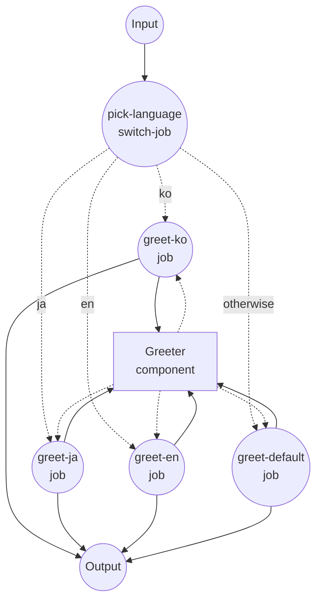

# Conditional Routing with `switch` Example

This example demonstrates the `switch` job type, which compares an input value against a list of cases and routes the workflow to the matching job.

## Overview

This workflow operates through the following process:

1. **Match Input Value**: The `pick-language` job reads `${input.language}` and compares it against each declared case in order
2. **Route to Branch**: On the first equal match, the workflow is routed to the corresponding greeting job
3. **Render Greeting**: The selected branch invokes the shared `greeter` shell component with a localized message and returns a small object with the language, message, and rendered line

Branching rules:

- `language == "ko"` routes to `greet-ko`
- `language == "ja"` routes to `greet-ja`
- `language == "en"` routes to `greet-en`
- everything else routes to `greet-default` (the `otherwise` branch)

## Preparation

### Prerequisites

- model-compose installed and available in your PATH

### Environment Configuration

1. Navigate to this example directory:
   ```bash
   cd examples/conditional-routing/switch
   ```

2. No additional environment configuration is required — this example uses only the local `shell` component and has no external dependencies.

## How to Run

1. **Start the service:**
   ```bash
   model-compose up
   ```

2. **Run the workflow:**

   **Using API:**
   ```bash
   curl -X POST http://localhost:8080/api/workflows/runs \
     -H "Content-Type: application/json" \
     -d '{"input": {"language": "ko", "name": "한열"}}'
   ```

   **Using Web UI:**
   - Open the Web UI: http://localhost:8081
   - Enter a `language` code (`ko`, `ja`, `en`, or anything else) and a `name`
   - Click the "Run Workflow" button

   **Using CLI:**
   ```bash
   # Korean
   model-compose run --input '{"language": "ko", "name": "한열"}'

   # Japanese
   model-compose run --input '{"language": "ja", "name": "Taro"}'

   # English
   model-compose run --input '{"language": "en", "name": "Alex"}'

   # Fallback branch
   model-compose run --input '{"language": "fr", "name": "Marie"}'
   ```

## Component Details

### Greeter Component (greeter)
- **Type**: Shell component
- **Purpose**: Renders a single localized greeting line for the given name
- **Command**: `echo "[${input.language}] ${input.text}"`
- **Output**: An object containing `language`, `message`, and the rendered `stdout` line

## Workflow Details

### "Multi-way Routing with `switch` Job" Workflow (Default)

**Description**: Picks a localized greeting based on the `language` input value. Demonstrates the `switch` job type with multiple cases and an `otherwise` fallback.

#### Job Flow

1. **pick-language**: Matches `${input.language}` against the declared cases and routes to the matching greeting job
2. **greet-ko / greet-ja / greet-en / greet-default**: One (and only one) of these runs, calling the `greeter` component with a localized message



#### Input Parameters

| Parameter | Type | Required | Default | Description |
|-----------|------|----------|---------|-------------|
| `language` | text | Yes | - | Language code used to pick a greeting branch (`ko`, `ja`, `en`, or any other value) |
| `name` | text | Yes | - | Name to address in the rendered greeting |

#### Output Format

| Field | Type | Description |
|-------|------|-------------|
| `language` | text | Display name of the matched language (`Korean`, `Japanese`, `English`, or `Unknown`) |
| `message` | text | Localized greeting line built from `name` |
| `rendered` | text | The full line emitted by the `echo` command |

## Example Output

```json
{
  "language": "Korean",
  "message": "안녕하세요, 한열님!",
  "rendered": "[Korean] 안녕하세요, 한열님!\n"
}
```

## Customization

- **Add more languages** — append additional jobs (`greet-fr`, `greet-de`) and matching `cases` entries. The first matching case wins, so order does not affect correctness but keeps the list readable.
- **Change the input source** — `pick-language` reads from `${input.language}`, but you can switch it to any rendered value (for example, the output of a prior detection job) by editing the `input:` field on the `switch` job.
- **Skip the fallback** — remove the `otherwise:` field if you would rather have the workflow end without a downstream branch when no case matches.

## Notes

- `switch` matches with `==` only. Use the [`if` job](../if) when you need ordering, ranges, or other operators.
- Cases are evaluated in order; the first equal match wins.
- If `otherwise` is omitted and nothing matches, the workflow ends without running a downstream branch.
