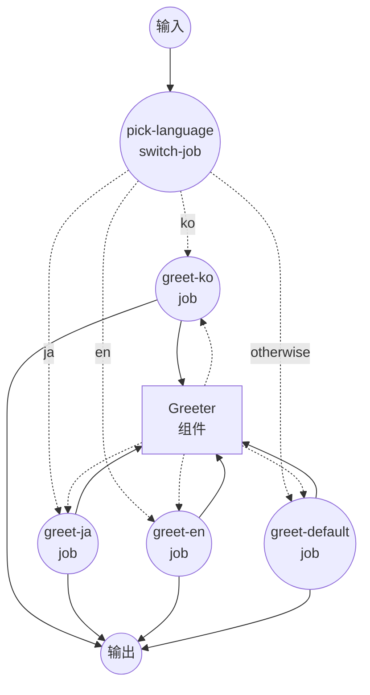

# 使用 `switch` 的条件路由示例

此示例演示了 `switch` 作业类型：将输入值与一组案例进行比较，并将工作流路由到匹配的作业。

## 概述

此工作流通过以下过程运行：

1. **匹配输入值**：`pick-language` 作业读取 `${input.language}`，并按顺序与已声明的每个案例进行比较
2. **路由到分支**：在第一次相等匹配时，工作流被路由到对应的问候作业
3. **渲染问候语**：所选分支以本地化的消息调用共享的 `greeter` shell 组件，并返回一个包含语言、消息和渲染行的小型对象

分支规则：

- 当 `language == "ko"` 时路由到 `greet-ko`
- 当 `language == "ja"` 时路由到 `greet-ja`
- 当 `language == "en"` 时路由到 `greet-en`
- 其余情况路由到 `greet-default`（`otherwise` 分支）

## 准备工作

### 前置条件

- 已安装 model-compose 并在您的 PATH 中可用

### 环境配置

1. 导航到此示例目录：
   ```bash
   cd examples/conditional-routing/switch
   ```

2. 不需要额外的环境配置 — 此示例仅使用本地 `shell` 组件，没有外部依赖。

## 运行方式

1. **启动服务：**
   ```bash
   model-compose up
   ```

2. **运行工作流：**

   **使用 API：**
   ```bash
   curl -X POST http://localhost:8080/api/workflows/runs \
     -H "Content-Type: application/json" \
     -d '{"input": {"language": "ko", "name": "한열"}}'
   ```

   **使用 Web UI：**
   - 打开 Web UI：http://localhost:8081
   - 输入 `language` 代码（`ko`、`ja`、`en` 或其他值）和 `name`
   - 点击 "Run Workflow" 按钮

   **使用 CLI：**
   ```bash
   # 韩语
   model-compose run --input '{"language": "ko", "name": "한열"}'

   # 日语
   model-compose run --input '{"language": "ja", "name": "Taro"}'

   # 英语
   model-compose run --input '{"language": "en", "name": "Alex"}'

   # 回退分支
   model-compose run --input '{"language": "fr", "name": "Marie"}'
   ```

## 组件详情

### Greeter 组件（greeter）
- **类型**：Shell 组件
- **用途**：为给定的名字渲染一行本地化的问候语
- **命令**：`echo "[${input.language}] ${input.text}"`
- **输出**：包含 `language`、`message` 以及渲染后的 `stdout` 行的对象

## 工作流详情

### "Multi-way Routing with `switch` Job" 工作流（默认）

**描述**：根据 `language` 输入值选择一条本地化的问候语。演示带有多个案例和 `otherwise` 回退的 `switch` 作业类型。

#### 作业流程

1. **pick-language**：将 `${input.language}` 与已声明的案例匹配，并路由到对应的问候作业
2. **greet-ko / greet-ja / greet-en / greet-default**：其中一个（且仅一个）作业会运行，以本地化的消息调用 `greeter` 组件



#### 输入参数

| 参数 | 类型 | 必需 | 默认值 | 描述 |
|-----|------|------|--------|------|
| `language` | text | 是 | - | 用于选择问候分支的语言代码（`ko`、`ja`、`en` 或其他值） |
| `name` | text | 是 | - | 在渲染的问候语中称呼的名字 |

#### 输出格式

| 字段 | 类型 | 描述 |
|-----|------|------|
| `language` | text | 匹配语言的显示名称（`Korean`、`Japanese`、`English` 或 `Unknown`） |
| `message` | text | 使用 `name` 构建的本地化问候语 |
| `rendered` | text | `echo` 命令输出的完整行 |

## 示例输出

```json
{
  "language": "Korean",
  "message": "안녕하세요, 한열님!",
  "rendered": "[Korean] 안녕하세요, 한열님!\n"
}
```

## 自定义

- **添加更多语言** — 追加额外的作业（`greet-fr`、`greet-de`）和对应的 `cases` 条目。第一个匹配的案例生效，因此顺序不影响正确性，但保持有序有助于可读性
- **更改输入源** — `pick-language` 从 `${input.language}` 读取值，但您可以通过修改 `switch` 作业的 `input:` 字段将其切换为任何渲染后的值（例如先前检测作业的输出）
- **跳过回退** — 如果希望在没有案例匹配时让工作流直接结束而不运行下游分支，可以移除 `otherwise:` 字段

## 注意事项

- `switch` 仅支持 `==` 比较。如果需要排序、范围或其他运算符，请使用 [`if` 作业](../if)。
- 案例按定义顺序求值，第一个相等匹配的案例生效。
- 如果没有案例匹配且省略了 `otherwise`，工作流将不会运行下游分支即结束。
