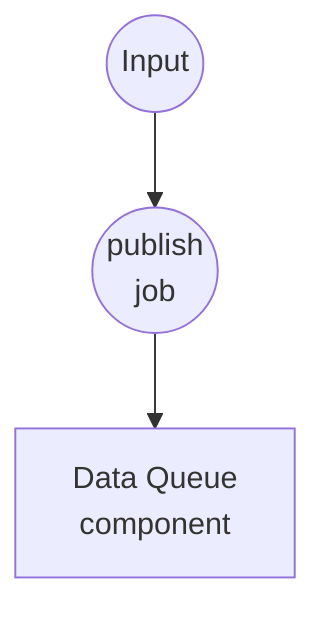
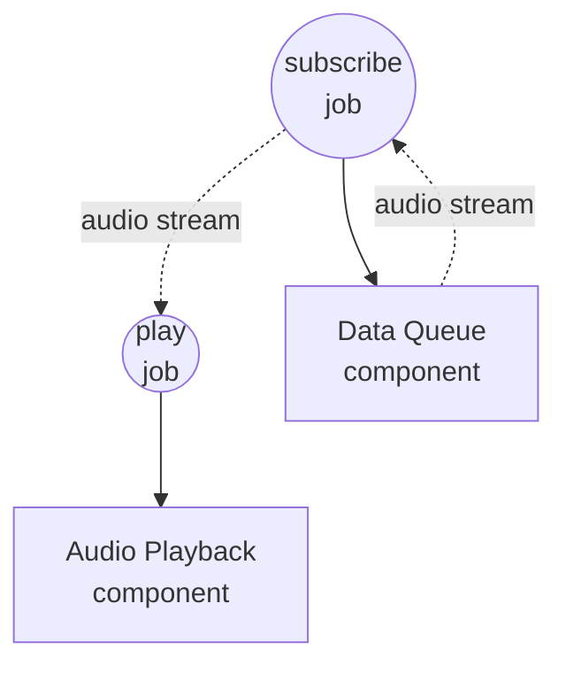

# 데이터 큐 오디오 재생 예제

이 예제는 공유된 `data-queue` 컴포넌트를 통한 워크플로우 간 스트리밍을 보여줍니다. 한 워크플로우는 필요할 때마다 오디오 클립을 큐에 넣고, 별도의 장기 실행 워크플로우가 큐를 소비하여 각 클립을 시스템 기본 오디오 출력으로 재생합니다.

## 개요

두 워크플로우가 하나의 in-process `data-queue` 컴포넌트 인스턴스를 공유합니다:

1. **publish-audio**: 호출당 하나의 오디오 소스(파일 경로 또는 URL)를 큐에 넣습니다. 원하는 만큼 호출해서 클립을 쌓아둘 수 있습니다.
2. **play-audio**: 계속 실행됩니다 — 큐를 구독하여 스트림을 `audio-playback` 컴포넌트에 곧바로 전달합니다. 클립은 FIFO 순서로 이어서 재생되며, 워크플로우는 취소될 때에만 정지합니다.

컴포넌트 인스턴스는 워크플로우 호출을 넘나들며 id로 캐시되므로, 두 워크플로우는 동일한 `asyncio.Queue`를 공유합니다. 컨슈머의 `dequeue` 액션은 `AsyncIterator`를 반환하며 `audio-playback`이 이를 투명하게 순회하므로 별도의 `for-each` 연결이 필요하지 않습니다.

## 준비사항

### 필수 요구사항

- model-compose가 설치되어 PATH에서 사용 가능
- 로컬에 `ffmpeg` 사용 가능 (`audio-playback` 컴포넌트에서 사용)
- 워크플로우를 실행하는 머신에서 접근 가능한 오디오 파일 하나 이상 (`.wav`, `.mp3`, `.flac` 등) 또는 공개 오디오 URL

### 환경 구성

환경 변수는 필요하지 않습니다.

## 실행 방법

1. **서비스 시작:**
   ```bash
   model-compose up
   ```

2. **플레이어 시작 (계속 실행 상태로 두기):**

   터미널이나 탭 하나에서 컨슈머 워크플로우를 시작합니다. 첫 클립이 도착할 때까지 대기합니다:

   ```bash
   model-compose run play-audio
   ```

   또는 http://localhost:8081 의 Web UI에서 `play-audio`를 실행합니다.

3. **클립 넣기 (반복 가능):**

   다른 터미널(또는 Web UI)에서 재생하려는 클립마다 한 번씩 `publish-audio`를 호출합니다:

   **API 사용:**
   ```bash
   curl -X POST http://localhost:8080/api/workflows/publish-audio/runs \
     -H "Content-Type: application/json" \
     -d '{"input": {"source": "/absolute/path/to/clip.wav"}}'
   ```

   **CLI 사용:**
   ```bash
   model-compose run publish-audio --input '{"source": "/absolute/path/to/clip.wav"}'
   ```

   각 호출은 아이템을 하나씩 추가하며, 플레이어가 순서대로 소비합니다.

4. **플레이어 중지:**

   Web UI 또는 runs API 취소 엔드포인트로 `play-audio` 실행을 취소합니다. `data-queue`는 취소를 깔끔하게 전파합니다.

## 컴포넌트 상세

### 데이터 큐 컴포넌트 (audio-queue)
- **타입**: `data-queue` 컴포넌트
- **드라이버**: `memory`
- **목적**: 프로듀서와 컨슈머 워크플로우 사이의 공유 FIFO 버퍼
- **주요 옵션**:
  - `max_size`: `100` — 큐가 가득 차면 publish가 오류로 실패 (블로킹 대신 명시적 실패로 백프레셔 처리)
- **액션**:
  - `enqueue` (method `publish`): `context.input`을 큐에 추가
  - `dequeue` (method `consume`): 취소될 때까지 아이템을 yield하는 AsyncIterator 반환

### 오디오 재생 컴포넌트 (player)
- **타입**: `audio-playback` 컴포넌트
- **드라이버**: `ffmpeg`
- **목적**: 각 오디오 소스를 OS 기본 출력 장치로 재생
- **주요 옵션**:
  - `audio`: 재생할 소스 — 단일 값, 리스트, 또는 스트림 허용
  - `sink: system`: 기본 출력 장치로 라우팅
  - `blocking: true`: 각 클립이 끝날 때까지 대기하여 순차 재생 유지

## 워크플로우 상세

### "오디오 클립을 재생 큐에 넣기" 워크플로우 (publish-audio)

**설명**: 오디오 소스 하나를 `audio-queue`에 push합니다. 반복 호출로 재생 목록을 쌓아 올립니다.

#### 작업 흐름

1. **publish**: 입력을 파일 소스로 렌더링하여 큐에 추가



#### 입력 매개변수

| 매개변수 | 타입 | 필수 | 기본값 | 설명 |
|-----------|------|----------|---------|-------------|
| `source` | file | 예 | - | 오디오 소스: 로컬 파일 경로, `file://` URL, 또는 `http(s)://` URL |

#### 출력 형식

`publish-audio`는 `null`을 반환합니다 — publish는 fire-and-forget 연산입니다.

### "큐에서 오디오 클립 재생" 워크플로우 (play-audio)

**설명**: 오디오 참조를 계속 dequeue하여 각각을 시스템 오디오 출력으로 재생합니다. 취소될 때까지 실행됩니다.

#### 작업 흐름

1. **subscribe**: `audio-queue`에서 consume 스트림 열기
2. **play**: 스트림을 순회하며 각 클립을 순서대로 재생



#### 입력 매개변수

없음 — 워크플로우는 오직 큐에서만 읽습니다.

#### 출력 형식

취소될 때까지 실행되며, 종료 시점의 출력은 없습니다.

## 예상 출력

`play-audio`가 실행 중인 상태에서 다음과 같은 `publish-audio` 호출을 순서대로 하면:

```bash
model-compose run publish-audio --input '{"source": "./samples/one.wav"}'
model-compose run publish-audio --input '{"source": "./samples/two.wav"}'
model-compose run publish-audio --input '{"source": "https://example.com/three.mp3"}'
```

...세 클립이 시스템 스피커를 통해 순차적으로 재생됩니다. 이전 클립이 재생 중일 때 추가로 `publish-audio`를 호출하면 큐에 쌓였다가 플레이어가 현재 클립을 마치는 즉시 이어서 재생됩니다.

## 커스터마이징

- 백프레셔 여유 공간을 조정하려면 `audio-queue.max_size`를 늘리거나 줄이세요
- 기본 출력 대신 특정 출력 장치를 지정하려면 `player.action.sink: device`와 `device: <인덱스-또는-이름>`을 설정하세요
- `player.action.volume`, `fade_in`, `fade_out`을 조정하여 재생 특성을 다듬을 수 있습니다
- `enqueue`/`dequeue`에 `session` 필드를 추가하면 큐를 사용자/요청/채널 단위로 분할할 수 있습니다 — 한 세션에 publish된 아이템은 해당 세션의 컨슈머에게만 보입니다
