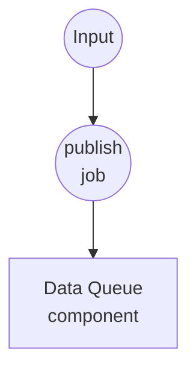
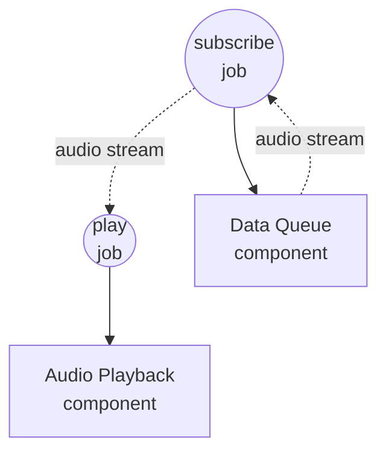

# Data Queue Audio Playback Example

This example demonstrates cross-workflow streaming through a shared `data-queue` component: one workflow enqueues audio clips on demand, and a separate long-running workflow drains the queue and plays each clip through the system's default audio output.

## Overview

Two workflows share a single in-process `data-queue` component instance:

1. **publish-audio**: Pushes a single audio source (file path or URL) into the queue per invocation. Call it as many times as you like to stack up clips.
2. **play-audio**: Runs continuously — subscribes to the queue and forwards the resulting stream directly to an `audio-playback` component. Clips play back-to-back in FIFO order; the workflow stops only when cancelled.

Because a component's instance is cached by id across workflow invocations, both workflows see the same underlying `asyncio.Queue`. The consumer's `dequeue` action returns an `AsyncIterator` that `audio-playback` iterates transparently, so no `for-each` glue is needed.

## Preparation

### Prerequisites

- model-compose installed and available in your PATH
- `ffmpeg` available locally (used by the `audio-playback` component)
- One or more audio files reachable from the machine running the workflow (`.wav`, `.mp3`, `.flac`, etc.), or public audio URLs

### Environment Configuration

No environment variables are required.

## How to Run

1. **Start the service:**
   ```bash
   model-compose up
   ```

2. **Start the player (leave it running):**

   In one terminal or tab, start the consumer workflow. It will block, waiting for the first clip:

   ```bash
   model-compose run play-audio
   ```

   Or open the Web UI at http://localhost:8081 and run `play-audio`.

3. **Enqueue clips (repeatable):**

   From another terminal (or the Web UI), call `publish-audio` once per clip you want to play:

   **Using API:**
   ```bash
   curl -X POST http://localhost:8080/api/workflows/publish-audio/runs \
     -H "Content-Type: application/json" \
     -d '{"input": {"source": "/absolute/path/to/clip.wav"}}'
   ```

   **Using CLI:**
   ```bash
   model-compose run publish-audio --input '{"source": "/absolute/path/to/clip.wav"}'
   ```

   Each call appends one item; the player drains them in order.

4. **Stop the player:**

   Cancel the `play-audio` run from the Web UI or by hitting the runs API cancel endpoint. `data-queue` propagates cancellation cleanly.

## Component Details

### Data Queue Component (audio-queue)
- **Type**: `data-queue` component
- **Driver**: `memory`
- **Purpose**: Shared FIFO buffer between the producer and consumer workflows
- **Key options**:
  - `max_size`: `100` — publish fails with an error when the queue is full (backpressure via explicit failure rather than blocking)
- **Actions**:
  - `enqueue` (method `publish`): appends `context.input` to the queue
  - `dequeue` (method `consume`): returns an AsyncIterator that yields items until cancelled

### Audio Playback Component (player)
- **Type**: `audio-playback` component
- **Driver**: `ffmpeg`
- **Purpose**: Plays each audio source through the OS default output device
- **Key options**:
  - `audio`: source(s) to play — accepts a single value, a list, or a stream
  - `sink: system`: routes to the default output device
  - `blocking: true`: waits for each clip to finish before returning, keeping playback sequential

## Workflow Details

### "Enqueue an audio clip for playback" Workflow (publish-audio)

**Description**: Push a single audio source into `audio-queue`. Invoke repeatedly to build up a playlist.

#### Job Flow

1. **publish**: Renders the input as a file source and enqueues it



#### Input Parameters

| Parameter | Type | Required | Default | Description |
|-----------|------|----------|---------|-------------|
| `source` | file | Yes | - | Audio source: local file path, `file://` URL, or `http(s)://` URL |

#### Output Format

`publish-audio` returns `null` — publishing is a fire-and-forget operation.

### "Play audio clips from the queue" Workflow (play-audio)

**Description**: Continuously dequeue audio references and play each one through the system audio output. Runs until cancelled.

#### Job Flow

1. **subscribe**: Opens a consume stream on `audio-queue`
2. **play**: Iterates the stream, playing each clip in order



#### Input Parameters

None — the workflow reads exclusively from the queue.

#### Output Format

Runs until cancelled; there is no terminal output.

## Example Output

With `play-audio` running, a sequence of `publish-audio` calls like:

```bash
model-compose run publish-audio --input '{"source": "./samples/one.wav"}'
model-compose run publish-audio --input '{"source": "./samples/two.wav"}'
model-compose run publish-audio --input '{"source": "https://example.com/three.mp3"}'
```

...results in the three clips playing sequentially through the system speakers. Additional `publish-audio` invocations while the earlier clips are still playing are enqueued and picked up as soon as the player finishes the current clip.

## Customization

- Raise or lower `audio-queue.max_size` to change backpressure headroom
- Set `player.action.sink: device` with a `device: <index-or-name>` to target a specific output device instead of the system default
- Adjust `player.action.volume`, `fade_in`, or `fade_out` to shape playback
- Add a `session` field to `enqueue`/`dequeue` to partition the queue by user, request, or channel — items published under one session are only visible to consumers of that session
