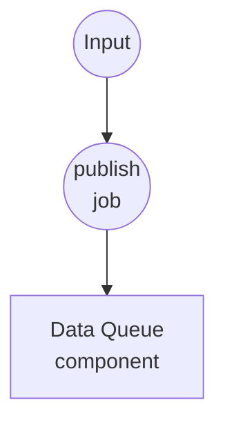
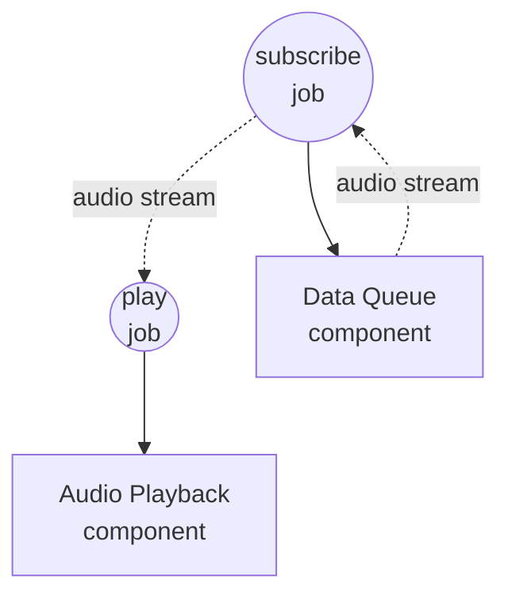

# 数据队列音频播放示例

此示例演示了通过共享的 `data-queue` 组件实现的跨工作流流式传输：一个工作流按需将音频片段入队，另一个长时间运行的工作流则消费队列并通过系统默认音频输出播放每个片段。

## 概述

两个工作流共享一个进程内 `data-queue` 组件实例：

1. **publish-audio**：每次调用向队列推送一个音频源（文件路径或 URL）。您可以任意多次调用以堆积片段。
2. **play-audio**：持续运行 — 订阅队列并将得到的流直接转发给 `audio-playback` 组件。片段按 FIFO 顺序连续播放；仅在被取消时停止。

由于组件实例按 id 在工作流调用之间被缓存，两个工作流看到的是同一个底层 `asyncio.Queue`。消费者的 `dequeue` 动作返回 `AsyncIterator`，`audio-playback` 会透明地迭代，因此无需 `for-each` 粘合。

## 准备工作

### 前置条件

- 已安装 model-compose 并在您的 PATH 中可用
- 本地可用 `ffmpeg`（供 `audio-playback` 组件使用）
- 运行工作流的机器可访问的一个或多个音频文件（`.wav`、`.mp3`、`.flac` 等）或公开的音频 URL

### 环境配置

不需要环境变量。

## 运行方式

1. **启动服务：**
   ```bash
   model-compose up
   ```

2. **启动播放器（保持运行状态）：**

   在一个终端或标签页中启动消费者工作流。它会阻塞并等待第一个片段：

   ```bash
   model-compose run play-audio
   ```

   或打开 http://localhost:8081 的 Web UI 并运行 `play-audio`。

3. **入队片段（可反复）：**

   在另一个终端（或 Web UI）中，每要播放一个片段就调用一次 `publish-audio`：

   **使用 API：**
   ```bash
   curl -X POST http://localhost:8080/api/workflows/publish-audio/runs \
     -H "Content-Type: application/json" \
     -d '{"input": {"source": "/absolute/path/to/clip.wav"}}'
   ```

   **使用 CLI：**
   ```bash
   model-compose run publish-audio --input '{"source": "/absolute/path/to/clip.wav"}'
   ```

   每次调用追加一项，播放器按顺序消费。

4. **停止播放器：**

   通过 Web UI 或点击 runs API 的取消端点来取消 `play-audio` 运行。`data-queue` 会干净地传播取消信号。

## 组件详情

### 数据队列组件 (audio-queue)
- **类型**：`data-queue` 组件
- **驱动**：`memory`
- **用途**：在生产者与消费者工作流之间共享的 FIFO 缓冲区
- **关键选项**：
  - `max_size`：`100` — 队列满时 publish 会以错误失败（通过显式失败而非阻塞来实现背压）
- **动作**：
  - `enqueue`（method `publish`）：将 `context.input` 追加到队列
  - `dequeue`（method `consume`）：返回 AsyncIterator，直到被取消才停止 yield 项目

### 音频播放组件 (player)
- **类型**：`audio-playback` 组件
- **驱动**：`ffmpeg`
- **用途**：通过操作系统默认输出设备播放每个音频源
- **关键选项**：
  - `audio`：要播放的源 — 接受单值、列表或流
  - `sink: system`：路由到默认输出设备
  - `blocking: true`：等待每个片段结束后再返回，保持顺序播放

## 工作流详情

### "将音频片段入队以便播放"工作流 (publish-audio)

**描述**：将一个音频源推入 `audio-queue`。反复调用即可构建播放列表。

#### 作业流程

1. **publish**：将输入渲染为文件源并入队



#### 输入参数

| 参数 | 类型 | 必需 | 默认 | 描述 |
|-----------|------|----------|---------|-------------|
| `source` | file | 是 | - | 音频源：本地文件路径、`file://` URL 或 `http(s)://` URL |

#### 输出格式

`publish-audio` 返回 `null` — publish 是一次即忘操作。

### "从队列播放音频片段"工作流 (play-audio)

**描述**：持续 dequeue 音频引用并通过系统音频输出逐一播放。直到被取消才停止。

#### 作业流程

1. **subscribe**：在 `audio-queue` 上打开 consume 流
2. **play**：迭代该流并按顺序播放每个片段



#### 输入参数

无 — 工作流仅从队列读取。

#### 输出格式

直到被取消才停止；没有终端输出。

## 示例输出

在 `play-audio` 正在运行时，按顺序执行以下 `publish-audio` 调用：

```bash
model-compose run publish-audio --input '{"source": "./samples/one.wav"}'
model-compose run publish-audio --input '{"source": "./samples/two.wav"}'
model-compose run publish-audio --input '{"source": "https://example.com/three.mp3"}'
```

……三个片段会通过系统扬声器依次播放。前一个片段仍在播放时额外调用 `publish-audio` 会被入队，一旦播放器完成当前片段就会被接续拾取。

## 自定义

- 调高或调低 `audio-queue.max_size` 以改变背压余量
- 设置 `player.action.sink: device` 并附上 `device: <索引-或-名称>` 以指定特定输出设备，而不是系统默认
- 调整 `player.action.volume`、`fade_in` 或 `fade_out` 以塑造播放效果
- 在 `enqueue`/`dequeue` 上添加 `session` 字段，可按用户、请求或频道对队列进行分区 — 某个会话下 publish 的项目仅对该会话的消费者可见
