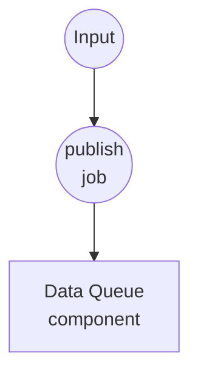
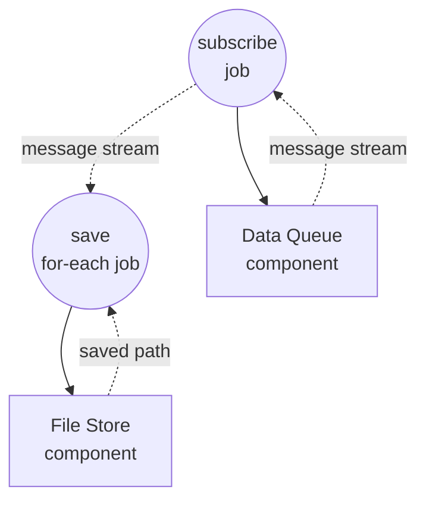

# 데이터 큐 기본 예제

이 예제는 `data-queue` 컴포넌트의 최소 사용 패턴을 보여줍니다. 두 워크플로우가 하나의 in-process 큐를 공유하며, 프로듀서는 메시지를 publish하고 장기 실행 컨슈머는 이를 소비하여 각각을 디스크에 기록합니다. 선택적 `session` 필드로 큐를 격리된 서브 큐로 분할하는 방법도 함께 보여줍니다.

## 개요

두 워크플로우가 하나의 `data-queue` 컴포넌트 인스턴스를 공유합니다:

1. **publish-message**: 호출당 하나의 텍스트 메시지를 큐에 넣습니다. 원하는 만큼 호출하면 각 호출이 아이템 하나를 추가합니다.
2. **consume-messages**: 계속 실행됩니다 — 큐를 구독하여 각 메시지를 `./output/messages/` 아래 텍스트 파일로 기록합니다.

컴포넌트 인스턴스는 워크플로우 호출을 넘나들며 id로 캐시되므로, 두 워크플로우는 동일한 기반 큐를 공유합니다. 프로듀서와 컨슈머 모두에 `session`을 설정하면 아이템이 격리된 서브 큐로 라우팅됩니다 — 세션 `A`의 프로듀서와 컨슈머는 세션 `B`의 아이템을 절대 보지 못합니다.

## 준비사항

### 필수 요구사항

- model-compose가 설치되어 PATH에서 사용 가능

### 환경 구성

환경 변수는 필요하지 않습니다.

## 실행 방법

1. **서비스 시작:**
   ```bash
   model-compose up
   ```

2. **컨슈머 시작 (계속 실행 상태로 두기):**

   터미널이나 탭 하나에서 컨슈머 워크플로우를 시작합니다. 첫 메시지가 도착할 때까지 대기합니다:

   ```bash
   model-compose run consume-messages
   ```

   또는 http://localhost:8081 의 Web UI에서 `consume-messages`를 실행합니다. 특정 세션만 소비하려면:

   ```bash
   model-compose run consume-messages --input '{"session": "A"}'
   ```

3. **메시지 publish (반복 가능):**

   다른 터미널(또는 Web UI)에서 큐에 넣을 메시지마다 한 번씩 `publish-message`를 호출합니다:

   **API 사용:**
   ```bash
   curl -X POST http://localhost:8080/api/workflows/publish-message/runs \
     -H "Content-Type: application/json" \
     -d '{"input": {"text": "hello"}}'
   ```

   **CLI 사용:**
   ```bash
   model-compose run publish-message --input '{"text": "hello"}'
   model-compose run publish-message --input '{"text": "world"}'
   ```

   세션 지정:

   ```bash
   model-compose run publish-message --input '{"session": "A", "text": "for-a"}'
   model-compose run publish-message --input '{"session": "B", "text": "for-b"}'
   ```

4. **컨슈머 중지:**

   Web UI 또는 runs API 취소 엔드포인트로 `consume-messages` 실행을 취소합니다. `data-queue`는 취소를 깔끔하게 전파합니다.

## 컴포넌트 상세

### 데이터 큐 컴포넌트 (messages)
- **타입**: `data-queue` 컴포넌트
- **드라이버**: `memory`
- **목적**: 프로듀서와 컨슈머 워크플로우 사이의 공유 FIFO 버퍼
- **주요 옵션**:
  - `max_size`: `100` — 큐가 가득 차면 publish가 오류로 실패 (블로킹 대신 명시적 실패로 백프레셔 처리)
  - `session` (각 액션에 지정): 아이템을 독립된 서브 큐로 라우팅. 생략하거나 비워두면 공유 기본 세션 사용.
- **액션**:
  - `enqueue` (method `publish`): 해석된 세션의 큐에 `context.input` 추가
  - `dequeue` (method `consume`): 취소될 때까지 해당 세션의 아이템을 yield하는 AsyncIterator 반환

### 파일 스토어 컴포넌트 (storage)
- **타입**: `file-store` 컴포넌트
- **드라이버**: `local`
- **베이스 경로**: `./output/messages`
- **목적**: 소비된 각 메시지를 세션 디렉토리별로 텍스트 파일로 저장
- **액션**: 메시지별 `path`와 텍스트 `source`로 `put`

## 워크플로우 상세

### "메시지를 큐에 publish" 워크플로우 (publish-message)

**설명**: `messages`에 메시지 하나를 push합니다. 컨슈머가 실행 중일 때 반복 호출합니다.

#### 작업 흐름

1. **publish**: `{text, session}`을 대상 세션에 enqueue



#### 입력 매개변수

| 매개변수 | 타입 | 필수 | 기본값 | 설명 |
|-----------|------|----------|---------|-------------|
| `text` | text | 예 | - | 큐에 enqueue되는 메시지 본문 |
| `session` | text | 아니오 | (기본 세션) | 서브 큐 키. 같은 세션의 컨슈머만 이 아이템을 받습니다. |

#### 출력 형식

`publish-message`는 `null`을 반환합니다 — publish는 fire-and-forget입니다.

### "큐에서 메시지 소비" 워크플로우 (consume-messages)

**설명**: 큐를 계속 비우며 각 메시지를 디스크에 저장합니다. 취소될 때까지 실행됩니다.

#### 작업 흐름

1. **subscribe**: `messages`에서 consume 스트림 열기
2. **save**: 스트리밍된 각 메시지에 대해 `./output/messages/<session>/`에 텍스트 파일 기록



#### 입력 매개변수

| 매개변수 | 타입 | 필수 | 기본값 | 설명 |
|-----------|------|----------|---------|-------------|
| `session` | text | 아니오 | (기본 세션) | 이 세션으로 publish된 아이템만 소비 |

#### 출력 형식

취소될 때까지 실행되며, 종료 시점의 출력은 없습니다. 부수 효과: 메시지 파일이 디스크에 기록됩니다.

## 예상 출력

`consume-messages`가 실행 중인 상태에서 다음과 같은 호출을 순서대로 하면:

```bash
model-compose run publish-message --input '{"text": "hello"}'
model-compose run publish-message --input '{"text": "world"}'
model-compose run publish-message --input '{"session": "A", "text": "alpha"}'
```

...다음과 같은 파일이 생성됩니다:

```
output/messages/default/message-hello.txt
output/messages/default/message-world.txt
output/messages/A/message-alpha.txt
```

`"alpha"` 메시지는 `{"session": "A"}`로 시작된 컨슈머에게만 도달합니다 — 기본 세션 컨슈머는 이를 절대 보지 못합니다.

## 커스터마이징

- 백프레셔 여유 공간을 조정하려면 `messages.max_size`를 늘리거나 줄이세요
- `storage.base_path`를 바꾸거나 file-store 드라이버를 교체하여 영속 경로를 다른 곳으로 라우팅할 수 있습니다
- 프로듀서에 필드를 추가하여 확장 가능 — `context.input` 전체가 하나의 아이템으로 enqueue됩니다
- 같은 세션에 컨슈머를 여러 개 추가하면 work-queue 방식으로 팬아웃됩니다 (각 아이템은 세션 내 정확히 한 컨슈머에게 전달)
- `session`을 correlation 키로 활용하세요 — 예: 사용자 id, 요청 id, 채널 이름 — 하나의 컴포넌트로 논리적으로 독립된 여러 스트림을 동시에 처리할 수 있습니다
