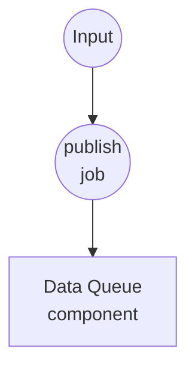
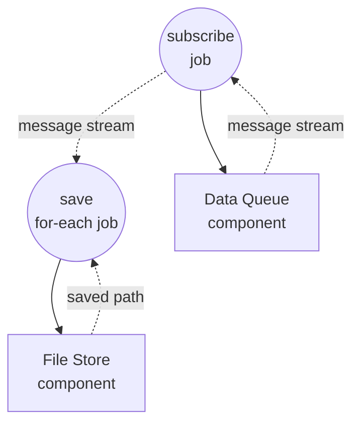

# Data Queue Basic Example

This example demonstrates the minimum viable pattern for a `data-queue` component: two workflows share one in-process queue, producers publish messages, a long-running consumer drains them and writes each to disk. It also shows how the optional `session` field partitions the queue into isolated sub-queues.

## Overview

Two workflows share one `data-queue` component instance:

1. **publish-message**: Pushes a single text message into the queue per invocation. Call it as many times as you like; each call appends one item.
2. **consume-messages**: Runs continuously — subscribes to the queue and writes each message to a text file under `./output/messages/`.

Because a component instance is cached by id across workflow invocations, both workflows see the same underlying queue(s). When `session` is set on the producer and consumer, items are routed to an isolated sub-queue — publishers and consumers of session `A` never see items from session `B`.

## Preparation

### Prerequisites

- model-compose installed and available in your PATH

### Environment Configuration

No environment variables are required.

## How to Run

1. **Start the service:**
   ```bash
   model-compose up
   ```

2. **Start the consumer (leave it running):**

   In one terminal or tab, start the consumer workflow. It will block, waiting for the first message:

   ```bash
   model-compose run consume-messages
   ```

   Or open the Web UI at http://localhost:8081 and run `consume-messages`. To scope to one session:

   ```bash
   model-compose run consume-messages --input '{"session": "A"}'
   ```

3. **Publish messages (repeatable):**

   From another terminal (or the Web UI), call `publish-message` once per message you want to enqueue:

   **Using API:**
   ```bash
   curl -X POST http://localhost:8080/api/workflows/publish-message/runs \
     -H "Content-Type: application/json" \
     -d '{"input": {"text": "hello"}}'
   ```

   **Using CLI:**
   ```bash
   model-compose run publish-message --input '{"text": "hello"}'
   model-compose run publish-message --input '{"text": "world"}'
   ```

   With sessions:

   ```bash
   model-compose run publish-message --input '{"session": "A", "text": "for-a"}'
   model-compose run publish-message --input '{"session": "B", "text": "for-b"}'
   ```

4. **Stop the consumer:**

   Cancel the `consume-messages` run from the Web UI or via the runs API cancel endpoint. `data-queue` propagates cancellation cleanly.

## Component Details

### Data Queue Component (messages)
- **Type**: `data-queue` component
- **Driver**: `memory`
- **Purpose**: Shared FIFO buffer between the producer and consumer workflows
- **Key options**:
  - `max_size`: `100` — publish fails with an error when the queue is full (backpressure via explicit failure rather than blocking)
  - `session` (on each action): routes items to an independent sub-queue. Omit or leave blank for the shared default session.
- **Actions**:
  - `enqueue` (method `publish`): appends `context.input` to the queue for the resolved session
  - `dequeue` (method `consume`): returns an AsyncIterator that yields items from the resolved session until cancelled

### File Store Component (storage)
- **Type**: `file-store` component
- **Driver**: `local`
- **Base path**: `./output/messages`
- **Purpose**: Persists each consumed message as a text file, grouped by session directory
- **Action**: `put` with a per-message `path` and text `source`

## Workflow Details

### "Publish a message to the queue" Workflow (publish-message)

**Description**: Push a single message into `messages`. Invoke repeatedly while a consumer is running.

#### Job Flow

1. **publish**: Enqueues `{text, session}` into the target session



#### Input Parameters

| Parameter | Type | Required | Default | Description |
|-----------|------|----------|---------|-------------|
| `text` | text | Yes | - | Message body enqueued into the queue |
| `session` | text | No | (default session) | Sub-queue key. Consumers with the same session receive this item; others do not. |

#### Output Format

`publish-message` returns `null` — publishing is fire-and-forget.

### "Consume messages from the queue" Workflow (consume-messages)

**Description**: Continuously drain the queue and save each message to disk. Runs until cancelled.

#### Job Flow

1. **subscribe**: Opens a consume stream on `messages`
2. **save**: For each streamed message, writes a text file into `./output/messages/<session>/`



#### Input Parameters

| Parameter | Type | Required | Default | Description |
|-----------|------|----------|---------|-------------|
| `session` | text | No | (default session) | Only consume items published under this session |

#### Output Format

Runs until cancelled; there is no terminal output. Side effect: message files are written to disk.

## Example Output

With `consume-messages` running, a sequence of calls like:

```bash
model-compose run publish-message --input '{"text": "hello"}'
model-compose run publish-message --input '{"text": "world"}'
model-compose run publish-message --input '{"session": "A", "text": "alpha"}'
```

...produces files such as:

```
output/messages/default/message-hello.txt
output/messages/default/message-world.txt
output/messages/A/message-alpha.txt
```

The `"alpha"` message only reaches a consumer that was started with `{"session": "A"}` — the default consumer never sees it.

## Customization

- Raise or lower `messages.max_size` to change backpressure headroom
- Change `storage.base_path` or swap the file-store driver to route persistence elsewhere
- Enrich the producer with additional fields; the entire `context.input` is enqueued as a single item
- Add more consumers with the same session to fan out work-queue style (each item goes to exactly one consumer in the session)
- Use `session` as a correlation key — e.g., a user id, request id, or channel name — to run many logically independent streams through one component
