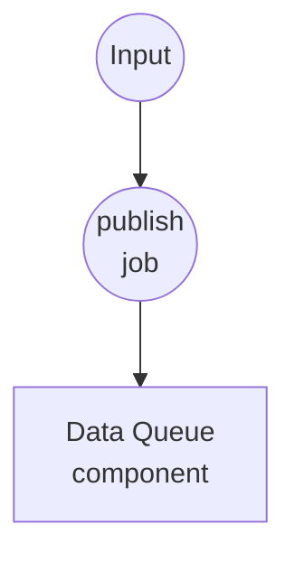
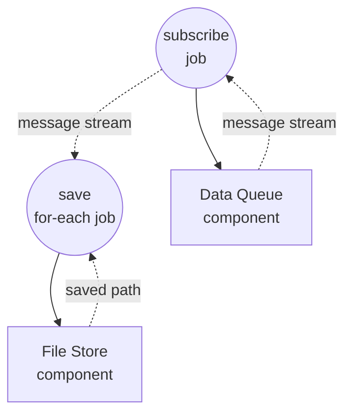

# 数据队列基础示例

此示例演示了 `data-queue` 组件的最小可用模式：两个工作流共享一个进程内队列，生产者发布消息，长时间运行的消费者逐一消费并将每条消息写入磁盘。同时展示了可选的 `session` 字段如何将队列分割为相互隔离的子队列。

## 概述

两个工作流共享一个 `data-queue` 组件实例：

1. **publish-message**：每次调用向队列推送一条文本消息。您可以任意多次调用；每次调用追加一项。
2. **consume-messages**：持续运行 — 订阅队列，并将每条消息写为 `./output/messages/` 下的文本文件。

由于组件实例按 id 在工作流调用之间被缓存，两个工作流看到的是同一个底层队列。在生产者和消费者上都设置 `session` 时，项目会被路由到隔离的子队列 —— 会话 `A` 的生产者与消费者永远不会看到会话 `B` 的项目。

## 准备工作

### 前置条件

- 已安装 model-compose 并在您的 PATH 中可用

### 环境配置

不需要环境变量。

## 运行方式

1. **启动服务：**
   ```bash
   model-compose up
   ```

2. **启动消费者（保持运行状态）：**

   在一个终端或标签页中启动消费者工作流。它会阻塞并等待第一条消息：

   ```bash
   model-compose run consume-messages
   ```

   或打开 http://localhost:8081 的 Web UI 并运行 `consume-messages`。若要限定于某个会话：

   ```bash
   model-compose run consume-messages --input '{"session": "A"}'
   ```

3. **发布消息（可反复）：**

   在另一个终端（或 Web UI）中，每要入队一条消息就调用一次 `publish-message`：

   **使用 API：**
   ```bash
   curl -X POST http://localhost:8080/api/workflows/publish-message/runs \
     -H "Content-Type: application/json" \
     -d '{"input": {"text": "hello"}}'
   ```

   **使用 CLI：**
   ```bash
   model-compose run publish-message --input '{"text": "hello"}'
   model-compose run publish-message --input '{"text": "world"}'
   ```

   带会话：

   ```bash
   model-compose run publish-message --input '{"session": "A", "text": "for-a"}'
   model-compose run publish-message --input '{"session": "B", "text": "for-b"}'
   ```

4. **停止消费者：**

   通过 Web UI 或点击 runs API 的取消端点来取消 `consume-messages` 运行。`data-queue` 会干净地传播取消信号。

## 组件详情

### 数据队列组件 (messages)
- **类型**：`data-queue` 组件
- **驱动**：`memory`
- **用途**：在生产者与消费者工作流之间共享的 FIFO 缓冲区
- **关键选项**：
  - `max_size`：`100` — 队列满时 publish 会以错误失败（通过显式失败而非阻塞来实现背压）
  - `session`（每个动作上）：将项目路由到独立的子队列。省略或留空则使用共享的默认会话。
- **动作**：
  - `enqueue`（method `publish`）：将 `context.input` 追加到解析出的会话的队列
  - `dequeue`（method `consume`）：返回 AsyncIterator，直到被取消才停止从该会话 yield 项目

### 文件存储组件 (storage)
- **类型**：`file-store` 组件
- **驱动**：`local`
- **基础路径**：`./output/messages`
- **用途**：将每条被消费的消息按会话目录持久化为文本文件
- **动作**：以每条消息的 `path` 和文本 `source` 执行 `put`

## 工作流详情

### "将消息发布到队列"工作流 (publish-message)

**描述**：将一条消息推入 `messages`。当消费者运行中时反复调用。

#### 作业流程

1. **publish**：将 `{text, session}` 入队到目标会话



#### 输入参数

| 参数 | 类型 | 必需 | 默认 | 描述 |
|-----------|------|----------|---------|-------------|
| `text` | text | 是 | - | 入队到队列的消息正文 |
| `session` | text | 否 | （默认会话） | 子队列键。相同会话的消费者才会收到该项目。 |

#### 输出格式

`publish-message` 返回 `null` —— publish 是一次即忘操作。

### "从队列消费消息"工作流 (consume-messages)

**描述**：持续消费队列并将每条消息保存到磁盘。直到被取消才停止。

#### 作业流程

1. **subscribe**：在 `messages` 上打开 consume 流
2. **save**：对每条流式消息，向 `./output/messages/<session>/` 写入文本文件



#### 输入参数

| 参数 | 类型 | 必需 | 默认 | 描述 |
|-----------|------|----------|---------|-------------|
| `session` | text | 否 | （默认会话） | 只消费在该会话下发布的项目 |

#### 输出格式

直到被取消才停止；没有终端输出。副作用：消息文件被写入磁盘。

## 示例输出

在 `consume-messages` 正在运行时，按顺序执行以下调用：

```bash
model-compose run publish-message --input '{"text": "hello"}'
model-compose run publish-message --input '{"text": "world"}'
model-compose run publish-message --input '{"session": "A", "text": "alpha"}'
```

……会产生如下文件：

```
output/messages/default/message-hello.txt
output/messages/default/message-world.txt
output/messages/A/message-alpha.txt
```

`"alpha"` 消息仅到达以 `{"session": "A"}` 启动的消费者 —— 默认会话消费者永远看不到它。

## 自定义

- 调高或调低 `messages.max_size` 以改变背压余量
- 更换 `storage.base_path` 或替换 file-store 驱动，将持久化路由到别处
- 为生产者增添字段来扩展 —— 整个 `context.input` 会作为单个项目入队
- 在同一会话中添加多个消费者以 work-queue 方式扇出（每个项目在该会话内仅送达一个消费者）
- 将 `session` 用作关联键 —— 例如用户 id、请求 id、频道名 —— 用一个组件同时运行多条逻辑上独立的流
