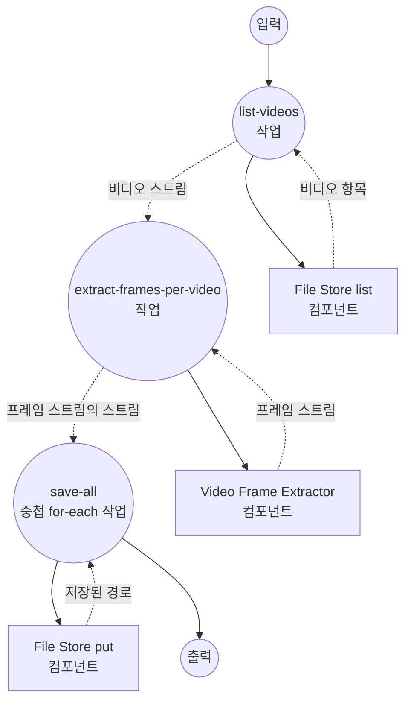

# 비디오 디렉토리 프레임 추출 예제

이 예제는 중첩된 스트리밍 워크플로우를 보여줍니다: 입력 디렉토리의 모든 비디오를 스트림으로 나열하고, 각 비디오에서 프레임을 내부 스트림으로 추출한 뒤, 모든 프레임을 로컬 파일 스토어의 비디오별 하위 디렉토리에 저장합니다.

## 개요

이 워크플로우는 다음 프로세스를 통해 작동합니다:

1. **비디오 나열**: `file-store`(local)가 `./input/videos`에서 glob 패턴과 일치하는 비디오를 나열합니다
2. **비디오별 프레임 추출**: `video-frame-extractor`가 나열된 각 비디오의 프레임을 스트리밍하여 이터레이터의 비동기 이터레이터를 생성합니다
3. **모든 프레임 저장**: 중첩된 `for-each`가 각 비디오를 반복하고 그 프레임 스트림을 반복하며 각 PNG를 `./output/frames/<video_path>/frame-<timestamp>.png`에 저장합니다

이 예제는 스트리밍 사양을 전 구간에서 확인합니다: 스트리밍 입력, 항목별 스트리밍 컴포넌트, 명명된 루프 변수를 사용하는 중첩 `for-each`.

## 준비사항

### 필수 요구사항

- model-compose가 설치되어 PATH에서 사용 가능
- 프레임 추출기를 실행하는 머신에 `ffmpeg` 사용 가능
- `./input/videos/` 아래에 하나 이상의 `.mov` 파일 배치

### 환경 구성

환경 변수는 필요하지 않습니다. 이 예제는 `./input/videos`에서 소스를 읽고 `./output/frames`에 결과물을 기록합니다.

## 실행 방법

1. **소스 비디오 배치:**
   ```bash
   mkdir -p input/videos
   cp /path/to/*.mov input/videos/
   ```

2. **서비스 시작:**
   ```bash
   model-compose up
   ```

3. **워크플로우 실행:**

   **API 사용:**
   ```bash
   curl -X POST http://localhost:8080/api/workflows/runs \
     -H "Content-Type: application/json" \
     -d '{}'
   ```

   **웹 UI 사용:**
   - Web UI 열기: http://localhost:8081
   - "Run Workflow" 클릭

   **CLI 사용:**
   ```bash
   model-compose run
   ```

프레임은 `./output/frames/<video_path>/frame-<timestamp>.png`에 기록됩니다.

## 컴포넌트 세부사항

### Source File Store 컴포넌트 (source-store)
- **유형**: `file-store` 컴포넌트
- **드라이버**: `local`
- **기본 경로**: `./input/videos`
- **목적**: 파이프라인에 공급할 비디오 나열
- **액션**: `pattern: "*.mov"`로 `list`

### Video Frame Extractor 컴포넌트 (frame-extractor)
- **유형**: `video-frame-extractor` 컴포넌트
- **드라이버**: `ffmpeg`
- **목적**: 각 입력 비디오에서 프레임 스트리밍
- **주요 옵션**:
  - `video`: 소스 비디오 미디어 (비디오별)
  - `frame_interval`: N 프레임마다 한 장씩 방출 (이 예제에서는 `30` 기본)
  - `streaming: true`: 비디오별로 비동기 이터레이터를 통해 프레임을 제공

### Output File Store 컴포넌트 (storage)
- **유형**: `file-store` 컴포넌트
- **드라이버**: `local`
- **기본 경로**: `./output/frames`
- **목적**: 각 스트리밍 프레임을 PNG로 영속화
- **액션**: 프레임별 `path`와 PNG `source`를 갖는 `put`

## 워크플로우 세부사항

### "Directory to Videos to Frames to Local Files" 워크플로우 (기본)

**설명**: 비디오 디렉토리를 프레임 추출기로 스트리밍하고, 생성되는 모든 프레임을 로컬 파일로 저장합니다.

#### 작업 흐름

1. **list-videos**: 입력 디렉토리의 `*.mov` 파일을 스트림으로 나열
2. **extract-frames-per-video**: 나열된 각 비디오에 대해 프레임을 스트리밍 — `AsyncIterator[AsyncIterator[Frame]]` 생성
3. **save-all**: 중첩된 `for-each` — 외부 루프는 비디오, 내부 루프(이름: `frame`)는 프레임을 반복하며 각 PNG를 비디오별 하위 디렉토리에 저장



#### 입력 매개변수

| 매개변수 | 유형 | 필수 | 기본값 | 설명 |
|---------|------|------|--------|------|
| - | - | - | - | 이 워크플로우는 입력 매개변수를 받지 않습니다. 소스는 `./input/videos`에서 읽습니다 |

#### 출력 형식

최종 `save-all` for-each는 프레임마다 `storage` 컴포넌트가 반환한 저장 경로를 산출합니다.

| 필드 | 유형 | 설명 |
|-----|------|------|
| `path` | text | `./output/frames/<video_path>/` 아래에 저장된 각 프레임 PNG의 로컬 경로 |

## 예제 출력

`./input/videos`에 두 개의 `.mov` 파일이 있고 `frame_interval: 30`이면 워크플로우는 다음과 같은 트리를 생성합니다:

```
output/frames/
├── clip-a.mov/
│   ├── frame-0.033.png
│   ├── frame-1.033.png
│   └── ...
└── clip-b.mov/
    ├── frame-0.033.png
    ├── frame-1.033.png
    └── ...
```

각 단계가 스트리밍이므로 첫 비디오의 프레임이 다 나오기 전에 이후 비디오의 프레임 기록이 시작될 수 있습니다.

## 사용자 정의

- `source-store`의 `pattern`을 변경해 다른 확장자를 포함(예: `"*.mp4"`)
- `extract-frames-per-video`의 `frame_interval`을 조정해 샘플 밀도 변경
- 내부 `for-each` 본문에 프레임별 처리(예: 이미지 모델) 추가
- `storage.driver`를 원격 파일 스토어로 교체해 프레임을 다른 곳에 기록
