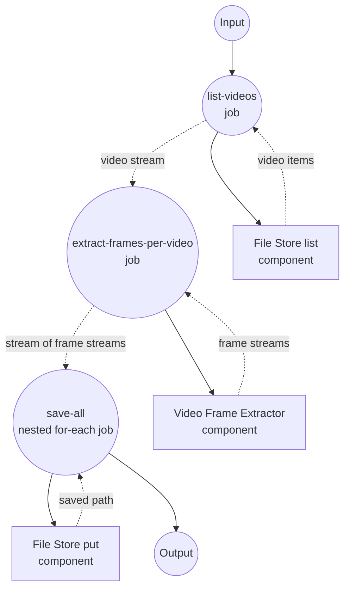

# Directory of Videos to Frames Example

This example demonstrates a nested streaming workflow: enumerate every video in an input directory as a stream, extract frames from each video as an inner stream, and save every frame to a per-video subdirectory on the local file store.

## Overview

This workflow operates through the following process:

1. **List Videos**: A `file-store` (local) enumerates videos from `./input/videos` matching a glob pattern
2. **Extract Frames per Video**: A `video-frame-extractor` streams frames for every listed video, producing an async iterator of iterators
3. **Save All Frames**: A nested `for-each` iterates over each video, then over its frame stream, saving each PNG to `./output/frames/<video_path>/frame-<timestamp>.png`

The example exercises the streaming spec end-to-end: streamed input, per-item streaming components, and nested `for-each` with named loop variables.

## Preparation

### Prerequisites

- model-compose installed and available in your PATH
- `ffmpeg` available on the machine running the frame extractor
- One or more `.mov` files placed under `./input/videos/`

### Environment Configuration

No environment variables are required. The example reads sources from `./input/videos` and writes outputs to `./output/frames`.

## How to Run

1. **Place source videos:**
   ```bash
   mkdir -p input/videos
   cp /path/to/*.mov input/videos/
   ```

2. **Start the service:**
   ```bash
   model-compose up
   ```

3. **Run the workflow:**

   **Using API:**
   ```bash
   curl -X POST http://localhost:8080/api/workflows/runs \
     -H "Content-Type: application/json" \
     -d '{}'
   ```

   **Using Web UI:**
   - Open the Web UI: http://localhost:8081
   - Click "Run Workflow"

   **Using CLI:**
   ```bash
   model-compose run
   ```

Frames are written to `./output/frames/<video_path>/frame-<timestamp>.png`.

## Component Details

### Source File Store Component (source-store)
- **Type**: `file-store` component
- **Driver**: `local`
- **Base path**: `./input/videos`
- **Purpose**: Lists videos to feed into the pipeline
- **Action**: `list` with `pattern: "*.mov"`

### Video Frame Extractor Component (frame-extractor)
- **Type**: `video-frame-extractor` component
- **Driver**: `ffmpeg`
- **Purpose**: Streams frames from each input video
- **Key options**:
  - `video`: source video media (per video)
  - `frame_interval`: emit every Nth frame (defaults to `30` in this example)
  - `streaming: true`: yields frames as an async iterator per video

### Output File Store Component (storage)
- **Type**: `file-store` component
- **Driver**: `local`
- **Base path**: `./output/frames`
- **Purpose**: Persists each streamed frame as a PNG
- **Action**: `put` with a per-frame `path` and PNG `source`

## Workflow Details

### "Directory to Videos to Frames to Local Files" Workflow (Default)

**Description**: Stream a directory of videos through the frame extractor and save every frame to local files as it is produced.

#### Job Flow

1. **list-videos**: Enumerate `*.mov` files in the input directory as a stream
2. **extract-frames-per-video**: For every listed video, stream out its frames — producing `AsyncIterator[AsyncIterator[Frame]]`
3. **save-all**: Nested `for-each` — outer loop over videos, inner loop (named `frame`) over frames, saving each PNG under a per-video subdirectory



#### Input Parameters

| Parameter | Type | Required | Default | Description |
|-----------|------|----------|---------|-------------|
| - | - | - | - | This workflow takes no input parameters; sources are read from `./input/videos` |

#### Output Format

The final `save-all` for-each yields, per frame, the saved file path returned by the `storage` component.

| Field | Type | Description |
|-------|------|-------------|
| `path` | text | Local path of each saved frame PNG, under `./output/frames/<video_path>/` |

## Example Output

With two `.mov` files in `./input/videos` and `frame_interval: 30`, the workflow produces a tree such as:

```
output/frames/
├── clip-a.mov/
│   ├── frame-0.033.png
│   ├── frame-1.033.png
│   └── ...
└── clip-b.mov/
    ├── frame-0.033.png
    ├── frame-1.033.png
    └── ...
```

Because each stage streams, frames from later videos can start being written before the first video's frames are exhausted.

## Customization

- Change the `pattern` in `source-store` to include other extensions (e.g., `"*.mp4"`)
- Adjust `frame_interval` in `extract-frames-per-video` to sample more or fewer frames
- Add per-frame processing (e.g., an image model) inside the inner `for-each` body
- Swap `storage.driver` for a remote file store to write frames elsewhere
