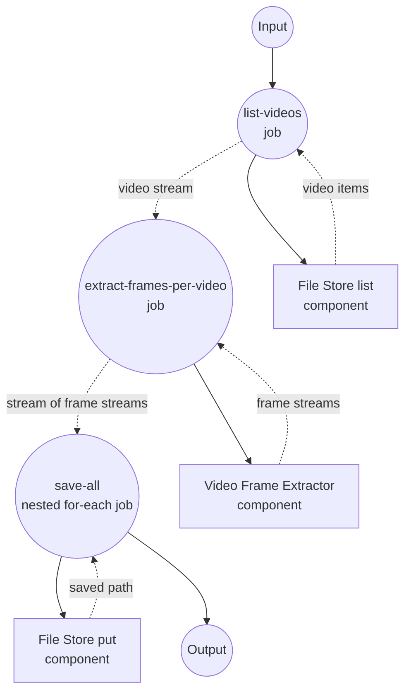

# 视频目录抽帧示例

此示例演示了一个嵌套的流式工作流：将输入目录中的每个视频枚举为流，将每个视频的帧作为内部流提取，并将所有帧保存到本地文件存储中按视频划分的子目录里。

## 概述

此工作流通过以下流程运行：

1. **列出视频**：`file-store`（local）从 `./input/videos` 枚举匹配 glob 模式的视频
2. **按视频提取帧**：`video-frame-extractor` 为每个已列出视频流式输出帧，产生迭代器的异步迭代器
3. **保存所有帧**：嵌套的 `for-each` 遍历每个视频及其帧流，将每个 PNG 保存到 `./output/frames/<video_path>/frame-<timestamp>.png`

该示例端到端地验证了流式规范：流式输入、按项流式组件，以及带命名循环变量的嵌套 `for-each`。

## 准备工作

### 前置条件

- 已安装 model-compose 并在您的 PATH 中可用
- 运行帧提取器的机器上可用 `ffmpeg`
- 在 `./input/videos/` 下放置一个或多个 `.mov` 文件

### 环境配置

不需要环境变量。此示例从 `./input/videos` 读取源，并将输出写入 `./output/frames`。

## 运行方式

1. **放置源视频：**
   ```bash
   mkdir -p input/videos
   cp /path/to/*.mov input/videos/
   ```

2. **启动服务：**
   ```bash
   model-compose up
   ```

3. **运行工作流：**

   **使用 API：**
   ```bash
   curl -X POST http://localhost:8080/api/workflows/runs \
     -H "Content-Type: application/json" \
     -d '{}'
   ```

   **使用 Web UI：**
   - 打开 Web UI：http://localhost:8081
   - 点击"运行工作流"

   **使用 CLI：**
   ```bash
   model-compose run
   ```

帧将写入 `./output/frames/<video_path>/frame-<timestamp>.png`。

## 组件详情

### Source File Store 组件 (source-store)
- **类型**：`file-store` 组件
- **驱动**：`local`
- **基路径**：`./input/videos`
- **用途**：列出用于送入管道的视频
- **动作**：以 `pattern: "*.mov"` 执行 `list`

### Video Frame Extractor 组件 (frame-extractor)
- **类型**：`video-frame-extractor` 组件
- **驱动**：`ffmpeg`
- **用途**：为每个输入视频流式输出帧
- **关键选项**：
  - `video`：源视频媒体（按视频）
  - `frame_interval`：每 N 帧发出一帧（本示例默认为 `30`）
  - `streaming: true`：按视频通过异步迭代器产出帧

### Output File Store 组件 (storage)
- **类型**：`file-store` 组件
- **驱动**：`local`
- **基路径**：`./output/frames`
- **用途**：将每个流式帧持久化为 PNG
- **动作**：使用每帧的 `path` 和 PNG `source` 的 `put`

## 工作流详情

### "Directory to Videos to Frames to Local Files" 工作流（默认）

**描述**：通过帧提取器流式处理一个视频目录，并在每一帧生成时保存到本地文件。

#### 作业流程

1. **list-videos**：将输入目录中的 `*.mov` 文件作为流枚举
2. **extract-frames-per-video**：为每个已列出视频流式输出其帧 —— 生成 `AsyncIterator[AsyncIterator[Frame]]`
3. **save-all**：嵌套 `for-each` —— 外层循环遍历视频，内层循环（命名为 `frame`）遍历帧，将每个 PNG 保存到按视频划分的子目录



#### 输入参数

| 参数 | 类型 | 必需 | 默认值 | 描述 |
|-----------|------|----------|---------|-------------|
| - | - | - | - | 此工作流不接受输入参数；源从 `./input/videos` 读取 |

#### 输出格式

最终的 `save-all` for-each 会按帧产出 `storage` 组件返回的保存路径。

| 字段 | 类型 | 描述 |
|-------|------|-------------|
| `path` | text | 每个已保存帧 PNG 的本地路径，位于 `./output/frames/<video_path>/` 下 |

## 示例输出

若 `./input/videos` 中有两个 `.mov` 文件且 `frame_interval: 30`，工作流将生成如下结构：

```
output/frames/
├── clip-a.mov/
│   ├── frame-0.033.png
│   ├── frame-1.033.png
│   └── ...
└── clip-b.mov/
    ├── frame-0.033.png
    ├── frame-1.033.png
    └── ...
```

由于每个阶段都是流式的，后续视频的帧可以在第一个视频的帧未耗尽之前就开始写入。

## 自定义

- 修改 `source-store` 的 `pattern` 以包含其他扩展名（例如 `"*.mp4"`）
- 调整 `extract-frames-per-video` 中的 `frame_interval` 以采样更多或更少的帧
- 在内层 `for-each` 主体中添加逐帧处理（如图像模型）
- 将 `storage.driver` 更换为远程文件存储，将帧写到其他位置
