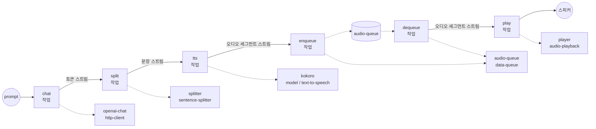

# LLM → Sentence-Splitter → TTS → 큐 기반 재생 예제

이 예제는 종단간(end-to-end) 스트리밍 음성 응답을 하나의 워크플로우
안에 연결합니다: GPT-4o 응답이 토큰 단위로 스트리밍되고, 즉시 문장
단위로 분할되며, Kokoro가 오디오 세그먼트로 합성하고, 인프로세스
`data-queue`를 통해 버퍼링된 뒤 시스템 기본 오디오 출력으로 재생됩니다.
첫 문장이 합성되는 즉시 재생이 시작됩니다 — 모델은 이전 문장들이 이미
말해지는 동안에도 계속 생성합니다.

## 개요

이 워크플로우는 병렬로 실행되는 두 개의 작업 트리를 포함하며,
`audio-queue` 컴포넌트를 통해 만납니다:

**프로듀서 체인** (LLM → 음성):

1. **`chat`** — `stream: true`로 `POST /v1/chat/completions`를 호출하고,
   `${response[].choices[0].delta.content}`를 통해 토큰 델타를 추출합니다.
2. **`split`** — `sentence-splitter`로 토큰 스트림을 버퍼링하고,
   한 번에 한 문장씩 방출합니다.
3. **`tts`** — Kokoro가 각 문장을 PCM 오디오 세그먼트(24kHz 모노 int16)로
   합성합니다.
4. **`enqueue`** — 각 오디오 세그먼트를 `audio-queue`에 게시합니다.

**컨슈머 체인** (큐 → 스피커):

5. **`dequeue`** — `audio-queue`에 대한 AsyncIterator를 엽니다.
6. **`play`** — 스트림을 `audio-playback`에 공급하고, 이는 각
   세그먼트를 시스템 기본 출력 장치로 전송합니다.

두 체인 사이에 `depends_on` 링크가 없으므로 병렬로 시작됩니다.
`data-queue`는 랑데부 지점 역할을 합니다: 프로듀서의 `publish`는 완성된
오디오 세그먼트를 각각 기록하고, 컨슈머의 `consume`은 이를 즉시
산출하여 `audio-playback`이 GPT-4o가 아직 뒤이은 문장을 생성하는 동안
말하기 시작할 수 있게 합니다.

## 준비사항

### 필수 요구사항

- `model-compose`가 설치되어 `PATH`에서 사용 가능
- 로컬에 `ffmpeg` 사용 가능 (`audio-playback`이 사용)
- `model-compose`와 동일한 환경에 `kokoro` Python 패키지 설치
  (Kokoro TTS 모델 가중치는 첫 실행 시 다운로드됨)
- OpenAI API 키
- 정상 작동하는 시스템 오디오 출력 (워크플로우는 기본 장치를 통해
  말합니다)

### 환경 구성

1. 이 예제 디렉토리로 이동:
   ```bash
   cd examples/data-streaming/llm-streaming-voice
   ```

2. OpenAI API 키가 포함된 `.env` 파일 생성:
   ```env
   OPENAI_API_KEY=your-actual-openai-api-key
   ```

## 실행 방법

1. **서비스 시작:**
   ```bash
   model-compose up
   ```

2. **워크플로우 실행:**

   **API 사용:**
   ```bash
   curl -X POST http://localhost:8080/api/workflows/runs \
     -H "Content-Type: application/json" \
     -d '{
       "input": {
         "prompt": "In three sentences, tell me why the night sky is dark."
       }
     }'
   ```

   **CLI 사용:**
   ```bash
   model-compose run --input '{
     "prompt": "In three sentences, tell me why the night sky is dark."
   }'
   ```

   **웹 UI 사용:**
   - Web UI 열기: http://localhost:8081
   - 프롬프트 입력 후 "Run Workflow" 클릭

   첫 문장이 합성되는 즉시 기본 오디오 출력을 통해 음성이 재생되기
   시작합니다.

## 워크플로우 세부사항



### 입력 매개변수

| 매개변수 | 유형 | 필수 | 기본값 | 설명 |
|---------|------|------|--------|------|
| `prompt` | text | 예 | - | GPT-4o에 전송되는 사용자 메시지 |
| `temperature` | number | 아니오 | `0.7` | 샘플링 온도 (0.0–1.0) |

### 출력 형식

이 워크플로우는 반환 페이로드가 없습니다 — 그 부작용은 시스템 기본
출력 장치를 통한 오디오 재생입니다.

## 컴포넌트 세부사항

### `openai-chat` (http-client)
GPT-4o 토큰 델타를 스트리밍합니다. `stream_format: json`이 SSE 프레임을
파싱하고, 출력 셀렉터가 각 `delta.content`를 추출하여 다운스트림
작업이 원시 토큰 문자열의 스트림을 볼 수 있게 합니다.

### `splitter` (sentence-splitter)
`streaming: true` 모드로 토큰 스트림을 소비하며 문장 종결자(`.`,
`!`, `?`, `。`, `！`, `？`, `…`, 개행)에 도달했을 때 정확히 산출하므로,
짧은 LLM 조각들이 TTS가 보기 전에 완전한 문장으로 재집계됩니다.

### `kokoro` (model / text-to-speech)
CPU에서 로컬로 실행되는 `hexgrad/Kokoro-82M`. 입력 문장당 하나의 오디오
세그먼트가 생성되므로, 작업 출력은 PCM 오디오 세그먼트(24kHz 모노
int16)의 스트림입니다. `max_concurrent_count: 1`은 단일 모델 인스턴스를
상주 상태로 유지합니다.

### `audio-queue` (data-queue)
인프로세스 FIFO. `publish`는 스트림을 받아 산출되는 각 항목을 큐에
넣습니다; `consume`은 `audio-playback`이 투명하게 소진하는
AsyncIterator를 반환합니다. `max_size: 100`은 빠른 LLM이 스피커를
앞지를 여유를 제공합니다.

### `player` (audio-playback)
`sink: system`으로의 `ffmpeg` 기반 재생. `wait_for_finish: true`는
각 세그먼트가 완료될 때까지 반환을 대기시켜, 연속된 세그먼트가 겹치지
않도록 합니다.

## 왜 하나의 워크플로우에 두 개의 체인인가?

파이프라인을 **프로듀서** 쪽(LLM → splitter → TTS → publish)과
**컨슈머** 쪽(consume → playback)으로 분할하여 큐를 통해 만나게 하면
두 반쪽이 분리된 상태로 유지됩니다:

- 프로듀서는 앞서 나갈 수 있습니다: 스피커가 문장 1을 말하는 동안
  문장 2와 3은 이미 큐에 자리 잡고 있을 수 있습니다.
- 큐에 여유가 있는 한(`max_size: 100`) 컨슈머는 프로듀서를 절대
  차단하지 않으며, 첫 세그먼트가 사용 가능해지면 프로듀서도 컨슈머를
  차단하지 않습니다.
- 워크플로우를 취소하면 두 체인이 깔끔하게 종료됩니다 — `data-queue`는
  대기 중인 모든 `consume` 호출에 취소를 전파합니다.

동일한 패턴은 프로듀서가 폭발적인 속도로 방출하고 컨슈머가 순차적이고
정렬된 전달을 필요로 하는 모든 프로듀서/컨슈머 분할에 일반화됩니다.

## 사용자 정의

- **다른 목소리**: `kokoro` 컴포넌트의 `voice: af_heart`를 다른 Kokoro
  프리셋(예: `af_bella`, `am_michael`)으로 변경.
- **다른 LLM**: `openai-chat` 컴포넌트 본문의 `gpt-4o`를 다른
  chat-completions 호환 모델로 교체.
- **문장 병합 또는 제한**: 매우 짧은 문장을 병합하거나 종결자 없는
  실행을 강제 분할하기 위해 splitter 액션에 `min_chunk_length` /
  `max_chunk_length`를 전달.
- **특정 출력 장치 지정**: `player.action.sink: device`를 설정하고
  `device: <index-or-name>`을 지정하여 시스템 기본값 대신 특정 출력으로
  재생 라우팅.
- **재생 대신 오디오 저장**: `player` 컴포넌트를 각 디큐된 세그먼트를
  디스크에 기록하는 `file-store` 컴포넌트로 교체.
