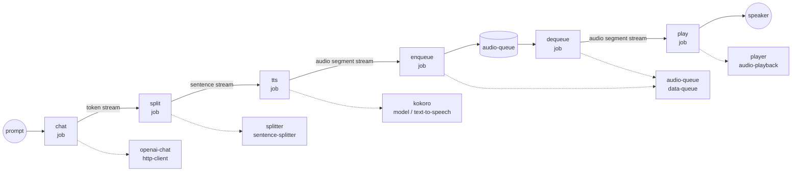

# LLM → Sentence-Splitter → TTS → Queued Playback Example

This example wires a full end-to-end streaming voice response inside a
single workflow: a GPT-4o answer is streamed token-by-token, split into
sentences on the fly, synthesized into audio segments by Kokoro, buffered
through an in-process `data-queue`, and played through the system's
default audio output. Playback starts as soon as the first sentence has
been synthesized — the model keeps generating while earlier sentences are
already being spoken.

## Overview

The workflow contains two job trees that run concurrently and rendezvous
through the `audio-queue` component:

**Producer chain** (LLM → speech):

1. **`chat`** — Calls `POST /v1/chat/completions` with `stream: true` and
   extracts token deltas via `${response[].choices[0].delta.content}`.
2. **`split`** — Buffers the token stream with `sentence-splitter` and
   emits one sentence at a time.
3. **`tts`** — Kokoro synthesizes each sentence into a PCM audio segment
   (24 kHz mono int16).
4. **`enqueue`** — Publishes each audio segment into `audio-queue`.

**Consumer chain** (queue → speaker):

5. **`dequeue`** — Opens an AsyncIterator over `audio-queue`.
6. **`play`** — Feeds the stream into `audio-playback`, which sends each
   segment to the system's default output device.

Because the two chains have no `depends_on` link between them, they start
in parallel. `data-queue` acts as the rendezvous point: the producer's
`publish` writes each finished audio segment, and the consumer's `consume`
yields it immediately so `audio-playback` can start speaking while later
sentences are still being generated by GPT-4o.

## Preparation

### Prerequisites

- `model-compose` installed and available in your `PATH`
- `ffmpeg` available locally (used by `audio-playback`)
- The `kokoro` Python package installed in the same environment as
  `model-compose` (Kokoro TTS model weights download on first run)
- An OpenAI API key
- A working system audio output (the workflow speaks through the default
  device)

### Environment Configuration

1. Navigate to this example directory:
   ```bash
   cd examples/data-streaming/llm-streaming-voice
   ```

2. Create an `.env` file with your OpenAI API key:
   ```env
   OPENAI_API_KEY=your-actual-openai-api-key
   ```

## How to Run

1. **Start the service:**
   ```bash
   model-compose up
   ```

2. **Run the workflow:**

   **Using API:**
   ```bash
   curl -X POST http://localhost:8080/api/workflows/runs \
     -H "Content-Type: application/json" \
     -d '{
       "input": {
         "prompt": "In three sentences, tell me why the night sky is dark."
       }
     }'
   ```

   **Using CLI:**
   ```bash
   model-compose run --input '{
     "prompt": "In three sentences, tell me why the night sky is dark."
   }'
   ```

   **Using Web UI:**
   - Open the Web UI: http://localhost:8081
   - Enter a prompt and click "Run Workflow"

   Speech starts playing through the default audio output as soon as the
   first sentence is synthesized.

## Workflow Details



### Input Parameters

| Parameter | Type | Required | Default | Description |
|-----------|------|----------|---------|-------------|
| `prompt` | text | Yes | - | The user message sent to GPT-4o |
| `temperature` | number | No | `0.7` | Sampling temperature (0.0–1.0) |

### Output Format

The workflow has no return payload — its side effect is audio playback
through the system default output device.

## Component Details

### `openai-chat` (http-client)
Streams GPT-4o token deltas. `stream_format: json` parses the SSE frames,
and the output selector extracts each `delta.content` so downstream jobs
see a stream of raw token strings.

### `splitter` (sentence-splitter)
Consumes the token stream in `streaming: true` mode and yields exactly
when a sentence terminator (`.`, `!`, `?`, `。`, `！`, `？`, `…`,
newline) is reached, so short LLM fragments are re-aggregated into
complete sentences before TTS sees them.

### `kokoro` (model / text-to-speech)
`hexgrad/Kokoro-82M` running locally on CPU. One audio segment is
generated per input sentence, so the job output is a stream of PCM audio
segments (24 kHz mono int16). `max_concurrent_count: 1` keeps a single
model instance resident.

### `audio-queue` (data-queue)
In-process FIFO. `publish` accepts a stream and enqueues each yielded
item; `consume` returns an AsyncIterator that `audio-playback` drains
transparently. `max_size: 100` provides headroom for a fast LLM outrunning
the speaker.

### `player` (audio-playback)
`ffmpeg`-backed playback to `sink: system`. `wait_for_finish: true`
waits for each segment to finish before returning, which keeps consecutive
segments from overlapping.

## Why Two Chains in One Workflow?

Splitting the pipeline into a **producer** side (LLM → splitter → TTS →
publish) and a **consumer** side (consume → playback) that meet through a
queue keeps the two halves decoupled:

- The producer can race ahead: while the speaker is still uttering
  sentence 1, sentences 2 and 3 may already be sitting in the queue.
- The consumer never blocks the producer as long as the queue has room
  (`max_size: 100`), and the producer never blocks the consumer once the
  first segment is available.
- Cancelling the workflow tears both chains down cleanly — `data-queue`
  propagates cancellation to any waiting `consume` call.

The same pattern generalizes to any producer/consumer split where the
producer emits at bursty rates and the consumer needs sequential, ordered
delivery.

## Customization

- **Different voice**: change `voice: af_heart` on the `kokoro` component
  to any other Kokoro preset (e.g. `af_bella`, `am_michael`).
- **Different LLM**: swap `gpt-4o` for another chat-completions-compatible
  model in the `openai-chat` component body.
- **Merge or cap sentences**: pass `min_chunk_length` /
  `max_chunk_length` into the splitter action to coalesce very short
  sentences or force-split terminator-less runs.
- **Target a specific output device**: set
  `player.action.sink: device` with a `device: <index-or-name>` to route
  playback to a specific output instead of the system default.
- **Persist the audio instead of playing it**: replace the `player`
  component with a `file-store` component that writes each dequeued
  segment to disk.
