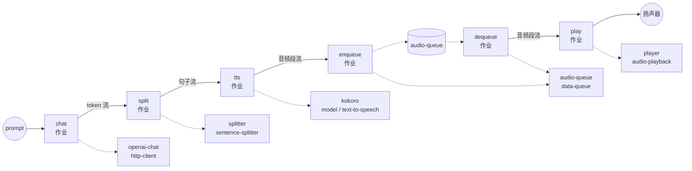

# LLM → Sentence-Splitter → TTS → 队列播放示例

此示例在单个工作流中串联了完整的端到端流式语音响应：GPT-4o 的回答被
逐 token 流式输出、即时切分成句子、由 Kokoro 合成为音频段、通过进程
内的 `data-queue` 缓冲，并通过系统默认音频输出播放。第一个句子完成
合成后播放就会立即开始 — 模型在较早的句子已经在朗读的同时仍继续生成。

## 概述

工作流包含两个并发运行并通过 `audio-queue` 组件汇合的作业树：

**生产者链**（LLM → 语音）：

1. **`chat`** — 使用 `stream: true` 调用
   `POST /v1/chat/completions`，并通过
   `${response[].choices[0].delta.content}` 提取 token 增量。
2. **`split`** — 使用 `sentence-splitter` 缓冲 token 流并按句发出。
3. **`tts`** — Kokoro 将每个句子合成为一个 PCM 音频段（24 kHz 单声道
   int16）。
4. **`enqueue`** — 将每个音频段发布到 `audio-queue`。

**消费者链**（队列 → 扬声器）：

5. **`dequeue`** — 打开 `audio-queue` 上的 AsyncIterator。
6. **`play`** — 将流传入 `audio-playback`，后者将每个音频段发送到系统
   默认输出设备。

由于两条链之间没有 `depends_on` 关联，它们会并行启动。`data-queue`
充当汇合点：生产者的 `publish` 写入每个已完成的音频段，消费者的
`consume` 立即产出该段，使 `audio-playback` 能够在 GPT-4o 仍在生成后续
句子的同时开始说话。

## 准备工作

### 前置条件

- 已安装 `model-compose` 并在您的 `PATH` 中可用
- 本地可用 `ffmpeg`（由 `audio-playback` 使用）
- 与 `model-compose` 相同环境中安装的 `kokoro` Python 包
  （Kokoro TTS 模型权重会在首次运行时下载）
- OpenAI API 密钥
- 工作正常的系统音频输出（工作流通过默认设备说话）

### 环境配置

1. 进入此示例目录：
   ```bash
   cd examples/data-streaming/llm-streaming-voice
   ```

2. 创建包含您的 OpenAI API 密钥的 `.env` 文件：
   ```env
   OPENAI_API_KEY=your-actual-openai-api-key
   ```

## 运行方式

1. **启动服务：**
   ```bash
   model-compose up
   ```

2. **运行工作流：**

   **使用 API：**
   ```bash
   curl -X POST http://localhost:8080/api/workflows/runs \
     -H "Content-Type: application/json" \
     -d '{
       "input": {
         "prompt": "In three sentences, tell me why the night sky is dark."
       }
     }'
   ```

   **使用 CLI：**
   ```bash
   model-compose run --input '{
     "prompt": "In three sentences, tell me why the night sky is dark."
   }'
   ```

   **使用 Web UI：**
   - 打开 Web UI：http://localhost:8081
   - 输入提示词并点击"运行工作流"

   一旦第一个句子被合成，语音就会开始通过默认音频输出播放。

## 工作流详情



### 输入参数

| 参数 | 类型 | 必需 | 默认值 | 描述 |
|-----------|------|----------|---------|-------------|
| `prompt` | text | 是 | - | 发送给 GPT-4o 的用户消息 |
| `temperature` | number | 否 | `0.7` | 采样温度 (0.0–1.0) |

### 输出格式

该工作流没有返回负载 — 其副作用是通过系统默认输出设备播放音频。

## 组件详情

### `openai-chat` (http-client)
流式输出 GPT-4o token 增量。`stream_format: json` 解析 SSE 帧，输出
选择器提取每个 `delta.content`，使下游作业看到原始 token 字符串的流。

### `splitter` (sentence-splitter)
以 `streaming: true` 模式消费 token 流，在到达句子终止符（`.`、`!`、
`?`、`。`、`！`、`？`、`…`、换行）时精确产出，因此在 TTS 看到它们之前，
短的 LLM 片段就已被重新聚合为完整句子。

### `kokoro` (model / text-to-speech)
`hexgrad/Kokoro-82M` 在 CPU 上本地运行。每个输入句子生成一个音频段，
因此作业输出是 PCM 音频段（24 kHz 单声道 int16）的流。
`max_concurrent_count: 1` 保持单个模型实例常驻。

### `audio-queue` (data-queue)
进程内 FIFO。`publish` 接受一个流并将产出的每个项入队；`consume`
返回一个 AsyncIterator，`audio-playback` 会透明地耗尽它。
`max_size: 100` 为快于扬声器的 LLM 提供缓冲空间。

### `player` (audio-playback)
基于 `ffmpeg` 的播放到 `sink: system`。`wait_for_finish: true` 等待
每个段完成后再返回，避免连续段之间重叠。

## 为什么在一个工作流中放两条链？

将管道拆分为**生产者**侧（LLM → splitter → TTS → publish）和**消费者**
侧（consume → playback），通过队列汇合，可让两半保持解耦：

- 生产者可以抢先运行：当扬声器仍在朗读句子 1 时，句子 2 和 3 可能已经
  在队列中。
- 只要队列有空间（`max_size: 100`），消费者绝不会阻塞生产者；一旦
  第一段可用，生产者也绝不会阻塞消费者。
- 取消工作流会干净地拆除两条链 — `data-queue` 将取消传播给任何等待中
  的 `consume` 调用。

同样的模式可以推广到任何生产者/消费者拆分：其中生产者以突发速率发出，
而消费者需要顺序、有序的交付。

## 自定义

- **不同的声音**：将 `kokoro` 组件上的 `voice: af_heart` 改为其他任何
  Kokoro 预设（如 `af_bella`、`am_michael`）。
- **不同的 LLM**：将 `openai-chat` 组件主体中的 `gpt-4o` 替换为其他
  chat-completions 兼容模型。
- **合并或限制句子**：向 splitter 动作传入 `min_chunk_length` /
  `max_chunk_length`，以合并非常短的句子或强制分割无终止符的运行。
- **指定特定输出设备**：设置 `player.action.sink: device` 并配合
  `device: <index-or-name>`，将播放路由到特定输出而非系统默认。
- **保存音频而不播放**：将 `player` 组件替换为将每个出队段写入磁盘的
  `file-store` 组件。
